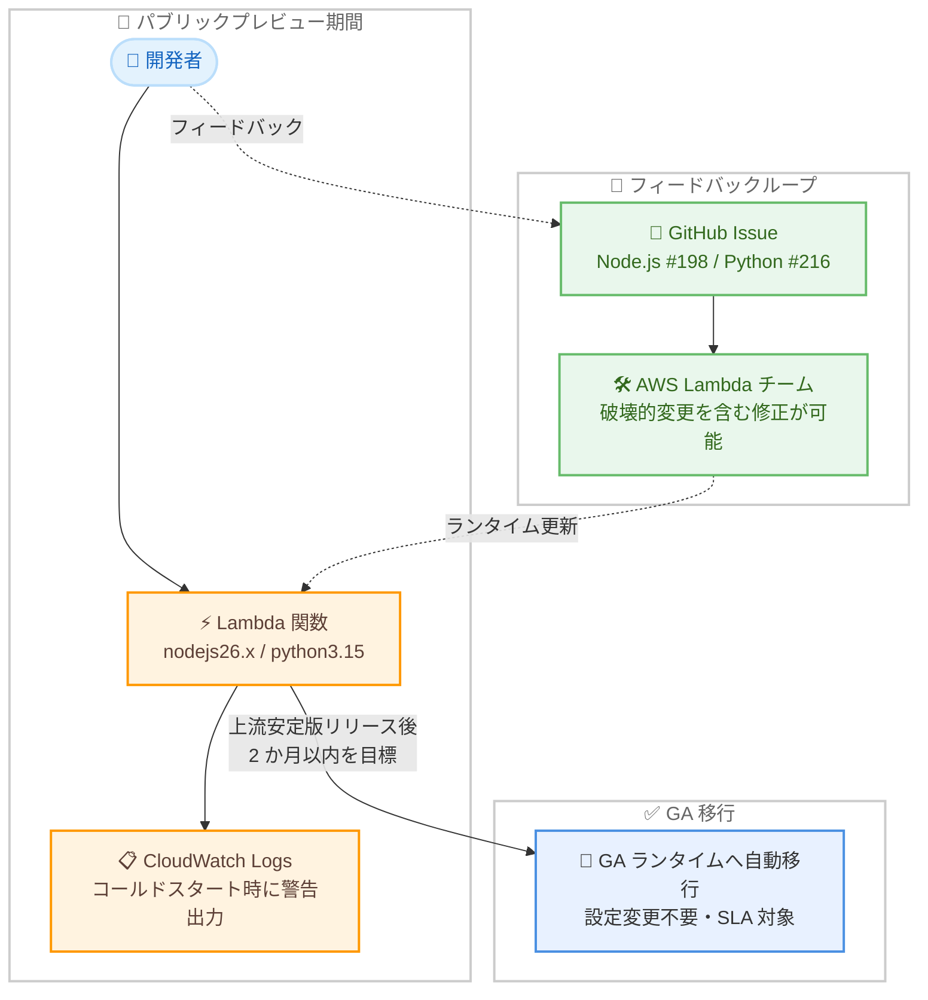

# AWS Lambda - Node.js 26 / Python 3.15 マネージドランタイムのパブリックプレビュー

**リリース日**: 2026 年 8 月 25 日
**サービス**: AWS Lambda
**機能**: Managed runtimes in public preview (Node.js 26 / Python 3.15)

📊 [このアップデートのインフォグラフィックを見る](https://takech9203.github.io/aws-news-summary/20260825-aws-lambda-node-js-python-public-preview.html)

## 概要

AWS Lambda が、マネージドランタイムのパブリックプレビュー提供を開始しました。第一弾として Node.js 26 と Python 3.15 が利用可能になり、お客様、パートナー、言語コミュニティは GA (一般提供) 前に新しいランタイムを試し、フィードバックを提供できるようになりました。

従来、Lambda のマネージドランタイムは GA として直接リリースされていました。GA 後は本番ワークロードで即座に利用されるため、問題が見つかっても既存関数に影響する破壊的変更を加えることができませんでした。今回のパブリックプレビュー方式では、プレビュー期間中に破壊的変更を含む修正が可能であり、コミュニティからのフィードバックをランタイムの品質向上に反映できます。また、サードパーティの可観測性プロバイダーや IaC ツールベンダーも、GA 前に互換性検証を行えます。

ランタイム識別子はプレビュー版と GA 版で同一 (`nodejs26.x` / `python3.15`) のため、GA 到達時には関数が自動的に GA ランタイムへ移行され、ユーザー側の設定変更は不要です。AWS はこの方式を「実験」と位置づけており、成果次第で今後のすべてのランタイムリリースのデフォルト方式とする意向を示しています。

**アップデート前の課題**

このアップデート以前は、Lambda のランタイムリリースプロセスに以下の課題がありました。

- 新しいランタイムは GA としてのみリリースされ、ユーザーが事前に試す手段がなかった
- GA 後に問題が発覚しても、既存関数への影響を避けるため破壊的変更による修正ができなかった
- 可観測性プロバイダーや IaC ツールなどのパートナーが、GA 前に互換性を検証できなかった
- 言語コミュニティからのフィードバックをランタイム設計に反映する機会が限られていた

**アップデート後の改善**

今回のアップデートにより、以下が可能になりました。

- GA 前の Node.js 26 / Python 3.15 ランタイムを全商用リージョンで試用できるようになった
- 専用の GitHub Issue を通じてフィードバックを提供し、GA 前の修正に反映できるようになった
- パートナーやツールベンダーが GA 前に互換性検証を実施できるようになった
- ランタイム識別子が GA 版と同一のため、GA 到達時に関数が自動的に移行され、追加作業が不要になった

## アーキテクチャ図



プレビュー期間中は開発者が GitHub Issue を通じてフィードバックを提供し、AWS が破壊的変更を含む修正を行います。ランタイム識別子は GA 版と同一のため、GA 到達時には関数が自動的に GA ランタイムへ移行されます。

## サービスアップデートの詳細

### 主要機能

1. **GA 前ランタイムのパブリックプレビュー提供**
   - Node.js 26 と Python 3.15 を GA 前に試用可能
   - マネージドランタイムとベースコンテナイメージの両方で提供 (ECR イメージタグは `26-preview` / `3.15-preview` で始まる)
   - Lambda Managed Instances や durable functions を含む、現行 GA ランタイムがサポートするすべての Lambda 機能を利用可能
   - GA ランタイムと同じパッチ適用サイクルに従う

2. **フィードバックに基づくランタイム改善**
   - プレビュー期間中は破壊的変更を含む修正が可能
   - 専用の GitHub Issue (Node.js 26: Issue #198、Python 3.15: Issue #216) でフィードバックを受付
   - バグ報告に加え、新しい言語機能の活用提案やプログラミングモデルの改善案も対象
   - 機能拡張や破壊的変更の告知も同じ Issue で行われる

3. **GA への自動移行**
   - ランタイム識別子は GA 版と同一 (`nodejs26.x` / `python3.15`) で、プレビュー専用の識別子は存在しない
   - GA 到達時に関数は自動的に GA ランタイムへ移行され、設定変更は不要
   - GA 時にプレビューラベルが削除され、SLA・サポート対象となり、GA の性能・品質基準が適用される

## 技術仕様

### プレビューランタイムの仕様

| 項目 | 詳細 |
|------|------|
| 対象ランタイム | Node.js 26 (`nodejs26.x`)、Python 3.15 (`python3.15`) |
| 提供形態 | マネージドランタイム、ベースコンテナイメージ |
| コンテナイメージタグ | `26-preview` (Node.js)、`3.15-preview` (Python) で始まるタグ |
| ランタイム識別子 | GA 版と同一 (プレビュー専用識別子なし) |
| 利用可能な Lambda 機能 | GA ランタイムと同等 (Lambda Managed Instances、durable functions を含む) |
| SLA / テクニカルサポート | 対象外 (GA 到達まで) |
| 警告ログ | コールドスタートごとに CloudWatch Logs へ警告を出力 |
| 上流の安定版リリース予定 | 2026 年 10 月 (Node.js 26 Active LTS / Python 3.15) |
| Lambda GA 目標 | 上流安定版リリース後 2 か月以内 |
| 料金 | 標準の Lambda 料金 (追加費用なし) |

### Runtime Management Controls との関係

| シナリオ | 挙動 |
|----------|------|
| プレビュー期間中に特定ランタイムバージョンへピン留め | GA 後もピン留めは維持される |
| ピン留めの解除 | いつでも解除して GA ランタイムへ移行可能 |
| GA 前バージョンへのピン留め継続 | SLA・テクニカルサポートの対象外 |

## 設定方法

### 前提条件

1. AWS アカウントと Lambda 関数を作成できる IAM 権限があること
2. AWS CLI、CloudFormation、AWS SAM、AWS CDK のいずれかを利用する場合は各ツールがセットアップ済みであること
3. 本番ワークロードではなく、検証用途での利用であることを理解していること

### 手順

#### ステップ 1: コンソールまたは CLI で関数を作成

```bash
aws lambda create-function \
  --function-name my-preview-function \
  --runtime nodejs26.x \
  --handler index.handler \
  --role arn:aws:iam::123456789012:role/my-role \
  --zip-file fileb://function.zip
```

AWS CLI で Node.js 26 プレビューランタイムを使用する Lambda 関数を作成します。Python の場合は `--runtime python3.15` を指定します。プレビュー専用の識別子はなく、GA 版と同じランタイム識別子を使用します。コンソールの場合は、ランタイムのドロップダウンから「Node.js 26 (Preview)」または「Python 3.15 (Preview)」を選択します。

#### ステップ 2: CloudFormation / AWS SAM で定義

```yaml
# AWS SAM テンプレートの例
Resources:
  MyPreviewFunction:
    Type: AWS::Serverless::Function
    Properties:
      Handler: app.lambda_handler
      Runtime: python3.15
      CodeUri: src/
```

CloudFormation (`AWS::Lambda::Function`) や AWS SAM (`AWS::Serverless::Function`) では、`Runtime` プロパティにランタイム識別子を指定するだけで利用できます。`sam init` ではテンプレート一覧に「(Preview)」ラベル付きで表示されます。

#### ステップ 3: AWS CDK で定義

```typescript
import { Function, Runtime, RuntimeFamily, Code } from "aws-cdk-lib/aws-lambda";

new Function(this, "MyPreviewFunction", {
  runtime: new Runtime("nodejs26.x", RuntimeFamily.NODEJS),
  handler: "index.handler",
  code: Code.fromAsset("lambda"),
});
```

AWS CDK では組み込みの enum (例: `Runtime.NODEJS_26_X`) が未提供のため、公開コンストラクタで `new Runtime("nodejs26.x", RuntimeFamily.NODEJS)` のように指定します。Python の場合は `new Runtime("python3.15", RuntimeFamily.PYTHON)` を使用します。生成される CloudFormation テンプレートは enum 版と同一で、GA 時に enum が追加される予定です。

#### ステップ 4: フィードバックの提供

動作検証で問題や改善案を見つけた場合は、専用の GitHub Issue にコメントするか、各リポジトリで新しい Issue を作成します。

- Node.js 26: `aws-lambda-nodejs-runtime-interface-client` リポジトリの Issue #198
- Python 3.15: `aws-lambda-python-runtime-interface-client` リポジトリの Issue #216

対象はランタイム自体 (実行環境、言語統合、プログラミングモデル) に限定され、Lambda 全般の機能要望は AWS Lambda パブリックロードマップが窓口となります。機能拡張や破壊的変更の告知も同じ Issue で行われるため、フォローすることが推奨されます。

## メリット

### ビジネス面

- **移行計画の前倒し**: GA 前に新ランタイムでの動作検証を開始できるため、GA 後の移行をスムーズに実施でき、ランタイム廃止 (deprecation) 対応のリードタイムを確保できる
- **リスクの早期発見**: 依存ライブラリや社内共通コードの非互換を GA 前に発見し、GA 時点での本番移行リスクを低減できる
- **追加コストなし**: プレビューランタイムは標準の Lambda 料金で利用でき、検証環境の追加費用が発生しない

### 技術面

- **GA 版と同一の識別子**: プレビューから GA への移行が自動で行われ、コードやテンプレートの変更が不要
- **フィードバックの反映機会**: 破壊的変更が許容されるプレビュー期間中に報告することで、ランタイムの問題が GA 前に修正される可能性が高い
- **エコシステムの事前検証**: 可観測性ツールや IaC ツールのベンダーが GA 前に対応を完了でき、GA 直後から周辺ツールを含めて利用できる

## デメリット・制約事項

### 制限事項

- プレビューランタイムは Lambda SLA および AWS テクニカルサポートの対象外
- 破壊的変更が加えられる可能性があり、今日動作する関数が次のランタイム更新後に修正を要する場合がある
- コールドスタートごとに CloudWatch Logs へ警告ログが出力される
- 最適化が未完了であり内部サブシステムのキャッシュも少ないため、GA 版よりコールドスタートなどの性能が劣る場合がある (GA 前に最適化予定)
- AWS CDK の組み込み enum は未提供 (GA 時に追加予定)

### 考慮すべき点

- 本番ワークロードでの使用は強く非推奨であり、検証・開発用途に限定すべき
- Runtime Management Controls で GA 前バージョンにピン留めしたままにすると、GA 後も SLA・サポートの対象外となる
- リリース時点では言語自体のバージョンアップが中心で、Lambda 固有の追加機能はない。言語の新機能は Node.js 26 リリースノートや Python 3.15 の「What's New」を参照する必要がある
- Node.js 26 の GA は上流の Active LTS 到達 (2026 年 10 月予定) が条件となる

## ユースケース

### ユースケース 1: GA 前の互換性検証による移行準備

**シナリオ**: Python 3.13 で稼働中の本番 Lambda 関数群を、GA 後速やかに Python 3.15 へ移行したい。依存ライブラリの非互換を GA 前に洗い出しておきたい。

**実装例**:
```bash
# 検証用に既存関数のコードを Python 3.15 プレビューでデプロイ
aws lambda create-function \
  --function-name my-app-py315-canary \
  --runtime python3.15 \
  --handler app.lambda_handler \
  --role arn:aws:iam::123456789012:role/my-role \
  --zip-file fileb://function.zip

# テストイベントで動作確認
aws lambda invoke \
  --function-name my-app-py315-canary \
  --payload file://test-event.json \
  response.json
```

**効果**: GA 前に依存ライブラリやコードの非互換を発見・修正でき、GA 到達後すぐに本番移行を開始できる。ランタイム識別子が同一のため、検証済みのテンプレートをそのまま本番移行に流用できる。

### ユースケース 2: 言語の新機能の early adoption 評価

**シナリオ**: 開発チームが Node.js 26 の新しい言語機能を活用した実装パターンを評価し、GA 後の標準開発ガイドラインを事前に整備したい。

**実装例**:
```yaml
# AWS SAM テンプレート (開発環境用)
Resources:
  FeatureEvalFunction:
    Type: AWS::Serverless::Function
    Properties:
      Handler: index.handler
      Runtime: nodejs26.x
      CodeUri: src/
      Environment:
        Variables:
          STAGE: dev
```

**効果**: GA を待たずに新しい言語機能の検証を進められ、GA 時点でチームの開発標準やベストプラクティスが整った状態でプロジェクトを開始できる。

### ユースケース 3: サードパーティツールベンダーによる事前対応

**シナリオ**: 可観測性プロバイダーや IaC ツールのベンダーが、自社製品 (Lambda レイヤー、エージェント、デプロイツールなど) の Node.js 26 / Python 3.15 対応を GA 前に完了させたい。

**実装例**:
```bash
# ベースコンテナイメージのプレビュータグを使用して互換性テスト
docker pull public.ecr.aws/lambda/python:3.15-preview
docker run -p 9000:8080 \
  -v ./agent:/opt/agent \
  public.ecr.aws/lambda/python:3.15-preview app.handler
```

**効果**: GA 直後から顧客が周辺ツールを含めた完全なスタックで新ランタイムを利用でき、ベンダーは競合に先行して対応を発表できる。問題があれば GitHub Issue を通じて GA 前の修正を働きかけられる。

## 料金

プレビューランタイムの利用に追加費用はありません。標準の Lambda 料金 (リクエスト数と実行時間に基づく従量課金) がそのまま適用されます。

詳細は [AWS Lambda 料金ページ](https://aws.amazon.com/lambda/pricing/) を参照してください。

## 利用可能リージョン

すべての AWS 商用リージョン、AWS GovCloud (US) リージョン、および中国リージョンで利用可能です。

## 関連サービス・機能

- **AWS Lambda Runtime Management Controls**: ランタイムバージョンのピン留め機能。プレビュー期間中のピン留めは GA 後も維持されるが、GA 前バージョンのままでは SLA・サポート対象外となる
- **AWS SAM / AWS CDK / AWS CloudFormation**: IaC ツールからプレビューランタイムを指定可能。CDK は組み込み enum 未提供のため公開コンストラクタを使用する
- **Amazon ECR Public Gallery (Lambda ベースイメージ)**: `26-preview` / `3.15-preview` で始まるタグでプレビュー版のベースコンテナイメージを提供
- **Amazon CloudWatch Logs**: プレビューランタイムのコールドスタートごとに警告ログが出力されるため、検証時のログ確認先となる

## 参考リンク

- 📊 [インフォグラフィック](https://takech9203.github.io/aws-news-summary/20260825-aws-lambda-node-js-python-public-preview.html)
- [公式発表 (What's New)](https://aws.amazon.com/about-aws/whats-new/2026/08/aws-lambda-node-js-python-public-preview/)
- [AWS Blog: Introducing public preview runtimes on AWS Lambda, starting with Node.js 26 and Python 3.15](https://aws.amazon.com/blogs/compute/introducing-public-preview-runtimes-on-aws-lambda-starting-with-node-js-26-and-python-3-15/)
- [ドキュメント: Lambda runtimes](https://docs.aws.amazon.com/lambda/latest/dg/lambda-runtimes.html)
- [フィードバック用 GitHub Issue (Node.js 26)](https://github.com/aws/aws-lambda-nodejs-runtime-interface-client/issues/198)
- [フィードバック用 GitHub Issue (Python 3.15)](https://github.com/aws/aws-lambda-python-runtime-interface-client/issues/216)
- [AWS Lambda SLA](https://aws.amazon.com/lambda/sla/)
- [料金ページ](https://aws.amazon.com/lambda/pricing/)

## まとめ

AWS Lambda のランタイムリリースプロセスにおける大きな転換点となるアップデートです。GA 前に Node.js 26 / Python 3.15 を試用してフィードバックを提供できるようになり、ユーザーは移行準備を前倒しでき、AWS はコミュニティの声を GA 前の品質改善に反映できます。本番利用は避けつつ、検証環境で新ランタイムの互換性テストを早期に開始し、2026 年 10 月の上流安定版リリース後に予定される GA へスムーズに備えることを推奨します。
