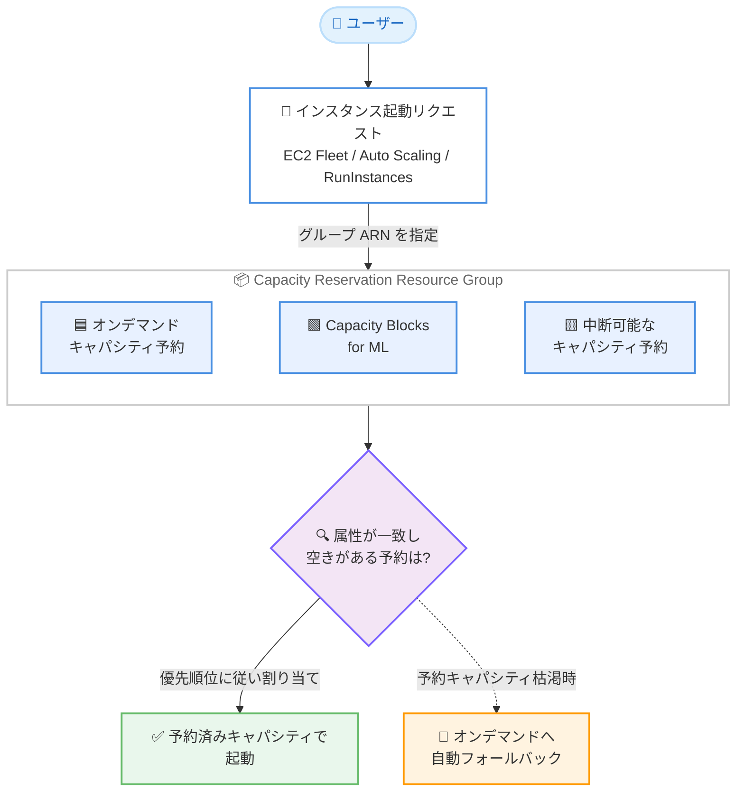

# Amazon EC2 - Capacity Reservation Resource Groups による Capacity Blocks および中断可能なキャパシティ予約のサポート

**リリース日**: 2026 年 8 月 25 日
**サービス**: Amazon EC2 (Elastic Compute Cloud)
**機能**: Capacity Reservation Resource Groups での EC2 Capacity Blocks for ML および interruptible Capacity Reservations のサポート

📊 [このアップデートのインフォグラフィックを見る](https://takech9203.github.io/aws-news-summary/20260825-capacity-reservation-resource-groups-ec2.html)

## 概要

Amazon EC2 の Capacity Reservation Resource Groups (キャパシティ予約リソースグループ) が、EC2 Capacity Blocks for ML と中断可能なキャパシティ予約 (interruptible Capacity Reservations) をサポートするようになりました。これまでオンデマンドキャパシティ予約 (ODCR) のみをグループ化できましたが、今回のアップデートにより、すべての予約タイプを任意の組み合わせで 1 つのグループに含めることができます。

Capacity Reservation Resource Groups は、複数のキャパシティ予約を論理的なコレクションとしてまとめ、単一のグループ ARN を指定するだけで複数の予約にまたがってインスタンスを起動できる機能です。今回の拡張により、予約済みキャパシティのポートフォリオ全体を対象とした一元的なインスタンス起動が容易になります。

さらに、EC2 Fleet および EC2 Auto Scaling グループと組み合わせる場合、予約タイプ間の優先順位付け (prioritization) の設定や、予約済みキャパシティが不足した際のオンデマンドキャパシティへの自動フォールバックの設定が可能です。ML ワークロード向けに Capacity Blocks を利用しつつ、ODCR や中断可能な予約も併用してキャパシティを柔軟に管理したいユーザーに有用なアップデートです。

**アップデート前の課題**

- 以前は Capacity Reservation Resource Groups に含められるのはオンデマンドキャパシティ予約 (ODCR) のみであり、Capacity Blocks for ML や中断可能なキャパシティ予約はグループ化できなかった
- 予約タイプごとに起動ターゲットを個別に指定する必要があり、複数の予約タイプを併用する場合の運用が複雑だった
- Capacity Blocks と ODCR を組み合わせたワークロードでは、キャパシティの消費順序を制御する統一的な仕組みがなかった

**アップデート後の改善**

- すべての予約タイプ (ODCR、Capacity Blocks for ML、中断可能なキャパシティ予約) を任意の組み合わせで 1 つのグループに追加できるようになった
- 単一のグループ ARN をターゲットに指定するだけで、予約済みキャパシティのポートフォリオ全体からインスタンスを起動できるようになった
- EC2 Fleet および EC2 Auto Scaling グループで、予約タイプ間の優先順位付けと、予約キャパシティ枯渇時のオンデマンドへの自動フォールバックを設定できるようになった

## アーキテクチャ図



複数タイプのキャパシティ予約を 1 つのリソースグループにまとめ、単一の ARN をターゲットとしてインスタンスを起動するフローです。EC2 Fleet や Auto Scaling グループでは、優先順位付けとオンデマンドへの自動フォールバックを設定できます。

## サービスアップデートの詳細

### 主要機能

1. **全予約タイプのグループ化**
   - ODCR に加えて、EC2 Capacity Blocks for ML と中断可能なキャパシティ予約をグループに追加可能
   - 任意の組み合わせで複数の予約タイプを 1 つのグループに混在させることが可能
   - 自アカウントが所有する予約と、他アカウントから共有された予約を同一グループに含めることも可能

2. **単一 ARN によるポートフォリオ全体への起動**
   - グループ ARN をターゲットに指定するだけで、グループ内の属性が一致し空きキャパシティのある予約にインスタンスがマッチング
   - インスタンスタイプ、プラットフォーム、アベイラビリティーゾーン、テナンシー、プレイスメントグループが異なる予約も同一グループに追加可能

3. **EC2 Fleet / Auto Scaling グループでの優先順位付けとフォールバック**
   - `ReservedCapacityOptions` により予約タイプ間の割り当て戦略 (`prioritized`) を設定可能
   - 対象の予約タイプとして `capacity-block` と `on-demand-capacity-reservation` を指定可能
   - 予約済みキャパシティが枯渇した場合に、オンデマンドキャパシティへ自動フォールバックする設定 (`ReservedCapacityFallbackOptions`) が可能

## 技術仕様

### サポートされる予約タイプ

| 予約タイプ | 説明 |
|------|------|
| オンデマンドキャパシティ予約 (ODCR) | 特定の AZ で任意の期間キャパシティを予約。従来からグループ化をサポート |
| EC2 Capacity Blocks for ML | GPU インスタンスなどを将来の日時に対して期間指定で予約。今回新たにサポート |
| 中断可能なキャパシティ予約 | 中断を許容することで柔軟に利用できるキャパシティ予約。今回新たにサポート |

### API変更履歴

| 日付 | サービス | 変更内容 |
|------|----------|----------|
| 2026/08/25 | [ec2](https://awsapichanges.com/archive/changes/f60d73-ec2.html) | 7 updated api methods - EC2 Fleet の Capacity Reservation Resource Groups 対応。`CreateFleet` / `DescribeFleets` に `ReservedCapacityOptions` (AllocationStrategy、ReservationTypes、ReservedCapacityFallbackOptions) が追加。`RunInstances` や Launch Template 関連 API の `InstanceMarketOptions.MarketType` に `on-demand` が追加 |

### CreateFleet の新しいオプション例

```json
{
  "ReservedCapacityOptions": {
    "AllocationStrategy": "prioritized",
    "CapacityReservationTarget": {
      "CapacityReservationResourceGroupArns": [
        "arn:aws:resource-groups:us-east-1:123456789012:group/my-cr-group"
      ]
    },
    "ReservationTypes": [
      "capacity-block",
      "on-demand-capacity-reservation"
    ],
    "ReservedCapacityFallbackOptions": {
      "MarketTypes": ["on-demand"]
    }
  }
}
```

## 設定方法

### 前提条件

1. 利用するリージョンで Capacity Blocks for ML および中断可能な ODCR がサポートされていること
2. AWS Resource Groups でグループを作成・管理する IAM 権限があること
3. グループに追加するキャパシティ予約 (ODCR、Capacity Blocks、中断可能な予約) が作成済みであること

### 手順

#### ステップ1: Capacity Reservation Resource Group を作成する

```bash
aws resource-groups create-group \
  --name my-cr-group \
  --configuration '[{"Type":"AWS::EC2::CapacityReservationPool"}]'
```

AWS Resource Groups でキャパシティ予約用のリソースグループを作成します。`AWS::EC2::CapacityReservationPool` タイプの設定により、キャパシティ予約専用のグループとして構成されます。

#### ステップ2: キャパシティ予約をグループに追加する

```bash
aws resource-groups group-resources \
  --group my-cr-group \
  --resource-arns \
    "arn:aws:ec2:us-east-1:123456789012:capacity-reservation/cr-1234567890abcdef0" \
    "arn:aws:ec2:us-east-1:123456789012:capacity-reservation/cr-0987654321fedcba0"
```

ODCR、Capacity Blocks、中断可能なキャパシティ予約の ARN を指定して、任意の組み合わせでグループに追加します。

#### ステップ3: グループをターゲットにインスタンスを起動する

```bash
aws ec2 run-instances \
  --image-id ami-0123456789abcdef0 \
  --instance-type p5.48xlarge \
  --count 1 \
  --capacity-reservation-specification \
    'CapacityReservationTarget={CapacityReservationResourceGroupArn=arn:aws:resource-groups:us-east-1:123456789012:group/my-cr-group}'
```

グループ ARN をターゲットに指定してインスタンスを起動します。Amazon EC2 は、グループ内で属性が一致し空きキャパシティのある予約にインスタンスをマッチングします。EC2 Fleet や Auto Scaling グループを使用する場合は、`ReservedCapacityOptions` で優先順位付けとフォールバックを設定できます。

## メリット

### ビジネス面

- **予約キャパシティの利用率向上**: 予約タイプを問わずポートフォリオ全体を単一ターゲットとして扱えるため、遊休キャパシティの発生を抑制できる
- **追加コストなし**: この機能の利用に追加料金は不要
- **ML ワークロードの計画的な実行**: Capacity Blocks と ODCR を組み合わせ、優先順位に基づいてコスト効率よくキャパシティを消費できる

### 技術面

- **運用のシンプル化**: 予約タイプごとに起動ターゲットを分ける必要がなくなり、単一のグループ ARN で管理できる
- **柔軟なキャパシティ戦略**: EC2 Fleet / Auto Scaling グループでの優先順位付けにより、予約タイプ間の消費順序を制御できる
- **可用性の向上**: 予約済みキャパシティ枯渇時にオンデマンドへ自動フォールバックすることで、キャパシティ不足による起動失敗を回避できる

## デメリット・制約事項

### 制限事項

- AWS GovCloud (US) および中国リージョンでは利用不可
- Capacity Blocks for ML と中断可能な ODCR をサポートするリージョンでのみ利用可能
- 優先順位付けとオンデマンドフォールバックは EC2 Fleet および EC2 Auto Scaling グループを使用する場合に設定可能

### 考慮すべき点

- 中断可能なキャパシティ予約で起動したインスタンスは中断される可能性があるため、ワークロードの耐障害性を考慮した設計が必要
- Capacity Blocks は予約期間が決まっているため、期間終了時のインスタンスの扱いをグループ全体の運用として計画する必要がある
- オンデマンドフォールバックを有効にすると、予約枠を超えた分は通常のオンデマンド料金が発生する

## ユースケース

### ユースケース1: ML トレーニングにおける Capacity Blocks と ODCR の併用

**シナリオ**: ML トレーニング用に GPU インスタンスの Capacity Blocks を予約しつつ、常時稼働分は ODCR で確保している。両方の予約を一元的に利用したい。

**実装例**:
```
1. Capacity Blocks と ODCR を 1 つのリソースグループに追加
2. EC2 Fleet の ReservedCapacityOptions で AllocationStrategy=prioritized を設定
3. ReservationTypes に capacity-block と on-demand-capacity-reservation を指定
```

**効果**: 予約タイプを意識せずに単一ターゲットでトレーニングジョブを起動でき、予約済みキャパシティの利用率が向上する。

### ユースケース2: 予約キャパシティ枯渇時のオンデマンドフォールバック

**シナリオ**: Auto Scaling グループでスケールアウトする際、まず予約済みキャパシティを消費し、不足分はオンデマンドで補いたい。

**実装例**:
```
1. Auto Scaling グループの起動設定でグループ ARN をターゲットに指定
2. ReservedCapacityFallbackOptions で MarketTypes=on-demand を設定
```

**効果**: 予約分を優先的に使い切った上で、キャパシティ不足による起動失敗を防ぎ、スケールアウトの信頼性を確保できる。

### ユースケース3: マルチアカウント環境での共有予約の一元管理

**シナリオ**: 組織内の複数アカウントで共有されたキャパシティ予約と自アカウントの予約を組み合わせて利用したい。

**実装例**:
```
1. 自アカウント所有の予約と、他アカウントから共有された予約を同一グループに追加
2. 属性 (インスタンスタイプ、AZ など) が異なる予約も同一グループで管理
3. アプリケーションは単一のグループ ARN のみを参照して起動
```

**効果**: 組織全体の予約済みキャパシティを論理的に集約し、アカウントをまたいだキャパシティの有効活用が可能になる。

## 料金

この機能の利用に追加料金は発生しません。各キャパシティ予約 (ODCR、Capacity Blocks for ML、中断可能なキャパシティ予約) 自体の料金は、それぞれの料金体系に従って課金されます。オンデマンドフォールバックで起動したインスタンスには通常のオンデマンド料金が適用されます。

## 利用可能リージョン

Capacity Blocks for ML および中断可能な ODCR をサポートするすべての AWS リージョンで利用可能です。ただし、AWS GovCloud (US) および中国リージョンは除きます。

## 関連サービス・機能

- **EC2 Capacity Blocks for ML**: GPU インスタンスなどの ML 向けキャパシティを将来の日時に対して期間指定で予約する機能。今回グループへの追加が可能になった
- **EC2 オンデマンドキャパシティ予約 (ODCR)**: 特定の AZ でキャパシティを任意の期間予約する機能。従来からグループ化をサポート
- **EC2 Fleet / EC2 Auto Scaling**: グループをターゲットにした起動で、予約タイプ間の優先順位付けとオンデマンドフォールバックを設定可能
- **AWS Resource Groups**: キャパシティ予約を論理的なコレクションとしてグループ化する基盤サービス

## 参考リンク

- 📊 [インフォグラフィック](https://takech9203.github.io/aws-news-summary/20260825-capacity-reservation-resource-groups-ec2.html)
- [公式発表 (What's New)](https://aws.amazon.com/about-aws/whats-new/2026/08/capacity-reservation-resource-groups-ec2/)
- [ドキュメント: Capacity Reservation Resource Groups](https://docs.aws.amazon.com/AWSEC2/latest/UserGuide/cr-groups.html)
- [ドキュメント: Capacity Reservations ユーザーガイド](https://docs.aws.amazon.com/AWSEC2/latest/UserGuide/ec2-capacity-reservations.html)
- [API 変更履歴 (awsapichanges.com)](https://awsapichanges.com/archive/changes/f60d73-ec2.html)

## まとめ

Capacity Reservation Resource Groups がすべての予約タイプに対応したことで、ODCR、Capacity Blocks for ML、中断可能なキャパシティ予約を単一のグループ ARN で一元管理し、ポートフォリオ全体からインスタンスを起動できるようになりました。特に ML ワークロードで複数の予約タイプを併用している場合は、EC2 Fleet や Auto Scaling グループの優先順位付けとオンデマンドフォールバックの設定を検討し、予約済みキャパシティの利用率向上と起動の信頼性確保につなげることを推奨します。
