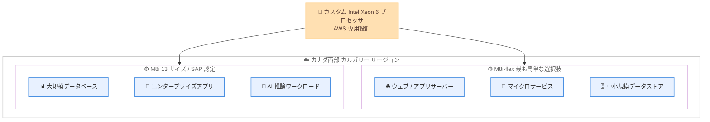

# Amazon EC2 - M8i / M8i-flex インスタンスがカナダ西部 (カルガリー) リージョンで利用可能に

**リリース日**: 2026 年 8 月 25 日
**サービス**: Amazon EC2
**機能**: M8i および M8i-flex インスタンスのカナダ西部 (カルガリー) リージョン対応

📊 [このアップデートのインフォグラフィックを見る](https://takech9203.github.io/aws-news-summary/20260825-ec2-m8i-m8i-flex-canada-west.html)

## 概要

Amazon EC2 の最新汎用インスタンスである M8i および M8i-flex インスタンスが、カナダ西部 (カルガリー) リージョンで利用可能になりました。M8i / M8i-flex は AWS 専用にカスタマイズされた Intel Xeon 6 プロセッサを搭載し、同等のクラウドベース Intel プロセッサの中で最高のパフォーマンスと最速のメモリ帯域幅を提供します。

前世代の Intel ベースインスタンスと比較して最大 15% 優れた料金パフォーマンスと 2.5 倍のメモリ帯域幅を実現します。また、M7i / M7i-flex と比較して全体で最大 20% 高いパフォーマンスを発揮し、PostgreSQL データベースで最大 30%、NGINX ウェブアプリケーションで最大 60%、AI 深層学習レコメンデーションモデルで最大 40% 高速です。

カナダ西部 (カルガリー) リージョンを利用するユーザーは、データレジデンシー要件を維持したまま、最新世代の Intel ベース汎用インスタンスによるパフォーマンスとコスト効率の向上を享受できます。

**アップデート前の課題**

このアップデート以前に存在していた課題や制限は以下のとおりです。

- カナダ西部 (カルガリー) リージョンでは第 8 世代 Intel ベース汎用インスタンスが利用できず、M7i / M7i-flex などの前世代インスタンスを使用する必要があった
- カナダ国内のデータレジデンシー要件があるワークロードは、最新インスタンスを利用するために他リージョンを選択できなかった
- メモリ帯域幅を多く消費するワークロード (データベース、AI 推論など) では、前世代インスタンスの性能が制約となる場合があった

**アップデート後の改善**

今回のアップデートにより可能になったことは以下のとおりです。

- カナダ西部 (カルガリー) リージョンで M8i / M8i-flex インスタンスを起動できるようになった
- データレジデンシー要件を維持したまま、前世代比で最大 15% 優れた料金パフォーマンスと 2.5 倍のメモリ帯域幅を利用できるようになった
- SAP 認定済みの M8i インスタンス (ベアメタル 2 種と 96xlarge を含む 13 サイズ) により、大規模エンタープライズワークロードを同リージョンで実行できるようになった

## アーキテクチャ図



カスタム Intel Xeon 6 プロセッサを搭載した 2 つのインスタンスファミリーが、カナダ西部 (カルガリー) リージョンでワークロード特性に応じて選択できるようになりました。

## サービスアップデートの詳細

### 主要機能

1. **カスタム Intel Xeon 6 プロセッサ**
   - AWS でのみ利用可能なカスタム Intel Xeon 6 プロセッサを搭載
   - 同等のクラウドベース Intel プロセッサの中で最高のパフォーマンスと最速のメモリ帯域幅
   - 前世代の Intel ベースインスタンスと比較して 2.5 倍のメモリ帯域幅

2. **M8i-flex インスタンス**
   - 料金パフォーマンス向上を最も簡単に実現できる選択肢
   - large から 16xlarge までの一般的なサイズを提供
   - コンピュートリソースを常時フル活用しないワークロード (ウェブ / アプリケーションサーバー、マイクロサービス、中小規模データストア、仮想デスクトップ、エンタープライズアプリケーション) に最適

3. **M8i インスタンス**
   - ベアメタル 2 種と新しい 96xlarge を含む 13 サイズを提供
   - SAP 認定済みで、大規模なエンタープライズワークロードに対応
   - 大きなインスタンスサイズや持続的な高 CPU 使用率を必要とする汎用ワークロード向け

4. **ワークロード別のパフォーマンス向上**
   - M7i / M7i-flex 比で全体的に最大 20% 高いパフォーマンス
   - PostgreSQL データベースで最大 30% 高速
   - NGINX ウェブアプリケーションで最大 60% 高速
   - AI 深層学習レコメンデーションモデルで最大 40% 高速

## 技術仕様

### インスタンスファミリーの比較

| 項目 | M8i-flex | M8i |
|------|----------|-----|
| プロセッサ | カスタム Intel Xeon 6 | カスタム Intel Xeon 6 |
| サイズ展開 | large ~ 16xlarge | 13 サイズ (96xlarge、ベアメタル 2 種を含む) |
| SAP 認定 | - | あり |
| 想定ワークロード | CPU を常時フル活用しない汎用ワークロード | 大規模サイズや持続的な高 CPU 使用率が必要な汎用ワークロード |
| 主な用途 | ウェブ / アプリサーバー、マイクロサービス、仮想デスクトップ | 大規模データベース、エンタープライズアプリケーション、AI 推論 |

### 前世代からの性能向上

| 比較対象 | 向上内容 |
|----------|----------|
| 前世代 Intel ベースインスタンス | 最大 15% 優れた料金パフォーマンス、2.5 倍のメモリ帯域幅 |
| M7i / M7i-flex (全体) | 最大 20% 高いパフォーマンス |
| M7i / M7i-flex (PostgreSQL) | 最大 30% 高速 |
| M7i / M7i-flex (NGINX) | 最大 60% 高速 |
| M7i / M7i-flex (AI 深層学習レコメンデーション) | 最大 40% 高速 |

## 設定方法

### 前提条件

1. AWS アカウントを保有していること
2. カナダ西部 (カルガリー) リージョン (ca-west-1) が有効化されていること
3. EC2 インスタンスを起動する IAM 権限があること

### 手順

#### ステップ1: 利用可能なインスタンスタイプの確認

```bash
aws ec2 describe-instance-type-offerings \
  --region ca-west-1 \
  --filters "Name=instance-type,Values=m8i.*,m8i-flex.*" \
  --query "InstanceTypeOfferings[].InstanceType" \
  --output table
```

カナダ西部 (カルガリー) リージョンで利用可能な M8i / M8i-flex のインスタンスサイズ一覧を取得しています。

#### ステップ2: M8i-flex インスタンスの起動

```bash
aws ec2 run-instances \
  --region ca-west-1 \
  --instance-type m8i-flex.large \
  --image-id ami-xxxxxxxxxxxxxxxxx \
  --key-name my-key-pair \
  --subnet-id subnet-xxxxxxxx
```

カナダ西部 (カルガリー) リージョンで m8i-flex.large インスタンスを起動しています。AMI ID とサブネット ID は環境に合わせて指定します。

#### ステップ3: 既存ワークロードの移行検討

M7i / M7i-flex や前世代インスタンスを利用している場合は、インスタンスタイプの変更 (インスタンス停止後に `modify-instance-attribute` を実行) により移行できます。移行前に、対象 AMI やアプリケーションが新しいインスタンスタイプで動作することを検証してください。

## メリット

### ビジネス面

- **コスト効率の向上**: 前世代の Intel ベースインスタンスと比較して最大 15% 優れた料金パフォーマンスにより、インフラコストを最適化できる
- **データレジデンシーの維持**: カナダ国内 (西部) にデータを保持しながら最新世代インスタンスを利用できる
- **SAP ワークロードへの対応**: M8i は SAP 認定済みのため、基幹システムのカナダ西部リージョンでの運用選択肢が広がる

### 技術面

- **メモリ帯域幅の大幅向上**: 前世代比 2.5 倍のメモリ帯域幅により、データベースやインメモリ処理の性能が向上する
- **ワークロード別の高速化**: PostgreSQL で最大 30%、NGINX で最大 60%、AI 深層学習レコメンデーションモデルで最大 40% の高速化が期待できる
- **柔軟なサイズ選択**: M8i-flex の large ~ 16xlarge に加え、M8i では 96xlarge やベアメタルを含む 13 サイズから選択できる

## デメリット・制約事項

### 制限事項

- M8i-flex のサイズ展開は large から 16xlarge までに限定される
- 公式発表にはカナダ西部 (カルガリー) リージョンでの具体的な料金は記載されておらず、料金ページでの確認が必要
- 性能向上値 (最大 20% など) はワークロードにより異なり、すべてのケースで同等の効果が得られるとは限らない

### 考慮すべき点

- M8i-flex は CPU を常時フル活用しないワークロード向けであり、持続的に高い CPU 使用率が必要な場合は M8i を選択する必要がある
- 前世代からの移行時は、OS / ドライバー (ENA、NVMe) の互換性を事前に検証することが推奨される
- リザーブドインスタンスや Savings Plans を利用中の場合は、インスタンスファミリー変更による割引適用範囲を確認する必要がある

## ユースケース

### ユースケース1: カナダ国内データレジデンシー要件のあるウェブアプリケーション基盤の刷新

**シナリオ**: カナダ西部 (カルガリー) リージョンで M7i-flex 上のウェブ / アプリケーションサーバーを運用しており、データを国外に出さずにコスト効率と性能を改善したい。

**実装例**:
```bash
# Auto Scaling グループの起動テンプレートを M8i-flex に更新
aws ec2 create-launch-template-version \
  --region ca-west-1 \
  --launch-template-id lt-xxxxxxxx \
  --source-version 1 \
  --launch-template-data '{"InstanceType":"m8i-flex.xlarge"}'
```

**効果**: NGINX ウェブアプリケーションで最大 60% の高速化と、前世代比最大 15% の料金パフォーマンス向上が期待できる。

### ユースケース2: PostgreSQL データベースのセルフマネージド運用の高速化

**シナリオ**: EC2 上でセルフマネージドの PostgreSQL を運用しており、クエリ性能とメモリ帯域幅がボトルネックになっている。

**実装例**:
```bash
# インスタンスを停止してインスタンスタイプを M8i に変更
aws ec2 stop-instances --region ca-west-1 --instance-ids i-xxxxxxxx
aws ec2 modify-instance-attribute \
  --region ca-west-1 \
  --instance-id i-xxxxxxxx \
  --instance-type "{\"Value\":\"m8i.4xlarge\"}"
aws ec2 start-instances --region ca-west-1 --instance-ids i-xxxxxxxx
```

**効果**: PostgreSQL で最大 30% の高速化と 2.5 倍のメモリ帯域幅により、クエリレイテンシーの改善が期待できる。

### ユースケース3: SAP ワークロードのカナダ西部リージョンでの運用

**シナリオ**: SAP 認定インスタンスを必要とする基幹システムを、カナダ西部のデータレジデンシー要件を満たしながら大規模サイズで運用したい。

**実装例**:
```bash
# SAP 向けに大規模サイズの M8i インスタンスを起動
aws ec2 run-instances \
  --region ca-west-1 \
  --instance-type m8i.96xlarge \
  --image-id ami-xxxxxxxxxxxxxxxxx \
  --key-name my-key-pair \
  --subnet-id subnet-xxxxxxxx
```

**効果**: SAP 認定済みの最新世代インスタンス (最大 96xlarge、ベアメタル対応) により、大規模な基幹システムを高い性能で運用できる。

## 料金

M8i / M8i-flex インスタンスは、オンデマンド、リザーブドインスタンス、Savings Plans、スポットインスタンスの各購入オプションで利用できます。前世代の Intel ベースインスタンスと比較して最大 15% 優れた料金パフォーマンスを提供します。カナダ西部 (カルガリー) リージョンでの具体的な料金は [Amazon EC2 料金ページ](https://aws.amazon.com/ec2/pricing/) を参照してください。

## 利用可能リージョン

今回のアップデートにより、カナダ西部 (カルガリー) リージョン (ca-west-1) で M8i および M8i-flex インスタンスが利用可能になりました。その他の利用可能リージョンは [M8i インスタンスページ](https://aws.amazon.com/ec2/instance-types/m8i/) を参照してください。

## 関連サービス・機能

- **Amazon EC2 M7i / M7i-flex**: 前世代の Intel ベース汎用インスタンス。M8i / M8i-flex への移行により最大 20% の性能向上が期待できる
- **Amazon EC2 Auto Scaling**: 起動テンプレートのインスタンスタイプを更新することで、段階的に M8i / M8i-flex へ移行できる
- **AWS Compute Optimizer**: 稼働中インスタンスの使用状況を分析し、M8i / M8i-flex への移行効果を事前に評価できる

## 参考リンク

- 📊 [インフォグラフィック](https://takech9203.github.io/aws-news-summary/20260825-ec2-m8i-m8i-flex-canada-west.html)
- [公式発表 (What's New)](https://aws.amazon.com/about-aws/whats-new/2026/08/ec2-m8i-m8i-flex-canada-west/)
- [AWS Blog: New general purpose Amazon EC2 M8i and M8i-flex instances are now available](https://aws.amazon.com/blogs/aws/new-general-purpose-amazon-ec2-m8i-and-m8i-flex-instances-are-now-available/)
- [M8i インスタンスページ](https://aws.amazon.com/ec2/instance-types/m8i/)
- [Amazon EC2 料金ページ](https://aws.amazon.com/ec2/pricing/)

## まとめ

カスタム Intel Xeon 6 プロセッサを搭載した最新世代の汎用インスタンス M8i / M8i-flex が、カナダ西部 (カルガリー) リージョンで利用可能になりました。カナダ国内のデータレジデンシー要件を満たしながら、前世代比で最大 15% の料金パフォーマンス向上と 2.5 倍のメモリ帯域幅を活用できます。同リージョンで M7i / M7i-flex や前世代インスタンスを利用している場合は、AWS Compute Optimizer などで効果を評価した上で移行を検討することを推奨します。
