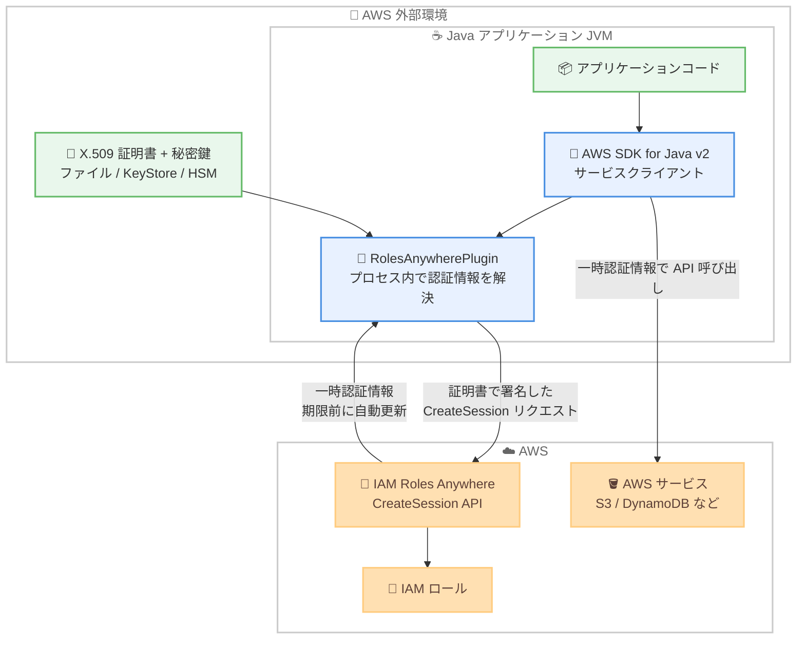

# AWS IAM Roles Anywhere - AWS SDK for Java 向けプラグイン

**リリース日**: 2026 年 8 月 25 日
**サービス**: AWS IAM Roles Anywhere
**機能**: IAM Roles Anywhere plugin for the AWS SDK for Java

📊 [このアップデートのインフォグラフィックを見る](https://takech9203.github.io/aws-news-summary/20260825-iam-roles-anywhere-java.html)

## 概要

AWS IAM Roles Anywhere が、AWS SDK for Java v2 向けの公式プラグインを提供開始しました。このプラグインにより、AWS 外部 (オンプレミス、他社クラウド、エッジ環境など) で稼働する Java ワークロードが、X.509 証明書を使用してアプリケーションのプロセス内 (同一 JVM 内) で直接、一時的な AWS 認証情報を取得できるようになります。

これまで IAM Roles Anywhere を利用するには、スタンドアロンの認証情報ヘルパーツール (credential helper) を別プロセスとして実行し、AWS プロファイルの `credential_process` に設定する方法が一般的でした。今回のプラグインは SDK のサービスクライアントビルダーに `addPlugin` で追加するだけで、`CreateSession` API の呼び出しから有効期限前の認証情報の自動更新までをすべてプロセス内で処理します。認証情報取得のための追加コードは不要です。

対象ユーザーは、長期アクセスキーを排除しつつ AWS 外部の Java アプリケーションから AWS API を呼び出したい開発者・セキュリティ管理者です。RSA、Elliptic Curve (EC)、ML-DSA (耐量子署名アルゴリズム) の鍵タイプに対応し、Java 8 以上で動作します。追加料金はありません。

**アップデート前の課題**

- IAM Roles Anywhere の認証情報取得には credential helper を別プロセスとして起動する必要があり、`credential_process` の設定やバイナリの配布・管理が必要だった
- サブプロセスの起動はコンテナ環境や制約のある実行環境で構成が煩雑になり、運用負荷が高かった
- 証明書や秘密鍵をファイルとして外部プロセスに渡す構成が前提となり、Java の `KeyStore` や JCE プロバイダー、HSM で管理される鍵素材との統合が難しかった

**アップデート後の改善**

- SDK クライアントビルダーへのプラグイン追加だけで、認証情報の取得・署名・自動更新がプロセス内で完結するようになった
- credential helper のサブプロセス起動や `credential_process` の設定が不要になり、デプロイ構成がシンプルになった
- SPI (サービスプロバイダーインターフェース) を通じてファイル、Java `KeyStore`、JCE プロバイダー、Secrets Manager や PKCS#11 などのカスタムソースから鍵素材を供給できるようになった
- ML-DSA を含む複数の鍵タイプに対応し、耐量子暗号への移行パスも確保された

## アーキテクチャ図



プラグインはアプリケーションと同一 JVM 内で動作し、X.509 証明書で署名した `CreateSession` リクエストにより一時認証情報を取得します。取得した認証情報は SDK クライアントに自動適用され、有効期限前に自動更新されます。

## サービスアップデートの詳細

### 主要機能

1. **プロセス内での認証情報解決**
   - AWS SDK for Java v2 の任意のサービスクライアントビルダーに `addPlugin` でプラグインを追加するだけで利用可能
   - スタンドアロンの credential helper と異なり、アプリケーションと同じ JVM 内で動作
   - `CreateSession` リクエストへの X.509 署名、一時認証情報の取得、期限前の自動更新をプラグインが処理し、以降の AWS API 呼び出しに追加コードなしで適用

2. **柔軟な鍵素材の供給 (SPI)**
   - `X509IdentityProvider.fromFiles()` でローカルディスク上の PEM 証明書と PKCS#8 秘密鍵を指定可能 (パスワード保護鍵、中間証明書チェーンにも対応)
   - `fromFiles` はリフレッシュのたびに証明書と鍵を再読み込みするため、ディスク上の証明書ローテーションが自動的に反映される
   - カスタム `resolve()` 実装により、Secrets Manager、Parameter Store、S3、ACM Private CA、PKCS#11 (HSM) などの動的ソースと統合可能
   - `ofStatic()` により HSM ハンドルなど呼び出し側が所有する鍵にも対応

3. **複数の鍵タイプに対応**
   - RSA、Elliptic Curve (EC)、ML-DSA の 3 種類の鍵タイプをサポート
   - ML-DSA は NIST 標準の耐量子署名アルゴリズムで、BouncyCastle などの JCE プロバイダーの登録が必要
   - 耐量子暗号への移行を見据えた証明書運用が可能

4. **既存の認証情報プロバイダーとの合成**
   - クライアントに `credentialsProvider` が設定済みの場合、`AwsCredentialsProviderChain` 経由で既存プロバイダーが優先され、本プラグインはフォールバックとして動作
   - `RolesAnywhereCredentialsProvider` を直接構築し、複数クライアント間でセッションキャッシュを共有することも可能

5. **秘密鍵のライフサイクル管理**
   - プラグインが所有する鍵素材は署名後に `PrivateKey.destroy()` を呼び出し、メモリ上の鍵の露出を最小化
   - HSM / PKCS#11 の鍵など呼び出し側が所有する鍵は破棄しない設計

## 技術仕様

### プラグインの基本情報

| 項目 | 詳細 |
|------|------|
| 配布先 | Maven Central |
| Group ID | `software.amazon.rolesanywhere.plugin` |
| Artifact ID | `roles-anywhere-java` |
| 対応 SDK | AWS SDK for Java v2 |
| 最小 Java バージョン | Java 8 |
| 対応鍵タイプ | RSA、EC、ML-DSA |
| ライセンス | Apache-2.0 |
| リリースサイクル | AWS SDK for Java とは独立した独自のリリースサイクル |

### 主な設定パラメータ

| パラメータ | 必須/任意 | 詳細 |
|------|------|------|
| `identityProvider` | 必須 | X.509 証明書と秘密鍵の供給元 |
| `trustAnchorArn` | 必須 | IAM Roles Anywhere トラストアンカーの ARN |
| `profileArn` | 必須 | IAM Roles Anywhere プロファイルの ARN |
| `roleArn` | 必須 | 引き受ける IAM ロールの ARN |
| `region` | 任意 | 明示指定 → `aws.region` システムプロパティ → `AWS_REGION` 環境変数 → ARN からの推論の順で解決 |
| `roleSessionName` | 任意 | デフォルトは自動生成 |
| `durationSeconds` | 任意 | 900〜43,200 秒、デフォルト 3,600 秒 |
| `staleTime` | 任意 | デフォルト 5 分 |
| `minRefreshInterval` | 任意 | デフォルト 5 分、最小 30 秒 |
| `endpoint` / `fipsEnabled` / `dualStackEnabled` / `httpClient` | 任意 | エンドポイントや HTTP クライアントのカスタマイズ |

### IAM ロールの信頼ポリシー例

```json
{
  "Version": "2012-10-17",
  "Statement": [
    {
      "Effect": "Allow",
      "Principal": {
        "Service": "rolesanywhere.amazonaws.com"
      },
      "Action": [
        "sts:AssumeRole",
        "sts:TagSession",
        "sts:SetSourceIdentity"
      ]
    }
  ]
}
```

IAM Roles Anywhere が引き受ける IAM ロールには、`rolesanywhere.amazonaws.com` をプリンシパルとする信頼ポリシーが必要です。

## 設定方法

### 前提条件

1. IAM Roles Anywhere のトラストアンカー (CA 証明書を登録) が作成済みであること
2. IAM Roles Anywhere のプロファイルと、`rolesanywhere.amazonaws.com` を信頼する IAM ロールが作成済みであること
3. トラストアンカーの CA から発行された X.509 クライアント証明書と秘密鍵 (PKCS#8 形式) を保有していること
4. AWS SDK for Java v2 を使用する Java 8 以上のアプリケーションであること

### 手順

#### ステップ 1: 依存関係の追加

```xml
<dependency>
    <groupId>software.amazon.rolesanywhere.plugin</groupId>
    <artifactId>roles-anywhere-java</artifactId>
    <version>最新バージョンを指定</version>
</dependency>
```

Maven の `pom.xml` にプラグインの依存関係を追加します。最新バージョンとリリースノートは Maven Central のプラグインページで確認できます。

#### ステップ 2: プラグインの構築

```java
RolesAnywherePlugin plugin = RolesAnywherePlugin.builder()
    .identityProvider(X509IdentityProvider.fromFiles(
        Paths.get("path/to/certificate.pem"),
        Paths.get("path/to/private-key.pem"),
        "RSA"))
    .trustAnchorArn("arn:aws:rolesanywhere:us-east-1:123456789012:trust-anchor/example")
    .profileArn("arn:aws:rolesanywhere:us-east-1:123456789012:profile/example")
    .roleArn("arn:aws:iam::123456789012:role/MyApplicationRole")
    .build();
```

X.509 証明書と秘密鍵のファイルパス、鍵タイプ、トラストアンカー・プロファイル・ロールの各 ARN を指定してプラグインを構築します。`fromFiles` は認証情報のリフレッシュごとに証明書を再読み込みするため、証明書のローテーションが自動反映されます。

#### ステップ 3: SDK クライアントへのアタッチ

```java
S3Client s3Client = S3Client.builder()
    .addPlugin(plugin)
    .region(Region.US_EAST_1)
    .build();
```

任意の AWS SDK for Java v2 サービスクライアントビルダーに `addPlugin` でプラグインを追加します。以降、このクライアント経由の AWS API 呼び出しには IAM Roles Anywhere の一時認証情報が自動的に適用され、期限前に自動更新されます。

## メリット

### ビジネス面

- **長期アクセスキーの排除**: AWS 外部のワークロードから IAM アクセスキーを排除し、鍵漏えいリスクとローテーション運用コストを削減できる
- **運用の簡素化**: credential helper バイナリの配布・バージョン管理・プロセス管理が不要になり、デプロイメントパイプラインがシンプルになる
- **追加料金なし**: プラグイン自体は無料で、IAM Roles Anywhere の利用にも追加料金は発生しない

### 技術面

- **プロセス内解決**: サブプロセスの起動や `credential_process` の設定が不要で、コンテナや制約のある実行環境でも構成しやすい
- **柔軟な鍵管理**: SPI により Java `KeyStore`、JCE プロバイダー、HSM (PKCS#11)、Secrets Manager、ACM Private CA など多様な鍵ソースと統合できる
- **耐量子暗号対応**: ML-DSA 鍵タイプのサポートにより、耐量子暗号への段階的な移行が可能
- **自動更新と鍵保護**: 一時認証情報の期限前自動更新に加え、署名後の `PrivateKey.destroy()` によりメモリ上の鍵の露出を最小化する設計

## デメリット・制約事項

### 制限事項

- AWS SDK for Java v2 専用であり、SDK for Java v1 や他言語の SDK では利用できない (JVM 以外のワークロードでは従来どおり credential helper を使用する)
- 最小 Java 8 ランタイムが必要
- ML-DSA 鍵を使用する場合は BouncyCastle などの JCE プロバイダーを起動時に登録する必要がある
- `durationSeconds` は 900〜43,200 秒 (15 分〜12 時間) の範囲に制限される

### 考慮すべき点

- 同一ホスト上の複数ツール間で認証情報を共有したい場合は、プロセス内で完結するプラグインよりも credential helper の方が適している
- 署名用の鍵素材をアプリケーションプロセスの外に置きたいセキュリティ要件がある場合も credential helper が推奨される
- プラグインは AWS SDK for Java とは独立したリリースサイクルを持つため、各リリースがサポートする SDK バージョンをリリースノートで確認する必要がある
- クライアントに既存の `credentialsProvider` が設定されている場合、プラグインはフォールバックとして動作する点に注意が必要

## ユースケース

### ユースケース 1: オンプレミス Java アプリケーションからの S3 アクセス

**シナリオ**: オンプレミスのデータセンターで稼働する Java バッチアプリケーションが、処理結果を Amazon S3 にアップロードする。これまでは IAM アクセスキーを設定ファイルに保存しており、監査で指摘を受けていた。

**実装例**:
```java
RolesAnywherePlugin plugin = RolesAnywherePlugin.builder()
    .identityProvider(X509IdentityProvider.fromFiles(
        Paths.get("/etc/pki/app/cert.pem"),
        Paths.get("/etc/pki/app/key.pem"),
        "EC"))
    .trustAnchorArn(trustAnchorArn)
    .profileArn(profileArn)
    .roleArn(roleArn)
    .build();

S3Client s3 = S3Client.builder().addPlugin(plugin).build();
s3.putObject(req, RequestBody.fromFile(resultFile));
```

**効果**: 長期アクセスキーを完全に排除し、既存の社内 PKI で発行した証明書ベースの認証に移行できる。証明書ローテーションもファイルの差し替えだけで自動反映される。

### ユースケース 2: 他社クラウド上のワークロードからのハイブリッド構成

**シナリオ**: 他社クラウドで稼働する Java マイクロサービス群が、Amazon DynamoDB と Amazon SQS を利用するハイブリッド構成。複数のサービスクライアントで認証セッションを効率的に共有したい。

**実装例**:
```java
RolesAnywhereCredentialsProvider provider =
    RolesAnywhereCredentialsProvider.builder()
        .identityProvider(identityProvider)
        .trustAnchorArn(trustAnchorArn)
        .profileArn(profileArn)
        .roleArn(roleArn)
        .build();

SdkPlugin shared = RolesAnywherePlugin.create(provider);
DynamoDbClient ddb = DynamoDbClient.builder().addPlugin(shared).build();
SqsClient sqs = SqsClient.builder().addPlugin(shared).build();
```

**効果**: 複数の SDK クライアント間でセッションキャッシュを共有し、`CreateSession` の呼び出し回数を抑えつつ、マルチクラウド環境から AWS サービスへ安全にアクセスできる。

### ユースケース 3: ACM Private CA と連携した短命証明書の動的発行

**シナリオ**: セキュリティ要件が厳しい金融系ワークロードで、長期の証明書をディスクに置かず、AWS Private CA から短命証明書を動的に発行して認証に使用したい。

**実装例**:
```java
X509IdentityProvider dynamicProvider = () -> {
    // AWS Private CA から短命証明書を発行して取得する処理
    String pemBundle = issueShortLivedCertificate();
    return X509Identity.fromPem(pemBundle, "EC");
};

RolesAnywherePlugin plugin = RolesAnywherePlugin.builder()
    .identityProvider(dynamicProvider)
    .trustAnchorArn(trustAnchorArn)
    .profileArn(profileArn)
    .roleArn(roleArn)
    .minRefreshInterval(Duration.ofMinutes(5))
    .build();
```

**効果**: SPI のカスタム `resolve()` 実装により証明書の発行から認証までを自動化し、鍵素材のディスク保存を回避。`minRefreshInterval` によりリトライストームも防止できる。

## 料金

プラグインの利用に追加料金はありません。IAM Roles Anywhere 自体も無料で利用でき、一時認証情報を使用して呼び出す各 AWS サービスの標準料金のみが発生します。

## 利用可能リージョン

AWS GovCloud (US) リージョン、AWS European Sovereign Cloud (ドイツ) リージョン、中国リージョンを含む、IAM Roles Anywhere が利用可能なすべての AWS リージョンで利用できます。

## 関連サービス・機能

- **AWS IAM Roles Anywhere**: 本プラグインの基盤サービス。X.509 証明書を使用して AWS 外部のワークロードに一時認証情報を提供する
- **IAM Roles Anywhere credential helper**: 従来からのスタンドアロン認証情報ヘルパー。JVM 以外のワークロードや、複数ツール間での認証情報共有には引き続きこちらが適する
- **AWS SDK for Java v2**: プラグインが統合される SDK。`addPlugin` によるプラグイン機構を提供する
- **AWS Private CA**: 短命証明書の動的発行と組み合わせることで、鍵素材の露出を最小化する構成が可能
- **AWS Secrets Manager**: SPI のカスタム実装により、証明書・秘密鍵の保管先として統合可能

## 参考リンク

- 📊 [インフォグラフィック](https://takech9203.github.io/aws-news-summary/20260825-iam-roles-anywhere-java.html)
- [公式発表 (What's New)](https://aws.amazon.com/about-aws/whats-new/2026/08/iam-roles-anywhere-java/)
- [ドキュメント: Get temporary security credentials with the IAM Roles Anywhere plugin for the AWS SDK for Java](https://docs.aws.amazon.com/rolesanywhere/latest/userguide/java-plugin.html)
- [Maven Central: roles-anywhere-java](https://central.sonatype.com/artifact/software.amazon.rolesanywhere.plugin/roles-anywhere-java)
- [GitHub: aws-sdk-plugin/roles-anywhere-java](https://github.com/aws-sdk-plugin/roles-anywhere-java)
- [IAM Roles Anywhere 製品ページ](https://aws.amazon.com/iam/roles-anywhere/)
- [IAM Roles Anywhere エンドポイントとクォータ](https://docs.aws.amazon.com/general/latest/gr/rolesanywhere.html)

## まとめ

AWS SDK for Java v2 向けの IAM Roles Anywhere プラグインにより、AWS 外部の Java ワークロードは credential helper のサブプロセスなしで、プロセス内で安全に一時認証情報を取得できるようになりました。長期アクセスキーの排除とデプロイ構成の簡素化を同時に実現できるため、オンプレミスやマルチクラウドで Java アプリケーションを運用している場合は、Maven Central からプラグインを導入して証明書ベース認証への移行を検討することを推奨します。
