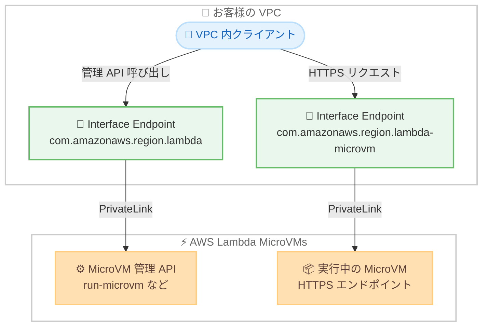

# AWS Lambda - MicroVMs の AWS PrivateLink サポート

**リリース日**: 2026 年 8 月 25 日
**サービス**: AWS Lambda (Lambda MicroVMs)
**機能**: AWS PrivateLink による Lambda MicroVMs へのプライベート接続

📊 [このアップデートのインフォグラフィックを見る](https://takech9203.github.io/aws-news-summary/20260825-lambda-microvms-supports-privatelink.html)

## 概要

AWS Lambda MicroVMs が AWS PrivateLink をサポートしました。これにより、Amazon VPC 内のリソースから Lambda MicroVMs へのトラフィックを、パブリックインターネットを経由せずに AWS ネットワーク内で完結させることができます。

今回のアップデートでは、2 種類の VPC エンドポイント経由の通信がサポートされます。MicroVM イメージの作成や MicroVM の起動といった管理系 API の呼び出しは既存の Lambda 用エンドポイント (`com.amazonaws.{region}.lambda`) を利用し、実行中の MicroVM の HTTPS エンドポイントへのアクセスには新しい専用エンドポイント (`com.amazonaws.{region}.lambda-microvm`) を利用します。エンドポイントは AWS Management Console、AWS CLI、AWS CloudFormation、AWS SDK から作成できます。

金融サービス、ヘルスケア、政府機関など、厳格なネットワーク分離要件を持つ規制対象ワークロードにおいて、Lambda MicroVMs を採用しやすくなるアップデートです。

**アップデート前の課題**

- 以前は VPC 内のクライアントから MicroVM の HTTPS エンドポイントに接続する際、トラフィックがパブリックインターネット経由となっていた
- 「インターネットへの経路を持たない閉域ネットワーク」を要件とする規制対象ワークロードでは、MicroVM への接続要件を満たすことが困難だった
- MicroVM 管理 API の呼び出しについても、NAT ゲートウェイやインターネットゲートウェイ経由の経路設計が必要だった

**アップデート後の改善**

- VPC エンドポイント経由で MicroVM 管理 API (イメージ作成、起動、停止など) をプライベートに呼び出せるようになった
- 専用の `lambda-microvm` エンドポイント経由で、実行中の MicroVM の HTTPS エンドポイントへプライベートに接続できるようになった
- プライベート DNS を有効化すれば、既存の MicroVM エンドポイントホスト名のままクライアント側の変更なしでプライベート接続に切り替えられる
- VPC エンドポイントポリシーにより、接続可能な MicroVM を特定のアカウントや組織に制限できるようになった

## アーキテクチャ図



VPC 内のクライアントは、管理 API 用と MicroVM 接続用の 2 種類のインターフェイスエンドポイントを経由し、パブリックインターネットを通らずに Lambda MicroVMs へアクセスします。

## サービスアップデートの詳細

### 主要機能

1. **MicroVM 管理 API のプライベート呼び出し**
   - MicroVM イメージの作成、MicroVM の起動・停止・終了などの管理 API を VPC エンドポイント経由で呼び出せる
   - Lambda 本体と同じ VPC エンドポイントサービス `com.amazonaws.{region}.lambda` を共用する
   - エンドポイントポリシーで `lambda:` プレフィックスの IAM アクション (例: `lambda:ListMicrovmImages`) を制御できる

2. **MicroVM HTTPS エンドポイントへのプライベート接続**
   - 専用の VPC エンドポイントサービス `com.amazonaws.{region}.lambda-microvm` を新設
   - `abc123def456.lambda-microvm.us-east-1.on.aws` のような MicroVM エンドポイント URL への HTTPS 接続を PrivateLink 経由で処理する
   - プライベート DNS を有効化すると、`*.lambda-microvm.{region}.on.aws` の名前解決が VPC 内でエンドポイントのプライベート IP に解決され、クライアント側の変更が不要

3. **VPC エンドポイントポリシーによる接続制御**
   - `lambda-microvm` エンドポイントの接続は、接続ごとに `lambda:ConnectMicrovm` アクションとしてポリシー評価される
   - MicroVM への接続は auth トークンで認証されるため、ポリシーの `Principal` と `Resource` は `"*"` を指定する必要がある
   - `aws:ResourceAccount` や `aws:ResourceOrgID` などの条件キーで、接続先 MicroVM の所有アカウントや組織を制限できる

## 技術仕様

### VPC エンドポイントの構成

| 項目 | 詳細 |
|------|------|
| 管理 API 用サービス名 | `com.amazonaws.{region}.lambda` (Lambda と共用) |
| MicroVM 接続用サービス名 | `com.amazonaws.{region}.lambda-microvm` |
| エンドポイントタイプ | Interface (インターフェイスエンドポイント) |
| 対象トラフィック | 管理 API 呼び出し、MicroVM エンドポイントへの HTTPS 通信 |
| プライベート DNS | 有効化推奨。`*.lambda-microvm.{region}.on.aws` を VPC 内で解決 |
| セキュリティグループ要件 | エンドポイント ENI への TCP 443 のアウトバウンド許可 |
| 認証方式 | MicroVM auth トークン (`X-aws-proxy-auth` ヘッダー)。SigV4 の IAM プリンシパルは関連付かない |

### エンドポイントポリシーで利用可能な条件キー

| 条件キー | 説明 |
|----------|------|
| `aws:ResourceAccount` | 接続先 MicroVM を所有する AWS アカウント |
| `aws:ResourceOrgID` | 接続先 MicroVM 所有アカウントの AWS Organizations 組織 ID |
| `aws:SourceVpce` | 接続が経由したインターフェイスエンドポイントの ID |
| `aws:SourceVpc` | 接続元の VPC の ID |
| `aws:VpcSourceIp` | 接続元クライアントのプライベート IP アドレス |

### エンドポイントポリシーの例

自アカウント (111122223333) が所有する MicroVM への接続のみを許可する例です。

```json
{
  "Statement": [
    {
      "Principal": "*",
      "Effect": "Allow",
      "Action": "lambda:ConnectMicrovm",
      "Resource": "*",
      "Condition": {
        "StringEquals": {
          "aws:ResourceAccount": "111122223333"
        }
      }
    }
  ]
}
```

## 設定方法

### 前提条件

1. Lambda MicroVMs が利用可能なリージョンであること
2. VPC とサブネット、および TCP 443 のアウトバウンドを許可するセキュリティグループが用意されていること
3. プライベート DNS を利用する場合、VPC の `enableDnsHostnames` と `enableDnsSupport` 属性が有効であること

### 手順

#### ステップ 1: MicroVM 接続用の VPC エンドポイントを作成

```bash
aws ec2 create-vpc-endpoint \
  --vpc-id vpc-ec43eb89 \
  --vpc-endpoint-type Interface \
  --service-name com.amazonaws.us-east-1.lambda-microvm \
  --subnet-id subnet-abababab \
  --security-group-id sg-1a2b3c4d \
  --private-dns-enabled
```

`lambda-microvm` サービスに対するインターフェイスエンドポイントを作成します。`--private-dns-enabled` を指定すると、既存の MicroVM エンドポイントホスト名がそのまま VPC 内のプライベート IP に解決されるため、クライアント側の変更が不要になります。

#### ステップ 2: エンドポイントの状態とプライベート DNS を確認

```bash
aws ec2 describe-vpc-endpoints \
  --vpc-endpoint-ids vpce-1a2b3c4d5e6f7g8h9 \
  --query 'VpcEndpoints[0].{State:State,PrivateDns:PrivateDnsEnabled,Dns:DnsEntries[*].DnsName}'
```

作成したエンドポイントが `available` 状態であること、およびプライベート DNS が有効になっていることを確認します。

#### ステップ 3: VPC 内から MicroVM エンドポイントへ接続

```bash
aws lambda-microvms create-microvm-auth-token \
  --microvm-identifier microvm-id \
  --expiration-in-minutes 30 \
  --allowed-ports '[{"port":8080}]'

curl 'https://abc123def456.lambda-microvm.us-east-1.on.aws' \
  -H 'X-aws-proxy-auth: TOKEN' \
  -H 'X-aws-proxy-port: 8080'
```

MicroVM への接続に必要な auth トークンを生成し、HTTPS リクエストを送信します。プライベート DNS が有効な場合、このホスト名は VPC 内でエンドポイントのプライベート IP に解決され、通信は PrivateLink 経由となります。

## メリット

### ビジネス面

- **規制要件への対応**: 金融、ヘルスケア、政府機関などで求められる厳格なネットワーク分離要件を満たしたうえで MicroVMs を採用できる
- **セキュリティ体制の強化**: トラフィックがパブリックインターネットに露出しないため、監査やコンプライアンス対応の説明が容易になる
- **移行コストの低減**: プライベート DNS によりクライアント側の変更なしでプライベート接続へ移行できる

### 技術面

- **閉域構成の実現**: インターネットゲートウェイや NAT ゲートウェイを持たない VPC からも管理 API と MicroVM エンドポイントの両方へ到達できる
- **きめ細かいアクセス制御**: エンドポイントポリシーの `lambda:ConnectMicrovm` アクションと `aws:ResourceAccount` / `aws:ResourceOrgID` 条件キーで接続先を制限できる
- **標準的な運用手段**: Console、CLI、CloudFormation、SDK のいずれからもエンドポイントを作成でき、既存の IaC ワークフローに組み込みやすい

## デメリット・制約事項

### 制限事項

- `lambda:ConnectMicrovm` は VPC エンドポイントポリシー専用のアクションであり、IAM のアイデンティティベースポリシーやリソースベースポリシーでは使用できない
- MicroVM への接続は auth トークンで認証されるため、エンドポイントポリシーは匿名プリンシパルで評価される。`Principal` に特定のプリンシパルを指定するとすべての接続が拒否される
- `aws:PrincipalArn` や `aws:PrincipalOrgID` など、リクエスト元アイデンティティに依存する条件キーはポリシー評価時に設定されず、マッチしない
- 接続先の制限は `Resource` 要素ではなく `aws:ResourceAccount` などの条件キーで行う必要がある

### 考慮すべき点

- プライベート DNS を無効にした場合、エンドポイント固有の DNS 名で接続する際に TLS SNI と HTTP Host ヘッダーの両方に元の MicroVM ホスト名を保持する必要がある (curl の `--connect-to` フラグなどを利用)
- デフォルトのエンドポイントポリシーは任意の AWS アカウントの MicroVM への接続を許可するため、要件に応じてカスタムポリシーの適用を検討する
- インターフェイスエンドポイントには時間課金とデータ処理課金が発生するため、トラフィック量に応じたコスト試算が必要

## ユースケース

### ユースケース 1: 金融機関の閉域ネットワークからの AI エージェント実行環境

**シナリオ**: インターネットへの経路を持たない閉域 VPC 内の業務システムから、コード実行やエージェントワークロード用の MicroVM を起動し、結果を取得したい。

**実装例**:
```bash
# 管理 API 用エンドポイント (Lambda と共用) と MicroVM 接続用エンドポイントを作成
aws ec2 create-vpc-endpoint --vpc-endpoint-type Interface \
  --service-name com.amazonaws.ap-northeast-1.lambda \
  --vpc-id vpc-xxxx --subnet-id subnet-xxxx --security-group-id sg-xxxx \
  --private-dns-enabled

aws ec2 create-vpc-endpoint --vpc-endpoint-type Interface \
  --service-name com.amazonaws.ap-northeast-1.lambda-microvm \
  --vpc-id vpc-xxxx --subnet-id subnet-xxxx --security-group-id sg-xxxx \
  --private-dns-enabled
```

**効果**: MicroVM のライフサイクル管理から実行中アプリケーションへのアクセスまで、すべての通信を AWS ネットワーク内で完結でき、ネットワーク分離要件を維持したまま MicroVMs を利用できる。

### ユースケース 2: 組織内アカウントの MicroVM のみに接続を制限

**シナリオ**: 共有ネットワークアカウントの VPC エンドポイントを複数チームが利用しており、自組織外の MicroVM への接続を防ぎたい。

**実装例**:
```json
{
  "Statement": [
    {
      "Principal": "*",
      "Effect": "Allow",
      "Action": "lambda:ConnectMicrovm",
      "Resource": "*",
      "Condition": {
        "StringEquals": {
          "aws:ResourceOrgID": "o-xxxxxxxxxx"
        }
      }
    }
  ]
}
```

**効果**: エンドポイント経由の接続先を自組織のアカウントが所有する MicroVM に限定でき、データ持ち出し経路のリスクを低減できる。

### ユースケース 3: オンプレミスから Direct Connect 経由での MicroVM 利用

**シナリオ**: オンプレミスのバッチ基盤から AWS Direct Connect と VPC を経由して、MicroVM 上のアプリケーションにプライベート接続したい。

**実装例**:
```bash
# オンプレミスから MicroVM ホスト名で接続 (VPC 内の Route 53 Resolver 経由で解決)
curl 'https://abc123def456.lambda-microvm.us-east-1.on.aws' \
  -H 'X-aws-proxy-auth: TOKEN' \
  -H 'X-aws-proxy-port: 8080'
```

**効果**: オンプレミスと MicroVM 間の通信をインターネットに出さずに実現でき、ハイブリッド構成でも一貫したセキュリティポリシーを維持できる。

## 料金

Lambda MicroVMs の PrivateLink サポート自体に追加料金はありませんが、インターフェイスエンドポイントの利用に対して AWS PrivateLink の標準料金 (エンドポイントの時間課金およびデータ処理課金) が発生します。詳細は [AWS PrivateLink 料金ページ](https://aws.amazon.com/privatelink/pricing/) を参照してください。

## 利用可能リージョン

Lambda MicroVMs が利用可能なすべてのリージョンで利用できます。最新のリージョン対応状況は [AWS Capabilities by Region](https://builder.aws.com/build/capabilities) で確認できます。

## 関連サービス・機能

- **AWS PrivateLink**: VPC と AWS サービス間のプライベート接続を提供する基盤サービス。今回のアップデートで MicroVMs が対応
- **Amazon VPC**: インターフェイスエンドポイント、セキュリティグループ、プライベート DNS の設定基盤
- **Lambda Network Connector**: MicroVM のアウトバウンド通信を VPC 経由にルーティングする egress 側の仕組み。今回の PrivateLink 対応は ingress 側と管理 API 側を補完する
- **AWS Direct Connect / AWS Site-to-Site VPN**: オンプレミスから VPC エンドポイント経由で MicroVM へ接続するハイブリッド構成で併用

## 参考リンク

- 📊 [インフォグラフィック](https://takech9203.github.io/aws-news-summary/20260825-lambda-microvms-supports-privatelink.html)
- [公式発表 (What's New)](https://aws.amazon.com/about-aws/whats-new/2026/08/lambda-microvms-supports-privatelink/)
- [ドキュメント: Lambda MicroVMs Networking](https://docs.aws.amazon.com/lambda/latest/dg/microvms-networking.html)
- [ドキュメント: Interface VPC Endpoints (AWS PrivateLink)](https://docs.aws.amazon.com/vpc/latest/privatelink/interface-endpoints.html)
- [料金ページ: AWS PrivateLink](https://aws.amazon.com/privatelink/pricing/)

## まとめ

Lambda MicroVMs が AWS PrivateLink に対応し、管理 API の呼び出しと実行中 MicroVM への HTTPS 接続の両方をパブリックインターネットを経由せずに行えるようになりました。厳格なネットワーク分離要件を持つ規制対象ワークロードでの MicroVMs 採用の障壁を大きく下げるアップデートです。閉域要件のある環境で MicroVMs の利用を検討している場合は、`lambda` および `lambda-microvm` の 2 つのインターフェイスエンドポイントの構成と、エンドポイントポリシーによる接続制御の設計から始めることを推奨します。
