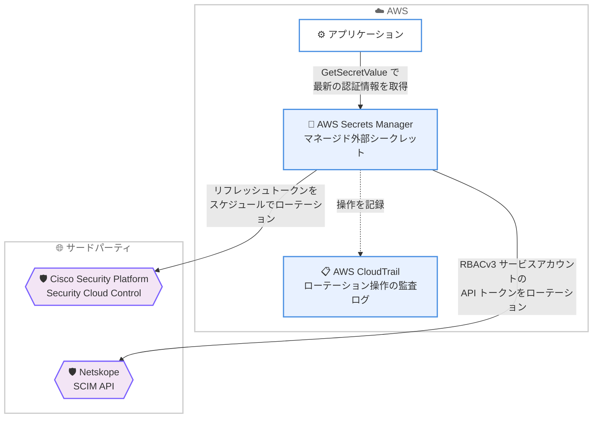

# AWS Secrets Manager - Cisco Security Platform および Netskope のマネージド外部シークレット対応

**リリース日**: 2026 年 8 月 25 日
**サービス**: AWS Secrets Manager
**機能**: マネージド外部シークレット (Managed External Secrets) の対応パートナー拡大 (Cisco Security Platform / Netskope)

📊 [このアップデートのインフォグラフィックを見る](https://takech9203.github.io/aws-news-summary/20260825-secrets-manager-cisco-netskope.html)

## 概要

AWS Secrets Manager のマネージド外部シークレット機能が拡張され、新たに Cisco Security Platform (Security Cloud Control) の API キーと Netskope の API トークンに対応しました。これにより、カスタムのローテーションコードを一切書くことなく、AWS マネジメントコンソールから直接これらのサードパーティ認証情報を保存し、自動ローテーションできるようになります。

マネージド外部シークレットは、統合パートナーが定義した事前定義フォーマットでサードパーティ認証情報を保存し、Lambda 関数不要のマネージドローテーションを提供する Secrets Manager のシークレットタイプです。今回の 2 つの統合はいずれも「自己認証型 (self-authenticating)」であり、保存された認証情報自体がローテーションを承認するため、別途管理者認証情報を用意する必要はありません。

今回の追加により、対応パートナーは BigID、Confluent Cloud、Datadog、GitLab、Jenkins、MongoDB Atlas、Okta、Paddle、Salesforce、Snowflake、SonarQube に Cisco と Netskope が加わり、セキュリティ製品の API 認証情報管理をマルチベンダー環境で標準化できます。

**アップデート前の課題**

このアップデート以前は、Cisco Security Platform や Netskope の API 認証情報を安全に管理するために、以下のような対応が必要でした。

- Cisco Security Platform の API キー (リフレッシュトークン) や Netskope の REST API トークンをローテーションするには、各製品の API 仕様に合わせたカスタム Lambda ローテーション関数を開発・保守する必要があった
- トークンの再発行や検証のロジックをアプリケーションごとに独自実装する必要があり、実装ミスによる認証情報の失効・漏洩リスクがあった
- ローテーションを自動化しない場合、長期間有効なトークンを使い続けることになり、セキュリティベストプラクティスに反していた

**アップデート後の改善**

今回のアップデートにより、以下が可能になりました。

- Cisco Security Platform の API キーのリフレッシュトークンを、ユーザー指定のスケジュールで自動ローテーションできるようになった (Cisco が定期的に再発行する新しいリフレッシュトークンを取得し、認証情報を常に有効に維持)
- Netskope の SCIM API を通じて、RBACv3 サービスアカウントの REST API トークンを自動ローテーションできるようになった (ローテーション完了前に新規生成トークンを検証)
- Lambda 関数のデプロイ・保守が不要になり、コンソールからの数クリックでローテーション設定が完了するようになった

## アーキテクチャ図



Secrets Manager が Lambda 関数なしで Cisco / Netskope の API と直接連携して認証情報をローテーションし、アプリケーションは常に最新の認証情報を GetSecretValue で取得します。すべてのローテーション操作は CloudTrail に記録されます。

## サービスアップデートの詳細

### 主要機能

1. **Cisco Security Platform (Security Cloud Control) API キーのマネージドローテーション**
   - シークレットタイプ `CiscoSecurityPlatformApiKey` として保存
   - API キーのリフレッシュトークンをユーザー指定のスケジュールでローテーションし、Cisco が定期的に再発行する新しいリフレッシュトークンを取得して認証情報を有効に維持
   - Cisco の標準的な OAuth パターンに従い、アプリケーションは保存されたリフレッシュトークンをオンデマンドで短期有効のアクセストークンに交換して利用

2. **Netskope REST API トークンのマネージドローテーション**
   - シークレットタイプ `NetskopeApiToken` として保存
   - Netskope の SCIM API を通じて RBACv3 サービスアカウントの REST API トークンをローテーション
   - ローテーション完了前に新規生成されたトークンを検証し、無効なトークンへの切り替えを防止

3. **自己認証型ローテーション**
   - 両統合とも保存された認証情報自体がローテーションを承認する自己認証型 (self-authenticating) の仕組み
   - ローテーション用に別途管理者認証情報 (スーパーユーザーシークレット) を保存・管理する必要がない

4. **Lambda 不要のマネージドローテーション基盤**
   - カスタムローテーション関数の作成・保守が不要で、アカウント内に Lambda 関数はデプロイされない
   - コンソールでのシークレット作成時にローテーションがデフォルトで有効化される
   - きめ細かなアクセス許可管理、可観測性、ガバナンス、コンプライアンス、ディザスタリカバリなど Secrets Manager の全機能セットを利用可能

## 技術仕様

### マネージド外部シークレットの構成要素

| 項目 | 詳細 |
|------|------|
| シークレットタイプ (Cisco) | `CiscoSecurityPlatformApiKey` |
| シークレットタイプ (Netskope) | `NetskopeApiToken` |
| シークレット値 | パートナーが定義したフィールドを `CreateSecret` 呼び出し時に保存 |
| ローテーションメタデータ | ローテーション時のシークレット更新に使用するフィールド (`RotateSecret` 呼び出しで使用) |
| ローテーション方式 | Lambda 関数不要のマネージドローテーション (自己認証型) |
| 監査 | すべてのローテーション操作・シークレット値更新・管理操作を AWS CloudTrail に記録 |
| 対応パートナー (既存) | BigID、Confluent Cloud、Datadog、GitLab、Jenkins、MongoDB Atlas、Okta、Paddle、Salesforce、Snowflake、SonarQube |

### 必要な権限

ローテーションを正常に機能させるには、Secrets Manager にシークレットのライフサイクルを管理するための権限を付与する必要があります。詳細は [Security and Permissions](https://docs.aws.amazon.com/secretsmanager/latest/userguide/mes-security.html) を参照してください。

## 設定方法

### 前提条件

1. AWS アカウントと Secrets Manager へのアクセス権限 (シークレットの作成・ローテーション設定権限)
2. Cisco Security Platform (Security Cloud Control) の API キー、または Netskope の RBACv3 サービスアカウントの REST API トークン
3. Secrets Manager がシークレットのライフサイクルを管理するための権限設定

### 手順

#### ステップ 1: マネージド外部シークレットの作成

AWS マネジメントコンソールで Secrets Manager を開き、[新しいシークレットを保存する] を選択します。シークレットタイプとして統合パートナー (Cisco または Netskope) を選択し、パートナーが定義したフォーマットに従って認証情報とローテーションメタデータを入力します。コンソールでの作成時にはローテーションがデフォルトで有効化されます。

#### ステップ 2: ローテーションスケジュールの設定

```bash
# ローテーションスケジュールの確認・更新の例
aws secretsmanager rotate-secret \
  --secret-id MyCiscoApiKeySecret \
  --rotation-rules "ScheduleExpression=rate(30 days)"
```

シークレットのローテーションスケジュールを設定します。この例では 30 日ごとにローテーションを実行するよう指定しています。Cisco の場合はリフレッシュトークンが、Netskope の場合は REST API トークンがスケジュールに従い自動的に再発行されます。

#### ステップ 3: アプリケーションからのシークレット取得

```bash
# 最新のシークレット値を取得
aws secretsmanager get-secret-value \
  --secret-id MyCiscoApiKeySecret \
  --query SecretString
```

アプリケーションは `GetSecretValue` API で常に最新の認証情報を取得します。Cisco の場合、アプリケーションは取得したリフレッシュトークンを Cisco の OAuth エンドポイントで短期有効のアクセストークンに交換して API を呼び出します。

## メリット

### ビジネス面

- **運用コスト削減**: カスタムローテーション Lambda 関数の開発・テスト・保守が不要になり、セキュリティ運用の工数を削減できる
- **セキュリティ体制の強化**: 定期的な自動ローテーションにより、長期間有効なトークンの放置による漏洩リスクを低減できる
- **コンプライアンス対応**: CloudTrail による完全な監査ログで、認証情報のローテーション履歴を証跡として提示できる

### 技術面

- **Lambda 不要のローテーション**: アカウント内にローテーション用 Lambda 関数がデプロイされず、VPC 設定やランタイム更新などの管理オーバーヘッドがない
- **自己認証型の設計**: ローテーション用の管理者認証情報を別途保存する必要がなく、管理するシークレットの数を最小化できる
- **標準化されたフォーマット**: パートナーごとに事前定義されたシークレットフォーマットにより、実装のばらつきや設定ミスを防止できる

## デメリット・制約事項

### 制限事項

- 対応するのは各パートナーが定義した特定のシークレットタイプのみ (Cisco は `CiscoSecurityPlatformApiKey`、Netskope は `NetskopeApiToken`)
- Netskope のローテーション対象は RBACv3 サービスアカウントの REST API トークンであり、SCIM API 経由での操作が前提となる
- マネージド外部シークレットがサポートされているリージョンでのみ利用可能

### 考慮すべき点

- Cisco の統合では、アプリケーション側で保存されたリフレッシュトークンを短期アクセストークンに交換する OAuth フローの実装が引き続き必要
- ローテーション後に古いトークンは無効化されるため、アプリケーションはキャッシュに依存せず Secrets Manager から最新の値を取得する設計にする必要がある
- 既存のカスタム Lambda ローテーション関数で管理しているシークレットを移行する場合は、シークレットタイプと保存フォーマットの変更が必要

## ユースケース

### ユースケース 1: Cisco Security Cloud Control と連携するセキュリティ自動化基盤

**シナリオ**: SOC チームが Cisco Security Cloud Control の API を利用してファイアウォールポリシーの自動監査や設定変更を行っており、API キーのリフレッシュトークンを手動で更新している。

**実装例**:
```
1. Cisco Security Cloud Control で API キーを発行
2. Secrets Manager でシークレットタイプ CiscoSecurityPlatformApiKey として保存
3. ローテーションスケジュールを設定 (例: rate(30 days))
4. 自動化スクリプトは GetSecretValue でリフレッシュトークンを取得し、
   短期アクセストークンに交換して Cisco API を呼び出す
```

**効果**: リフレッシュトークンの手動更新作業が不要になり、トークン失効による自動化パイプラインの停止を防止できる。

### ユースケース 2: Netskope SASE 環境のログ収集パイプライン

**シナリオ**: SIEM へ Netskope のイベントログを取り込むために REST API トークンを使用しており、セキュリティポリシー上 90 日ごとのトークンローテーションが求められている。

**実装例**:
```
1. Netskope で RBACv3 サービスアカウントを作成し REST API トークンを発行
2. Secrets Manager でシークレットタイプ NetskopeApiToken として保存
3. ローテーションスケジュールを rate(90 days) で設定
4. ログ収集ジョブは実行時に GetSecretValue で最新トークンを取得
```

**効果**: ポリシーで求められる定期ローテーションが完全自動化され、ローテーション完了前のトークン検証により取り込みパイプラインの中断リスクも低減できる。

### ユースケース 3: マルチベンダーセキュリティ製品の認証情報の一元管理

**シナリオ**: Cisco、Netskope、Datadog、Okta など複数のセキュリティ / 監視製品の API 認証情報をベンダーごとに異なる方法で管理しており、統制が効いていない。

**実装例**:
```
1. 各製品の認証情報をマネージド外部シークレットとして Secrets Manager に集約
2. IAM ポリシーでシークレットごとにきめ細かなアクセス制御を設定
3. CloudTrail + Amazon EventBridge でローテーションイベントを監視・通知
```

**効果**: サードパーティ認証情報の保存・ローテーション・監査を単一のサービスに標準化でき、ガバナンスとコンプライアンス対応が容易になる。

## 料金

マネージド外部シークレットの利用に追加料金はなく、AWS Secrets Manager の標準料金体系が適用されます。シークレットごとの月額料金と API 呼び出しごとの料金が発生します。最新の料金は [AWS Secrets Manager 料金ページ](https://aws.amazon.com/secrets-manager/pricing/) を参照してください。

## 利用可能リージョン

AWS Secrets Manager のマネージド外部シークレットがサポートされているすべての AWS リージョンで利用可能です。

## 関連サービス・機能

- **AWS Lambda**: 従来のカスタムローテーションで必要だったが、マネージド外部シークレットではデプロイ不要になる
- **AWS CloudTrail**: すべてのローテーション操作・シークレット値更新・管理操作を記録し、監査証跡を提供する
- **AWS IAM**: シークレットごとのきめ細かなアクセス許可管理を実現する
- **AWS KMS**: Secrets Manager に保存されるシークレット値の暗号化に使用される

## 参考リンク

- 📊 [インフォグラフィック](https://takech9203.github.io/aws-news-summary/20260825-secrets-manager-cisco-netskope.html)
- [公式発表 (What's New)](https://aws.amazon.com/about-aws/whats-new/2026/08/secrets-manager-cisco-netskope/)
- [ドキュメント: Managed external secrets](https://docs.aws.amazon.com/secretsmanager/latest/userguide/managed-external-secrets.html)
- [ドキュメント: Managed external secrets Partners](https://docs.aws.amazon.com/secretsmanager/latest/userguide/mes-partners.html)
- [ドキュメント: Security and Permissions](https://docs.aws.amazon.com/secretsmanager/latest/userguide/mes-security.html)
- [料金ページ](https://aws.amazon.com/secrets-manager/pricing/)

## まとめ

Cisco Security Platform と Netskope のマネージド外部シークレット対応により、主要なセキュリティ製品の API 認証情報を Lambda 関数なしで自動ローテーションできるようになりました。これらの製品の API トークンをカスタムコードや手動運用で管理している場合は、マネージド外部シークレットへの移行を検討し、認証情報管理の標準化とセキュリティ体制の強化を進めることを推奨します。
