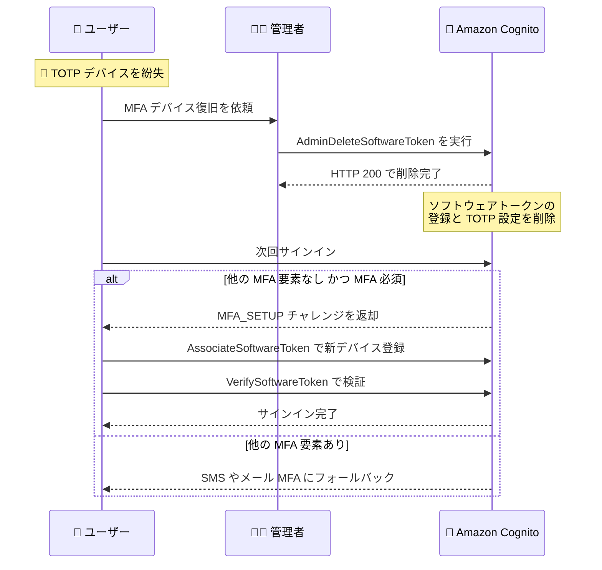

# Amazon Cognito - ユーザーの TOTP 設定をリセットする管理者向け API 操作の追加

**リリース日**: 2026 年 8 月 26 日
**サービス**: Amazon Cognito
**機能**: AdminDeleteSoftwareToken API による TOTP MFA 設定のリセット

📊 [このアップデートのインフォグラフィックを見る](https://takech9203.github.io/aws-news-summary/20260826-amazon-cognito-totp-reset.html)

## 概要

Amazon Cognito に、ユーザーの TOTP (時間ベースのワンタイムパスワード) MFA 設定をリセットするための新しい管理者向け API 操作 `AdminDeleteSoftwareToken` が追加されました。管理者はこの操作により、ユーザーとソフトウェアトークン (認証アプリ) の関連付けを削除でき、ユーザーは次回サインイン時に新しいデバイスを登録できるようになります。

スマートフォンの紛失や初期化などにより TOTP デバイスへのアクセスを失ったユーザーは、これまでサインインできなくなる (ロックアウトされる) ケースがありました。今回のアップデートにより、管理者は MFA の強制を維持したまま、ユーザーに安全な復旧パスを提供できます。ユーザープールで MFA を必須としている企業のシステム管理者や、カスタマーサポート業務を担当するチームにとって有用なアップデートです。

**アップデート前の課題**

- ユーザーが TOTP デバイス (スマートフォンなど) を紛失した場合、管理者側でソフトウェアトークンの登録を直接削除する API 操作が存在しなかった
- MFA を必須とするユーザープールでは、ロックアウトされたユーザーの復旧のためにアカウントの再作成が必要になるケースがあった
- アカウント再作成に伴い、ユーザー属性やグループ設定などの再構成が必要となり、運用負荷が高かった

**アップデート後の改善**

- 新しい `AdminDeleteSoftwareToken` API により、管理者がユーザーのソフトウェアトークン登録と TOTP MFA 設定を削除できるようになった
- ユーザーは次回サインイン時に `MFA_SETUP` チャレンジを通じて新しい TOTP デバイスを登録できるようになった
- MFA の強制ポリシーを維持したまま、アカウント再作成なしで復旧パスを提供できるようになった

## アーキテクチャ図



TOTP デバイスを紛失したユーザーの復旧フローです。管理者が `AdminDeleteSoftwareToken` を実行すると、ユーザーは次回サインイン時に新しい TOTP デバイスを登録するか、他の MFA 要素にフォールバックしてサインインできます。

## サービスアップデートの詳細

### 主要機能

1. **AdminDeleteSoftwareToken API 操作**
   - ユーザーの登録済み TOTP MFA 要素 (ソフトウェアトークン) を管理者権限で削除する新しい API 操作
   - リクエストパラメータは `UserPoolId` と `Username` の 2 つのみでシンプル
   - AWS CLI、AWS SDK、API から利用可能
   - IAM 認証情報による署名付きリクエストが必要 (IAM ポリシーで対応する権限の付与が必要)

2. **ソフトウェアトークン登録と TOTP 設定の削除**
   - ユーザーのソフトウェアトークン登録と TOTP MFA の優先設定 (preference) を削除する
   - SMS やメールなど、ユーザーが登録している他の MFA 要素は無効化されない
   - MFA 要素の有効化や優先設定の変更には、従来どおり `AdminSetUserMFAPreference` を使用する

3. **次回サインイン時の再登録フロー**
   - ユーザープールで MFA が必須で、他に利用可能な MFA 要素がない場合、次回サインイン時に `MFA_SETUP` チャレンジが返され、ユーザーは新しい MFA 要素を登録する
   - ユーザーが SMS やメール MFA など他の要素を登録している場合は、その要素にフォールバックしてサインインできる
   - ユーザーがソフトウェアトークンを登録していない場合は `ResourceNotFoundException` が返される

## 技術仕様

### API 仕様

| 項目 | 詳細 |
|------|------|
| API 操作名 | `AdminDeleteSoftwareToken` |
| リクエストパラメータ | `UserPoolId` (必須)、`Username` (必須、エイリアス属性も指定可) |
| レスポンス | 成功時は HTTP 200 (空ボディ) |
| 認可方式 | IAM 認証情報による署名付きリクエスト |
| 主なエラー | `ResourceNotFoundException` (トークン未登録)、`UserNotFoundException`、`NotAuthorizedException`、`TooManyRequestsException` など |

### リクエスト構文

```json
{
   "Username": "string",
   "UserPoolId": "string"
}
```

## 設定方法

### 前提条件

1. Amazon Cognito ユーザープールが作成済みであること
2. 対象ユーザーが TOTP MFA (ソフトウェアトークン) を登録済みであること
3. 実行する IAM プリンシパルに `cognito-idp:AdminDeleteSoftwareToken` 権限が付与されていること

### 手順

#### ステップ 1: IAM 権限の確認

```json
{
  "Version": "2012-10-17",
  "Statement": [
    {
      "Effect": "Allow",
      "Action": "cognito-idp:AdminDeleteSoftwareToken",
      "Resource": "arn:aws:cognito-idp:ap-northeast-1:123456789012:userpool/ap-northeast-1_EXAMPLE"
    }
  ]
}
```

管理者ユーザーまたはロールに、対象ユーザープールに対する `AdminDeleteSoftwareToken` の実行を許可する IAM ポリシーを設定します。

#### ステップ 2: ソフトウェアトークンの削除

```bash
aws cognito-idp admin-delete-software-token \
  --user-pool-id ap-northeast-1_EXAMPLE \
  --username testuser
```

指定したユーザープール内のユーザー `testuser` のソフトウェアトークン登録と TOTP MFA 設定を削除します。成功時は空のレスポンスが返ります。

#### ステップ 3: ユーザーによる新デバイスの登録

削除後、ユーザーは次回サインイン時に `MFA_SETUP` チャレンジを受け取り、`AssociateSoftwareToken` と `VerifySoftwareToken` のフローで新しい TOTP デバイスを登録します。他の MFA 要素 (SMS、メールなど) が登録済みの場合は、その要素でサインインできます。

## メリット

### ビジネス面

- **運用負荷の削減**: アカウント再作成が不要になり、ヘルプデスクやサポートチームの対応工数を削減できる
- **ユーザー体験の向上**: デバイス紛失時でもユーザー属性やグループ設定を維持したまま、迅速にアカウントを復旧できる
- **セキュリティポリシーの維持**: MFA の強制を緩和することなく、復旧パスを提供できる

### 技術面

- **シンプルな API 設計**: `UserPoolId` と `Username` のみで実行でき、サポートツールや管理コンソールへの組み込みが容易
- **他の MFA 要素への影響なし**: TOTP のみを削除し、SMS やメール MFA などの他の要素は維持される
- **IAM による厳密なアクセス制御**: IAM ポリシーで実行権限を細かく制御でき、監査も可能

## デメリット・制約事項

### 制限事項

- ユーザーがソフトウェアトークンを登録していない場合は `ResourceNotFoundException` が返される
- 削除できるのは TOTP (ソフトウェアトークン) のみで、他の MFA 要素の削除や無効化には別の API (`AdminSetUserMFAPreference` など) が必要
- セカンダリレプリカリージョンなど、一部の構成では操作がサポートされず `OperationNotEnabledException` が返される場合がある

### 考慮すべき点

- 管理者による MFA リセットはソーシャルエンジニアリング攻撃の標的になり得るため、リセット実行前の本人確認プロセスを整備する必要がある
- `AdminDeleteSoftwareToken` の実行権限は必要最小限のプリンシパルに限定し、AWS CloudTrail で実行履歴を監査することが推奨される
- ユーザーがまだ既存の TOTP デバイスにアクセスできる場合は、この操作を使わずに `VerifySoftwareToken` による新トークンの検証で既存トークンを置き換えられる (削除はサインイン不能時の手段)

## ユースケース

### ユースケース 1: スマートフォン紛失時のアカウント復旧

**シナリオ**: 社内システムのユーザーが TOTP 認証アプリの入ったスマートフォンを紛失し、サインインできなくなった。ユーザープールでは MFA が必須に設定されている。

**実装例**:
```bash
# 本人確認完了後、管理者が TOTP 設定をリセット
aws cognito-idp admin-delete-software-token \
  --user-pool-id ap-northeast-1_EXAMPLE \
  --username lost-device-user
```

**効果**: ユーザーは次回サインイン時に `MFA_SETUP` チャレンジで新しいデバイスを登録でき、アカウント再作成なしで業務を再開できる。

### ユースケース 2: ヘルプデスクツールへの組み込み

**シナリオ**: SaaS 事業者がカスタマーサポート向けの管理ツールを運用しており、エンドユーザーからの MFA リセット依頼に迅速に対応したい。

**実装例**:
```python
import boto3

client = boto3.client("cognito-idp")

def reset_totp(user_pool_id: str, username: str) -> None:
    """本人確認済みユーザーの TOTP 設定をリセットする"""
    client.admin_delete_software_token(
        UserPoolId=user_pool_id,
        Username=username,
    )
```

**効果**: サポート担当者が管理ツール上でワンクリックで TOTP をリセットでき、対応時間を短縮できる。

### ユースケース 3: デバイス交換時の計画的な移行

**シナリオ**: 従業員の業務用スマートフォンの定期交換に伴い、旧デバイスが既に初期化済みで TOTP の移行ができなかったユーザーを救済したい。

**実装例**:
```bash
# 対象ユーザーの一覧に対して TOTP リセットを実行
for user in user-a user-b user-c; do
  aws cognito-idp admin-delete-software-token \
    --user-pool-id ap-northeast-1_EXAMPLE \
    --username "$user"
done
```

**効果**: 旧デバイスを初期化済みのユーザーも、新デバイスで TOTP を再登録してサインインを継続できる。

## 料金

追加料金は発生しません。Amazon Cognito の標準料金 (月間アクティブユーザー数に基づく課金) が適用されます。詳細は [Amazon Cognito の料金ページ](https://aws.amazon.com/cognito/pricing/) を参照してください。

## 利用可能リージョン

Amazon Cognito が利用可能なすべての AWS リージョンで利用できます (東京・大阪リージョンを含む)。詳細は [AWS リージョン別サービス一覧](https://aws.amazon.com/about-aws/global-infrastructure/regional-product-services/) を参照してください。

## 関連サービス・機能

- **AdminSetUserMFAPreference**: ユーザーの MFA 要素の有効化・優先設定を管理者が変更する API。TOTP 削除後の他要素の管理に使用
- **AssociateSoftwareToken / VerifySoftwareToken**: ユーザー自身が TOTP ソフトウェアトークンを登録・検証する API。リセット後の再登録フローで使用
- **AdminGetUserAuthFactors**: ユーザーに設定されている認証要素 (パスワード、SMS、メール、TOTP など) を管理者が確認できる API (2026 年 7 月追加)
- **AWS CloudTrail**: `AdminDeleteSoftwareToken` の実行履歴を記録し、管理者操作の監査に活用可能

## 参考リンク

- 📊 [インフォグラフィック](https://takech9203.github.io/aws-news-summary/20260826-amazon-cognito-totp-reset.html)
- [公式発表 (What's New)](https://aws.amazon.com/about-aws/whats-new/2026/08/amazon-cognito-totp-reset/)
- [API リファレンス: AdminDeleteSoftwareToken](https://docs.aws.amazon.com/cognito-user-identity-pools/latest/APIReference/API_AdminDeleteSoftwareToken.html)
- [開発者ガイド: TOTP ソフトウェアトークン MFA の削除](https://docs.aws.amazon.com/cognito/latest/developerguide/user-pool-settings-mfa-totp.html#user-pool-settings-mfa-totp-remove)
- [料金ページ](https://aws.amazon.com/cognito/pricing/)

## まとめ

`AdminDeleteSoftwareToken` の追加により、TOTP デバイスを紛失したユーザーの復旧がアカウント再作成なしで可能になり、MFA を必須とする環境の運用性が大きく向上しました。MFA を強制している Cognito ユーザープールを運用しているチームは、ヘルプデスクの復旧手順にこの API を組み込み、あわせて本人確認プロセスと IAM 権限の最小化、CloudTrail による監査を整備することを推奨します。
