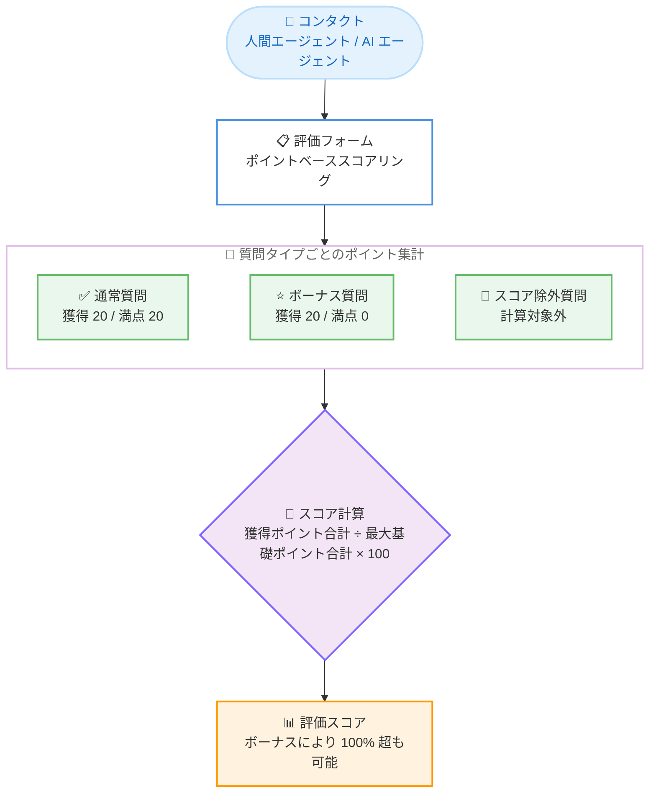

# Amazon Connect Customer - パフォーマンス評価におけるポイントベーススコアリング

**リリース日**: 2026 年 8 月 26 日
**サービス**: Amazon Connect Customer
**機能**: パフォーマンス評価のポイントベーススコアリング (Points-based Scoring)

📊 [このアップデートのインフォグラフィックを見る](https://takech9203.github.io/aws-news-summary/20260826-amazon-connect-customer-points-based-scoring-evaluations.html)

## 概要

Amazon Connect Customer が、人間のエージェントと AI エージェントのパフォーマンス評価において、ポイントベースのスコアリングをサポートしました。マネージャーは各評価基準にビジネス上の重要度に応じたポイントを割り当て、獲得ポイントの合計として評価スコアを算出できます。

従来のパーセンテージベースのスコアリングでは、各質問に割り当てるウェイトの合計が 100% になるように調整する必要がありました。ポイントベーススコアリングでは、例えば「顧客の問題解決に 40 ポイント、コンプライアンス要件の遵守に 20 ポイント、適切な挨拶に 10 ポイント」のように、合計を 100 にする必要なく自由にポイントを設定できます。マネージャーは「何を評価対象とするか」「どの程度重視するか」「何に追加加点するか」を柔軟にコントロールでき、ビジネスが重視する価値をスコアに反映できます。

このアップデートは、コンタクトセンターの品質管理 (QA) チームやスーパーバイザーが、自社の評価ポリシーに合わせた評価フォームを設計する際の柔軟性を大きく向上させます。

**アップデート前の課題**

このアップデート以前は、以下の課題や制限がありました。

- 評価フォームの各質問に割り当てるウェイトの合計を必ず 100% に調整する必要があり、質問の追加・削除のたびに全体のウェイト再配分が必要だった
- ボーナス加点 (規定の満点を超える加点) をスコアに反映する仕組みがなく、優れた対応を評価に反映しにくかった
- 特定の質問 (例: 問い合わせ理由の記録) をスコア計算から除外しつつフォームに残す、といった柔軟な設計が難しかった

**アップデート後の改善**

今回のアップデートにより、以下が可能になりました。

- 各評価基準に任意のポイントを割り当て、合計 100 の制約なしに評価フォームを設計できるようになった
- ボーナスオプションやボーナス質問により、100% を超えるスコアで優れた対応を評価できるようになった
- 複数のコンプライアンス基準を 1 つの複数選択式質問に統合してフォームを短縮したり、特定の質問をスコア計算から除外したりできるようになった

## アーキテクチャ図



ポイントベーススコアリングでは、質問タイプごとに獲得ポイントと最大基礎ポイントが集計され、その比率から評価スコアが算出されます。ボーナス質問は分子のみに加算されるため、スコアが 100% を超えることがあります。

## サービスアップデートの詳細

### 主要機能

1. **ポイントベースのスコア設定**
   - 各評価基準 (質問) にビジネス上の重要度に応じた任意のポイントを割り当て可能
   - 合計を 100% にする必要がなく、質問の追加・削除時にウェイトの再配分が不要
   - 評価スコアは「獲得ポイント合計 ÷ 最大基礎ポイント合計 × 100」で算出

2. **ボーナスオプションとボーナス質問**
   - ボーナスオプション: 質問の通常の満点を超えるポイントを持つ選択肢を設定可能。選択されると獲得ポイントが質問の満点を超える
   - ボーナス質問: 獲得ポイントは分子 (獲得ポイント合計) に加算されるが、分母 (最大基礎ポイント合計) には加算されない。これにより全体スコアが 100% を超えることが可能
   - 優れた顧客対応 (強いラポール形成など) への追加加点を実現

3. **柔軟な質問設計**
   - スコア除外質問: 獲得ポイント・最大基礎ポイントのいずれにも影響せず、スコア計算から完全に除外される (例: 問い合わせ理由の記録)
   - 複数選択式質問: 選択された全オプションのポイントを合算。上限 (キャップ) を設定した場合はその値で頭打ち。複数のコンプライアンス基準を 1 問に統合してフォームを短縮可能
   - 数値質問: 回答が該当する数値範囲に応じてポイントを付与

4. **人間エージェントと AI エージェントの両方に対応**
   - 人間のエージェントに加え、AI エージェントのパフォーマンス評価にも同じポイントベーススコアリングを利用可能

## 技術仕様

### スコア計算方法

| 項目 | 詳細 |
|------|------|
| スコア計算式 | スコア = (獲得ポイント合計 ÷ 最大基礎ポイント合計) × 100 |
| 獲得ポイント | 全スコア対象質問で選択された回答のポイント値の合計 |
| 最大基礎ポイント | ボーナス以外の各質問で達成可能な最高ポイント値の合計 |
| ボーナスオプション | 獲得ポイントに加算、最大基礎ポイントは変化なし |
| ボーナス質問 | 獲得ポイントに加算、最大基礎ポイントは 0 として扱う |
| スコア除外質問 | 獲得ポイント・最大基礎ポイントの両方から除外 |
| 自動失格 (Automatic fail) | 選択されると対象範囲 (セクションまたはフォーム全体) の獲得ポイントが 0 になる。最大基礎ポイントは変化なし |
| 複数選択で「該当なし」を選択 | 獲得ポイントは 0。最大基礎ポイントは分母に計上される |

### スコア計算の例

公式ドキュメントに記載されている 6 問構成のフォームの例です。

| 質問 | タイプ | 獲得ポイント | 最大基礎ポイント |
|------|--------|--------------|------------------|
| 1.1 | 単一選択 (通常) | 20 | 20 |
| 1.2 | 単一選択 + ボーナスオプション | 30 | 20 |
| 1.3 | ボーナス質問 | 20 | 0 |
| 1.4 | スコア除外 | 対象外 | 対象外 |
| 1.5 | 数値 (通常) | 20 | 20 |
| 1.6 | 複数選択 | 60 | 60 |

- 獲得ポイント合計: 20 + 30 + 20 + 20 + 60 = 150
- 最大基礎ポイント合計: 20 + 20 + 0 + 20 + 60 = 120
- スコア: (150 ÷ 120) × 100 = 125%

ボーナスオプションとボーナス質問により、スコアが 100% を超えています。

## 設定方法

### 前提条件

1. Amazon Connect Customer インスタンスが作成済みであること
2. 会話分析 (Conversational Analytics) およびパフォーマンス評価機能が有効であること
3. 評価フォームの作成・編集権限を持つセキュリティプロファイルが割り当てられていること

### 手順

#### ステップ 1: 評価フォームの作成または編集

Amazon Connect 管理コンソールから評価フォームの作成画面を開き、新規フォームを作成するか既存フォームを編集します。

#### ステップ 2: スコアリングモードの選択

フォームのスコアリング設定で、従来のパーセンテージベース (ウェイト方式) に代えてポイントベーススコアリングを選択します。

#### ステップ 3: 質問ごとのポイント設定

各質問の選択肢にポイント値を割り当てます。必要に応じて以下を設定します。

- ボーナスオプションまたはボーナス質問の追加
- スコア計算から除外する質問の指定
- 複数選択式質問のポイント上限 (キャップ) の設定
- 自動失格オプションの設定

#### ステップ 4: フォームの公開と評価の実施

フォームを公開し、コンタクトの評価に使用します。評価結果はポイントの合計に基づくスコアとして記録されます。

## メリット

### ビジネス面

- **評価ポリシーの柔軟な反映**: 「何を評価するか」「どの程度重視するか」「何に追加加点するか」をビジネス価値に基づいて自由に設計できる
- **優秀な対応の可視化**: ボーナス加点により、基準を超えた優れた顧客対応を定量的に評価し、エージェントのモチベーション向上につなげられる
- **評価フォームの短縮**: 複数のコンプライアンス基準を 1 つの複数選択式質問に統合でき、評価者の作業負荷を軽減できる

### 技術面

- **メンテナンス性の向上**: 質問の追加・削除時にウェイト合計 100% の再調整が不要になり、フォーム管理が容易になる
- **人間と AI エージェントの統一評価**: 同一のスコアリング方式で人間エージェントと AI エージェントの両方を評価できる
- **既存方式との併用**: 従来のパーセンテージベーススコアリングも引き続き利用可能で、フォームごとに適切な方式を選択できる

## デメリット・制約事項

### 制限事項

- ボーナス質問やボーナスオプションを使用すると、スコアが 100% を超える場合があり、既存のレポートやしきい値ベースのルールとの整合性確認が必要
- 複数選択式質問で「該当なし」を選択した場合、獲得ポイントは 0 だが最大基礎ポイントは分母に計上される点に注意が必要
- 自動失格オプションが選択されると、対象範囲 (セクションまたはフォーム全体) の獲得ポイントが 0 になる

### 考慮すべき点

- 既存のパーセンテージベースのフォームからポイントベースへ移行する場合、過去の評価スコアとの比較方法を事前に検討する必要がある
- ポイント配分の設計はスコアの意味に直結するため、QA チーム内で採点基準の合意形成を行うことが望ましい

## ユースケース

### ユースケース 1: コンプライアンス重視の評価フォーム設計

**シナリオ**: 金融機関のコンタクトセンターで、コンプライアンス遵守を最重要項目として評価したい。

**実装例**:
```
- 問題解決: 40 ポイント
- コンプライアンス要件の遵守: 20 ポイント (自動失格オプション付き)
- 適切な挨拶: 10 ポイント
```

**効果**: 合計 100 の制約なしに、ビジネス上の優先度をそのままポイント配分に反映できます。重大なコンプライアンス違反は自動失格によりスコア 0 として扱えます。

### ユースケース 2: ボーナス加点による優秀対応の評価

**シナリオ**: 顧客との強いラポール形成など、基準を超えた優れた対応を評価に反映し、エージェントの成長を促したい。

**実装例**:
```
- 通常質問: 標準対応で満点 20 ポイント
- ボーナスオプション: 特に優れた対応に 30 ポイント (満点 20 を超える加点)
- ボーナス質問: 追加の加点項目として設定 (分母に影響しない)
```

**効果**: スコアが 100% を超えることを許容する設計により、「合格」と「卓越」を区別した評価が可能になります。

### ユースケース 3: 評価フォームの簡素化

**シナリオ**: 評価項目が多く、評価者 1 人あたりの評価作業に時間がかかっている。

**実装例**:
```
- 複数のコンプライアンス基準 (本人確認、録音告知、免責説明) を
  1 つの複数選択式質問に統合し、各選択肢にポイントを割り当てる
- 問い合わせ理由の記録はスコア除外質問として設定する
```

**効果**: フォームの質問数を削減して評価作業を効率化しつつ、必要な記録項目はスコアに影響させずに残せます。

## 料金

ポイントベーススコアリング自体に追加料金はなく、Amazon Connect Customer の会話分析 (パフォーマンス評価) の既存の料金体系に従います。詳細は Amazon Connect の料金ページを参照してください。

## 利用可能リージョン

Amazon Connect Customer が提供されているすべてのリージョンで利用可能です。

## 関連サービス・機能

- **Amazon Connect Customer 会話分析 (Conversational Analytics)**: パフォーマンス評価の基盤となる機能。通話やチャットの分析結果を評価に活用できる
- **パフォーマンス評価 (Performance Evaluations)**: 評価フォームによるエージェント評価機能。今回のアップデートでスコアリング方式の選択肢が拡大
- **Amazon Connect AI エージェント**: 人間エージェントと同様に、AI エージェントの対応品質もポイントベースで評価可能

## 参考リンク

- 📊 [インフォグラフィック](https://takech9203.github.io/aws-news-summary/20260826-amazon-connect-customer-points-based-scoring-evaluations.html)
- [公式発表 (What's New)](https://aws.amazon.com/about-aws/whats-new/2026/08/amazon-connect-customer-points-based-scoring-evaluations/)
- [ドキュメント: How point-based scoring is calculated in Connect Customer](https://docs.aws.amazon.com/connect/latest/adminguide/about-pointbased-scoring.html)
- [Amazon Connect Customer 会話分析](https://aws.amazon.com/products/connect/customer/conversational-analytics/)

## まとめ

Amazon Connect Customer のパフォーマンス評価にポイントベーススコアリングが追加され、ウェイト合計 100% の制約なしに、ビジネス価値に基づいた柔軟な評価フォーム設計が可能になりました。ボーナス加点やスコア除外質問により、優秀な対応の評価やフォームの簡素化も実現できます。コンタクトセンターの品質管理を行っているチームは、既存のパーセンテージベースのフォームを見直し、ポイントベースへの移行を検討することを推奨します。
