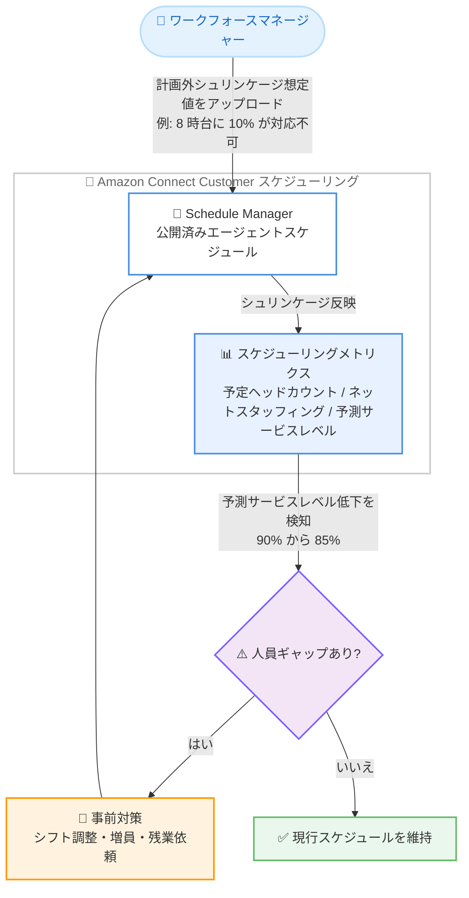

# Amazon Connect Customer - エージェントスケジュールにおける計画外シュリンケージのサポート

**リリース日**: 2026 年 8 月 26 日
**サービス**: Amazon Connect Customer
**機能**: エージェントスケジュールにおける計画外シュリンケージ (Unplanned Shrinkage) の入力と反映

📊 [このアップデートのインフォグラフィックを見る](https://takech9203.github.io/aws-news-summary/20260826-amazon-connect-customer-unplanned-shrinkage.html)

## 概要

Amazon Connect Customer のエージェントスケジューリング機能で、マネージャーがエージェントスケジュールに計画外シュリンケージ (unplanned shrinkage) を入力できるようになりました。シュリンケージとは、勤務予定のエージェントが実際にはコンタクト対応に従事できない時間の割合を指し、遅刻ログインや急な病欠といった予測が難しい欠勤 (計画外シュリンケージ) が含まれます。

今回のアップデートにより、マネージャーは計画外シュリンケージの想定値をエージェントスケジュールに直接アップロードし、その影響を反映したスケジューリングメトリクス (予定ヘッドカウント、ネットスタッフィング、予測サービスレベル) を即座に確認できます。例えば、来週月曜日の午前 8 時に勤務予定のエージェントのうち 10% が遅刻ログインにより対応不可と見込まれる場合、計画外シュリンケージを反映すると予測サービスレベルは 90% から 85% に低下します。

これにより、ワークフォースマネージャーは計画外のエージェント不在によって生じる人員配置のギャップに事前に対処できるようになり、スケジューリング精度の向上と目標サービスレベルの維持が容易になります。コンタクトセンターのワークフォース管理 (WFM) を担当するスケジューラーやマネージャーに有用なアップデートです。

**アップデート前の課題**

- 以前は、遅刻ログインや急な病欠などの計画外の欠勤をスケジュールに反映する標準的な手段がなく、スケジュール上の人員数と実際に稼働可能な人員数に乖離が生じていた
- 予測サービスレベルやネットスタッフィングなどのメトリクスが計画外の欠勤を考慮していないため、実際のサービスレベルが目標を下回るリスクを事前に把握しにくかった
- 計画外シュリンケージの影響を見積もるには、スプレッドシートなどでの手作業による補正計算が必要だった

**アップデート後の改善**

- 計画外シュリンケージの想定値をエージェントスケジュールに直接アップロードできるようになった
- 予定ヘッドカウント、ネットスタッフィング、予測サービスレベルの各メトリクスが計画外シュリンケージを反映した値で即座に更新されるようになった
- 人員配置のギャップを事前に特定し、シフト調整や増員などの対策を先回りして実施できるようになった

## アーキテクチャ図



計画外シュリンケージの入力からメトリクス更新、人員ギャップへの事前対応までのワークフローを示しています。

## サービスアップデートの詳細

### 主要機能

1. **計画外シュリンケージの直接入力**
   - マネージャーが計画外シュリンケージの想定値をエージェントスケジュールに直接アップロード可能
   - 遅刻ログイン、急な病欠など、事前のスケジュールに組み込めない欠勤を割合として反映
   - 時間帯ごとの想定値を設定でき、時間帯別の稼働率変動 (例: 朝一番の遅刻ログイン多発) を表現可能

2. **シュリンケージ反映済みメトリクスの即時更新**
   - 計画外シュリンケージを反映した以下のメトリクスを即座に確認可能
   - 予定ヘッドカウント (scheduled headcount): スケジュール上の人員数
   - ネットスタッフィング (net staffing): 必要人員数に対する過不足
   - 予測サービスレベル (projected service level): シュリンケージ考慮後のサービスレベル予測

3. **人員ギャップへのプロアクティブな対応**
   - シュリンケージ反映後のメトリクスにより、目標サービスレベルを下回る時間帯を事前に特定可能
   - シフト調整や増員などの対策を計画外の欠勤が実際に発生する前に実施可能
   - スケジューリング精度と目標サービスレベル維持能力の向上に寄与

## 技術仕様

### シュリンケージの位置付け

| 項目 | 詳細 |
|------|------|
| シュリンケージとは | 勤務予定時間のうち、エージェントがコンタクト対応に従事できない時間の割合 |
| 計画的シュリンケージ | 研修、ミーティング、休暇など、事前にシフトアクティビティとしてスケジュールに組み込める非稼働時間 |
| 計画外シュリンケージ | 遅刻ログイン、急な病欠など、事前にスケジュールへ組み込めない欠勤 (今回のアップデート対象) |
| 影響を受けるメトリクス | 予定ヘッドカウント、ネットスタッフィング、予測サービスレベル |
| 入力方法 | スケジュールへの想定値のアップロード |

### メトリクスへの影響例

| 条件 | 予測サービスレベル |
|------|------------------|
| 計画外シュリンケージなし | 90% |
| 午前 8 時のエージェントの 10% が対応不可と想定 | 85% |

### API 変更履歴

本アップデートは Connect Customer 管理 Web サイト上のスケジューリング機能に関するものであり、レポート作成時点で本機能に直接関連する API 変更は確認されていません。

## 設定方法

### 前提条件

1. Amazon Connect Customer インスタンスでエージェントスケジューリング (予測、キャパシティプランニング、スケジューリング) が有効化されていること
2. スケジューリング機能にアクセスするための適切なセキュリティプロファイル権限が付与されていること
3. スケジュールの作成・公開に必要な設定 (スタッフルール、シフトアクティビティ、シフトプロファイル、スタッフィンググループ) が完了していること

### 手順

#### ステップ 1: スケジュールの生成と公開

Connect Customer 管理 Web サイトの Schedule Manager でエージェントスケジュールを生成し、公開します。スケジューリングの基本的な流れは公式ドキュメントの [Scheduling in Connect Customer](https://docs.aws.amazon.com/connect/latest/adminguide/scheduling.html) を参照してください。

#### ステップ 2: 計画外シュリンケージ想定値のアップロード

Schedule Manager で対象スケジュールを開き、計画外シュリンケージの想定値 (時間帯ごとの対応不可割合など) をアップロードします。過去の遅刻・欠勤実績を分析して想定値を算出することを推奨します。

#### ステップ 3: 更新されたメトリクスの確認と対策

アップロード後、予定ヘッドカウント、ネットスタッフィング、予測サービスレベルがシュリンケージを反映した値に即座に更新されます。目標サービスレベルを下回る時間帯があれば、シフト調整や増員などの対策を実施します。

## メリット

### ビジネス面

- **サービスレベルの維持**: 計画外の欠勤による影響を事前に可視化し、目標サービスレベルの未達リスクを低減できる
- **顧客体験の向上**: 人員不足による応答遅延を未然に防ぎ、顧客の待ち時間を抑制できる
- **運用コストの最適化**: 実態に即した人員計画により、過剰配置と人員不足の両方を回避できる

### 技術面

- **スケジューリング精度の向上**: スケジュール上の人員数と実際の稼働可能人員数の乖離をメトリクスに反映できる
- **手作業の削減**: スプレッドシートなどでの補正計算が不要になり、管理 Web サイト上で一元的に確認できる
- **即時のフィードバック**: 想定値のアップロード後、メトリクスが即座に更新されるため、複数シナリオの検討が容易になる

## デメリット・制約事項

### 制限事項

- Amazon Connect Customer のエージェントスケジューリングが利用可能なリージョンでのみ利用できる
- 計画外シュリンケージは想定値 (予測) であり、実際の欠勤率と乖離する可能性がある
- エージェントスケジューリング機能の利用には、対応するセキュリティプロファイル権限の設定が必要

### 考慮すべき点

- 想定値の精度を高めるため、過去の遅刻・欠勤実績データに基づいて定期的に見直すことが望ましい
- 計画的シュリンケージ (研修、ミーティングなど) はシフトアクティビティとして別途スケジュールに組み込む必要がある
- キャパシティプランニングにおけるシュリンケージ設定とは適用対象が異なるため、長期の人員計画と短期のスケジュール調整で使い分ける必要がある

## ユースケース

### ユースケース 1: 朝一番の遅刻ログイン対策

**シナリオ**: 月曜朝 8 時台は遅刻ログインが多く、実際の稼働人員がスケジュールを恒常的に下回っている。

**実装例**:
```
1. 過去 4 週間の 8 時台の遅刻ログイン率を集計 (例: 平均 10%)
2. Schedule Manager で月曜 8 時台に計画外シュリンケージ 10% をアップロード
3. 予測サービスレベルが 90% から 85% に低下することを確認
4. 目標 90% を維持するため、8 時台のシフトに 2 名を追加配置
```

**効果**: 遅刻ログインが発生しても目標サービスレベルを維持できる。

### ユースケース 2: 流行性疾患シーズンの病欠対応

**シナリオ**: インフルエンザ流行期に急な病欠が増加し、サービスレベルが低下する傾向がある。

**実装例**:
```
1. 前年同時期の病欠率を分析 (例: 通常 3% が流行期は 8% に上昇)
2. 流行期のスケジュールに計画外シュリンケージ 8% をアップロード
3. ネットスタッフィングの不足時間帯を特定
4. オンコール要員の確保や残業依頼を事前に計画
```

**効果**: 病欠増加による人員不足を先回りして補い、応答品質の低下を防止できる。

### ユースケース 3: 複数シナリオでのスタッフィング検証

**シナリオ**: 新しいシフト体系の導入にあたり、欠勤率の変動に対するスケジュールの耐性を検証したい。

**実装例**:
```
1. 楽観 (5%)、標準 (10%)、悲観 (15%) の 3 パターンの計画外シュリンケージを順に適用
2. 各パターンでの予測サービスレベルとネットスタッフィングを比較
3. 悲観シナリオでも目標を維持できるようシフトプロファイルを調整
```

**効果**: 欠勤率の変動に強いスケジュール設計が可能になり、運用リスクを低減できる。

## 料金

本機能は Amazon Connect Customer のエージェントスケジューリング機能の一部として提供されます。エージェントスケジューリングの料金体系に準じ、本機能自体の追加料金は発表されていません。詳細は [Amazon Connect の料金ページ](https://aws.amazon.com/connect/pricing/) を参照してください。

## 利用可能リージョン

Amazon Connect Customer のエージェントスケジューリングが利用可能なすべての AWS リージョンで利用できます。リージョンごとの利用可否は [Availability of Connect Customer features by Region](https://docs.aws.amazon.com/connect/latest/adminguide/regions.html#optimization_region) を参照してください。

## 関連サービス・機能

- **Amazon Connect Customer 予測 (Forecasting)**: 過去データに基づきコンタクト量と処理時間を予測する機能。スケジュール生成の基礎となる
- **Amazon Connect Customer キャパシティプランニング**: 長期的な必要エージェント数をシュリンケージなどのメトリクスを考慮して予測する機能
- **Amazon Connect Customer スケジュールアドヒアランス**: 公開済みスケジュールに対するエージェントの遵守状況をスーパーバイザーが監視する機能

## 参考リンク

- 📊 [インフォグラフィック](https://takech9203.github.io/aws-news-summary/20260826-amazon-connect-customer-unplanned-shrinkage.html)
- [公式発表 (What's New)](https://aws.amazon.com/about-aws/whats-new/2026/08/amazon-connect-customer-unplanned-shrinkage/)
- [ドキュメント: Forecasting & agent scheduling in Connect Customer](https://docs.aws.amazon.com/connect/latest/adminguide/forecasting-capacity-planning-scheduling.html)
- [ドキュメント: Scheduling in Connect Customer](https://docs.aws.amazon.com/connect/latest/adminguide/scheduling.html)
- [料金ページ](https://aws.amazon.com/connect/pricing/)

## まとめ

Amazon Connect Customer のエージェントスケジューリングで計画外シュリンケージを入力できるようになり、遅刻ログインや急な病欠を考慮した現実的なスタッフィングメトリクスを即座に確認できるようになりました。ワークフォースマネージャーは人員ギャップを事前に特定し、目標サービスレベルの維持に向けた対策を先回りして実施できます。Connect Customer でスケジューリング機能を利用中の場合は、過去の欠勤実績を分析し、計画外シュリンケージの想定値をスケジュールに反映することを推奨します。
