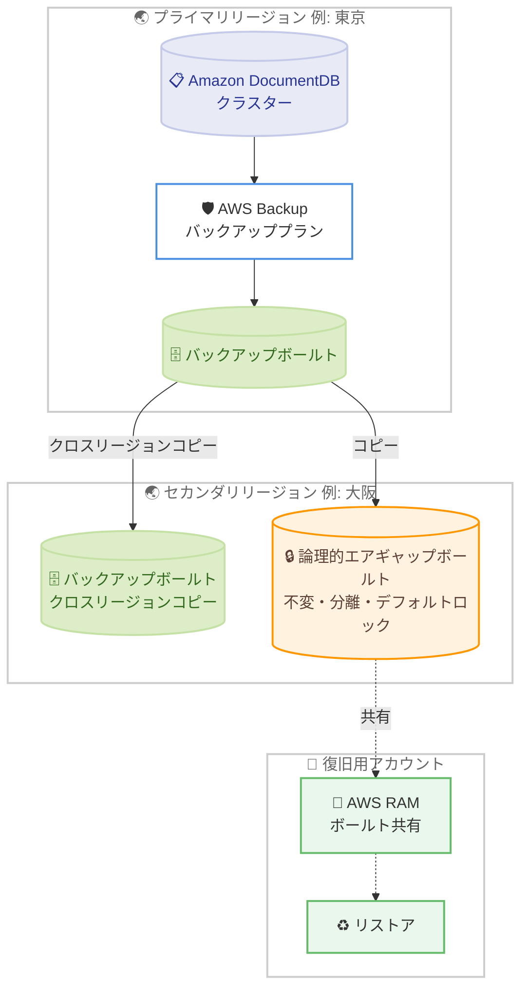

# AWS Backup - Amazon DocumentDB のクロスリージョンバックアップコピーと論理的エアギャップボールトを 9 リージョンに拡大

**リリース日**: 2026 年 8 月 26 日
**サービス**: AWS Backup
**機能**: Amazon DocumentDB 向けクロスリージョンバックアップコピーおよび論理的エアギャップボールトのリージョン拡大

📊 [このアップデートのインフォグラフィックを見る](https://takech9203.github.io/aws-news-summary/20260826-aws-backup-cross-region-air-gapped-docdb.html)

## 概要

AWS Backup は、Amazon DocumentDB のバックアップに対するクロスリージョンコピーと論理的エアギャップボールト (Logically Air-gapped Vault) のサポートを、新たに 9 つの AWS リージョンに拡大しました。対象リージョンには大阪リージョンが含まれており、日本のユーザーにとっても重要なアップデートです。

クロスリージョンコピーにより、バックアッププランまたはオンデマンドのコピージョブを通じて、DocumentDB のバックアップを対象リージョンとの間で移動できます。これにより、災害対策 (DR)、事業継続、コンプライアンス要件への対応が容易になります。また、論理的エアギャップボールトにコピーすることで、デフォルトでロックされた不変 (イミュータブル) かつ分離されたバックアップを保持でき、ランサムウェアなどの脅威からデータを保護できます。

対象ユーザーは、DocumentDB を利用しており、リージョン障害への備えやサイバーレジリエンス強化を求める組織です。特に大阪リージョンを DR サイトとして活用したい日本の企業にとって有用です。

**アップデート前の課題**

このアップデート以前は、今回追加された 9 リージョンにおいて以下の制限がありました。

- 対象リージョンでは DocumentDB バックアップのクロスリージョンコピーが利用できず、リージョン障害に備えた DR 構成を AWS Backup だけで構築できなかった
- 対象リージョンでは DocumentDB バックアップを論理的エアギャップボールトに保管できず、ランサムウェア対策としての不変・分離バックアップの選択肢が限られていた
- アカウント侵害時の復旧を想定したボールト共有やマルチパーティ承認による保護を、これらのリージョンの DocumentDB バックアップに適用できなかった

**アップデート後の改善**

今回のアップデートにより、以下が可能になりました。

- 大阪を含む 9 リージョンで、DocumentDB バックアップをバックアッププランまたはオンデマンドコピージョブで他リージョンへコピーできるようになった
- DocumentDB バックアップを論理的エアギャップボールトにコピーし、デフォルトでロックされた不変かつ分離されたバックアップとして保持できるようになった
- AWS Resource Access Manager (RAM) によるボールト共有と、マルチパーティ承認によるボールトアクセス保護を活用し、アカウント侵害時の復旧時間を短縮できるようになった

## アーキテクチャ図



プライマリリージョンの DocumentDB バックアップを、クロスリージョンコピーで別リージョンの通常ボールトや論理的エアギャップボールトへ複製し、AWS RAM 経由で復旧用アカウントに共有してリストアする構成を示しています。

## サービスアップデートの詳細

### 主要機能

1. **クロスリージョンバックアップコピー**
   - バックアッププラン (スケジュールベース) またはオンデマンドコピージョブで、DocumentDB バックアップを対象リージョンとの間で双方向にコピー可能
   - 災害対策、事業継続、コンプライアンス要件 (データの地理的分散保管など) に対応
   - AWS Backup コンソール、AWS CLI、AWS SDK から利用可能

2. **論理的エアギャップボールトのサポート**
   - DocumentDB バックアップを論理的エアギャップボールトにコピーし、デフォルトでロックされた不変かつ分離されたバックアップとして保管
   - AWS 所有キーまたはカスタマーマネージドキー (KMS) による暗号化に対応
   - コンプライアンスモードでロックされるため、保持期間中は誰もバックアップを削除できない

3. **アカウント侵害時の復旧支援**
   - AWS Resource Access Manager (RAM) を使用してボールトを他のアカウントと共有し、ソースアカウントが利用できない場合でもリストアが可能
   - マルチパーティ承認によりボールトへのアクセスを保護し、アカウント侵害時のデータ損失からの復旧時間を短縮

### 追加された 9 リージョン

| 地域 | リージョン |
|------|-----------|
| アジアパシフィック | 香港、ジャカルタ、メルボルン、大阪 |
| 欧州 | スペイン、ストックホルム、チューリッヒ |
| アフリカ | ケープタウン |
| 中東 | イスラエル (テルアビブ) |

## 技術仕様

### 論理的エアギャップボールトの特徴

| 項目 | 詳細 |
|------|------|
| 不変性 | コンプライアンスモードでロックされ、保持期間中は削除・変更不可 |
| 暗号化 | AWS 所有キーまたはカスタマーマネージドキーで暗号化 |
| 分離 | ソースアカウントから論理的に分離された保管領域 |
| 共有 | AWS RAM による他アカウントへのボールト共有が可能 |
| アクセス保護 | マルチパーティ承認によるアクセス制御に対応 |
| 操作方法 | AWS Backup コンソール、AWS CLI、AWS SDK |

## 設定方法

### 前提条件

1. Amazon DocumentDB クラスターが AWS Backup で保護されていること
2. AWS Backup の DocumentDB に対するリソースオプトインが有効であること
3. コピー先リージョンにバックアップボールト (または論理的エアギャップボールト) が作成済みであること

### 手順

#### ステップ 1: 論理的エアギャップボールトの作成

```bash
aws backup create-logically-air-gapped-backup-vault \
  --backup-vault-name docdb-airgapped-vault \
  --min-retention-days 7 \
  --max-retention-days 365 \
  --region ap-northeast-3
```

大阪リージョンに論理的エアギャップボールトを作成します。最小保持期間 7 日、最大保持期間 365 日を設定し、この範囲内の保持期間を持つバックアップのみが格納可能になります。

#### ステップ 2: バックアッププランにクロスリージョンコピーを設定

```bash
aws backup create-backup-plan \
  --backup-plan '{
    "BackupPlanName": "docdb-dr-plan",
    "Rules": [{
      "RuleName": "daily-with-cross-region-copy",
      "TargetBackupVaultName": "primary-vault",
      "ScheduleExpression": "cron(0 17 * * ? *)",
      "Lifecycle": {"DeleteAfterDays": 35},
      "CopyActions": [{
        "DestinationBackupVaultArn": "arn:aws:backup:ap-northeast-3:123456789012:backup-vault:docdb-airgapped-vault",
        "Lifecycle": {"DeleteAfterDays": 90}
      }]
    }]
  }'
```

毎日のバックアップを取得し、大阪リージョンの論理的エアギャップボールトへ自動的にコピーするバックアッププランを作成します。コピー先での保持期間は 90 日に設定しています。

#### ステップ 3: オンデマンドコピージョブの実行

```bash
aws backup start-copy-job \
  --recovery-point-arn "arn:aws:backup:ap-northeast-1:123456789012:recovery-point:xxxx" \
  --source-backup-vault-name primary-vault \
  --destination-backup-vault-arn "arn:aws:backup:ap-northeast-3:123456789012:backup-vault:docdb-airgapped-vault" \
  --iam-role-arn "arn:aws:iam::123456789012:role/service-role/AWSBackupDefaultServiceRole"
```

既存の復旧ポイントを指定して、東京リージョンから大阪リージョンの論理的エアギャップボールトへオンデマンドでコピーします。

## メリット

### ビジネス面

- **事業継続性の向上**: リージョン障害が発生しても、別リージョンのバックアップから DocumentDB を復旧でき、事業継続計画 (BCP) を強化できる
- **ランサムウェア対策**: 不変かつ分離されたバックアップにより、ランサムウェア攻撃やアカウント侵害時でも確実にデータを復旧できる
- **コンプライアンス対応**: データの地理的分散保管や改ざん防止など、規制要件への対応が容易になる

### 技術面

- **運用の一元化**: AWS Backup のバックアッププランで DocumentDB のクロスリージョンコピーを自動化でき、個別のスクリプト運用が不要になる
- **復旧時間の短縮**: AWS RAM によるボールト共有とマルチパーティ承認により、ソースアカウントが侵害された場合でも別アカウントから迅速にリストア可能
- **柔軟な暗号化**: AWS 所有キーとカスタマーマネージドキーの両方に対応し、組織のキー管理ポリシーに合わせて選択できる

## デメリット・制約事項

### 制限事項

- 今回の拡大対象は発表された 9 リージョンであり、利用可能なリージョンと機能の組み合わせは公式ドキュメントの機能可用性ページで確認が必要
- 論理的エアギャップボールトはコンプライアンスモードでロックされるため、保持期間中はバックアップを削除できない (誤設定時もコスト負担が継続する)
- 論理的エアギャップボールトには最小・最大保持期間の設定が必須であり、範囲外の保持期間を持つバックアップは格納できない

### 考慮すべき点

- クロスリージョンコピーにはリージョン間データ転送料金とコピー先のバックアップストレージ料金が発生するため、保持期間とコピー頻度の設計が重要
- マルチパーティ承認を利用する場合は、承認チームの体制と運用フローを事前に整備する必要がある

## ユースケース

### ユースケース 1: 東京 - 大阪間の DR 構成

**シナリオ**: 東京リージョンで稼働する DocumentDB クラスターについて、大規模災害に備えて大阪リージョンにバックアップを保持したい。

**実装例**:
```
バックアッププラン: 毎日 AM 2:00 にバックアップ取得
コピー先: 大阪リージョン (ap-northeast-3) のバックアップボールト
保持期間: プライマリ 35 日、コピー先 90 日
```

**効果**: 東京リージョン全体の障害時にも大阪リージョンのバックアップから DocumentDB を復旧でき、国内でデータを完結させたままリージョン DR を実現できる。

### ユースケース 2: ランサムウェア対策としての不変バックアップ

**シナリオ**: 金融系ワークロードで、ランサムウェア攻撃によるバックアップの暗号化・削除リスクに備えたい。

**実装例**:
```
論理的エアギャップボールトを別リージョンに作成
最小保持期間: 30 日 / 最大保持期間: 365 日
バックアッププランのコピーアクションで自動コピー
マルチパーティ承認チームを設定
```

**効果**: バックアップがデフォルトでロックされた不変ストレージに分離保管されるため、本番アカウントが侵害されてもバックアップは保護され、確実な復旧が可能になる。

### ユースケース 3: アカウント侵害時のクリーンルーム復旧

**シナリオ**: 本番アカウントが侵害された場合に、クリーンな別アカウントへ迅速に DocumentDB を復旧したい。

**実装例**:
```
論理的エアギャップボールトを AWS RAM で復旧用アカウントに共有
復旧用アカウントから共有ボールト内の復旧ポイントを参照
復旧用アカウント内で DocumentDB クラスターとしてリストア
```

**効果**: ソースアカウントにアクセスできない状況でも、共有されたボールトから直接リストアでき、データ損失インシデントからの復旧時間を大幅に短縮できる。

## 料金

AWS Backup の標準料金体系に基づき、バックアップストレージ料金、クロスリージョンデータ転送料金、リストア料金が発生します。論理的エアギャップボールトのストレージ料金は通常のバックアップストレージとは異なる料金が設定されているため、詳細は [AWS Backup 料金ページ](https://aws.amazon.com/backup/pricing/) を参照してください。

## 利用可能リージョン

今回のアップデートで、以下の 9 リージョンで DocumentDB のクロスリージョンバックアップコピーと論理的エアギャップボールトが利用可能になりました。

- アジアパシフィック (香港)
- アジアパシフィック (ジャカルタ)
- アジアパシフィック (メルボルン)
- アジアパシフィック (大阪)
- 欧州 (スペイン)
- 欧州 (ストックホルム)
- 欧州 (チューリッヒ)
- アフリカ (ケープタウン)
- イスラエル (テルアビブ)

リージョンごとの機能可用性の最新情報は、[AWS Backup の機能可用性ドキュメント](https://docs.aws.amazon.com/aws-backup/latest/devguide/backup-feature-availability.html#features-by-region) を参照してください。

## 関連サービス・機能

- **Amazon DocumentDB**: 今回のアップデートで保護対象となる MongoDB 互換のドキュメントデータベース。AWS Backup によるバックアップの一元管理に対応
- **AWS Resource Access Manager (RAM)**: 論理的エアギャップボールトを他アカウントと共有し、アカウント侵害時のクリーンルーム復旧を実現
- **AWS Backup Vault Lock**: 通常のバックアップボールトに WORM (Write Once Read Many) 保護を追加する機能。論理的エアギャップボールトはロックがデフォルトで適用される点が異なる
- **AWS KMS**: 論理的エアギャップボールトの暗号化にカスタマーマネージドキーを利用可能

## 参考リンク

- 📊 [インフォグラフィック](https://takech9203.github.io/aws-news-summary/20260826-aws-backup-cross-region-air-gapped-docdb.html)
- [公式発表 (What's New)](https://aws.amazon.com/about-aws/whats-new/2026/08/aws-backup-cross-region-air-gapped-docdb/)
- [AWS Blog: Building cyber resiliency with AWS Backup logically air-gapped vault](https://aws.amazon.com/blogs/storage/building-cyber-resiliency-with-aws-backup-logically-air-gapped-vault/)
- [ドキュメント: 論理的エアギャップボールト](https://docs.aws.amazon.com/aws-backup/latest/devguide/logicallyairgappedvault.html)
- [ドキュメント: リージョン別機能可用性](https://docs.aws.amazon.com/aws-backup/latest/devguide/backup-feature-availability.html#features-by-region)
- [料金ページ](https://aws.amazon.com/backup/pricing/)

## まとめ

Amazon DocumentDB のクロスリージョンバックアップコピーと論理的エアギャップボールトが大阪を含む 9 リージョンに拡大され、リージョン DR とランサムウェア対策の選択肢が広がりました。特に東京 - 大阪間で国内完結の DR 構成を検討している場合は、バックアッププランへのコピーアクション追加と論理的エアギャップボールトの導入を検討することを推奨します。
