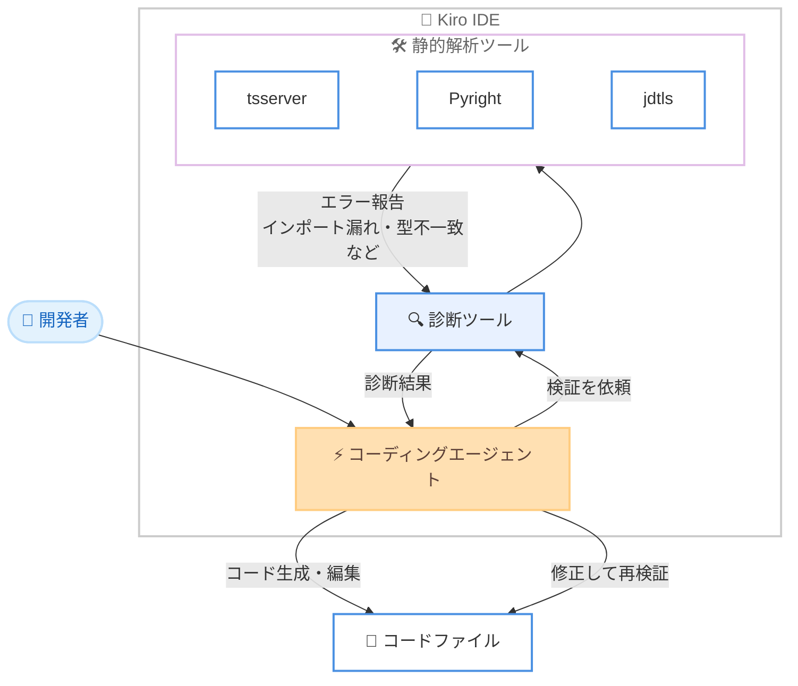

# Kiro - AI コーディングエージェントは本当に進化しているのか? 6 か月間の診断データ分析

**リリース日**: 2026年8月26日
**サービス**: Kiro
**内容**: 診断 (Diagnostics) ツールの 6 か月間の利用データに基づく AI コーディングエージェントの品質改善分析

📊 [このアップデートのインフォグラフィックを見る](https://takech9203.github.io/aws-news-summary/20260826-kiro-diagnostics-over-time.html)

## 概要

Kiro の Applied Science チーム (Pardis Pashakhanloo 氏、Rajdeep Mukherjee 氏) が、「Are AI coding agents actually getting better?」と題したブログ記事を公開しました。この記事は、Kiro IDE の診断 (Diagnostics) ツールの利用データを 6 か月間にわたって分析し、AI コーディングエージェントが実際に改善しているかを定量的に検証したものです。

診断ツールは、Kiro のコーディングエージェントがコードを作成・変更した際に、tsserver (TypeScript)、jdtls (Java)、Pyright (Python)、rust-analyzer (Rust)、gopls (Go)、clangd (C/C++)、ESLint などの静的解析ツールを実行し、モジュールのインポート漏れ、型の不一致、未定義シンボルといった、通常はビルド時まで表面化しない問題を検出する機能です。エージェントはこの結果をフィードバックとして受け取り、「生成 → 検証 → 修正」のループでコードを自律的に改善します。

分析の結果、エラー率は着実に低下しており AI コーディングエージェントは測定可能なレベルで改善している一方、「新しいモデルは単にミスが減るのではなく、ミスの種類が変化している」という、より繊細な実態が明らかになりました。Kiro を利用する開発者やエンジニアリングチームにとって、AI 生成コードの品質を言語やコード種別ごとに見積もるうえで有用な知見です。

**分析前の課題 (これまで分からなかったこと)**

- AI コーディングエージェントの改善は最終成果物の静的解析 (post-hoc analysis) で測られることが多く、モデルが自己検証を行う能力 (セルフモニタリング) は可視化されていなかった
- モデルがどのカテゴリのエラーを生成し、どれを自律的に修正できるのかという内訳が不明だった
- 言語やコード種別 (実装コードとテストコード) ごとのエラー傾向の違いが定量化されていなかった

**分析で明らかになったこと**

- 最新モデルではエラー率が 1 ファイルあたり約 1.2 エラーに収束しつつあり、「そのままコンパイルできるコード」への進歩が確認された
- 新しいモデルほど 1 回の診断呼び出しで複数の関連ファイルをまとめてチェックする傾向があり、ファイル横断のリグレッション検出が向上している
- エラーの構成は変化しており、「未解決インポート」が全モデルで最大のエラーカテゴリ (約 30〜58%) を占める

## アーキテクチャ図



診断ツールを介した「生成 → 検証 → 修正」のループを示しています。エージェントは編集後に静的解析を呼び出し、報告されたエラーを基にコードを修正して再検証します。今回の分析は、このループにおけるツール呼び出しデータを対象としています。

## 分析内容の詳細

### 分析データの概要

| 項目 | 詳細 |
|------|------|
| 分析期間 | 2026 年 1 月〜6 月の 6 か月間 |
| 分析対象 | Kiro IDE 上の約 150 万件の会話 (Amazon 社内ユーザーのデータ) |
| 診断ツール呼び出し | 約 40.6 万回 |
| 対象モデル | Claude 7 モデル (Opus 4.5〜4.8、Sonnet 4〜4.6) |
| 対象言語 | TypeScript、Python、Java、Rust、Go、Kotlin、C++、Swift など |

データの内訳として、Opus 4.5 と 4.6 が全体の 51% 超、Sonnet 4.5 が約 45% を占めており、新しいモデルほどデータポイントは少ない点に留意が必要です。

### 主要な調査結果

1. **診断ツールの自発的な呼び出し率は 3〜22%**
   - Opus 4.6 が最も積極的で、会話の 22.26% で診断ツールを呼び出した (Opus 4.7 と 4.8 は約 10% に低下)
   - Sonnet 4.5 は 2.74% とほとんど呼び出さなかったが、Sonnet 4.6 では 13.89% に大幅増加
   - 多くの会話は依然としてモデルが静的解析による自己チェックを行わずに完了している
   - 関連研究では、エラー解決まで完了をブロックする形で診断を強制すると、誤ったコードの受け入れ率が約 90% から約 8% に低減できることが示されている

2. **ファイルあたりのエラー数は約 1.2 に収束 (改善傾向)**
   - Sonnet ファミリーは明確な改善を示し、Sonnet 4 の 3.01 エラー/ファイルから Sonnet 4.6 の 1.29 へと 57% 削減
   - Opus ファミリーは非単調で、Opus 4.6 と 4.8 は 1.21、Opus 4.5 と 4.7 は 1.7〜1.8 と、バージョンアップが必ずしも改善を意味しない
   - 両ファミリーとも最新版では約 1.2 エラー/ファイルに収束し、「そのままコンパイル可能なコード」に近づいている

3. **新しいモデルほど 1 回の呼び出しで多くのファイルをチェック**
   - Sonnet 4 の 1.57 ファイル/回から Sonnet 4.6 の 1.86 へ、Opus 4.5 の 1.78 から Opus 4.7 の 2.04 (ピーク) へ増加
   - 編集したファイル単体ではなく、実装とテスト、モジュールとその利用側といった関連ファイルをまとめて検証する戦略へ変化
   - インポート破壊、インターフェース不一致、下流の型エラーなどファイル横断のリグレッション検出が向上

4. **「未解決インポート」が最大のエラーカテゴリ**
   - 全モデルで最大のエラーカテゴリであり、多くの場合全診断の約 3 分の 1、Opus 4.7 では半数超を占める
   - 「未定義シンボル」と型システム関連のエラー (構文エラー、暗黙の any など) が残りを構成
   - モデルごとにエラー分布が異なり、依存関係の解決を苦手とするモデルと、幅広いカテゴリに分散するモデルが存在

5. **テストコードは実装コードの 3〜4 倍難しい**
   - Opus ファミリーはソースファイルのエラーを 1.4 未満に抑える一方、テストファイルでは 3.64 (Opus 4.6) 〜6.00 (Opus 4.8)
   - Sonnet 4.5 は最も差が大きく、ソース 2.26 に対しテスト 9.13
   - モックフレームワーク、アサーションライブラリ、複雑なセットアップパターンがテストコードを困難にしている

6. **言語によるエラー率の差は最大 6.7 倍 (Java は難しく Python は容易)**
   - Opus 4.6 のデータでは、Java のファイルエラー率が 26.7% と最も高い (生成された Java ファイルの 4 分の 1 以上に診断エラーが含まれる)
   - Rust が 15.1%、C++ が 12.2% で続き、TSX/React、TypeScript、Kotlin、Go は 8〜11% の中間層
   - Python は 4.0%、JavaScript は 1.6% と低いが、JavaScript の低さは静的解析が弱いことの反映であり、TypeScript の型システムを加えると 8.6% に上昇する

### 分析における注意点 (記事内で明示された制約)

- **測定対象は静的解析のみ**: 診断がクリーンでもコードが正しいとは限らない。ランタイムエラー、ロジックバグ、性能劣化はこのデータでは検出できない
- **環境がユーザーごとに異なる**: 検出されるエラーはインストール済み拡張機能に依存するため、エラー率はコード品質とツールの厳格さの混合を反映する
- **モデル改善だけが変数ではない**: ステアリングプロンプト、フック、サブエージェントなどオーケストレーション層の変更も 6 か月間のエラー率に影響し得るため、改善をモデル性能のみに帰属することはできない

## メリット

### ビジネス面

- **AI コーディング導入の期待値設定**: 言語ごとのエラー率データ (Java 26.7% vs Python 4.0%) により、コードベースの特性に応じたレビュー・修正工数を見積もれる
- **エビデンスに基づくモデル選定**: バージョンアップが必ずしも品質向上を意味しないことが示されており、モデル更新時の検証の重要性を裏付ける
- **改善トレンドの確認**: 最新モデルは約 1.2 エラー/ファイルに収束しており、AI 生成コードの実用性が着実に高まっていることを定量的に確認できる

### 技術面

- **自己検証行動の可視化**: 最終成果物の品質だけでなく、モデルがどの程度自発的に自己チェックを行うかというプロセスレベルの知見が得られる
- **エラーカテゴリの把握**: 未解決インポートが支配的であることから、依存関係のコンテキスト提供やインポート検証の自動化が有効な対策として示唆される
- **診断の強制による品質向上**: 診断をオプションとして提供するだけでなく、エラー解決までブロックする設計が誤コード受け入れ率を大幅に下げることが示されている

## デメリット・制約事項

### 制限事項

- 分析データは Amazon 社内ユーザーに限定されており、一般的な開発者集団と比べて環境のばらつきが小さい可能性がある
- 新しいモデル (Opus 4.7/4.8、Sonnet 4.6) はデータポイントが少なく、統計的な信頼性が相対的に低い
- 静的解析で捕捉できる問題のみが対象で、動的解析やテスト実行が必要な問題は含まれない

### 考慮すべき点

- Java や Rust など静的型付けが厳格な言語のコードベースでは、AI 生成コードの診断クリーンアップに多くの時間を見込む必要がある
- テストコードの生成はエラーが 3〜4 倍多いため、テスト生成時は特に人によるレビューを強化することが望ましい
- 診断ツールの呼び出し率は最大でも 22% 程度であり、モデル任せにせず明示的なプロンプトやフックで検証を促す運用が有効

## ユースケース

### ユースケース1: 言語別の AI コーディング活用戦略の策定

**シナリオ**: 複数言語 (Java、TypeScript、Python) のコードベースを持つ組織が、AI コーディングエージェントの導入範囲とレビュー体制を計画する。

**アプローチ**:
```text
- Python (エラー率 4.0%) のコードベース: AI 活用を積極化し、レビューは通常レベル
- TypeScript (8.6%): AI 活用と診断ツールの併用を標準化
- Java (26.7%): AI 生成コードの診断クリーンアップ工数を事前に計画に組み込む
```

**効果**: 言語ごとのエラー傾向に基づいた現実的な工数見積もりとレビュー体制を構築できる。

### ユースケース2: テストコード生成時の品質ゲート強化

**シナリオ**: AI エージェントにユニットテストの生成を任せているが、モックやアサーション周りのエラーが頻発している。

**アプローチ**:
```text
- テスト生成タスクでは診断ツールの実行を明示的に指示するステアリングを設定
- エージェントフックでテストファイル編集後に診断を自動実行
- 実装ファイルとテストファイルをまとめて検証するよう促す
```

**効果**: テストコードで 3〜4 倍多く発生するエラーを、コミット前の自律修正ループで低減できる。

### ユースケース3: モデルバージョン更新時の品質検証

**シナリオ**: 新しいモデルバージョンがリリースされた際に、自チームのコードベースで品質が向上するかを確認したい。

**アプローチ**:
```text
- 代表的なコーディングタスクで新旧モデルを比較
- 診断エラー数 (エラー/ファイル)、エラーカテゴリ分布、
  診断ツールの自発的呼び出し率を観測
```

**効果**: Opus 4.7 のようにバージョンアップでもエラー率が上がるケースがあるため、実データに基づいてモデル移行を判断できる。

## 利用可能リージョン

Kiro はグローバルに利用可能なサービスです。診断ツールは Kiro IDE の組み込み機能として、ユーザーの環境にインストールされた言語拡張機能に基づいて動作します。

## 関連サービス・機能

- **Kiro Diagnostics ツール**: 本分析の対象となった機能。エージェントのコード編集後に静的解析を実行し、自律的な修正ループを実現する
- **Kiro のモデルファミリー**: 分析対象となった Claude Opus 4.5〜4.8 および Sonnet 4〜4.6 を含む、Kiro で選択可能なモデル群
- **エージェントフック / ステアリング**: 診断の実行をワークフローに組み込み、モデル任せにせず検証を強制するために活用できる Kiro の機能

## 参考リンク

- 📊 [インフォグラフィック](https://takech9203.github.io/aws-news-summary/20260826-kiro-diagnostics-over-time.html)
- [Kiro Blog: Are AI coding agents actually getting better?](https://kiro.dev/blog/diagnostics-over-time/)
- [Kiro Blog: Empowering Kiro with IDE Diagnostics](https://kiro.dev/blog/empowering-kiro-with-ide-diagnostics/)
- [Kiro ドキュメント: モデル概要](https://kiro.dev/docs/models/)
- [Kiro ドキュメント](https://kiro.dev/docs/)

## まとめ

Kiro の 6 か月間・約 40.6 万回の診断データは、AI コーディングエージェントが測定可能なレベルで改善しており、最新モデルでは約 1.2 エラー/ファイルに収束していることを示しました。一方で、未解決インポートの支配、テストコードの難しさ、言語間の大きな差 (Java は Python の 6.7 倍のエラー率) といった構造的な課題も明らかになっています。AI コーディングエージェントを活用するチームは、言語とコード種別ごとの傾向を踏まえてレビュー体制を設計し、診断ツールをワークフローに明示的に組み込むことを推奨します。
