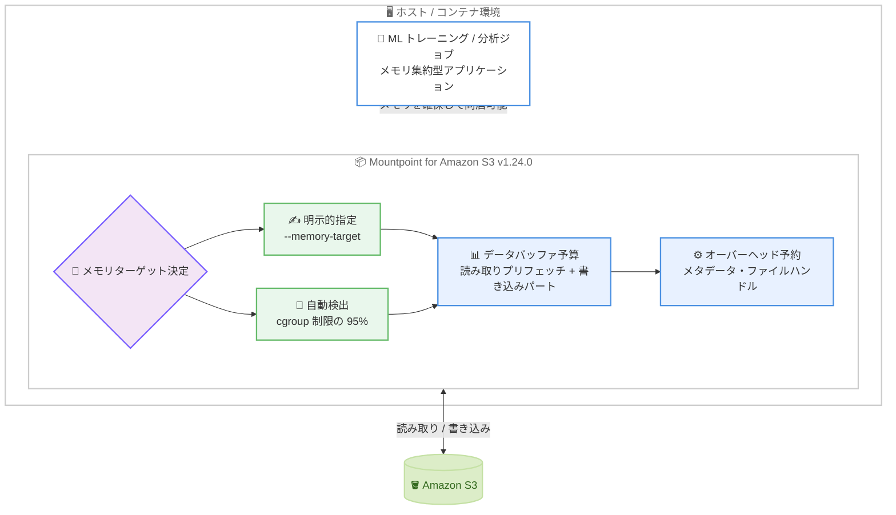

# Mountpoint for Amazon S3 - メモリ使用量コントロール

**リリース日**: 2026 年 8 月 26 日
**サービス**: Amazon S3 (Mountpoint for Amazon S3)
**機能**: メモリ使用量コントロール (Memory Usage Controls)

📊 [このアップデートのインフォグラフィックを見る](https://takech9203.github.io/aws-news-summary/20260826-mountpoint-for-S3-adds-memory-usage-controls.html)

## 概要

Mountpoint for Amazon S3 が、メモリ使用量の上限を制御する機能をサポートしました。ユーザーが明示的にメモリターゲットを指定する方法と、実行環境に基づいて Mountpoint が自動的に安全なデフォルト値を決定する方法の 2 種類が利用できます。たとえば Amazon EKS 上ではコンテナに割り当てられたメモリ量 (cgroup のメモリ制限) を自動検出し、その範囲内で動作します。

これまで Mountpoint のメモリフットプリントは、ワークロードのアクセスパターンに応じて時間とともに増加する可能性があり、機械学習トレーニングや分析ジョブなど、メモリを大量に消費するアプリケーションと同一ホストで動作させる場合に、パフォーマンスや安定性の問題を引き起こすリスクがありました。今回のアップデートにより、メモリ割り当てが厳格に制限されたコンテナ環境でも、Mountpoint を安心して利用できるようになります。

本機能は Mountpoint for Amazon S3 v1.24.0 で導入され、`--memory-target` CLI 引数として提供されます。メモリ逼迫時には、Mountpoint が I/O を減速し、不要になったバッファを解放し、プリフェッチを縮小することで、ターゲット内に収まるように動作します。

**アップデート前の課題**

このアップデート以前には、以下の課題がありました。

- Mountpoint のメモリ使用量は使用パターンに応じて増加する可能性があり、上限を設定する手段がなかった
- 機械学習トレーニングや分析ジョブなど、メモリ集約型アプリケーションと同居させると、メモリ競合によるパフォーマンス低下や OOM (Out of Memory) のリスクがあった
- メモリ割り当てが厳しく制限されたコンテナ環境 (Kubernetes / EKS の Pod など) では、メモリ超過による Pod の強制終了を考慮した運用が必要だった

**アップデート後の改善**

今回のアップデートにより、以下が可能になりました。

- `--memory-target` 引数で Mountpoint の総メモリ使用量のターゲットを明示的に設定できるようになった
- 実行環境 (cgroup のメモリ制限) に基づく自動検出により、コンテナのメモリバジェット内で安全に動作するようになった
- メモリ逼迫時には I/O の減速、バッファの解放、プリフェッチの縮小によりターゲット内に収まるため、他のアプリケーションのためにメモリを確保できるようになった

## アーキテクチャ図



Mountpoint は明示的な指定または cgroup 制限の自動検出によりメモリターゲットを決定し、その予算内で読み取りプリフェッチと書き込みバッファを管理します。これにより、同一ホスト上のメモリ集約型アプリケーションとの安全な同居が可能になります。

## サービスアップデートの詳細

### 主要機能

1. **明示的なメモリターゲット設定 (`--memory-target`)**
   - Mountpoint の総メモリ使用量のターゲットを MiB 単位で指定できる (最小 512 MiB)
   - 読み取り時のプリフェッチバッファと、書き込み時のアップロードパート保持の両方をカバーする
   - ターゲットは保証されたハードリミットではなく、Mountpoint がバッファ管理により収まるように動作する目標値

2. **実行環境に基づく自動検出**
   - `--memory-target` を指定しない場合、総メモリ量 (cgroup で制限されている場合はその制限値) の 95% がデフォルトのターゲットになる
   - Amazon EKS などのコンテナ環境では、コンテナに割り当てられたメモリバジェットを自動検出する
   - v1.24.0 では、親スライスから継承された cgroup メモリ制限の検出も修正されている

3. **メモリ逼迫時の適応動作**
   - メモリ逼迫時には I/O を減速し、不要になったバッファを解放し、プリフェッチウィンドウを縮小する
   - オーバーヘッド (メタデータやファイルハンドル) 用に `max(128 MiB, memory_target / 8)` を予約し、残りをデータバッファ予算として使用する
   - 同時に書き込みオープンできるファイル数がメモリターゲットから導出される上限に制限される (v1.24.0 の破壊的変更)

## 技術仕様

### メモリターゲットの仕様

| 項目 | 詳細 |
|------|------|
| 設定方法 | `--memory-target` CLI 引数 (MiB 単位) |
| 最小値 | 512 MiB |
| デフォルト | 総メモリ (または cgroup 制限値) の 95% |
| オーバーヘッド予約 | `max(128 MiB, memory_target / 8)` |
| 対象バッファ | 読み取りプリフェッチ、書き込みアップロードパート |
| 逼迫時の動作 | I/O 減速、バッファ解放、プリフェッチ縮小 |
| 導入バージョン | Mountpoint for Amazon S3 v1.24.0 (2026 年 8 月 24 日リリース) |

### 書き込みオープン可能ファイル数の上限

メモリターゲットと書き込みパートサイズから、同時に書き込みオープンできるファイル数の上限が以下の式で決まります。上限に達すると、書き込み用の `open()` は `ENOMEM` で失敗します。

```
上限 = (memory_target - オーバーヘッド - read_part_size) / write_part_size
```

| メモリターゲット | パートサイズ | 書き込みオープン可能ファイル数 |
|------------------|--------------|--------------------------------|
| 512 MiB | 8 MiB (デフォルト) | 47 |
| 4 GiB | 8 MiB (デフォルト) | 447 |

上限を引き上げるには、`--memory-target` を増やすか `--write-part-size` を減らします。Mountpoint は起動時にこの上限をログに出力します。

### 関連する CLI 引数

| 引数 | 説明 |
|------|------|
| `--memory-target` | 総メモリ使用量のターゲット (MiB 単位、最小 512 MiB) |
| `--read-part-size` | 並列読み取りのパートサイズ (デフォルト 8 MiB) |
| `--write-part-size` | 並列書き込みのパートサイズ (デフォルト 8 MiB) |

`--read-part-size` はデータバッファ予算内に収まる必要があります。`--memory-target` を明示的に指定した場合、大きすぎるパートサイズは起動時に拒否されます。デフォルトターゲット使用時は、警告とともに自動的に縮小されます。

## 設定方法

### 前提条件

1. Mountpoint for Amazon S3 v1.24.0 以降がインストールされていること (GitHub の最新リリースにアップグレード)
2. マウント対象の S3 バケットへの適切な IAM 権限があること
3. コンテナ環境で自動検出を利用する場合、cgroup によるメモリ制限が設定されていること

### 手順

#### ステップ 1: 最新バージョンへのアップグレード

```bash
# 現在のバージョンを確認
mount-s3 --version

# 最新版をダウンロードしてインストール (x86_64 Linux の例)
wget https://s3.amazonaws.com/mountpoint-s3-release/latest/x86_64/mount-s3.rpm
sudo yum install -y ./mount-s3.rpm
```

現在インストールされている Mountpoint のバージョンを確認し、v1.24.0 以降でない場合は最新リリースをダウンロードしてインストールします。

#### ステップ 2: メモリターゲットを指定してマウント

```bash
# メモリ使用量のターゲットを 1024 MiB に設定してマウント
mount-s3 --memory-target 1024 amzn-s3-demo-bucket /mnt/s3
```

`--memory-target` 引数により、Mountpoint の総メモリ使用量のターゲットを 1024 MiB に設定してバケットをマウントします。読み取りプリフェッチと書き込みバッファがこの予算内で管理されます。

#### ステップ 3: 自動検出に任せる場合

```bash
# 引数を指定せずにマウント (環境の 95% を自動的にターゲットに設定)
mount-s3 amzn-s3-demo-bucket /mnt/s3
```

`--memory-target` を指定しない場合、Mountpoint は総メモリ量 (コンテナでは cgroup のメモリ制限値) の 95% を自動的にターゲットとして使用します。Amazon EKS の Pod など、メモリ制限が設定されたコンテナ内ではその制限値が自動検出されます。

## メリット

### ビジネス面

- **インフラコストの最適化**: メモリ集約型ワークロードと Mountpoint を同一ホストに安全に同居させられるため、インスタンスの集約度を高めてコストを削減できる
- **安定性の向上**: OOM によるアプリケーションやコンテナの強制終了リスクが低減し、ML トレーニングジョブなどの長時間処理の中断を防止できる
- **運用負荷の軽減**: 自動検出により環境ごとのチューニングが不要になり、運用がシンプルになる

### 技術面

- **予測可能なメモリフットプリント**: Mountpoint のメモリ使用量が予算内に収まるため、キャパシティプランニングが容易になる
- **コンテナネイティブな動作**: cgroup のメモリ制限を自動検出するため、Kubernetes / EKS のリソース制限 (limits.memory) と自然に整合する
- **グレースフルな縮退**: メモリ逼迫時にはクラッシュではなく、I/O 減速とプリフェッチ縮小により動作を継続する

## デメリット・制約事項

### 制限事項

- メモリターゲットの最小値は 512 MiB であり、それ未満には設定できない
- ターゲットは保証されたハードリミットではなく、瞬間的にターゲットを超える可能性がある
- v1.24.0 以降、同時に書き込みオープンできるファイル数がメモリターゲットから導出される上限に制限され、超過時は `open()` が `ENOMEM` で失敗する (破壊的変更)

### 考慮すべき点

- メモリターゲットを小さく設定しすぎると、プリフェッチ縮小や I/O 減速によりスループットが低下する可能性がある
- 多数のファイルを同時に書き込むワークロードでは、`--memory-target` の引き上げまたは `--write-part-size` の縮小が必要になる場合がある
- `--read-part-size` を大きく設定する場合、データバッファ予算内に収まるかを確認する必要がある

## ユースケース

### ユースケース 1: EKS 上の ML トレーニングジョブとの同居

**シナリオ**: Amazon EKS 上で S3 のトレーニングデータを Mountpoint 経由で読み込む ML トレーニング Pod を実行する。Pod にはメモリ制限が設定されており、トレーニングプロセス自体が大量のメモリを消費する。

**実装例**:
```yaml
# Pod のメモリ制限を設定 (Mountpoint はこの制限を自動検出)
resources:
  limits:
    memory: "16Gi"
```

**効果**: Mountpoint がコンテナのメモリバジェットを自動検出して予算内で動作するため、OOM による Pod の強制終了を防ぎながらトレーニングを継続できます。

### ユースケース 2: 分析ジョブ実行ホストでの明示的なメモリ割り当て

**シナリオ**: EC2 インスタンス上で Spark などの分析ジョブと Mountpoint を同居させる。分析ジョブに大部分のメモリを割り当てたい。

**実装例**:
```bash
# Mountpoint には 2 GiB のみを割り当て、残りを分析ジョブ用に確保
mount-s3 --memory-target 2048 amzn-s3-demo-bucket /mnt/data
```

**効果**: Mountpoint のメモリ使用量が 2 GiB 程度に抑えられ、分析ジョブが必要とするメモリを確実に確保できます。

### ユースケース 3: 多数ファイルの同時書き込みワークロード

**シナリオ**: ログ集約やバッチ出力など、多数のファイルを同時に S3 へ書き込むワークロードで、書き込みオープン数の上限を確保したい。

**実装例**:
```bash
# メモリターゲット 4 GiB (デフォルトの 8 MiB パートで約 447 ファイルまで同時書き込み可能)
mount-s3 --memory-target 4096 amzn-s3-demo-bucket /mnt/output
```

**効果**: メモリターゲットに応じた書き込みオープン上限を把握した上で運用でき、`ENOMEM` エラーを回避しながら安定した書き込みが可能になります。

## 料金

Mountpoint for Amazon S3 はオープンソースのファイルクライアントであり、追加料金なしで利用できます。S3 の通常の API リクエスト料金 (GET、PUT、LIST など)、ストレージ料金、データ転送料金が適用されます。

## 利用可能リージョン

Mountpoint for Amazon S3 はすべての AWS リージョンで利用可能です。メモリ使用量コントロール機能を利用するには、GitHub から最新リリース (v1.24.0 以降) にアップグレードしてください。

## 関連サービス・機能

- **Amazon S3**: Mountpoint がマウント対象とするオブジェクトストレージサービス
- **Amazon EKS**: Mountpoint for Amazon S3 CSI ドライバー経由で Pod から S3 をマウント可能。コンテナのメモリ制限の自動検出が特に有効
- **Amazon EC2**: ML トレーニングや分析ワークロードの実行基盤。Mountpoint とアプリケーションのメモリ配分を制御可能
- **Amazon SageMaker AI**: S3 上のトレーニングデータへの高スループットアクセスに Mountpoint を活用可能

## 参考リンク

- 📊 [インフォグラフィック](https://takech9203.github.io/aws-news-summary/20260826-mountpoint-for-S3-adds-memory-usage-controls.html)
- [公式発表 (What's New)](https://aws.amazon.com/about-aws/whats-new/2026/08/mountpoint-for-S3-adds-memory-usage-controls/)
- [Mountpoint for Amazon S3 製品ページ](https://aws.amazon.com/s3/features/mountpoint/)
- [Mountpoint for Amazon S3 GitHub リポジトリ](https://github.com/awslabs/mountpoint-s3)
- [設定ガイド (CONFIGURATION.md)](https://github.com/awslabs/mountpoint-s3/blob/main/doc/CONFIGURATION.md)
- [リリースノート (v1.24.0)](https://github.com/awslabs/mountpoint-s3/releases)
- [Amazon S3 料金ページ](https://aws.amazon.com/s3/pricing/)

## まとめ

Mountpoint for Amazon S3 のメモリ使用量コントロールにより、ML トレーニングや分析ジョブなどメモリ集約型ワークロードとの安全な同居が可能になりました。特にメモリ制限が厳格なコンテナ環境 (EKS など) では自動検出が有効に働くため、Mountpoint を利用しているワークロードは v1.24.0 以降へのアップグレードを推奨します。多数ファイルの同時書き込みを行う場合は、書き込みオープン数の上限に関する破壊的変更を事前に確認してください。
