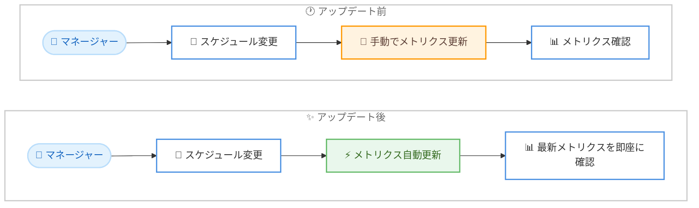

# Amazon Connect - スケジューリングメトリクスの自動更新

**リリース日**: 2026 年 8 月 27 日
**サービス**: Amazon Connect (エージェントスケジューリング / ワークフォースマネジメント)
**機能**: スケジューリングページにおけるスケジュールメトリクスの自動更新

📊 [このアップデートのインフォグラフィックを見る](https://takech9203.github.io/aws-news-summary/20260827-amazon-connect-customer-scheduling-metrics.html)

## 概要

Amazon Connect のエージェントスケジューリング機能において、スケジューリングページのスケジュールメトリクスが自動的に更新されるようになりました。スケジュールを変更すると、関連するメトリクスが手動操作なしで即座に再計算され、画面に反映されます。

例えば、10 人のエージェントに対して午前 10 時から 11 時までの新しいチームミーティングを追加すると、純利用可能ヘッドカウント (net available headcount) や予測サービスレベルなどのメトリクスが自動的に更新されます。これにより、ワークフォースマネージャーはスケジュール変更が人員配置のカバレッジに与える影響を常に最新の状態で把握できます。

本アップデートの主な対象ユーザーは、コンタクトセンターでエージェントのシフト管理を行うワークフォースマネージャーやスーパーバイザーです。日中の急なスケジュール変更時にも、迅速かつ的確な人員配置の意思決定が可能になります。

**アップデート前の課題**

- スケジュールを変更しても、メトリクスへの影響を確認するには手動での更新操作が必要だった
- ミーティング追加やシフト調整のたびに最新のメトリクスを確認する手間が発生し、作業効率が低下していた
- メトリクスの反映にタイムラグがあると、古い情報に基づいて人員配置を判断してしまうリスクがあった

**アップデート後の改善**

- スケジュール変更と同時に、純利用可能ヘッドカウントや予測サービスレベルなどのメトリクスが自動的に更新されるようになった
- 手動更新の操作が不要になり、ワークフォースマネージャーの作業負荷が軽減された
- 常に最新のメトリクスに基づいて、日中の人員配置の意思決定を迅速に行えるようになった

## アーキテクチャ図



アップデート前は、スケジュール変更後に手動でメトリクスを更新する必要がありましたが、アップデート後はスケジュール変更と同時にメトリクスが自動的に再計算され、即座に確認できます。

## サービスアップデートの詳細

### 主要機能

1. **スケジュールメトリクスの自動更新**
   - スケジューリングページ上でスケジュールを変更すると、関連するメトリクスが自動的に更新される
   - 手動の更新操作 (リフレッシュ) が不要になり、常に最新の状態を確認できる
   - シフト調整、ミーティング追加などの変更が即座にメトリクスへ反映される

2. **人員配置カバレッジの可視化**
   - 純利用可能ヘッドカウント (net available headcount) がスケジュール変更に応じて自動再計算される
   - 予測サービスレベルもあわせて更新され、変更が顧客対応品質に与える影響を確認できる
   - 例: 10 人のエージェントに午前 10 時から 11 時のチームミーティングを追加すると、その時間帯の利用可能人員が即座に反映される

3. **日中の迅速な意思決定支援**
   - スケジュール変更が人員配置に与える影響をリアルタイムに把握できる
   - 当日 (intraday) のスケジュール管理において、より早く、より正確な判断が可能になる

## 技術仕様

### 対象機能とメトリクス

| 項目 | 詳細 |
|------|------|
| 対象機能 | Amazon Connect エージェントスケジューリングのスケジューリングページ |
| 更新タイミング | スケジュール変更時に自動更新 |
| 対象メトリクスの例 | 純利用可能ヘッドカウント、予測サービスレベルなど |
| 必要な操作 | なし (自動で反映されるため手動更新は不要) |

## 設定方法

### 前提条件

1. Amazon Connect インスタンスが作成済みであること
2. 予測、キャパシティプランニング、スケジューリング機能が有効化されていること
3. スケジューリングページへのアクセス権限を持つセキュリティプロファイルがユーザーに割り当てられていること

### 手順

#### ステップ 1: スケジューリングページを開く

Amazon Connect の管理画面から「スケジューリング」ページに移動します。本機能は自動的に有効になっているため、追加の設定は不要です。

#### ステップ 2: スケジュールを変更する

シフトの調整やチームミーティングの追加など、通常どおりスケジュールを編集します。

#### ステップ 3: 自動更新されたメトリクスを確認する

変更を加えると、純利用可能ヘッドカウントや予測サービスレベルなどのメトリクスが自動的に再計算されます。手動での更新操作なしに、変更後の人員配置カバレッジを即座に確認できます。

## メリット

### ビジネス面

- **意思決定の迅速化**: スケジュール変更の影響が即座に可視化されるため、日中の人員配置判断をより早く行える
- **サービスレベルの維持**: 予測サービスレベルへの影響をリアルタイムに確認でき、顧客対応品質の低下を未然に防げる
- **運用負荷の軽減**: 手動更新の手間がなくなり、ワークフォースマネージャーがより価値の高い業務に集中できる

### 技術面

- **追加設定不要**: 既存のエージェントスケジューリング利用者は、設定変更なしで自動的に本機能を利用できる
- **最新データに基づく判断**: メトリクスの反映漏れや確認遅れによる、古い情報に基づいた判断のリスクを排除できる
- **既存ワークフローとの親和性**: スケジューリングページの操作方法は変わらず、学習コストなしで導入できる

## デメリット・制約事項

### 制限事項

- 本機能は Amazon Connect のエージェントスケジューリング機能が利用可能なリージョンでのみ提供される
- エージェントスケジューリング (予測、キャパシティプランニング、スケジューリング) 機能の有効化が前提となる

### 考慮すべき点

- 自動更新されるのはスケジューリングページ上のメトリクスであり、需要予測そのものの精度はこれまでどおり予測機能に依存する
- メトリクスの定義や計算方法を正しく理解した上で、人員配置の判断に活用する必要がある

## ユースケース

### ユースケース 1: 急なチームミーティングの追加

**シナリオ**: コンタクトセンターで、午前 10 時から 11 時に 10 人のエージェントを対象とした緊急のチームミーティングを設定する必要が生じた。

**実装例**:
```text
1. スケジューリングページで対象エージェント 10 人を選択
2. 10:00 - 11:00 にミーティングのアクティビティを追加
3. 自動更新された純利用可能ヘッドカウントと予測サービスレベルを確認
4. カバレッジ不足が見られる場合は、他エージェントのシフトを調整
```

**効果**: ミーティング追加が当該時間帯の応対体制に与える影響を即座に確認でき、サービスレベル低下を防ぐ調整を先回りして実施できる。

### ユースケース 2: 当日の欠勤対応

**シナリオ**: 当日朝に複数のエージェントから欠勤連絡があり、ワークフォースマネージャーがシフトの組み替えを行う。

**実装例**:
```text
1. 欠勤したエージェントのシフトをスケジューリングページで削除または変更
2. 自動更新されたメトリクスで時間帯ごとの人員不足を把握
3. 他のエージェントの休憩時間やシフトを調整し、その都度メトリクスの改善を確認
```

**効果**: 調整のたびに手動でメトリクスを更新する必要がなく、試行錯誤しながら最適な人員配置を短時間で組み立てられる。

### ユースケース 3: 研修スケジュールの計画的な組み込み

**シナリオ**: 新機能リリースに伴い、全エージェントに 1 時間の研修を実施する必要があるが、サービスレベルへの影響を最小限に抑えたい。

**実装例**:
```text
1. 候補となる時間帯に研修アクティビティを仮登録
2. 自動更新された予測サービスレベルを時間帯ごとに比較
3. 影響が最も小さい時間帯に研修を確定
```

**効果**: 複数の候補時間帯を比較検討する際にメトリクスが即座に反映されるため、顧客対応への影響が最小となる研修計画を効率的に立案できる。

## 料金

本アップデートに伴う追加料金は発表されていません。スケジューリングメトリクスの自動更新は、Amazon Connect のエージェントスケジューリング機能の一部として提供されます。エージェントスケジューリングの料金は Amazon Connect の料金体系に従います。詳細は料金ページを参照してください。

## 利用可能リージョン

Amazon Connect のエージェントスケジューリング機能が利用可能なすべての AWS リージョンで提供されます。対象リージョンの一覧は [Amazon Connect の利用可能リージョン](https://docs.aws.amazon.com/connect/latest/adminguide/regions.html#optimization_region) を参照してください。

## 関連サービス・機能

- **Amazon Connect 予測 (Forecasting)**: 過去の実績データに基づきコンタクト量を予測する機能。スケジューリングの前提となる需要予測を提供する
- **Amazon Connect キャパシティプランニング**: 長期的な人員計画を立案する機能。スケジューリングと組み合わせて要員計画の全体最適を図る
- **Amazon Connect リアルタイムメトリクス**: 稼働中のコンタクトセンターの状況を監視する機能。スケジュールどおりの運用ができているかの確認に活用できる

## 参考リンク

- 📊 [インフォグラフィック](https://takech9203.github.io/aws-news-summary/20260827-amazon-connect-customer-scheduling-metrics.html)
- [公式発表 (What's New)](https://aws.amazon.com/about-aws/whats-new/2026/08/amazon-connect-customer-scheduling-metrics/)
- [ドキュメント: 予測、キャパシティプランニング、スケジューリング](https://docs.aws.amazon.com/connect/latest/adminguide/forecasting-capacity-planning-scheduling.html)
- [料金ページ](https://aws.amazon.com/connect/pricing/)

## まとめ

Amazon Connect のスケジューリングページでメトリクスが自動更新されるようになり、ワークフォースマネージャーはスケジュール変更が人員配置に与える影響を即座に確認できるようになりました。追加設定は不要のため、エージェントスケジューリングを利用中の場合は、日中のシフト調整や当日の欠勤対応などの運用フローに本機能を組み込むことを推奨します。
