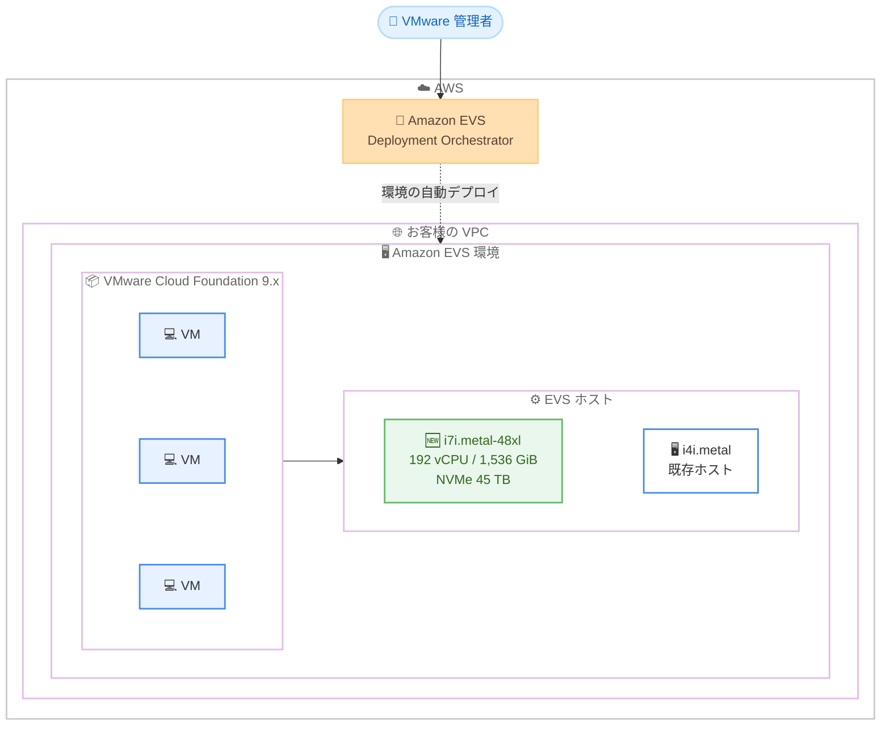

# Amazon EVS - i7i.metal-48xl インスタンスタイプのサポート

**リリース日**: 2026 年 8 月 27 日
**サービス**: Amazon Elastic VMware Service (Amazon EVS)
**機能**: i7i.metal-48xl Amazon EC2 ベアメタルインスタンスタイプのサポート

📊 [このアップデートのインフォグラフィックを見る](https://takech9203.github.io/aws-news-summary/20260827-amazon-evs-i7i-48xl.html)

## 概要

Amazon Elastic VMware Service (Amazon EVS) が、i7i.metal-48xl Amazon EC2 ベアメタルインスタンスタイプをサポートしました。i7i.metal-48xl は、より新しい世代のプロセッサを搭載した高コア数のホストオプションであり、AWS 上の VMware ベースのワークロードにおいてコストパフォーマンスの向上を実現します。

i7i インスタンスは第 5 世代 Intel Xeon スケーラブルプロセッサを搭載し、Amazon EC2 の x86 ベースのストレージ最適化インスタンスの中で最高のコンピューティング性能とストレージ性能を提供します。従来の i4i インスタンスと比較して、最大 23% 高いコンピューティング性能と 10% 以上優れたプライスパフォーマンスを実現します。

i7i.metal-48xl の大容量なメモリとストレージにより、より少ない EVS ホスト数でより多くの仮想マシン (VM) を実行して垂直方向にスケールできます。さらに、メモリ階層化 (memory tiering) などの VMware Cloud Foundation (VCF) 9.x の最新機能や、オンボーディングを簡素化する Amazon EVS Deployment Orchestrator などの新しい自動化機能も活用できます。

**アップデート前の課題**

Amazon EVS のホストとして選択できるインスタンスタイプが限られており、以下の課題がありました。

- 大規模な VM 集約を行う場合、ホストあたりのコア数・メモリ容量が不足し、必要なホスト数が増加していた
- 旧世代プロセッサベースのホストでは、最新世代と比較してコンピューティング性能とプライスパフォーマンスに改善の余地があった
- ホストの選択肢が少なく、ワークロードの特性に合わせたサイジングの柔軟性が限られていた

**アップデート後の改善**

- 192 vCPU、1,536 GiB メモリ、45 TB の NVMe ローカルストレージを備えた高集約ホストを EVS 環境で利用可能になった
- i4i インスタンス比で最大 23% 高いコンピューティング性能と 10% 以上優れたプライスパフォーマンスを実現できるようになった
- より少ないホスト数で多くの VM を実行できるため、ライセンスコストや運用負荷の最適化が可能になった
- VCF 9.x のメモリ階層化などの最新機能と組み合わせて、VM 集約率をさらに高められるようになった

## アーキテクチャ図



Amazon EVS 環境のホストとして新たに i7i.metal-48xl を選択できるようになり、1 ホストあたりの VM 集約率を高めながら VCF 9.x 環境を運用できます。

## サービスアップデートの詳細

### 主要機能

1. **i7i.metal-48xl ベアメタルインスタンスのサポート**
   - 192 vCPU、1,536 GiB メモリ、12 x 3,750 GB = 45,000 GB (45 TB) の NVMe ローカルストレージを搭載
   - ネットワーク帯域幅 100 Gbps、Amazon EBS 帯域幅 60 Gbps をサポート
   - ベアメタルインスタンスのため、ESXi ハイパーバイザーを直接実行可能

2. **第 5 世代 Intel Xeon スケーラブルプロセッサによる性能向上**
   - 全コアターボ周波数 3.2 GHz、最大コアターボ周波数 4.0 GHz の Emerald Rapids 世代プロセッサを搭載
   - i4i インスタンス比で最大 23% 高いコンピューティング性能
   - i4i インスタンス比で 10% 以上優れたプライスパフォーマンス
   - Intel Total Memory Encryption (TME) による常時メモリ暗号化をサポート

3. **VCF 9.x の最新機能との組み合わせ**
   - メモリ階層化 (memory tiering) により、NVMe ストレージをメモリの拡張として活用し VM 集約率を向上
   - Amazon EVS Deployment Orchestrator による環境デプロイの自動化・オンボーディングの簡素化
   - 大容量ホストへの集約により、より少ないホスト数での垂直スケーリングが可能

## 技術仕様

### i7i.metal-48xl の仕様

| 項目 | 詳細 |
|------|------|
| vCPU | 192 |
| メモリ | 1,536 GiB (DDR5) |
| インスタンスストレージ | 12 x 3,750 GB = 45,000 GB (NVMe SSD) |
| ネットワーク帯域幅 | 100 Gbps |
| EBS 帯域幅 | 60 Gbps |
| プロセッサ | 第 5 世代 Intel Xeon スケーラブルプロセッサ (Emerald Rapids)、全コアターボ 3.2 GHz |
| アクセラレータ | AMX、DSA、IAA、QAT (DSA / IAA / QAT はベアメタルのみ) |
| EFA | サポート |

### 従来ホストとの比較

| 項目 | i4i.metal (従来) | i7i.metal-48xl (新規) |
|------|------------------|----------------------|
| vCPU | 128 | 192 |
| メモリ | 1,024 GiB | 1,536 GiB |
| プロセッサ世代 | 第 3 世代 Intel Xeon | 第 5 世代 Intel Xeon |
| コンピューティング性能 | 基準 | 最大 23% 向上 |
| プライスパフォーマンス | 基準 | 10% 以上向上 |

## 設定方法

### 前提条件

1. Amazon EVS が利用可能な AWS リージョンであること
2. Amazon EC2 i7i インスタンスが同リージョンで利用可能であること
3. VMware Cloud Foundation のライセンスキーを保有していること
4. EVS 環境用の VPC およびネットワーク要件 (Route Server など) が構成済みであること

### 手順

#### ステップ 1: リージョンの対応状況を確認

Amazon EVS と Amazon EC2 i7i の両方が利用可能なリージョンであることを、各リージョン対応表で確認します。

#### ステップ 2: EVS 環境の作成またはホスト追加

```bash
# 既存の EVS 環境に i7i.metal-48xl ホストを追加する例
aws evs create-environment-host \
  --environment-id env-xxxxxxxxx \
  --host '{
    "hostName": "esxi-host-01",
    "instanceType": "i7i.metal-48xl",
    "keyName": "my-key-pair"
  }'
```

`create-environment-host` コマンドで、EVS 環境にホストを追加します。`instanceType` に `i7i.metal-48xl` を指定することで、新しいインスタンスタイプのホストをプロビジョニングします。実際のパラメータは最新の AWS CLI リファレンスで確認してください。

#### ステップ 3: ホストの状態確認

```bash
# 環境内のホスト一覧と状態を確認
aws evs list-environment-hosts \
  --environment-id env-xxxxxxxxx
```

`list-environment-hosts` コマンドで、追加したホストのプロビジョニング状態を確認します。ホストが正常に追加された後、vCenter Server から ESXi ホストとしてクラスターに組み込まれていることを確認します。

## メリット

### ビジネス面

- **コスト最適化**: i4i 比で 10% 以上優れたプライスパフォーマンスにより、VMware ワークロードの運用コストを削減できる
- **ライセンス効率**: より少ないホスト数で多くの VM を集約できるため、ホスト数に依存するコストの最適化につながる
- **移行の柔軟性**: ビジネスの需要に合わせて、自社のペースでクラウドへの移行と拡張を進められる

### 技術面

- **高い集約率**: 192 vCPU と 1,536 GiB メモリにより、1 ホストあたりの VM 集約率を大幅に向上できる
- **最新機能の活用**: VCF 9.x のメモリ階層化や Amazon EVS Deployment Orchestrator などの最新機能・自動化と組み合わせられる
- **高性能ストレージ**: 45 TB の NVMe ローカルストレージと 100 Gbps のネットワーク帯域幅により、ストレージ性能が要求されるワークロードにも対応できる

## デメリット・制約事項

### 制限事項

- Amazon EVS と Amazon EC2 i7i の両方が利用可能なリージョンでのみ利用できる
- ベアメタルインスタンスのため、プロビジョニングには仮想化インスタンスより時間がかかる場合がある
- VCF 9.x の最新機能 (メモリ階層化など) を利用するには、対応する VCF バージョンが必要

### 考慮すべき点

- 既存の i4i ベースの環境からの移行では、クラスター構成やホスト数の再設計が必要になる場合がある
- 高集約構成では 1 ホスト障害時の影響範囲が大きくなるため、可用性設計 (vSphere HA、ホスト数の冗長性) を考慮する必要がある
- ワークロードの特性 (CPU、メモリ、ストレージのバランス) に応じて、最適なインスタンスタイプを選定することが重要

## ユースケース

### ユースケース 1: 大規模 VMware 環境の AWS 移行

**シナリオ**: オンプレミスで数百台の VM を運用しており、データセンター契約の更新期限までに AWS へ移行したい。

**実装例**:
```
1. Amazon EVS Deployment Orchestrator で VCF 9.x 環境を自動デプロイ
2. i7i.metal-48xl ホストでクラスターを構成し、高い集約率で VM を収容
3. HCX などを利用してオンプレミスから VM をライブマイグレーション
```

**効果**: 少ないホスト数で大量の VM を収容でき、アーキテクチャ変更なしで迅速な移行を実現できます。

### ユースケース 2: メモリ集約型ワークロードの集約

**シナリオ**: メモリ使用量の大きいデータベース VM やアプリケーション VM を効率的に集約したい。

**実装例**:
```
1. i7i.metal-48xl (1,536 GiB メモリ) ホストでクラスターを構成
2. VCF 9.x のメモリ階層化を有効化し、NVMe をメモリの拡張として活用
3. メモリ要求の大きい VM を優先的に配置
```

**効果**: 物理メモリと NVMe 階層化の組み合わせにより、ホストあたりの VM 集約率をさらに高め、コストを最適化できます。

### ユースケース 3: 既存 EVS 環境の性能強化と垂直スケーリング

**シナリオ**: i4i ベースの既存 EVS 環境で性能が逼迫しており、ホスト数を増やさずに処理能力を拡張したい。

**実装例**:
```
1. 既存 EVS 環境に i7i.metal-48xl ホストを追加
2. vSphere DRS で高負荷 VM を新ホストへ移行
3. 段階的に旧世代ホストを新世代ホストへ置き換え
```

**効果**: i4i 比で最大 23% 高いコンピューティング性能により、ホスト数を抑えながら環境全体の処理能力を向上できます。

## 料金

Amazon EVS の料金は、EVS 環境で使用する EC2 ベアメタルホストのインスタンスタイプと利用時間に基づいて課金されます。i7i.metal-48xl はオンデマンドに加え、Savings Plans やリザーブドインスタンスなどの購入オプションによるコスト最適化が可能です。VMware Cloud Foundation のライセンスは別途必要です。最新の料金は [Amazon EVS 料金ページ](https://aws.amazon.com/evs/pricing/) を参照してください。

## 利用可能リージョン

Amazon EVS と Amazon EC2 i7i インスタンスの両方が利用可能な AWS リージョンで利用できます。最新の対応状況は以下を参照してください。

- [Amazon EVS のリージョン対応状況](https://docs.aws.amazon.com/evs/latest/userguide/what-is-evs.html)
- [Amazon EC2 i7i のリージョン対応状況](https://aws.amazon.com/ec2/instance-types/i7i/)

## 関連サービス・機能

- **Amazon EC2 i7i インスタンス**: 本アップデートで EVS ホストとして利用可能になったストレージ最適化ベアメタルインスタンス
- **VMware Cloud Foundation (VCF) 9.x**: EVS 上で稼働する VMware プラットフォーム。メモリ階層化などの最新機能を提供
- **Amazon EVS Deployment Orchestrator**: EVS 環境のデプロイを自動化し、オンボーディングを簡素化する機能
- **Amazon EBS / Amazon FSx for NetApp ONTAP**: EVS 環境の外部ストレージ拡張オプション

## 参考リンク

- 📊 [インフォグラフィック](https://takech9203.github.io/aws-news-summary/20260827-amazon-evs-i7i-48xl.html)
- [公式発表 (What's New)](https://aws.amazon.com/about-aws/whats-new/2026/08/amazon-evs-i7i-48xl)
- [Amazon EVS 製品ページ](https://aws.amazon.com/evs/)
- [Amazon EVS ユーザーガイド](https://docs.aws.amazon.com/evs/latest/userguide/what-is-evs.html)
- [Amazon EC2 i7i インスタンス](https://aws.amazon.com/ec2/instance-types/i7i/)
- [Amazon EVS 料金ページ](https://aws.amazon.com/evs/pricing/)

## まとめ

Amazon EVS が i7i.metal-48xl をサポートしたことで、第 5 世代 Intel Xeon プロセッサによる高い性能と大容量リソースを備えたホストで VMware ワークロードを運用できるようになりました。i4i 比で最大 23% の性能向上と 10% 以上のプライスパフォーマンス改善が見込めるため、新規の EVS 環境構築や既存環境の増設・置き換えの際は、i7i.metal-48xl の採用を検討することを推奨します。
