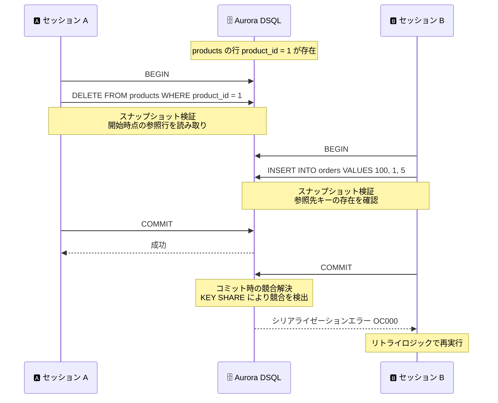

# Amazon Aurora DSQL - 外部キー制約のサポート

**リリース日**: 2026 年 8 月 27 日
**サービス**: Amazon Aurora DSQL
**機能**: 外部キー制約 (Foreign Key Constraints) のサポート

📊 [このアップデートのインフォグラフィックを見る](https://takech9203.github.io/aws-news-summary/20260827-aurora-dsql-foreign-key-constraints.html)

## 概要

Amazon Aurora DSQL が外部キー制約 (FOREIGN KEY constraints) をサポートしました。新規テーブルと既存テーブルの両方に対して外部キー制約を定義できるようになり、テーブル間の参照整合性 (referential integrity) をデータベース側で保証できます。Aurora DSQL は、PostgreSQL 互換のサーバーレス分散 SQL データベースであり、アクティブ - アクティブのマルチリージョン可用性を特徴としています。

外部キー制約により、例えば「注文レコードの商品 ID は必ず商品テーブルに存在する行を参照しなければならない」といった関係性をデータベースレベルで表現でき、参照を壊す書き込み操作は Aurora DSQL がブロックします。参照先の行が削除または更新された際の参照アクションとして、NO ACTION、RESTRICT、CASCADE、SET NULL、SET DEFAULT の 5 つをサポートします。

本アップデートは、Aurora DSQL の PostgreSQL 互換性における大きなマイルストーンです。これまで外部キー制約は Aurora DSQL の主要な非サポート機能の 1 つであり、既存の PostgreSQL アプリケーションを移行する際の障壁となっていました。参照アクションに加えて MATCH FULL / MATCH SIMPLE のマッチタイプや遅延可能制約 (DEFERRABLE) もサポートされ、PostgreSQL の標準的な外部キー機能に近い形で利用できます。

**アップデート前の課題**

- 以前は Aurora DSQL で外部キー制約を定義できず、参照整合性の検証ロジックをアプリケーション側で実装する必要があった
- アプリケーション側の整合性チェックは実装漏れや競合状態により、孤児レコード (参照先が存在しない行) が発生するリスクがあった
- 外部キー制約を利用する既存の PostgreSQL アプリケーションを Aurora DSQL へ移行する際、スキーマとアプリケーションロジックの書き換えが必要だった

**アップデート後の改善**

- CREATE TABLE および既存テーブルへの追加により、外部キー制約をデータベース側で定義・強制できるようになった
- NO ACTION、RESTRICT、CASCADE、SET NULL、SET DEFAULT の 5 つの参照アクションにより、参照先の削除・更新時の挙動を柔軟に制御できるようになった
- MATCH FULL / MATCH SIMPLE のマッチタイプと遅延可能制約 (DEFERRABLE) をサポートし、PostgreSQL との互換性が向上、移行時の書き換えが不要になった

## アーキテクチャ図



Aurora DSQL は楽観的並行性制御 (OCC) に基づき、トランザクション開始時のスナップショット検証とコミット時の競合解決の 2 段階で参照整合性を保証します。ロック待機は発生せず、競合はコミット時にシリアライゼーションエラーとして返されます。

## サービスアップデートの詳細

### 主要機能

1. **外部キー制約の定義**
   - 列制約 (REFERENCES) として単一列の外部キーを定義可能
   - テーブル制約 (FOREIGN KEY ... REFERENCES ...) として単一列または複数列の複合外部キーを定義可能
   - 参照先の列リストを省略した場合、参照先テーブルの主キーが使用される
   - 自己参照外部キー (ツリー構造など) や、1 つのテーブルへの複数の外部キー制約 (多対多関係) もサポート
   - 新規テーブルと既存テーブルの両方に定義可能

2. **参照アクション (Referential Actions)**
   - **NO ACTION** (デフォルト): 削除・更新が制約違反となる場合にエラーを返す。遅延制約の場合は制約チェック時点で判定
   - **RESTRICT**: 参照している行が存在する場合、削除・更新をエラーにする。NO ACTION と異なり遅延不可
   - **CASCADE**: 参照先の削除・更新に連動して、参照している行を削除または更新する
   - **SET NULL**: 参照している列 (または指定したサブセット) を NULL に設定する
   - **SET DEFAULT**: 参照している列 (または指定したサブセット) をデフォルト値に設定する

3. **マッチタイプと遅延可能制約**
   - **MATCH SIMPLE** (デフォルト): 外部キー列のいずれかが NULL の場合、参照先との一致を要求しない
   - **MATCH FULL**: 複合外部キーにおいて、全列が NULL または全列が非 NULL であることを要求する
   - **DEFERRABLE / INITIALLY DEFERRED**: 制約チェックをトランザクションのコミット時まで遅延可能。相互参照する行を順序を気にせず同一トランザクション内で挿入できる

### 参照整合性の維持メカニズム

Aurora DSQL は分散データベースでありながら、ロックを使わずに参照整合性を保証します。

1. **スナップショット検証**: 各トランザクションは開始時点の一貫したスナップショットに対して実行される。参照する行の挿入・更新時は参照先テーブルを、参照先キーの削除・更新時は参照元テーブルを、スナップショットから読み取って検証する。ロックを取得しないため、他のトランザクションは並行して両テーブルを変更できる
2. **コミット時の競合解決**: トランザクション開始からコミットまでの間に発生した並行変更を検出するため、参照先の行に暗黙的に KEY SHARE 句を適用する。競合が検出された場合、トランザクションはシリアライゼーションエラー (SQLSTATE 40001、OC000) で失敗する

## 技術仕様

### 外部キー制約の仕様

| 項目 | 詳細 |
|------|------|
| 参照アクション | NO ACTION (デフォルト)、RESTRICT、CASCADE、SET NULL、SET DEFAULT |
| マッチタイプ | MATCH SIMPLE (デフォルト)、MATCH FULL |
| 遅延可能性 | NOT DEFERRABLE (デフォルト)、DEFERRABLE INITIALLY IMMEDIATE、DEFERRABLE INITIALLY DEFERRED |
| 定義方法 | 列制約 (REFERENCES)、テーブル制約 (FOREIGN KEY) |
| 複合キー | サポート (テーブル制約形式で定義) |
| 参照先の要件 | 遅延不可の UNIQUE 制約または主キー制約の列 |
| 整合性保証方式 | スナップショット検証 + コミット時の競合解決 (OCC ベース) |
| 競合時の挙動 | シリアライゼーションエラー (SQLSTATE 40001) |

### PostgreSQL との互換性における位置づけ

| 観点 | PostgreSQL | Aurora DSQL |
|------|-----------|-------------|
| 外部キー構文 | FOREIGN KEY / REFERENCES | 同等の構文をサポート |
| 参照アクション | 5 種類 | 同じ 5 種類をサポート |
| マッチタイプ | MATCH SIMPLE / FULL / PARTIAL | MATCH SIMPLE / FULL をサポート |
| DEFERRABLE | 各種制約に適用可能 | 外部キー制約のみに適用可能 |
| 整合性の強制方式 | 行ロックによる待機 | OCC による競合検出 (待機なし、エラーで通知) |
| 競合時のアプリ対応 | ロック待機・デッドロック対策 | シリアライゼーションエラーのリトライが必要 |

## 設定方法

### 前提条件

1. Aurora DSQL クラスターが作成済みであること
2. PostgreSQL 互換クライアント (psql など) で接続できること
3. 参照先の列が遅延不可の UNIQUE 制約または主キー制約を持つこと

### 手順

#### ステップ1: 参照先テーブルの作成

```sql
CREATE TABLE products (
    product_no integer PRIMARY KEY,
    name text,
    price numeric
);
```

参照先となる商品テーブルを作成します。外部キーの参照先となる列は主キーまたは UNIQUE 制約を持つ必要があります。

#### ステップ2: 外部キー制約付きテーブルの作成

```sql
CREATE TABLE orders (
    order_id integer PRIMARY KEY,
    product_no integer REFERENCES products ON DELETE RESTRICT,
    quantity integer
);
```

REFERENCES 句で products テーブルへの外部キー制約を定義します。参照先の列リストを省略すると主キーが使用されます。ON DELETE RESTRICT により、注文から参照されている商品の削除はエラーになります。

#### ステップ3: 複合外部キーや遅延制約の定義

```sql
-- 複合外部キー (テーブル制約形式)
CREATE TABLE shipments (
    shipment_id integer PRIMARY KEY,
    warehouse_id integer,
    product_no integer,
    FOREIGN KEY (warehouse_id, product_no)
        REFERENCES inventory (warehouse_id, product_no) MATCH FULL
);

-- コミット時まで制約チェックを遅延
CREATE TABLE orders_deferred (
    order_id integer PRIMARY KEY,
    product_no integer REFERENCES products DEFERRABLE INITIALLY DEFERRED,
    quantity integer
);
```

複数列にまたがる外部キーは FOREIGN KEY のテーブル制約形式で定義します。DEFERRABLE INITIALLY DEFERRED を指定すると、制約チェックがコミット時まで遅延され、参照先の行より先に参照元の行を挿入できます。

## メリット

### ビジネス面

- **データ品質の向上**: 参照整合性がデータベースレベルで保証され、孤児レコードによるデータ不整合や、それに起因する業務障害を防止できる
- **移行障壁の低減**: 外部キー制約に依存する既存の PostgreSQL アプリケーションを、スキーマの書き換えなしに Aurora DSQL へ移行しやすくなる
- **開発コストの削減**: アプリケーション側で参照整合性チェックを実装・維持する必要がなくなり、開発とテストの工数を削減できる

### 技術面

- **ロックフリーの整合性保証**: スナップショット検証とコミット時の競合解決により、ロック待機なしで参照整合性を維持。並行トランザクションのスループットを阻害しない
- **柔軟な参照アクション**: CASCADE や SET NULL などにより、親子関係のデータライフサイクル管理をデータベースに委譲できる
- **遅延可能制約のサポート**: DEFERRABLE により、相互に参照し合う行を同一トランザクション内で任意の順序で挿入できる

## デメリット・制約事項

### 制限事項

- 参照先または参照元テーブルへのすべての DML 操作は、参照整合性を保証するための追加読み取りが発生する
- CASCADE、SET NULL、SET DEFAULT による自動変更は Aurora DSQL のトランザクション行数制限にカウントされ、子行の数が多い場合に予期しない失敗を招く可能性がある
- RESTRICT のチェックは遅延できない (NO ACTION は遅延可能)
- DEFERRABLE オプションは外部キー制約のみに適用可能 (PostgreSQL では他の制約にも適用できる)
- MATCH PARTIAL はサポートされない (PostgreSQL 本体でも未実装)

### 考慮すべき点

- 競合はロック待機ではなくシリアライゼーションエラー (SQLSTATE 40001) として返されるため、アプリケーションにリトライロジックの実装が必要
- 多数の行から参照される行のキー列が頻繁に変更されるスキーマでは競合が多発する。頻繁に変更される値は非キー列に移すなど、スキーマ設計の見直しを推奨
- 子行の数が無制限または予測不能な関係では、CASCADE などの自動変更アクションよりも NO ACTION または RESTRICT の使用が推奨される
- 外部キー制約の追加前にワークロードのベンチマークを実施し、追加読み取りによるパフォーマンス特性を検証することが推奨される

## ユースケース

### ユースケース1: EC サイトの注文管理

**シナリオ**: 注文テーブルが商品テーブルを参照する EC サイトで、販売中の商品が誤って削除されて注文データが不整合になることを防ぎたい。

**実装例**:
```sql
CREATE TABLE orders (
    order_id integer PRIMARY KEY,
    product_no integer REFERENCES products ON DELETE RESTRICT,
    quantity integer
);
```

**効果**: 注文から参照されている商品の削除はデータベースがエラーでブロックするため、アプリケーション側のチェック漏れがあっても孤児レコードが発生しない。

### ユースケース2: PostgreSQL アプリケーションの Aurora DSQL への移行

**シナリオ**: 外部キー制約を多用する既存の PostgreSQL アプリケーションを、サーバーレスでマルチリージョン対応の Aurora DSQL へ移行したい。

**実装例**:
```sql
-- 既存の PostgreSQL スキーマをほぼそのまま利用可能
CREATE TABLE order_items (
    product_no integer REFERENCES products,
    order_id integer REFERENCES orders,
    quantity integer,
    PRIMARY KEY (product_no, order_id)
);
```

**効果**: これまで外部キー制約が移行の障壁だったワークロードで、スキーマの書き換えなしに移行を検討できる。競合時のシリアライゼーションエラーへのリトライ対応のみ追加すればよい。

### ユースケース3: 相互参照データの一括登録

**シナリオ**: マスターデータの一括登録において、参照先と参照元の行を順序を気にせず同一トランザクションで挿入したい。

**実装例**:
```sql
CREATE TABLE orders (
    order_id integer PRIMARY KEY,
    product_no integer REFERENCES products DEFERRABLE INITIALLY DEFERRED,
    quantity integer
);

BEGIN;
INSERT INTO orders VALUES (1, 100, 2);   -- 参照先より先に挿入可能
INSERT INTO products VALUES (100, 'Widget', 9.99);
COMMIT;  -- コミット時点で制約を検証
```

**効果**: 制約チェックがコミット時まで遅延されるため、挿入順序の制御ロジックが不要になり、バッチ処理やデータロードの実装が簡素化される。

## 料金

外部キー制約の利用自体に追加料金は発表されていません。Aurora DSQL の標準料金 (DPU ベースのコンピューティング課金とストレージ課金) が適用されます。

ただし、参照先・参照元テーブルへの DML 操作には参照整合性を保証するための追加読み取りが発生するため、外部キー制約を持つテーブルへの書き込みでは DPU 消費が増加する可能性があります。導入前にベンチマークで確認することが推奨されます。

## 利用可能リージョン

Aurora DSQL が利用可能なすべての AWS リージョンで利用できます。最新のリージョン一覧は [AWS リージョン別サービス一覧](https://aws.amazon.com/about-aws/global-infrastructure/regional-product-services/) を参照してください。

## 関連サービス・機能

- **Amazon Aurora PostgreSQL**: フル機能の PostgreSQL 互換データベース。外部キーを行ロックで強制する従来型の方式であり、Aurora DSQL の OCC ベースの方式との違いを理解して使い分ける
- **Aurora DSQL の並行性制御 (OCC)**: 外部キー制約の競合解決は Aurora DSQL の楽観的並行性制御の仕組みに基づく。KEY SHARE 句の挙動やリトライ設計の理解が重要
- **Aurora DSQL のデータベース制限**: CASCADE などの自動変更はトランザクション行数制限の対象となるため、クォータの確認が必要

## 参考リンク

- 📊 [インフォグラフィック](https://takech9203.github.io/aws-news-summary/20260827-aurora-dsql-foreign-key-constraints.html)
- [公式発表 (What's New)](https://aws.amazon.com/about-aws/whats-new/2026/08/aurora-dsql-foreign-key-constraints/)
- [ドキュメント: Working with foreign key constraints in Aurora DSQL](https://docs.aws.amazon.com/aurora-dsql/latest/userguide/working-with-foreign-key-constraints.html)
- [ドキュメント: CREATE TABLE の外部キー構文](https://docs.aws.amazon.com/aurora-dsql/latest/userguide/create-table-syntax-support.html#create-table-foreign-keys)
- [Amazon Aurora DSQL 製品ページ](https://aws.amazon.com/rds/aurora/dsql/)

## まとめ

外部キー制約は Aurora DSQL の PostgreSQL 互換性における最大級のギャップの 1 つであり、本アップデートによりリレーショナルデータベースの中核機能である参照整合性をデータベース側で保証できるようになりました。外部キー制約が理由で Aurora DSQL の採用を見送っていた場合は、移行の再評価を推奨します。導入時は、OCC 特有のシリアライゼーションエラーに対するリトライ実装と、追加読み取りによるパフォーマンス影響のベンチマークを事前に実施してください。
