# AWS Backup - Amazon FSx for NetApp ONTAP のクロスリージョン・クロスアカウントバックアップサポート

**リリース日**: 2026 年 8 月 27 日
**サービス**: AWS Backup
**機能**: Amazon FSx for NetApp ONTAP バックアップのクロスリージョンコピーおよびクロスアカウントコピー

📊 [このアップデートのインフォグラフィックを見る](https://takech9203.github.io/aws-news-summary/20260827-aws-backup-amazon-fsx-netapp-cross-account-region.html)

## 概要

AWS Backup が、Amazon FSx for NetApp ONTAP のバックアップを別の AWS リージョン、別の AWS アカウント、またはその両方へコピーする機能をサポートしました。コピーは、バックアッププランによるポリシーベースの自動実行と、オンデマンドのコピージョブの両方で実行できます。

クロスリージョンコピーは、リージョン障害に備えたディザスタリカバリ (DR) や事業継続性 (BCP) の要件に対応します。クロスアカウントコピーは、誤削除、運用ミス、アカウント侵害といったリスクからバックアップデータを保護します。AWS Organizations と組み合わせることで、組織全体のバックアップコピーを一元的に自動化・管理できます。

なお、同日に Amazon FSx 側からも同等の機能に関する発表 ([Amazon FSx for NetApp ONTAP now supports copying backups across AWS Regions and accounts](https://aws.amazon.com/about-aws/whats-new/2026/08/fsx-ontap-cross-region-backup-copy/)) が行われています。本レポートでは AWS Backup 側の発表を中心に解説します。

**アップデート前の課題**

以前は、AWS Backup で FSx for NetApp ONTAP を保護する際に以下の制約がありました。

- FSx for NetApp ONTAP のバックアップは、AWS Backup のクロスリージョンコピーおよびクロスアカウントコピーの対象外だった
- リージョン障害やアカウント侵害に備えたバックアップの隔離保管を、AWS Backup の標準機能だけでは実現できなかった
- 他の対応リソース (Amazon EBS、Amazon RDS など) と FSx for NetApp ONTAP とで、DR 戦略やバックアップ運用を統一できなかった

**アップデート後の改善**

今回のアップデートにより、以下が可能になりました。

- FSx for NetApp ONTAP のバックアップを別リージョン、別アカウント、またはその両方へコピーできるようになった
- バックアッププランのコピーアクションによる自動コピーと、オンデマンドコピージョブの両方に対応した
- AWS Organizations を利用した組織全体でのバックアップポリシーの一元管理に、FSx for NetApp ONTAP のコピーも組み込めるようになった
- AWS Backup コンソール、AWS CLI、AWS SDK から利用できる

## アーキテクチャ図

```mermaid
flowchart TD
    subgraph SrcAccount["🏢 ソースアカウント"]
        subgraph RegionA["🌏 リージョン A"]
            FSx["🗄️ FSx for NetApp ONTAP<br/>ファイルシステム"]
            Plan["📋 AWS Backup<br/>バックアッププラン"]
            VaultA[("🔐 バックアップボールト A")]
        end
        subgraph RegionB["🌎 リージョン B"]
            VaultB[("🔐 バックアップボールト B<br/>DR 用")]
        end
    end

    subgraph DstAccount["🏢 別アカウント"]
        subgraph RegionC["🌍 リージョン A または B"]
            VaultC[("🔐 バックアップボールト C<br/>隔離保管用")]
        end
    end

    Plan -->|バックアップ作成| FSx
    FSx -->|復旧ポイント保存| VaultA
    VaultA -->|クロスリージョンコピー| VaultB
    VaultA -->|クロスアカウントコピー| VaultC

    classDef account fill:none,stroke:#CCCCCC,stroke-width:2px,color:#666666
    classDef region fill:none,stroke:#E1BEE7,stroke-width:2px,color:#666666
    classDef storage fill:#DCEDC8,stroke:#C5E1A5,stroke-width:2px,color:#33691E
    classDef vault fill:#E8EAF6,stroke:#C5CAE9,stroke-width:2px,color:#283593
    classDef process fill:#FFFFFF,stroke:#4A90E2,stroke-width:2px,color:#333333

    class SrcAccount,DstAccount account
    class RegionA,RegionB,RegionC region
    class FSx storage
    class VaultA,VaultB,VaultC vault
    class Plan process
```



ソースアカウントのバックアップボールトに保存された FSx for NetApp ONTAP の復旧ポイントを、別リージョンのボールトや別アカウントのボールトへコピーする構成です。クロスリージョンとクロスアカウントの組み合わせも可能です。

## サービスアップデートの詳細

### 主要機能

1. **クロスリージョンコピー**
   - FSx for NetApp ONTAP のバックアップを別の AWS リージョンのバックアップボールトへコピーできる
   - リージョン規模の障害に備えた DR 要件や、地理的に分離したデータ保管の要件に対応
   - コピー先で独立したライフサイクル (保持期間) を設定できる

2. **クロスアカウントコピー**
   - バックアップを別の AWS アカウントのバックアップボールトへコピーできる
   - 誤削除、運用ミス、アカウント侵害からバックアップデータを保護
   - クロスリージョンとクロスアカウントを同時に組み合わせたコピーも可能

3. **ポリシーベースとオンデマンドの両対応**
   - バックアッププランのコピーアクションとして自動コピーを定義できる
   - 既存の復旧ポイントに対するオンデマンドコピージョブも実行できる
   - AWS Backup コンソール、AWS CLI、AWS SDK から操作可能

4. **AWS Organizations による一元管理**
   - AWS Organizations のバックアップポリシーと組み合わせて、組織全体でコピーを自動化できる
   - 複数アカウント環境でのバックアップガバナンスを強化

## 技術仕様

### コピー機能の概要

| 項目 | 詳細 |
|------|------|
| 対象リソース | Amazon FSx for NetApp ONTAP ファイルシステム / ボリュームのバックアップ |
| コピー先 | 別リージョン、別アカウント、またはその両方 |
| 実行方法 | バックアッププランのコピーアクション、オンデマンドコピージョブ |
| 操作インターフェース | AWS Backup コンソール、AWS CLI、AWS SDK |
| クロスアカウントの前提 | ソースとコピー先のアカウントが同一の AWS Organizations に所属していること |
| コピー先ボールトの要件 | コピー先ボールトのアクセスポリシーでソースアカウントからのコピーを許可すること |

### バックアッププランのコピーアクション設定例

```json
{
  "BackupPlan": {
    "BackupPlanName": "fsx-ontap-dr-plan",
    "Rules": [
      {
        "RuleName": "DailyBackupWithCopy",
        "TargetBackupVaultName": "primary-vault",
        "ScheduleExpression": "cron(0 17 * * ? *)",
        "Lifecycle": {
          "DeleteAfterDays": 35
        },
        "CopyActions": [
          {
            "DestinationBackupVaultArn": "arn:aws:backup:us-west-2:123456789012:backup-vault:dr-vault",
            "Lifecycle": {
              "DeleteAfterDays": 90
            }
          }
        ]
      }
    ]
  }
}
```

`CopyActions` にコピー先ボールトの ARN を指定することで、バックアップ作成後に自動でコピーが実行されます。コピー先の ARN に別リージョンや別アカウントのボールトを指定できます。

## 設定方法

### 前提条件

1. ソースリージョンとコピー先リージョンの両方で、AWS Backup と Amazon FSx for NetApp ONTAP が利用可能であること
2. クロスアカウントコピーの場合、両アカウントが同一の AWS Organizations に所属し、AWS Backup のクロスアカウントバックアップ機能が有効化されていること
3. コピー先バックアップボールトのアクセスポリシーで、ソースアカウントからのコピー操作が許可されていること
4. AWS Backup が使用する IAM ロールに、コピージョブの実行に必要な権限が付与されていること

### 手順

#### ステップ 1: コピー先バックアップボールトの準備

```bash
# コピー先リージョンまたはコピー先アカウントでボールトを作成
aws backup create-backup-vault \
  --backup-vault-name dr-vault \
  --region us-west-2
```

コピー先となるバックアップボールトを作成します。クロスアカウントコピーの場合は、コピー先アカウントでボールトを作成し、アクセスポリシーでソースアカウントからの `backup:CopyIntoBackupVault` を許可します。

```bash
# コピー先ボールトにアクセスポリシーを設定 (クロスアカウントの場合)
aws backup put-backup-vault-access-policy \
  --backup-vault-name dr-vault \
  --policy '{
    "Version": "2012-10-17",
    "Statement": [
      {
        "Effect": "Allow",
        "Principal": {"AWS": "arn:aws:iam::111122223333:root"},
        "Action": "backup:CopyIntoBackupVault",
        "Resource": "*"
      }
    ]
  }'
```

ソースアカウント (例: 111122223333) からこのボールトへのコピーを許可するポリシーを設定します。

#### ステップ 2: バックアッププランにコピーアクションを追加

```bash
aws backup create-backup-plan \
  --backup-plan file://fsx-ontap-dr-plan.json
```

前述の JSON 例のように `CopyActions` を含むバックアッププランを作成します。以降、スケジュールに従って作成されたバックアップが自動的にコピー先ボールトへコピーされます。

#### ステップ 3: オンデマンドコピージョブの実行 (必要に応じて)

```bash
aws backup start-copy-job \
  --recovery-point-arn arn:aws:backup:ap-northeast-1:111122223333:recovery-point:xxxxxxxx \
  --source-backup-vault-name primary-vault \
  --destination-backup-vault-arn arn:aws:backup:us-west-2:123456789012:backup-vault:dr-vault \
  --iam-role-arn arn:aws:iam::111122223333:role/service-role/AWSBackupDefaultServiceRole
```

既存の復旧ポイントを指定して、オンデマンドでコピージョブを開始します。コピージョブの状態は `aws backup describe-copy-job` で確認できます。

## メリット

### ビジネス面

- **DR / BCP 要件への対応**: リージョン障害に備えて FSx for NetApp ONTAP のバックアップを地理的に分離したリージョンに保管でき、事業継続性の要件を満たしやすくなる
- **セキュリティリスクの低減**: 別アカウントへのコピーにより、アカウント侵害やランサムウェア攻撃を受けた場合でもバックアップデータを保全できる
- **コンプライアンス対応**: データの隔離保管や保持要件など、規制・監査要件への対応が容易になる

### 技術面

- **バックアップ運用の統一**: 他の AWS Backup 対応リソースと同じ仕組みで FSx for NetApp ONTAP の DR コピーを管理でき、運用がシンプルになる
- **ポリシーベースの自動化**: バックアッププランや AWS Organizations のバックアップポリシーにより、コピーを含む保護運用を自動化できる
- **柔軟なライフサイクル管理**: ソースとコピー先で独立した保持期間を設定でき、コストと保護要件のバランスを取りやすい

## デメリット・制約事項

### 制限事項

- Amazon FSx for NetApp ONTAP と AWS Backup の両方が利用可能な商用リージョンでのみ利用できる
- クロスアカウントコピーには、ソースとコピー先のアカウントが同一の AWS Organizations に所属している必要がある (AWS Backup のクロスアカウントバックアップの一般要件)

### 考慮すべき点

- クロスリージョンコピーにはリージョン間データ転送料金が、コピー先にはバックアップストレージ料金が発生するため、コピー対象とライフサイクル設定を要件に合わせて設計する必要がある
- コピー先ボールトのアクセスポリシーや KMS キーの設定 (暗号化されたバックアップのコピー) を事前に確認する必要がある
- 大容量ファイルシステムの初回コピーは完了までに時間がかかる可能性があるため、RPO / RTO の設計時に考慮が必要

## ユースケース

### ユースケース 1: リージョン障害に備えた DR 構成

**シナリオ**: 東京リージョンで FSx for NetApp ONTAP を運用しており、リージョン障害時にも別リージョンでファイルサーバーを復旧できるようにしたい。

**実装例**:
```
1. 大阪リージョンに DR 用バックアップボールトを作成
2. バックアッププランに CopyActions で大阪リージョンのボールトを指定
3. 障害発生時、大阪リージョンのバックアップから FSx for NetApp ONTAP を復元
```

**効果**: リージョン障害時にも別リージョンのバックアップからファイルシステムを復旧でき、事業継続性を確保できる。

### ユースケース 2: ランサムウェア対策としてのバックアップ隔離

**シナリオ**: 本番アカウントが侵害された場合でも、バックアップデータが削除・暗号化されないように保護したい。

**実装例**:
```
1. AWS Organizations 内に専用のバックアップアカウントを用意
2. バックアップアカウントにボールトを作成し、アクセスポリシーで本番アカウントからのコピーのみ許可
3. 本番アカウントのバックアッププランでクロスアカウントコピーを設定
```

**効果**: 本番アカウントとは分離された環境にバックアップが保管され、アカウント侵害や誤削除の影響を受けにくくなる。

### ユースケース 3: 組織全体のバックアップガバナンス

**シナリオ**: 複数アカウントで FSx for NetApp ONTAP を運用しており、全アカウントで統一されたコピーポリシーを強制したい。

**実装例**:
```
1. AWS Organizations のバックアップポリシーで、コピーアクションを含むバックアップルールを定義
2. 対象の組織単位 OU にポリシーをアタッチ
3. 各アカウントの FSx for NetApp ONTAP がポリシーに従って自動的にバックアップ・コピーされる
```

**効果**: アカウントごとの設定漏れを防ぎ、組織全体で一貫したデータ保護体制を実現できる。

## 料金

AWS Backup の標準料金体系に従います。バックアップストレージ料金に加えて、コピーに関しては以下のコストが発生します。

- クロスリージョンコピー: リージョン間のデータ転送料金と、コピー先リージョンでのバックアップストレージ料金
- クロスアカウントコピー: コピー先アカウントでのバックアップストレージ料金

最新の料金は [AWS Backup 料金ページ](https://aws.amazon.com/backup/pricing/) を参照してください。

## 利用可能リージョン

Amazon FSx for NetApp ONTAP と AWS Backup の両方が利用可能なすべての商用 AWS リージョンで利用できます。リージョンごとの機能対応状況は [AWS Backup の機能対応表](https://docs.aws.amazon.com/aws-backup/latest/devguide/backup-feature-availability.html#supported-services-by-region) を参照してください。

## 関連サービス・機能

- **Amazon FSx for NetApp ONTAP**: 本アップデートの保護対象となるフルマネージド共有ストレージサービス。同日に FSx 側からも同機能の発表があった
- **AWS Organizations**: バックアップポリシーによる組織全体でのバックアップ・コピーの一元管理と、クロスアカウントコピーの前提となるサービス
- **AWS Backup Vault Lock**: コピー先ボールトと組み合わせることで、バックアップの削除・変更を防止するイミュータブルな保管を実現できる

## 参考リンク

- 📊 [インフォグラフィック](https://takech9203.github.io/aws-news-summary/20260827-aws-backup-amazon-fsx-netapp-cross-account-region.html)
- [公式発表 (What's New)](https://aws.amazon.com/about-aws/whats-new/2026/08/aws-backup-amazon-fsx-netapp-cross-account-region/)
- [関連発表: Amazon FSx for NetApp ONTAP now supports copying backups across AWS Regions and accounts](https://aws.amazon.com/about-aws/whats-new/2026/08/fsx-ontap-cross-region-backup-copy/)
- [AWS Backup 製品ページ](https://aws.amazon.com/backup/)
- [AWS Backup 機能対応表 (ドキュメント)](https://docs.aws.amazon.com/aws-backup/latest/devguide/backup-feature-availability.html#supported-services-by-region)
- [AWS Backup 料金ページ](https://aws.amazon.com/backup/pricing/)

## まとめ

AWS Backup による Amazon FSx for NetApp ONTAP のクロスリージョン・クロスアカウントコピー対応により、他の AWS リソースと同じ仕組みで DR とバックアップ隔離を実現できるようになりました。FSx for NetApp ONTAP を運用している場合は、既存のバックアッププランにコピーアクションを追加し、DR 要件やランサムウェア対策の観点からコピー先の構成を検討することを推奨します。
