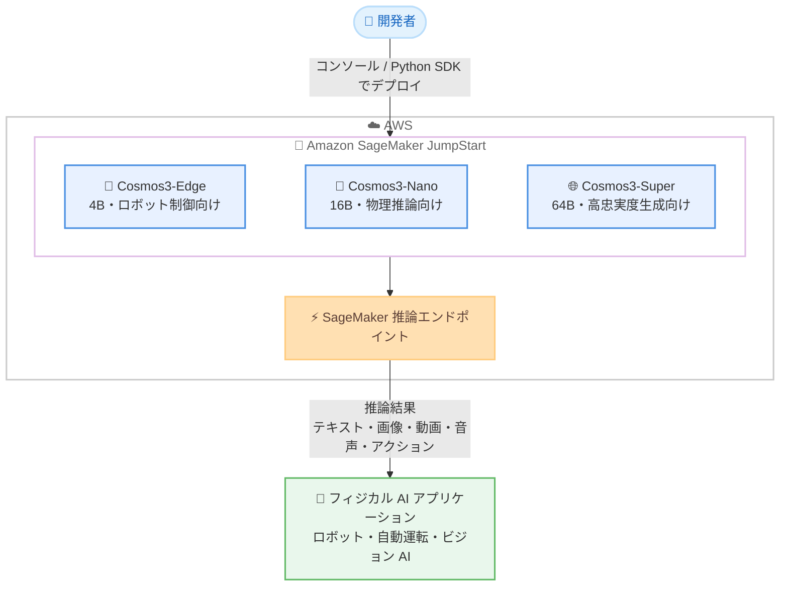

# Amazon SageMaker JumpStart - NVIDIA Cosmos 3 ファミリー (Cosmos3-Edge / Cosmos3-Nano / Cosmos3-Super) の提供開始

**リリース日**: 2026 年 8 月 27 日
**サービス**: Amazon SageMaker JumpStart
**機能**: NVIDIA Cosmos3-Edge、Cosmos3-Nano、Cosmos3-Super モデルの提供開始

📊 [このアップデートのインフォグラフィックを見る](https://takech9203.github.io/aws-news-summary/20260827-cosmos3-edge-cosmos3-nano-cosmos3-super-on-sagemaker-jumpstart.html)

## 概要

NVIDIA の Cosmos 3 ファミリーに属する 3 つのモデル、Cosmos3-Edge、Cosmos3-Nano、Cosmos3-Super が Amazon SageMaker JumpStart で利用可能になりました。Cosmos 3 ファミリーは「フィジカル AI のためのオープンなフロンティア・オムニモーダルワールドモデル」と位置づけられており、ロボット、自動運転車、ビジョン AI システムなど、物理環境を知覚し、推論し、計画し、行動するシステムの構築を目的としています。

3 つのモデルはパラメータ規模と用途が異なります。Cosmos3-Edge (4B) はオンデバイスのロボット制御とリアルタイム視覚推論向け、Cosmos3-Nano (16B) は物理法則を考慮したワールド生成と物理推論向け、Cosmos3-Super (64B) は大規模シミュレーションや合成データ生成に適した最高忠実度のモデルです。いずれもテキスト、画像、動画、音声、アクション軌跡といった複数モダリティを扱うオムニモーダルモデルです。

SageMaker JumpStart のモデルカタログからコンソール経由でワンクリックデプロイできるほか、SageMaker Python SDK からもデプロイ可能です。ロボティクスや自動運転などフィジカル AI 領域の開発者は、インフラ構築の手間なくこれらの最先端モデルを試すことができます。

**アップデート前の課題**

このアップデート以前に存在していた課題や制限は以下のとおりです。

- NVIDIA Cosmos 3 ファミリーのモデルを AWS 上で利用するには、モデルの入手、コンテナ構築、推論エンドポイントの構成を自前で行う必要があった
- フィジカル AI 向けのオムニモーダルワールドモデルを検証する際、GPU インフラの調達とセットアップに時間がかかっていた
- ロボット制御、物理推論、大規模シミュレーションといった用途ごとに適切なモデルサイズを選択して運用する仕組みを個別に整備する必要があった

**アップデート後の改善**

今回のアップデートにより可能になったことは以下のとおりです。

- SageMaker JumpStart のモデルカタログから Cosmos3-Edge、Cosmos3-Nano、Cosmos3-Super を数クリックでデプロイできるようになった
- SageMaker Python SDK を使用したプログラマティックなデプロイと推論が可能になった
- 用途に応じて 4B / 16B / 64B の 3 つのモデルサイズをマネージドな環境で使い分けられるようになった

## アーキテクチャ図



開発者は SageMaker JumpStart のモデルカタログから用途に合った Cosmos 3 モデルを選択し、SageMaker 推論エンドポイントとしてデプロイして、ロボットや自動運転などのフィジカル AI アプリケーションから利用します。

## サービスアップデートの詳細

### 主要機能

1. **Cosmos3-Edge (4B): オンデバイスロボット制御とリアルタイム視覚推論**
   - 2B の Nemotron ベースの推論器 (reasoner) を備えた 4B パラメータのオムニモデル
   - ロボット制御向け解像度 (640x360) で動作
   - NVIDIA Jetson Thor 上で 15 Hz、1 推論あたり 32 アクションを生成
   - 組み込みシステム向けに 256p および 480p の動画を 12〜30 FPS で処理可能

2. **Cosmos3-Nano (16B): 物理法則を考慮したワールド生成と物理推論**
   - コンパクトな 16B パラメータのオムニモーダルモデル
   - テキスト、画像、動画、音声、アクション軌跡の混合入力を受け付け、対応する出力を生成
   - テキスト、画像、動画にまたがる Chain-of-Thought 推論を最大 720p でサポート

3. **Cosmos3-Super (64B): ファミリー最高忠実度のモデル**
   - 統合 Mixture-of-Transformers アーキテクチャを採用した 64B パラメータモデル
   - 言語、画像、動画、音声、アクションシーケンスを同時に処理・生成
   - 複数のアスペクト比で最大 720p に対応し、大規模シミュレーション、合成データ生成、ポリシー学習に適合

4. **SageMaker JumpStart によるデプロイ**
   - SageMaker コンソールのモデルカタログからのデプロイに対応
   - SageMaker Python SDK によるプログラマティックなデプロイに対応

## 技術仕様

### モデル比較

| 項目 | Cosmos3-Edge | Cosmos3-Nano | Cosmos3-Super |
|------|--------------|--------------|---------------|
| パラメータ数 | 4B (+2B 推論器) | 16B | 64B |
| 主な用途 | オンデバイスロボット制御、リアルタイム視覚推論 | 物理法則を考慮したワールド生成、物理推論 | 大規模シミュレーション、合成データ生成、ポリシー学習 |
| 解像度 | 640x360 (ロボット制御)、256p / 480p 動画 | 最大 720p | 最大 720p (複数アスペクト比) |
| 特徴 | Jetson Thor 上で 15 Hz、32 アクション / 推論 | マルチモーダル Chain-of-Thought 推論 | 統合 Mixture-of-Transformers アーキテクチャ |
| 入出力モダリティ | 動画、アクション | テキスト、画像、動画、音声、アクション軌跡 | 言語、画像、動画、音声、アクションシーケンス |

## 設定方法

### 前提条件

1. AWS アカウントを保有していること
2. Amazon SageMaker AI (SageMaker Studio または SageMaker Python SDK) を利用できる環境があること
3. モデルのデプロイに必要な GPU インスタンスのサービスクォータが確保されていること

### 手順

#### ステップ1: SageMaker JumpStart でモデルを検索

SageMaker コンソールから SageMaker Studio を開き、JumpStart のモデルカタログで「Cosmos3」を検索します。Cosmos3-Edge、Cosmos3-Nano、Cosmos3-Super の 3 モデルが表示されます。

#### ステップ2: モデルをデプロイ

コンソールの場合はモデル詳細ページで [Deploy] を選択します。SageMaker Python SDK を使用する場合は以下のようにデプロイします。

```python
from sagemaker.jumpstart.model import JumpStartModel

# JumpStart のモデル ID を指定してモデルを作成
# 実際のモデル ID は SageMaker Studio のモデルカタログで確認
model = JumpStartModel(model_id="<cosmos3-model-id>")

# 推論エンドポイントとしてデプロイ
predictor = model.deploy()
```

`JumpStartModel` でモデル ID を指定してモデルオブジェクトを作成し、`deploy()` で SageMaker 推論エンドポイントを起動しています。

#### ステップ3: 推論の実行

```python
# マルチモーダル入力で推論を実行
response = predictor.predict(payload)
print(response)
```

デプロイしたエンドポイントに対して、テキストや画像、動画などの入力を含むペイロードを送信し、推論結果を取得しています。検証完了後は不要なエンドポイントを削除してコストを抑えます。

## メリット

### ビジネス面

- **フィジカル AI 開発の加速**: ロボットや自動運転などの開発において、最先端のワールドモデルを短時間で検証でき、プロトタイピングから本番検討までのリードタイムを短縮できる
- **初期投資の抑制**: 大規模 GPU 環境を自前で構築することなく、従量課金で最大 64B パラメータのモデルを利用できる
- **用途に応じたコスト最適化**: 4B / 16B / 64B の 3 サイズから要件に合ったモデルを選択でき、過剰なリソース利用を回避できる

### 技術面

- **マネージドなデプロイ**: SageMaker JumpStart によりコンテナ構築や推論サーバー設定が不要で、数クリックまたは数行のコードでエンドポイントを起動できる
- **オムニモーダル対応**: テキスト、画像、動画、音声、アクション軌跡を単一モデルで処理でき、複数モデルの組み合わせによる複雑なパイプラインを簡素化できる
- **SageMaker エコシステムとの統合**: デプロイ後は SageMaker の監視、オートスケーリング、セキュリティ機能をそのまま活用できる

## デメリット・制約事項

### 制限事項

- 発表内では利用可能リージョンが明示されていないため、利用予定のリージョンでモデルが提供されているかを SageMaker JumpStart のモデルカタログで確認する必要がある
- 大規模モデル (特に Cosmos3-Super 64B) のホスティングには高性能な GPU インスタンスが必要で、相応の推論コストが発生する
- Cosmos3-Edge のオンデバイス性能値 (15 Hz、32 アクション / 推論) は NVIDIA Jetson Thor 上での値であり、SageMaker エンドポイントでの性能はインスタンスタイプに依存する

### 考慮すべき点

- GPU インスタンスのサービスクォータが不足している場合は、事前にクォータ引き上げ申請が必要
- フィジカル AI 用途では、クラウド推論のレイテンシーが実機制御の要件を満たすかを検証する必要がある
- オープンモデルであるため、ライセンス条件 (NVIDIA のモデルライセンス) を確認したうえで商用利用を判断する必要がある

## ユースケース

### ユースケース1: ロボットアームのリアルタイム制御開発

**シナリオ**: 製造業の企業が、視覚入力に基づいてロボットアームを制御するシステムを開発しており、実機搭載前にクラウド上でモデルの挙動を検証したい。

**実装例**:
```python
# Cosmos3-Edge をデプロイして視覚入力からアクションを生成
model = JumpStartModel(model_id="<cosmos3-edge-model-id>")
predictor = model.deploy()
response = predictor.predict(camera_frame_payload)
```

**効果**: 640x360 のロボット制御向け解像度で動作する Cosmos3-Edge により、実機 (Jetson Thor) への搭載を見据えたアクション生成の検証をクラウド上で効率的に実施できる。

### ユースケース2: 自動運転向けの物理推論と危険予測

**シナリオ**: 自動運転システムの開発チームが、走行映像に対して物理法則を考慮した状況理解と推論を行うコンポーネントを検証したい。

**実装例**:
```python
# Cosmos3-Nano で走行映像に対する Chain-of-Thought 推論を実行
model = JumpStartModel(model_id="<cosmos3-nano-model-id>")
predictor = model.deploy()
response = predictor.predict(driving_video_payload)
```

**効果**: 16B のコンパクトなモデルで動画を含むマルチモーダル入力に対する物理推論を実行でき、コストを抑えながらシナリオ理解の精度を評価できる。

### ユースケース3: 合成データ生成によるポリシー学習の強化

**シナリオ**: ロボティクス企業が、実環境での収集が困難なエッジケースの学習データを合成データで補完し、制御ポリシーの学習を強化したい。

**実装例**:
```python
# Cosmos3-Super で高忠実度のシミュレーション動画を生成
model = JumpStartModel(model_id="<cosmos3-super-model-id>")
predictor = model.deploy()
synthetic_data = predictor.predict(scenario_prompt_payload)
```

**効果**: 最大 720p の高忠実度な動画とアクションシーケンスを生成でき、大規模シミュレーションと合成データによるポリシー学習のデータ不足を解消できる。

## 料金

SageMaker JumpStart 経由のモデルデプロイでは、モデル自体のカタログ利用に追加料金はなく、推論エンドポイントとして起動する SageMaker AI のインスタンス使用料が発生します。料金はインスタンスタイプと稼働時間に基づく従量課金です。

詳細は [Amazon SageMaker AI の料金ページ](https://aws.amazon.com/sagemaker-ai/pricing/) を参照してください。

## 利用可能リージョン

公式発表では利用可能リージョンが明示されていません。SageMaker JumpStart が利用可能なリージョンのうち、対象モデルがカタログに表示されるリージョンで利用できます。利用予定のリージョンで SageMaker Studio のモデルカタログを確認してください。

## 関連サービス・機能

- **Amazon SageMaker JumpStart**: 事前学習済みモデルのカタログとワンクリックデプロイを提供する SageMaker AI の機能。今回のモデル提供の基盤
- **Amazon SageMaker AI 推論エンドポイント**: デプロイしたモデルをホスティングするマネージド推論基盤。オートスケーリングや監視機能を提供
- **Amazon Bedrock**: フルマネージドな基盤モデル API サービス。エンドポイント管理が不要な選択肢として、ユースケースに応じて使い分けが可能

## 参考リンク

- 📊 [インフォグラフィック](https://takech9203.github.io/aws-news-summary/20260827-cosmos3-edge-cosmos3-nano-cosmos3-super-on-sagemaker-jumpstart.html)
- [公式発表 (What's New)](https://aws.amazon.com/about-aws/whats-new/2026/01/cosmos3-edge-cosmos3-nano-cosmos3-super-on-sagemaker-jumpstart/)
- [Amazon SageMaker JumpStart ドキュメント](https://docs.aws.amazon.com/sagemaker/latest/dg/studio-jumpstart.html)
- [Amazon SageMaker AI 料金ページ](https://aws.amazon.com/sagemaker-ai/pricing/)

## まとめ

NVIDIA の Cosmos 3 ファミリー (Edge 4B / Nano 16B / Super 64B) が SageMaker JumpStart に追加され、ロボット、自動運転、ビジョン AI といったフィジカル AI 領域のオムニモーダルワールドモデルをマネージド環境で手軽に利用できるようになりました。フィジカル AI の開発に取り組むチームは、まず SageMaker Studio のモデルカタログで対象モデルの提供状況を確認し、用途に合ったサイズのモデルで検証を開始することを推奨します。
