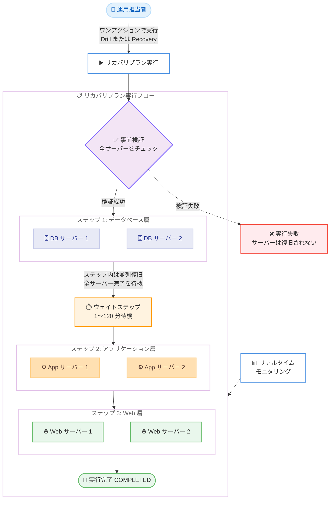

# AWS Elastic Disaster Recovery - Recovery Plans によるアプリケーション復旧のオーケストレーション

**リリース日**: 2026 年 8 月 27 日
**サービス**: AWS Elastic Disaster Recovery (AWS DRS)
**機能**: Recovery Plans (リカバリプラン)

📊 [このアップデートのインフォグラフィックを見る](https://takech9203.github.io/aws-news-summary/20260827-elastic-disaster-recovery-plans.html)

## 概要

AWS Elastic Disaster Recovery (AWS DRS) に、複数サーバーで構成されるアプリケーションの復旧を順序立てて自動実行する Recovery Plans (リカバリプラン) が追加されました。ソースサーバーを順序付きのステップにグループ化して復旧順序を一度定義しておけば、災害時やドリル (訓練) 時にワンアクションでプラン全体を実行できます。

多層アプリケーションでは、データベース層が起動してからアプリケーション層、その後に Web 層という順序で復旧する必要があります。Recovery Plans はこの依存関係を事前にプランとして定義し、各ステップを順番に実行、ステップ内のサーバーは並列に復旧します。ドリルモードによる非破壊的な検証、リアルタイムのモニタリングにも対応しており、高ストレス下での手動オペレーションによるミスを排除し、復旧時間の短縮に貢献します。

本機能は追加料金なしで、AWS DRS が利用可能なすべてのリージョンで提供されます。

**アップデート前の課題**

- 復旧順序に依存関係のある多層アプリケーションでは、サーバーを 1 台ずつ手動で正しい順序に起動する必要があり、時間がかかりミスも発生しやすかった
- 依存関係や起動順序を手順書などで管理し、災害時の高ストレス環境下で人手により実行する必要があった
- 複数サーバーの復旧進捗を横断的に追跡する仕組みがなく、個別のリカバリジョブを個別に監視する必要があった

**アップデート後の改善**

- ソースサーバーを順序付きステップにグループ化し、ワンアクションでプラン全体を実行できるようになった
- ステップ間に待機時間 (ウェイトステップ) を挿入でき、アプリケーションの初期化時間を考慮した復旧が可能になった
- 同じプランをドリルモードで実行して、ソースサーバーやレプリケーションに影響を与えずに DR 準備状況を検証できるようになった
- 実行中のプランの進捗をリアルタイムでモニタリングし、失敗時のリトライ、スキップ、キャンセルなどの介入が可能になった

## アーキテクチャ図



リカバリプランは各ステップを順番に実行し、ステップ内のサーバーは並列に復旧します。すべてのサーバーが終了状態に達してから次のステップに進み、ウェイトステップでアプリケーションの初期化時間を確保できます。

## サービスアップデートの詳細

### 主要機能

1. **順序付きステップによる復旧オーケストレーション**
   - ソースサーバーをサーバーステップにグループ化し、プラン内で順序を定義
   - ステップは 1 つずつ順番に実行され、ステップ内のすべてのサーバーは同時に並列で復旧が開始される
   - 各サーバーが終了状態に達するまで待機してから次のステップに進むため、依存関係を確実に担保できる

2. **ウェイトステップ**
   - ステップ間に 1〜120 分の固定待機時間を挿入可能
   - インスタンス起動後のアプリケーション初期化時間 (データベースの起動完了など) を考慮した復旧シーケンスを構成できる
   - ウェイトステップをプランの最初のステップにすることはできない

3. **ドリルモードとリカバリモード**
   - 同一のプランをドリル (訓練) と実際のリカバリの両方のモードで実行可能
   - ドリルはソースサーバーや進行中のレプリケーションに影響を与えずに DR 準備状況を検証できる
   - 実行モードはプラン内のすべてのサーバーステップに適用される

4. **影響レベル (Impact Level) による失敗制御**
   - サーバーごとに Critical (デフォルト) または Optional を設定可能
   - Critical サーバーの失敗はステップと実行全体を失敗させるが、Optional サーバーの失敗はプランを停止させない
   - 重要度に応じた柔軟な失敗ハンドリングが可能

5. **事前検証と再検証**
   - 実行開始時にプラン内の全サーバーを検証し、1 台でも検証に失敗すると実行は即座に失敗し、サーバーは一切復旧されない
   - 各サーバーステップの開始時点でも再検証が行われ、レプリケーションの停滞やリカバリポイントの削除などの状態変化を検出

6. **リアルタイムモニタリングと介入操作**
   - 実行中のプランの進捗をリアルタイムで追跡可能
   - 失敗したステップのリトライ、スキップ、実行のキャンセルが可能
   - プランが起動したリカバリインスタンスは Recovery instances ページに表示され、各リカバリジョブはジョブ履歴に記録される

## 技術仕様

### クォータ

| 項目 | 上限 |
|------|------|
| アカウント / リージョンあたりのリカバリプラン数 | 1,000 |
| プランあたりのステップ数 | 20 |
| プランあたりのソースサーバー数 (全ステップ合計) | 100 |
| プランあたりの同時実行数 | 1 |
| ウェイトステップの待機時間 | 1〜120 分 |
| 単一実行の最大継続時間 | 24 時間 |

同時リカバリジョブ数やアカウントあたりのソースサーバー数など、個々のリカバリに適用される AWS DRS のサービスクォータは、プランが開始するリカバリにも同様に適用されます。

### 実行の仕組み

| 項目 | 詳細 |
|------|------|
| 実行のスコープ | プランとソースサーバーは同一の AWS アカウント・リージョン内である必要がある |
| 実行のスナップショット | 実行はプランのポイントインタイムコピーであり、実行開始後のプラン編集は進行中の実行に影響しない |
| 実行モード | DRILL または RECOVERY |
| リカバリポイント | サーバーごとに特定のリカバリポイント (pit- プレフィックスの ID) を指定可能。省略時は最新データから復旧 |
| タイムアウト | 実行が 24 時間以内に完了しない場合、実行中のステップは TIMED_OUT となり以降のステップは実行されない (進行中のリカバリジョブは完了まで実行される) |
| 起動設定 | 個別リカバリと同じ復旧プロセス、起動設定、起動テンプレート、ポストローンチアクションが適用される |

### CLI コマンド例

リカバリプランの実行には `start-recovery-plan-execution` コマンドを使用します。

```bash
aws drs start-recovery-plan-execution \
    --recovery-plan-arn <PLAN_ARN> \
    --mode DRILL
```

特定のリカバリポイントから復旧する場合は `--source-servers` パラメータを追加します。

```bash
aws drs start-recovery-plan-execution \
    --recovery-plan-arn <PLAN_ARN> \
    --mode RECOVERY \
    --source-servers '[
        {"sourceServerID": "s-1234567890abcdef1", "recoverySnapshotID": "pit-1234567890abcdef1"}
    ]'
```

`recoverySnapshotID` は AWS DRS のリカバリポイント ID (pit- プレフィックス、21 文字) であり、Amazon EBS スナップショット ID (snap- プレフィックス) とは異なる点に注意が必要です。

## 設定方法

### 前提条件

1. AWS DRS のアカウント初期化が完了していること
2. 対象のソースサーバーが AWS DRS でレプリケーションされていること
3. プランに含めるすべてのソースサーバーが、プランと同一の AWS アカウント・リージョンにあること

### 手順

#### ステップ 1: リカバリプランの作成

AWS DRS コンソール (https://console.aws.amazon.com/drs/home) のナビゲーションペインで [Recovery plans] を選択し、新しいプランを作成します。プラン名はアカウント・リージョン内で一意である必要があります。

#### ステップ 2: ステップの追加と順序付け

復旧順序に従ってサーバーステップを追加し、各ステップにソースサーバーを割り当てます。必要に応じてステップ間にウェイトステップ (1〜120 分) を挿入し、サーバーごとに影響レベル (Critical / Optional) を設定します。

#### ステップ 3: ドリルの実行

```bash
# 利用可能なリカバリポイントを確認
aws drs describe-recovery-snapshots \
    --source-server-id s-1234567890abcdef1 \
    --order DESC \
    --max-results 5

# ドリルモードでプランを実行
aws drs start-recovery-plan-execution \
    --recovery-plan-arn <PLAN_ARN> \
    --mode DRILL
```

`describe-recovery-snapshots` でソースサーバーの最新リカバリポイントを確認し、`start-recovery-plan-execution` をドリルモードで実行してプランの動作を検証します。コンソールの場合は対象プランを選択し、[Execute recovery plan] から [Drill] を選択します。

#### ステップ 4: 実行のモニタリングとクリーンアップ

実行の進捗をリアルタイムで監視し、必要に応じてリトライ、スキップ、キャンセルを行います。ドリル完了後は、起動されたドリルインスタンスを Recovery instances ページから必ず終了 (ターミネート) します。

## メリット

### ビジネス面

- **復旧時間 (RTO) の短縮**: 手動での順次起動が不要になり、依存関係を守りながら最大限の並列化で復旧できるため、アプリケーション全体の復旧時間が短縮される
- **オペレーションミスの排除**: 災害時の高ストレス環境下での手動オペレーションによる起動順序の誤りなど、人為的ミスを排除できる
- **DR 訓練の定期実施が容易に**: ワンアクションでドリルを実行できるため、DR 準備状況の定期的な検証が容易になり、コンプライアンス要件への対応も効率化される

### 技術面

- **依存関係の担保**: 各ステップの全サーバーの完了を待ってから次のステップに進むため、データベース → アプリケーション → Web という起動順序を確実に守れる
- **事前検証によるフェイルファスト**: 実行開始時に全サーバーを検証し、問題があれば 1 台も復旧せずに即座に失敗するため、中途半端な復旧状態を回避できる
- **既存設定との一貫性**: プランによるリカバリは個別リカバリと同じ起動設定、起動テンプレート、ポストローンチアクションを使用するため、既存の DRS 設定をそのまま活用できる

## デメリット・制約事項

### 制限事項

- プラン内のすべてのソースサーバーは、プランと同一の AWS アカウント・リージョンに存在する必要がある (クロスアカウント / クロスリージョンのオーケストレーションは不可)
- プランあたり最大 20 ステップ、100 ソースサーバー、同時実行は 1 つまで
- 実行は開始から 24 時間以内に完了する必要があり、タイムアウトした実行は再開できない (新しい実行を開始するか、残りのサーバーを個別に復旧する)
- ウェイトステップをプランの最初のステップにすることはできない

### 考慮すべき点

- プランが起動したインスタンス (ドリルインスタンスを含む) は自動では終了・クリーンアップされず、終了するまで Amazon EC2 や Amazon EBS などの料金が発生し続ける。プランは一度に最大 100 インスタンスを起動できるため、ドリル後のクリーンアップを徹底する必要がある
- 特定のリカバリポイントを指定 (ピン留め) した場合、そのポイントはステップ開始時点で再検証される。長いプランでは実行開始から数時間後にステップが実行されることがあり、その間にリカバリポイントが保持期間を過ぎて削除されるとステップが失敗する
- ステップの所要時間は最も遅いサーバーに依存するため、サーバーステップとウェイトステップの合計が 24 時間の上限に収まるようにプランを設計する必要がある
- あるソースサーバーが複数のプランに属している場合、他のプランの実行がそのサーバーを使用中だと新しい実行を開始できない

## ユースケース

### ユースケース 1: 3 層 Web アプリケーションの DR 復旧自動化

**シナリオ**: オンプレミスで稼働するデータベース、アプリケーションサーバー、Web サーバーで構成される基幹システムを AWS DRS で保護している。災害時にはデータベース → アプリケーション → Web の順で復旧する必要がある。

**実装例**:
```
ステップ 1: DB サーバー x 2 (Critical)
ステップ 2: ウェイトステップ 10 分 (DB 初期化待ち)
ステップ 3: アプリケーションサーバー x 4 (Critical)
ステップ 4: ウェイトステップ 5 分
ステップ 5: Web サーバー x 4 (Critical)、監視エージェントサーバー x 1 (Optional)
```

**効果**: 災害時にワンアクションで正しい順序の復旧が実行され、手順書ベースの手動オペレーションと比較して復旧時間を大幅に短縮し、順序ミスによる復旧失敗を防止できる。

### ユースケース 2: 定期的な DR ドリルによる復旧手順の検証

**シナリオ**: 金融機関のコンプライアンス要件として、四半期ごとに DR 訓練を実施し、復旧手順の有効性を証明する必要がある。

**実装例**:
```bash
# 四半期ごとのドリル実行
aws drs start-recovery-plan-execution \
    --recovery-plan-arn arn:aws:drs:ap-northeast-1:123456789012:recovery-plan/plan-example \
    --mode DRILL

# ドリル完了後、リカバリインスタンスを確認・検証してからターミネート
```

**効果**: 本番のソースサーバーやレプリケーションに影響を与えずに、実際の復旧と同じプランを検証できる。訓練の実行がワンアクションになるため訓練の頻度を上げやすく、実行履歴が監査証跡としても活用できる。

### ユースケース 3: 特定時点のリカバリポイントを使用したランサムウェア対策復旧

**シナリオ**: ランサムウェア感染が判明し、感染前の特定時点のデータからアプリケーション全体を正しい順序で復旧したい。

**実装例**:
```bash
# 感染前のリカバリポイントを特定
aws drs describe-recovery-snapshots \
    --source-server-id s-1234567890abcdef1 \
    --order DESC

# 特定のリカバリポイントを指定してプランを実行
aws drs start-recovery-plan-execution \
    --recovery-plan-arn <PLAN_ARN> \
    --mode RECOVERY \
    --source-servers '[
        {"sourceServerID": "s-1234567890abcdef1", "recoverySnapshotID": "pit-1234567890abcdef1"}
    ]'
```

**効果**: サーバーごとに感染前のクリーンなリカバリポイントを指定しつつ、アプリケーション全体を依存関係に従った順序で一括復旧できる。

## 料金

Recovery Plans 機能自体は追加料金なしで利用できます。AWS DRS の標準料金 (ソースサーバーごとの時間課金) に加え、以下の点に注意が必要です。

- プランが起動したリカバリインスタンスおよびドリルインスタンスには、Amazon EC2、Amazon EBS などの関連料金が発生する
- 起動されたインスタンスは実行の完了・キャンセル・タイムアウト後も自動では終了されないため、手動で終了するまで課金が継続する

詳細は [AWS Elastic Disaster Recovery 料金ページ](https://aws.amazon.com/disaster-recovery/pricing/) を参照してください。

## 利用可能リージョン

AWS Elastic Disaster Recovery が利用可能なすべての AWS リージョンで利用できます。

## 関連サービス・機能

- **AWS DRS ポストローンチアクション**: プランによるリカバリでも、ソースサーバーに設定済みのポストローンチアクションが個別リカバリと同様に実行される
- **AWS DRS 起動設定・起動テンプレート**: プランは個別リカバリと同じ起動設定と EC2 起動テンプレートを使用するため、既存の設定がそのまま適用される
- **ARC Region switch**: マルチリージョンのフェイルオーバーオーケストレーションを提供するサービス。Recovery Plans は単一アカウント・リージョン内の DRS サーバー復旧の順序制御に特化している点で補完関係にある
- **AWS Elastic Disaster Recovery のドリル機能**: 従来からの個別サーバー単位のドリルに加え、プラン単位でのドリル実行が可能になった

## 参考リンク

- 📊 [インフォグラフィック](https://takech9203.github.io/aws-news-summary/20260827-elastic-disaster-recovery-plans.html)
- [公式発表 (What's New)](https://aws.amazon.com/about-aws/whats-new/2026/08/elastic-disaster-recovery-plans/)
- [ドキュメント: Orchestrating recovery with recovery plans](https://docs.aws.amazon.com/drs/latest/userguide/recovery-plans.html)
- [ドキュメント: Running a recovery plan](https://docs.aws.amazon.com/drs/latest/userguide/recovery-plans-executing.html)
- [ドキュメント: Recovery plan quotas](https://docs.aws.amazon.com/drs/latest/userguide/recovery-plans-quotas.html)
- [料金ページ](https://aws.amazon.com/disaster-recovery/pricing/)

## まとめ

Recovery Plans により、AWS DRS を利用した多層アプリケーションの復旧が、手動の順次オペレーションからワンアクションの自動オーケストレーションへと進化しました。追加料金なしで利用できるため、AWS DRS を利用中のすべてのユーザーにとって導入価値の高いアップデートです。まずは既存のソースサーバーで復旧順序をプラン化し、ドリルモードで定期的に検証するワークフローの確立をおすすめします。ドリル後のインスタンスのクリーンアップは忘れずに実施してください。
