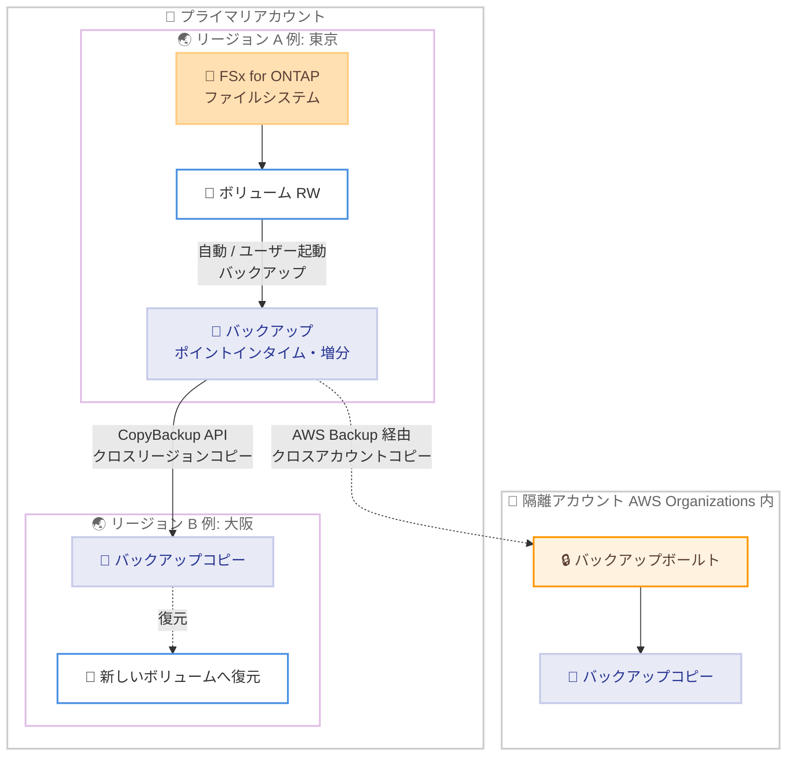

# Amazon FSx for NetApp ONTAP - クロスリージョン・クロスアカウントバックアップコピー

**リリース日**: 2026 年 8 月 27 日
**サービス**: Amazon FSx for NetApp ONTAP
**機能**: AWS リージョン間および AWS アカウント間でのバックアップコピー

📊 [このアップデートのインフォグラフィックを見る](https://takech9203.github.io/aws-news-summary/20260827-fsx-ontap-cross-region-backup-copy.html)

## 概要

Amazon FSx for NetApp ONTAP が、ボリュームバックアップを同一リージョン内および別の AWS リージョンへコピーする機能と、AWS Organizations 内の信頼されたアカウント間でコピーする機能をサポートしました。FSx for NetApp ONTAP は、NetApp の ONTAP ファイルシステムをベースに構築されたフルマネージドの共有ストレージサービスです。

FSx バックアップはボリュームのポイントインタイムのオフラインコピーであり、ファイルシステムが存在するリージョン内の複数のアベイラビリティーゾーンに冗長に保存されます。今回のアップデートにより、バックアップのセカンダリコピーを別のリージョンや別のアカウントに保持できるようになり、事業継続性 (BCP)、データ保護、コンプライアンス要件への対応力が向上します。ディザスタリカバリ戦略の強化や、ランサムウェア対策としてのデータ分離を検討している Solutions Architect、ストレージ管理者にとって重要なアップデートです。

なお、同日に「AWS Backup が Amazon FSx for NetApp ONTAP のクロスリージョン・クロスアカウントバックアップをサポート」という関連発表も行われています。本レポートは FSx 側の発表を中心に解説します。

**アップデート前の課題**

- 以前は、FSx for NetApp ONTAP のバックアップは、ファイルシステムと同じリージョン・同じアカウント内でのみ作成・復元が可能だった
- リージョン全体に影響する障害が発生した場合、別リージョンでバックアップから復旧する手段がなかった
- バックアップを別アカウントに隔離できず、認証情報の漏えいや誤削除・悪意ある削除に対する防御層が限定的だった
- リージョンをまたぐデータ保護には、SnapMirror などの別の仕組みを構成する必要があった

**アップデート後の改善**

- 新規・既存のバックアップを、別の AWS リージョンまたは同一リージョン内にコピーできるようになった
- AWS Organizations 内の信頼されたアカウントへバックアップをコピーし、データを隔離できるようになった
- プライマリリージョンの障害時に、コピー先リージョンでバックアップから復元し、迅速に可用性を回復できるようになった
- レジリエンス、データ分離、運用の柔軟性が向上した

## アーキテクチャ図



プライマリリージョンで取得したボリュームバックアップを、CopyBackup API で別リージョンへコピーし、コピー先リージョンで新しいボリュームとして復元できます。クロスアカウントコピーは AWS Backup と AWS Organizations の連携により実現します。

## サービスアップデートの詳細

### 主要機能

1. **クロスリージョンバックアップコピー**
   - Amazon FSx コンソール、AWS CLI、API を使用して、同一アカウント内でバックアップを別リージョンへコピー可能
   - 同一リージョン内でのコピー (in-Region コピー) にも対応し、ボリュームデータのクローンとしても利用可能
   - コピーは同一 AWS パーティション内に限定 (商用リージョン間、中国リージョン間、AWS GovCloud (US) リージョン間はそれぞれのセット内のみ)
   - ユーザーが作成したバックアップコピーのタイプは `USER_INITIATED` となる

2. **クロスアカウントバックアップコピー**
   - AWS Backup の AWS Organizations サポートを利用して、組織内の信頼されたアカウントへバックアップをコピー可能
   - **ファンイン**: 複数のプライマリアカウントから 1 つの隔離アカウントへ集約
   - **ファンアウト**: 1 つのプライマリアカウントから複数の隔離アカウントへ分散
   - 誤削除・悪意ある削除、認証情報の喪失、AWS KMS キーの侵害に対する追加の防御層を提供

3. **増分コピーによる効率化**
   - 別リージョンへの最初のコピーは常にフルコピー
   - 2 回目以降、同一アカウント・同一コピー先リージョンへのコピーは増分コピーとなり、時間とストレージコストを削減
   - 増分コピーの条件: 過去にコピーしたバックアップがコピー先リージョンに残っており、同じ AWS KMS キーを使用していること

## 技術仕様

### バックアップコピーの仕様

| 項目 | 詳細 |
|------|------|
| コピー方式 | 初回はフルコピー、以降は増分コピー (条件を満たす場合) |
| コピー範囲 | 同一パーティション内のリージョン間、同一リージョン内 |
| クロスアカウント | AWS Backup + AWS Organizations 経由 |
| 同時コピー数 (ボリューム単位) | 1 ボリュームから単一のコピー先リージョン・KMS キーに対して最大 5 件 |
| 同時コピー数 (アカウント単位) | アカウントあたり最大 1,000 件の進行中コピーリクエスト |
| ソースバックアップの条件 | ステータスが `AVAILABLE` であること |
| 非対応 | FlexGroup ボリュームのバックアップコピー、中国リージョンでのクロスアカウントコピー |

### API 変更

今回のアップデートに伴う新規 API の追加はありません。他の FSx ファイルシステムタイプで提供されていた既存の `CopyBackup` API が、FSx for NetApp ONTAP のバックアップに対応しました。

### IAM 権限

バックアップコピーを実行するには、リクエスト元 (IAM ロールまたは IAM ユーザー) がソースバックアップとソースリージョンへのアクセス権を持ち、`fsx:CopyBackup` アクションが許可されている必要があります。

```json
{
    "Version": "2012-10-17",
    "Statement": [
        {
            "Effect": "Allow",
            "Action": "fsx:CopyBackup",
            "Resource": "arn:aws:fsx:*:111122223333:backup/*"
        }
    ]
}
```

## 設定方法

### 前提条件

1. FSx for NetApp ONTAP ファイルシステムのボリュームバックアップ (自動またはユーザー起動) が存在し、ステータスが `AVAILABLE` であること
2. `fsx:CopyBackup` アクションを許可する IAM ポリシーが設定されていること
3. クロスアカウントコピーの場合、AWS Organizations と AWS Backup のクロスアカウント管理が設定されていること

### 手順

#### ステップ1: ソースバックアップの確認

```bash
aws fsx describe-backups \
  --region ap-northeast-1 \
  --filters "Name=file-system-id,Values=fs-0123456789abcdef0"
```

ソースリージョン (例: 東京) で対象ファイルシステムのバックアップ一覧を取得し、コピーするバックアップ ID とステータスが `AVAILABLE` であることを確認します。

#### ステップ2: バックアップをコピー先リージョンへコピー

```bash
aws fsx copy-backup \
  --region ap-northeast-3 \
  --source-backup-id backup-0123456789abcdef0 \
  --source-region ap-northeast-1 \
  --tags Key=Purpose,Value=DR
```

コピー先リージョン (例: 大阪) で `copy-backup` を実行します。`--source-region` にソースリージョン、`--source-backup-id` にコピー元のバックアップ ID を指定します。コピー先で使用する KMS キーを変更する場合は `--kms-key-id` を指定します。

#### ステップ3: コピーの進行状況を確認

```bash
aws fsx describe-backups \
  --region ap-northeast-3 \
  --backup-ids backup-abcdef01234567890
```

コピー先リージョンで新しいバックアップのステータスを確認します。`COPYING` から `AVAILABLE` に変わればコピー完了です。コピー完了後は、コピー先リージョンの既存の FSx for ONTAP ファイルシステム上に新しいボリュームとして復元できます。

## メリット

### ビジネス面

- **事業継続性の強化**: リージョン規模の障害が発生しても、別リージョンのバックアップコピーから復元して業務を継続できる
- **コンプライアンス対応**: バックアップの地理的分散や隔離アカウントへの保管など、規制要件への対応が容易になる
- **ランサムウェア対策**: 隔離アカウントへのコピーにより、認証情報の侵害や悪意ある削除からバックアップを保護できる

### 技術面

- **増分コピーによる効率化**: 初回以降は変更データのみをコピーするため、コピー時間とストレージコストを最小化できる
- **既存バックアップにも適用可能**: 新規バックアップだけでなく、既存のバックアップもコピーできる
- **マネージドな運用**: SnapMirror などの追加構成なしに、コンソール・CLI・API からバックアップのリージョン間コピーを実行できる

## デメリット・制約事項

### 制限事項

- クロスリージョンコピーは同一 AWS パーティション内に限定される (商用リージョンと中国リージョン、GovCloud (US) の間ではコピー不可)
- FlexGroup ボリュームのバックアップコピーはサポートされない
- 1 ボリュームから単一のコピー先リージョン・KMS キーへの進行中コピーは最大 5 件、アカウントあたりの進行中コピーリクエストは最大 1,000 件
- コピー中のソースバックアップは削除できない (コピー完了後も削除可能になるまで短い遅延が発生する場合がある)
- 中国 (北京・寧夏) リージョンではクロスアカウントコピーはサポートされない

### 考慮すべき点

- 別リージョンへの初回コピーは常にフルコピーとなるため、大容量ボリュームでは完了までの時間とデータ転送コストを見込む必要がある
- 増分コピーを維持するには、コピー先リージョンの過去のバックアップコピーを削除しないこと、および同一の KMS キーを使い続けることが条件となる
- バックアップの復元は、バックアップが保存されているリージョン内のファイルシステムに対してのみ可能 (別リージョンへ直接復元はできないため、事前にコピーしておく必要がある)
- クロスアカウントコピーは AWS Backup 経由で実行するため、AWS Backup 側の設定と組織ポリシーの整備が必要

## ユースケース

### ユースケース1: クロスリージョンディザスタリカバリ

**シナリオ**: 東京リージョンで稼働する FSx for ONTAP 上の業務ファイル共有について、リージョン障害に備えたバックアップベースの DR を構築したい。

**実装例**:
```bash
# 大阪リージョンへ日次バックアップを定期コピー
aws fsx copy-backup \
  --region ap-northeast-3 \
  --source-backup-id backup-0123456789abcdef0 \
  --source-region ap-northeast-1
```

**効果**: 東京リージョンの障害時に、大阪リージョンのバックアップコピーからボリュームを復元し、迅速にサービスを再開できる。SnapMirror によるレプリケーション構成に比べ、待機系ファイルシステムを常時稼働させる必要がなく、低コストで RPO 要件の緩い DR を実現できる。

### ユースケース2: 隔離アカウントへのバックアップ保管 (ランサムウェア対策)

**シナリオ**: 金融機関のセキュリティ要件として、本番アカウントの侵害時にもバックアップが保護されるよう、バックアップを別アカウントへ隔離したい。

**実装例**:
```
1. AWS Organizations でバックアップ専用の隔離アカウントを用意
2. AWS Backup のクロスアカウント管理を有効化
3. バックアッププランのコピーアクションで、隔離アカウントの
   バックアップボールトをコピー先に指定 (ファンイン構成)
```

**効果**: 本番アカウントの認証情報漏えいや KMS キー侵害が発生しても、隔離アカウント側のバックアップコピーは影響を受けず、確実に復旧ポイントを確保できる。

### ユースケース3: 別リージョンへのデータクローン

**シナリオ**: 本番データのコピーを使用して、別リージョンで開発・テスト環境を構築したい。

**実装例**:
```bash
# バックアップを開発環境のリージョンへコピーし、新しいボリュームへ復元
aws fsx copy-backup --region us-west-2 \
  --source-backup-id backup-0123456789abcdef0 \
  --source-region us-east-1

aws fsx create-volume-from-backup \
  --region us-west-2 \
  --backup-id backup-abcdef01234567890 \
  --name devVolume \
  --ontap-configuration StorageVirtualMachineId=svm-0123456789abcdef0
```

**効果**: 本番環境に影響を与えることなく、ポイントインタイムの本番データを別リージョンの開発・テスト環境に展開できる。

## 料金

追加機能としての料金は発表されていません。バックアップコピーには、コピー先リージョンでのバックアップストレージ料金 (GB-月単位) と、リージョン間のデータ転送料金が適用されます。増分コピーにより、2 回目以降のコピーでは変更データ分のみが転送・保存されるため、コストを抑えられます。詳細は [Amazon FSx for NetApp ONTAP の料金ページ](https://aws.amazon.com/fsx/netapp-ontap/pricing/) を参照してください。

## 利用可能リージョン

Amazon FSx for NetApp ONTAP が提供されているすべての AWS リージョンで、新規・既存のバックアップのコピーが可能です。最新のリージョン情報は [AWS リージョン別サービス一覧](https://aws.amazon.com/about-aws/global-infrastructure/regional-product-services/) を参照してください。

## 関連サービス・機能

- **AWS Backup**: クロスアカウントコピーおよびポリシーベースのバックアップ管理を提供。同日に [AWS Backup 側でも FSx for NetApp ONTAP のクロスリージョン・クロスアカウントバックアップ対応が発表](https://aws.amazon.com/about-aws/whats-new/2026/08/aws-backup-amazon-fsx-netapp-cross-account-region/) されている
- **AWS Organizations**: クロスアカウントコピーのアカウント境界を定義するポリシー管理を提供
- **AWS KMS**: バックアップおよびバックアップコピーの暗号化に使用。増分コピーの維持には同一キーの継続使用が必要
- **NetApp SnapMirror**: FSx for ONTAP のボリュームレプリケーション機能。より短い RPO/RTO が必要な場合の代替手段

## 参考リンク

- 📊 [インフォグラフィック](https://takech9203.github.io/aws-news-summary/20260827-fsx-ontap-cross-region-backup-copy.html)
- [公式発表 (What's New)](https://aws.amazon.com/about-aws/whats-new/2026/08/fsx-ontap-cross-region-backup-copy/)
- [関連発表: AWS Backup adds cross-Region and cross-account backup support for Amazon FSx for NetApp ONTAP](https://aws.amazon.com/about-aws/whats-new/2026/08/aws-backup-amazon-fsx-netapp-cross-account-region/)
- [ドキュメント: Copying backups (FSx for ONTAP User Guide)](https://docs.aws.amazon.com/fsx/latest/ONTAPGuide/copy-backups.html)
- [ドキュメント: Protecting your data with volume backups](https://docs.aws.amazon.com/fsx/latest/ONTAPGuide/using-backups.html)
- [料金ページ](https://aws.amazon.com/fsx/netapp-ontap/pricing/)

## まとめ

FSx for NetApp ONTAP のバックアップを別リージョン・別アカウントへコピーできるようになったことで、これまで同一リージョン・同一アカウントに限定されていたバックアップ保護の範囲が大きく広がりました。リージョン障害への備えやランサムウェア対策としてのバックアップ隔離を、SnapMirror などの追加構成なしにマネージドに実現できます。FSx for ONTAP を利用中の場合は、DR 要件とコンプライアンス要件を確認のうえ、クロスリージョンコピーの定期実行や AWS Backup による隔離アカウントへのコピー導入を検討することを推奨します。
