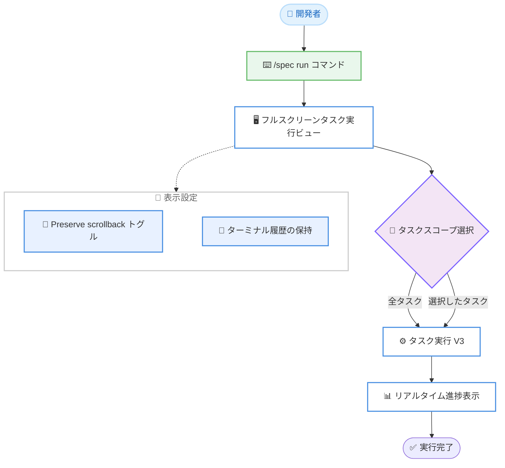

# Kiro - Kiro CLI 2.20.0 フルスクリーン Spec タスク実行と Preserve scrollback

**リリース日**: 2026 年 8 月 27 日
**サービス**: Kiro (Kiro CLI)
**機能**: Full-Screen Spec Task Execution and Preserve Scrollback (バージョン 2.20.0)

📊 [このアップデートのインフォグラフィックを見る](https://takech9203.github.io/aws-news-summary/20260827-kiro-changelog-2026-08-27-cli.html)

## 概要

Kiro CLI 2.20.0 がリリースされました。本リリースの目玉は、V3 の Spec 実行に専用のフルスクリーンタスク実行ビューが追加されたことです。`/spec run` コマンドで Spec を実行すると、専用のフルスクリーンビューが開き、タスクの進捗をリアルタイムで確認できるほか、実行開始前に対象とするタスクのスコープを選択できます。Spec 駆動開発のタスク実行体験が大きく向上するアップデートです。

また、Improvements として「Preserve scrollback」トグルが `/settings display` に追加されました。ターミナル出力のオーバーフローやウィンドウリサイズに伴う再描画が発生しても、ターミナルのスクロールバック履歴 (過去の出力) が保持されるようになります。TUI アプリケーションでありがちな「画面の再描画で過去のログが消えてしまう」問題への対処です。

このほか、再開したチャットでのターン復元の完全化や MCP OAuth サインインの信頼性向上など多数の修正が含まれています。また、インストール済みの Powers を一覧表示する `/powers` コマンドの追加などを含むパッチ 2.20.1 も公開されています。なお、同日付の Kiro IDE 1.0.395 のアップデートについては別レポートで扱っており、本レポートは CLI 2.20.0 リリースに焦点を当てています。

**アップデート前の課題**

- 以前は Spec のタスク実行が通常のチャット画面内で行われ、複数タスクの進捗を俯瞰しながら追跡する専用のビューがなかった
- 実行前にタスクのスコープを対話的に選択する手段が限られており、実行範囲のコントロールがしにくかった
- ターミナル出力のオーバーフローやリサイズによる再描画で、スクロールバック上の過去の出力が失われることがあった
- 再開したチャットで、中断されたツールやツール出力を含むターンが完全に復元されないことがあった
- MCP の OAuth サインインが再接続後に継続されない、レジストリから追加した MCP サーバーの認証情報が保持されないなどの問題があった

**アップデート後の改善**

- `/spec run` で専用のフルスクリーンタスク実行ビューが開き、リアルタイムで進捗を確認できるようになった
- 実行開始前にタスクスコープを選択できるようになり、実行範囲を柔軟にコントロールできるようになった
- `/settings display` の Preserve scrollback トグルにより、オーバーフローやリサイズ再描画後もターミナル履歴が参照できるようになった
- 再開したチャットで、中断されたツールやツール出力を含む完全なターンが復元されるようになった
- 過大なリクエストは自動的な会話のコンパクションとリトライで処理され、単一メッセージが収まらない場合はエラーメッセージで制限が明確に説明されるようになった

## アーキテクチャ図



`/spec run` から始まるフルスクリーンタスク実行のフローと、表示設定に追加された Preserve scrollback トグルの関係を示しています。

## サービスアップデートの詳細

### 主要機能

1. **フルスクリーン Spec タスク実行 (V3)**
   - `/spec run` で Spec を実行すると、専用のフルスクリーンタスク実行ビューが開く
   - タスクの進捗をリアルタイムで追跡できる
   - 実行開始前にタスクスコープ (実行対象のタスク範囲) を選択できる

2. **Preserve scrollback トグル (Improvements)**
   - `/settings display` に新しいトグルとして追加
   - ターミナル出力のオーバーフロー時やリサイズによる再描画時にも、ターミナル履歴 (スクロールバック) を保持する
   - 過去の出力をさかのぼって確認したいケースで有効

3. **修正 (Fixes)**
   - 再開したチャットで、中断されたツールとツール出力を含む完全なターンが復元されるようになった
   - 過大なリクエストは自動的な会話コンパクションとリトライがトリガーされ、単一メッセージが収まらない場合はエラーで制限がより明確に説明されるようになった
   - V3 で大きなシェル出力を完全に保存しても、チャット再開時のパフォーマンスが低下しなくなった
   - V3 の Web 検索、取得したページ、プロセス出力が、再開したチャットで正しくリプレイされるようになった
   - V3 のサインインエラーが、汎用メッセージではなく根本原因を表示するようになった
   - V3 の Hook ステータスが、チャットの開始時・再開時に正しく表示されるようになった
   - V3 の MCP OAuth サインインが、再接続後も確実に継続されるようになった
   - V3 でレジストリから追加した MCP サーバーが、設定済みの認証情報を保持するようになった
   - V3 の MCP ツール結果が、再開したチャットで正しくリプレイされるようになった

4. **パッチ 2.20.1 (2026 年 8 月 27 日公開)**
   - 新しい `/powers` コマンドで、インストール済みの Powers を一覧表示できるようになった (V3)
   - 冗長な認証・プロファイル呼び出しの削除により、チャットの起動が高速化された
   - `app.disableAutoupdates` が Windows でのアップデートダウンロードも抑止し、一時ディレクトリにインストーラーが蓄積しなくなった
   - エージェントモニターの出力ペインでキー長押しによる高速スクロールが停止・スキップしなくなった
   - 長時間セッション中にバックグラウンドで CLI が自己アップグレードした後も、認証が失敗しなくなった
   - ツールと Hook の表示が、切り詰め・失敗・サブエージェントのライブ出力を正確に報告するようになった
   - V3 の `/chat load` と `/chat save` が `~` で始まるパスを受け付けるようになった
   - V3 がリモートの `$$schema` 参照を含む JSON ファイルを書き込めるようになった
   - V3 がリクエスト中に期限切れとなる認証情報を更新し、ターンを終了させなくなった
   - V3 が停止したモデルレスポンスからハングせずに自動回復するようになった
   - V3 が停止したサブエージェントをタイムアウトさせ、親のターンをブロックしなくなった
   - `chat.historyMode` が `kiro-cli settings` で無効として拒否されず受け付けられるようになった

## 技術仕様

### リリース情報

| 項目 | 詳細 |
|------|------|
| 対象製品 | Kiro CLI |
| バージョン | 2.20.0 (パッチ 2.20.1 は 2026 年 8 月 27 日公開) |
| 主要機能 | フルスクリーン Spec タスク実行ビュー (V3)、Preserve scrollback トグル |
| 関連コマンド | `/spec run`、`/settings display`、`/powers` (2.20.1) |
| 関連設定 | `app.disableAutoupdates`、`chat.historyMode` |

## 設定方法

### 前提条件

1. Kiro CLI がインストールされていること
2. Kiro CLI をバージョン 2.20.0 以降 (推奨: 2.20.1) にアップデートしていること
3. フルスクリーンタスク実行を利用する場合、V3 で Spec が作成されていること

### 手順

#### ステップ 1: Kiro CLI のアップデート確認

```bash
kiro-cli --version
```

現在の Kiro CLI のバージョンを確認します。2.20.0 未満の場合は、自動アップデートまたは公式ドキュメントの手順で最新版にアップデートします。

#### ステップ 2: フルスクリーンタスク実行ビューで Spec を実行

```bash
# Kiro CLI のチャット内で実行
/spec run
```

Spec の実行を開始します。専用のフルスクリーンタスク実行ビューが開き、実行開始前にタスクスコープを選択したうえで、進捗をリアルタイムで確認できます。

#### ステップ 3: Preserve scrollback の有効化

```bash
# Kiro CLI のチャット内で実行
/settings display
```

表示設定を開き、Preserve scrollback トグルを有効化します。これにより、出力のオーバーフローやターミナルのリサイズによる再描画後も、スクロールバック上のターミナル履歴が保持されます。

## メリット

### ビジネス面

- **開発生産性の向上**: Spec タスクの進捗をリアルタイムで俯瞰でき、長時間のタスク実行でも状況把握が容易になる
- **手戻りの削減**: 実行前にタスクスコープを選択できるため、意図しないタスクの実行を避け、必要な範囲のみを効率的に進められる
- **運用の安定性向上**: ストリーム復旧や認証情報の自動更新などの修正により、長時間のエージェント作業が中断されにくくなる

### 技術面

- **専用ビューによる視認性**: チャットのログに埋もれず、タスク実行専用のフルスクリーンビューで進捗を追跡できる
- **ターミナル履歴の保持**: Preserve scrollback により、再描画後も過去の出力をさかのぼって確認でき、デバッグやレビューがしやすくなる
- **チャット再開の信頼性向上**: 中断されたツール出力、Web 検索結果、MCP ツール結果などが再開したチャットで正しくリプレイされる

## デメリット・制約事項

### 制限事項

- フルスクリーンタスク実行ビューは V3 の Spec 実行が対象
- Preserve scrollback はトグル設定であり、必要に応じて `/settings display` から明示的に有効化する必要がある
- `/powers` コマンドはパッチ 2.20.1 で追加されたため、2.20.0 では利用できない

### 考慮すべき点

- 2.20.1 で複数の修正が入っているため、2.20.0 ではなく最新パッチへのアップデートが推奨される
- 同日に Kiro IDE 1.0.395 のアップデートも公開されており、IDE と CLI の両方を利用している場合はそれぞれのチェンジログの確認が必要 (IDE 側は別レポートを参照)

## ユースケース

### ユースケース 1: 大規模な Spec の段階的な実行

**シナリオ**: 多数のタスクを含む Spec を作成したが、まずは基盤部分のタスクのみを実行して結果を確認したい。

**実装例**:
```
/spec run
# フルスクリーンビューでタスクスコープを選択し、対象タスクのみを実行
```

**効果**: 実行範囲をコントロールしながら段階的に実装を進められ、途中経過をリアルタイムで確認できる。

### ユースケース 2: 長時間実行タスクの進捗モニタリング

**シナリオ**: ビルドやテストを含む時間のかかるタスク群を Spec で実行し、進捗を随時把握したい。

**実装例**:
```
/spec run
# フルスクリーンビューでリアルタイムの進捗表示を確認
```

**効果**: 各タスクの状態が専用ビューに集約され、どこまで完了しているかが一目で分かる。

### ユースケース 3: 再描画後のログ確認

**シナリオ**: エージェントの長い出力やターミナルのリサイズ後に、過去のコマンド出力やエージェントの応答を確認したい。

**実装例**:
```
/settings display
# Preserve scrollback トグルを有効化
```

**効果**: オーバーフローやリサイズ再描画が発生しても、ターミナルのスクロールバックから過去の出力を参照できる。

## 利用可能リージョン

グローバル (Kiro はリージョンに依存しないグローバルサービスとして提供)

## 関連サービス・機能

- **Kiro IDE**: 同日 (2026 年 8 月 27 日) に IDE 1.0.395 のアップデートも公開されている。サードパーティ拡張機能の互換性向上などが含まれる (別レポートで解説)
- **Kiro Specs**: Spec 駆動開発の中核機能。今回のフルスクリーンタスク実行ビューは Spec のタスク実行体験を強化する
- **MCP (Model Context Protocol)**: 今回の修正で MCP OAuth サインインの継続性やレジストリ追加サーバーの認証情報保持が改善されている
- **Kiro Powers**: パッチ 2.20.1 で追加された `/powers` コマンドにより、インストール済みの Powers を一覧表示できる

## 参考リンク

- 📊 [インフォグラフィック](https://takech9203.github.io/aws-news-summary/20260827-kiro-changelog-2026-08-27-cli.html)
- [Kiro Changelog](https://kiro.dev/changelog/)
- [Kiro CLI 2.20 チェンジログ詳細](https://kiro.dev/changelog/cli/2-20/)
- [ドキュメント: Kiro Specs](https://kiro.dev/docs/specs)
- [ドキュメント: Kiro CLI チャット設定](https://kiro.dev/docs/cli/chat/settings/)
- [ドキュメント: Kiro CLI スラッシュコマンド](https://kiro.dev/docs/cli/reference/slash-commands/)

## まとめ

Kiro CLI 2.20.0 は、`/spec run` によるフルスクリーンタスク実行ビューと Preserve scrollback トグルにより、Spec 駆動開発のタスク実行体験とターミナルの使い勝手を大きく改善するリリースです。チャット再開時のターン復元や MCP サインインの信頼性など、日常利用に直結する多数の修正も含まれています。Kiro CLI を利用している場合は、追加の修正を含むパッチ 2.20.1 以降へのアップデートを推奨します。
