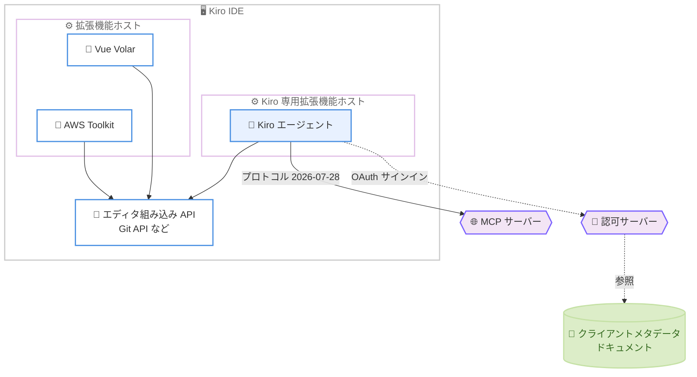

# Kiro - サードパーティ拡張機能の互換性向上と MCP サインインの信頼性向上 (v1.0.395)

**リリース日**: 2026 年 8 月 27 日
**サービス**: Kiro (IDE)
**機能**: Third-Party Extension Compatibility and More Reliable MCP Sign-In

📊 [このアップデートのインフォグラフィックを見る](https://takech9203.github.io/aws-news-summary/20260827-kiro-changelog-2026-08-27-ide.html)

## 概要

Kiro IDE のバージョン 1.0.395 がリリースされた。本バージョンでは、Vue (Volar) や AWS Toolkit などのサードパーティ拡張機能が Kiro と共存して動作できるようになった。Kiro 本体が専用の拡張機能ホスト (Extension Host) で実行されるアーキテクチャに変更されたことで、他の拡張機能は Git API などのエディタ組み込み API へのフルアクセスを維持できる。

また、MCP (Model Context Protocol) の最新プロトコルリビジョン 2026-07-28 のサポートが追加され、MCP サーバーへのサインインと接続の信頼性が大幅に向上した。OAuth 認証やエンタープライズレジストリ経由で認証情報が配布される MCP サーバーへの接続が安定し、応答の遅いサーバーや到達不能なサーバーがセッション起動をブロックしなくなった。さらに、エンタープライズ向けに独自の OAuth クライアント ID を使用した MCP 認証 (Client ID Metadata Documents) にも対応した。

安定性の面では、大きなエージェント応答の処理中に発生していた拡張機能ホストのクラッシュが削減され、一時的なネットワーク断が発生してもエージェントのターンが中断されずに自動的に回復するようになった。

**アップデート前の課題**

このアップデート以前に存在していた課題や制限は以下のとおり。

- Kiro とサードパーティ拡張機能が同一の拡張機能ホストを共有していたため、Vue (Volar) や AWS Toolkit などの拡張機能が Git API などのエディタ組み込み API に正しくアクセスできない場合があった
- MCP サーバーの OAuth サインインや、エンタープライズレジストリ経由の認証情報を使用する接続が失敗することがあった
- 応答の遅い MCP サーバーや到達不能な MCP サーバーが、セッションの起動を遅延させていた
- Dynamic Client Registration (DCR) をサポートしない認可サーバーに対して、MCP の OAuth 認証を構成する手段がなかった
- 大きなエージェント応答の処理中に拡張機能ホストがクラッシュし、セッションが中断され作業中の内容が失われることがあった
- 一時的なネットワーク断が発生すると、エージェントのターンがそこで終了してしまっていた

**アップデート後の改善**

今回のアップデートにより以下が可能になった。

- Kiro が専用の拡張機能ホストで実行されるようになり、サードパーティ拡張機能が Git API などの組み込み API へのフルアクセスを維持したまま Kiro と共存できるようになった
- MCP プロトコルリビジョン 2026-07-28 のサポートが追加され、OAuth やエンタープライズレジストリ経由の認証を使用する MCP サーバーへの接続が安定した
- 応答の遅い MCP サーバーがあってもセッション起動がブロックされなくなった
- `oauth.clientMetadataUrl` 設定により、ホストされたクライアントメタデータドキュメントを参照して DCR なしで MCP の OAuth 認証が可能になった (エンタープライズ向け)
- 大きなエージェント応答の処理中における拡張機能ホストのクラッシュが削減された
- TLS 接続やキープアライブ接続が切断されても自動的に再試行され、エージェントのターンが継続するようになった

## アーキテクチャ図



Kiro は専用の拡張機能ホストで実行され、サードパーティ拡張機能は別の拡張機能ホストから Git API などの組み込み API にフルアクセスできる。MCP サーバーへの接続は最新プロトコルに対応し、OAuth 認証ではホストされたクライアントメタデータドキュメントの参照も可能になった。

## サービスアップデートの詳細

### 主要機能 (Improvements)

1. **サードパーティ拡張機能との共存**
   - Vue (Volar) や AWS Toolkit などのサードパーティ拡張機能が、Git API などのエディタ組み込み API にアクセスできるようになった
   - Kiro が専用の拡張機能ホストで実行されるアーキテクチャに変更された
   - これにより、他の拡張機能は組み込み API へのフルアクセスを維持できる

2. **最新 MCP プロトコルのサポートとサインインの信頼性向上**
   - MCP プロトコルリビジョン 2026-07-28 のサポートを追加
   - 複数の MCP サインインおよび接続の不具合を解消
   - OAuth を使用するサーバーや、エンタープライズレジストリ経由で認証情報が配布されるサーバーへの接続が安定
   - 応答が遅い、または到達不能な MCP サーバーがセッション起動をブロックしなくなった

3. **MCP 向けの独自 OAuth クライアント ID の持ち込み (エンタープライズ)**
   - `oauth.clientMetadataUrl` で MCP サーバーにホストされたクライアントメタデータドキュメントを指定し、Dynamic Client Registration なしで認証可能
   - `oauth.redirectUri` を固定値で併用することで、認可サーバーがコールバックを受け入れられるように構成できる
   - Client ID Metadata Documents (CIMD) と呼ばれる仕組みに対応

### 修正 (Fixes)

1. **拡張機能ホストのクラッシュ削減**
   - 大きなエージェント応答の処理中に発生していた拡張機能ホストのクラッシュを削減
   - セッションの中断や作業中の内容の消失を防止

2. **ネットワーク断からの自動回復**
   - 一時的なネットワーク断が発生しても、エージェントのターンが継続するようになった
   - 切断された TLS 接続やキープアライブ接続を自動的に再試行し、ターンを終了させない

## 技術仕様

### アップデート内容の整理

| 項目 | 詳細 |
|------|------|
| バージョン | 1.0.395 |
| 対象製品 | Kiro IDE |
| 拡張機能ホスト | Kiro 専用ホストで実行、サードパーティ拡張機能は組み込み API へフルアクセス可能 |
| MCP プロトコル | リビジョン 2026-07-28 をサポート |
| OAuth 設定 | `oauth.clientMetadataUrl`、`oauth.redirectUri` を追加 (エンタープライズ向け) |
| ネットワーク回復 | TLS / キープアライブ接続の切断を自動再試行 |

### MCP OAuth クライアント設定 (エンタープライズ)

MCP サーバー設定で、ホストされたクライアントメタデータドキュメントと固定リダイレクト URI を指定する例。

```json
{
  "mcpServers": {
    "my-enterprise-server": {
      "url": "https://mcp.example.com/mcp",
      "oauth": {
        "clientMetadataUrl": "https://example.com/oauth/client-metadata.json",
        "redirectUri": "http://127.0.0.1:3128/oauth/callback"
      }
    }
  }
}
```

`oauth.clientMetadataUrl` は認可サーバーが参照するクライアントメタデータドキュメントの URL を指定し、Dynamic Client Registration を使用せずにクライアント ID を確立する。`oauth.redirectUri` は認可サーバーに事前登録したコールバック URI を固定するために使用する。詳細な設定方法は公式ドキュメントを参照。

## 設定方法

### 前提条件

1. Kiro IDE をインストール済みであること
2. アップデートを適用するには Kiro を再起動するか、最新バージョンをダウンロードすること
3. MCP の OAuth クライアント ID 持ち込みを使用する場合は、認可サーバー側でクライアントメタデータドキュメントとリダイレクト URI の受け入れ設定が必要

### 手順

#### ステップ 1: Kiro を最新バージョンに更新

Kiro IDE のアップデート通知に従って更新するか、kiro.dev から最新版をダウンロードしてインストールする。バージョン 1.0.395 以降で本アップデートの機能が有効になる。

#### ステップ 2: サードパーティ拡張機能の動作確認

Vue (Volar) や AWS Toolkit などの拡張機能をインストールし、Git 連携などの組み込み API を使用する機能が正しく動作することを確認する。追加の設定は不要で、Kiro が専用の拡張機能ホストで実行されるため自動的に共存できる。

#### ステップ 3: MCP サーバー設定の確認 (必要な場合)

MCP 設定ファイルで OAuth を使用するサーバーの接続を確認する。エンタープライズ環境で Dynamic Client Registration を使用できない場合は、`oauth.clientMetadataUrl` と `oauth.redirectUri` を設定して独自のクライアント ID で認証する。

## メリット

### ビジネス面

- **既存ワークフローとの統合**: AWS Toolkit などの業務で使用する拡張機能を Kiro と併用できるため、既存の開発ワークフローを変えずに AI エージェントを導入できる
- **エンタープライズ対応の強化**: DCR を許可しない厳格な認可サーバー運用の企業でも、独自のクライアント ID で MCP の OAuth 認証を構成できる
- **生産性の維持**: セッションクラッシュや作業内容の消失、ネットワーク断によるターンの中断が減り、開発者の作業が中断されにくくなった

### 技術面

- **拡張機能ホストの分離**: Kiro が専用ホストで実行されるため、サードパーティ拡張機能が Git API などの組み込み API へのフルアクセスを維持できる
- **最新 MCP プロトコル対応**: リビジョン 2026-07-28 に対応し、最新の MCP サーバー実装と互換性を確保できる
- **接続の堅牢性**: 遅延やダウン中の MCP サーバーがセッション起動をブロックせず、TLS / キープアライブ接続の切断も自動再試行される

## デメリット・制約事項

### 制限事項

- OAuth クライアント ID の持ち込み (`oauth.clientMetadataUrl` / `oauth.redirectUri`) はエンタープライズ向けの機能として位置付けられている
- `oauth.clientMetadataUrl` を使用する場合、認可サーバーがクライアントメタデータドキュメント (CIMD) をサポートしている必要がある

### 考慮すべき点

- 拡張機能ホストのアーキテクチャ変更後も、使用中の拡張機能が期待どおり動作するか更新後に確認することを推奨
- MCP プロトコルリビジョンはサーバー側の実装にも依存するため、接続先サーバーの対応状況を確認すること

## ユースケース

### ユースケース 1: Vue プロジェクトでの Kiro 活用

**シナリオ**: Vue で開発するフロントエンドチームが、Volar による言語サポートを使用しながら Kiro のエージェント機能でコード生成やリファクタリングを行いたい。

**実装例**:
```text
1. Kiro IDE を 1.0.395 以降に更新
2. Vue (Volar) 拡張機能をインストール
3. Volar のシンタックスハイライトや型チェックを利用しつつ、Kiro エージェントで開発
```

**効果**: Volar が Git API などの組み込み API にフルアクセスできるため、言語サポートとソース管理連携を損なわずに AI エージェントを活用できる。

### ユースケース 2: エンタープライズ環境での MCP OAuth 認証

**シナリオ**: 社内の認可サーバーが Dynamic Client Registration を許可しておらず、事前登録済みのクライアント ID でのみ MCP サーバーへの認証を許可している。

**実装例**:
```json
{
  "mcpServers": {
    "internal-tools": {
      "url": "https://mcp.internal.example.com/mcp",
      "oauth": {
        "clientMetadataUrl": "https://idp.example.com/clients/kiro-metadata.json",
        "redirectUri": "http://127.0.0.1:3128/oauth/callback"
      }
    }
  }
}
```

**効果**: DCR を使用せずに社内のセキュリティポリシーに準拠した形で MCP サーバーへの OAuth 認証を構成でき、エンタープライズレジストリ経由の認証情報でも安定して接続できる。

### ユースケース 3: 不安定なネットワーク環境での開発

**シナリオ**: モバイル回線や共有 Wi-Fi など、一時的な切断が発生しやすい環境で長時間のエージェントタスクを実行する。

**実装例**:
```text
1. Kiro エージェントに大規模なリファクタリングタスクを依頼
2. ネットワークが一時的に切断されても、TLS / キープアライブ接続が自動再試行される
3. エージェントのターンは中断されず、タスクが継続される
```

**効果**: ネットワーク断のたびにタスクを再実行する必要がなくなり、長時間のエージェントタスクを安心して任せられる。

## 利用可能リージョン

グローバル (Kiro はグローバルに提供されるサービスであり、特定のリージョンに依存しない)

## 関連サービス・機能

- **MCP (Model Context Protocol)**: Kiro が外部ツールやデータソースと連携するためのプロトコル。本アップデートで最新リビジョン 2026-07-28 に対応した
- **AWS Toolkit**: AWS リソースを IDE から操作するための拡張機能。本アップデートにより Kiro と共存して組み込み API を利用できる
- **Kiro CLI**: Kiro のコマンドラインインターフェース。IDE とは別に独自のチェンジログでアップデートが提供されている

## 参考リンク

- 📊 [インフォグラフィック](https://takech9203.github.io/aws-news-summary/20260827-kiro-changelog-2026-08-27-ide.html)
- [Kiro Changelog (v1.0.395)](https://kiro.dev/changelog/ide/1-0-395)
- [Kiro Changelog 一覧](https://kiro.dev/changelog/)
- [Kiro MCP ドキュメント](https://kiro.dev/docs/mcp)
- [Kiro MCP 設定 - Client ID Metadata Documents](https://kiro.dev/docs/mcp/configuration#client-id-metadata-documents-cimd)

## まとめ

Kiro IDE 1.0.395 は、サードパーティ拡張機能との共存、最新 MCP プロトコル対応とサインインの信頼性向上、クラッシュ削減とネットワーク断からの自動回復という、日々の開発体験に直結する改善をまとめたアップデートである。Vue や AWS Toolkit などの拡張機能を併用しているユーザーや、エンタープライズ環境で MCP の OAuth 認証に課題があったチームは、早めのアップデート適用を推奨する。
