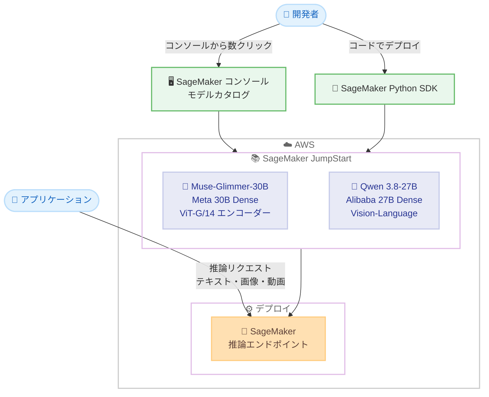

# Amazon SageMaker JumpStart - Muse-Glimmer-30B および Qwen 3.8-27B モデルの提供開始

**リリース日**: 2026 年 8 月 27 日
**サービス**: Amazon SageMaker JumpStart
**機能**: Muse-Glimmer-30B (Meta) および Qwen 3.8-27B (Alibaba) 基盤モデルの追加

📊 [このアップデートのインフォグラフィックを見る](https://takech9203.github.io/aws-news-summary/20260827-muse-glimmer-30b-qwen-3.8-27b-on-sagemaker-jumpstart.html)

## 概要

Amazon SageMaker JumpStart で、Meta の **Muse-Glimmer-30B** と Alibaba の **Qwen 3.8-27B** の 2 つの基盤モデルが利用可能になりました。両モデルは、自律的なエージェント型ワークフローとマルチモーダルな長期推論 (long-horizon reasoning) をカバーする最新のオープンウェイトモデルです。

Muse-Glimmer-30B は Meta Superintelligence Lab が開発した 30B パラメータの Dense モデルで、約 1.8B パラメータの ViT-G/14 知覚エンコーダーを組み合わせた構成を持ち、マルチステップ推論、ツール使用、失敗からの回復を伴う自律的なエージェントタスク向けに設計されています。Qwen 3.8-27B は 27B パラメータのネイティブな Vision-Language Dense モデルで、コーディング、マルチステップのエージェントタスク、テキスト・画像・動画にわたるマルチモーダル理解に強みを持ちます。

SageMaker JumpStart のモデルカタログまたは SageMaker Python SDK を使用して、数クリックでこれらのモデルをデプロイできます。機械学習インフラの構築や管理を意識することなく、最新のオープンモデルを迅速に評価・活用したい開発者やデータサイエンティストが対象です。

**アップデート前の課題**

このアップデート以前に存在していた課題や制限は以下のとおりです。

- Muse-Glimmer-30B や Qwen 3.8-27B などの最新オープンウェイトモデルを AWS 上で利用するには、モデルアーティファクトの取得、推論コンテナの準備、エンドポイント構成などを自前で行う必要があった
- エージェントタスクとマルチモーダル理解の両方に対応するモデルを、統一された手順で検証する仕組みがなかった
- モデルのデプロイやスケーリングに機械学習インフラの専門知識が必要だった

**アップデート後の改善**

今回のアップデートにより可能になったことは以下のとおりです。

- SageMaker JumpStart のモデルカタログから数クリックで両モデルをデプロイできるようになった
- SageMaker Python SDK を使用したプログラマティックなデプロイが可能になった
- マネージドな SageMaker エンドポイント上で、エージェントワークロードとマルチモーダルワークロードをすぐに検証できるようになった

## アーキテクチャ図



SageMaker JumpStart のモデルカタログまたは Python SDK から 2 つのモデルを選択し、マネージドな推論エンドポイントとしてデプロイする流れを示しています。

## サービスアップデートの詳細

### 主要機能

1. **Muse-Glimmer-30B (Meta) の提供**
   - Meta Superintelligence Lab による 30B パラメータの Dense モデル
   - 約 1.8B パラメータの専用 ViT-G/14 知覚エンコーダーを搭載し、テキストと画像を交互に混在させた入力 (interleaved input) に対応
   - マルチステップ推論、ツール使用、失敗からの回復を伴う自律的なエージェントタスク向けに設計
   - 131K トークン超のコンテキストウィンドウをサポート
   - 推論強度 (reasoning strength) を low から extra-high まで選択可能
   - Apache 2.0 ライセンスで提供され、公式発表によればクラウドインフラなしでも動作可能なため、常時稼働のエンタープライズエージェントにも適する

2. **Qwen 3.8-27B (Alibaba) の提供**
   - 27B パラメータのネイティブな Vision-Language Dense モデル
   - コーディング、マルチステップのエージェントタスク、テキスト・画像・動画にわたるマルチモーダル理解に強み
   - 262K トークンのコンテキストウィンドウを持ち、YaRN スケーリングにより約 1M トークンまで拡張可能
   - SWE-bench Pro で 61.7 のスコアを記録
   - 量子化時に約 17GB のフットプリントで動作
   - 推論エフォート (reasoning effort) のレベルを調整可能

3. **簡単なデプロイ**
   - SageMaker コンソールの JumpStart モデルカタログから数クリックでデプロイ可能
   - SageMaker Python SDK によるプログラマティックなデプロイに対応

## 技術仕様

### モデル比較

| 項目 | Muse-Glimmer-30B | Qwen 3.8-27B |
|------|------------------|--------------|
| 提供元 | Meta (Meta Superintelligence Lab) | Alibaba |
| アーキテクチャ | 30B Dense + 約 1.8B ViT-G/14 知覚エンコーダー | 27B Dense (ネイティブ Vision-Language) |
| モダリティ | テキスト、画像 (interleaved 入力) | テキスト、画像、動画 |
| コンテキストウィンドウ | 131K トークン超 | 262K トークン (YaRN で約 1M まで拡張可能) |
| 推論制御 | 推論強度を low から extra-high まで選択可能 | 推論エフォートのレベルを調整可能 |
| 主な用途 | 自律エージェント、ツール使用、失敗回復 | コーディング、エージェントタスク、マルチモーダル理解 |
| その他 | Apache 2.0 ライセンス | SWE-bench Pro 61.7、量子化時約 17GB |

### デプロイ方法

| 方法 | 詳細 |
|------|------|
| SageMaker コンソール | JumpStart モデルカタログからモデルを選択し、数クリックでデプロイ |
| SageMaker Python SDK | `JumpStartModel` クラスなどを使用したプログラマティックなデプロイ |

## 設定方法

### 前提条件

1. AWS アカウントを保有していること
2. Amazon SageMaker AI (SageMaker Studio または SageMaker Python SDK) を利用できる IAM 権限があること
3. デプロイ先リージョンで対象モデルに必要な推論インスタンスのサービスクォータが確保されていること

### 手順

#### ステップ 1: SageMaker JumpStart でモデルを検索

SageMaker コンソールから SageMaker Studio を開き、JumpStart のモデルカタログで「Muse-Glimmer-30B」または「Qwen 3.8-27B」を検索します。モデルカードでは、モデルの概要、ライセンス、推奨インスタンスタイプを確認できます。

#### ステップ 2: モデルをデプロイ

モデルカードの [Deploy] を選択し、エンドポイント名とインスタンスタイプを指定してデプロイします。SageMaker Python SDK を使用する場合の例は以下のとおりです。

```python
from sagemaker.jumpstart.model import JumpStartModel

# JumpStart のモデル ID を指定してモデルを作成
# 実際のモデル ID は JumpStart モデルカタログで確認してください
model = JumpStartModel(model_id="<model-id>")

# マネージドエンドポイントとしてデプロイ
predictor = model.deploy()
```

このコードは、JumpStart カタログ上のモデルを SageMaker のリアルタイム推論エンドポイントとしてデプロイします。

#### ステップ 3: 推論リクエストを送信

```python
# テキストプロンプトを送信して推論結果を取得
response = predictor.predict({
    "inputs": "AWS のサーバーレスアーキテクチャの利点を説明してください。"
})
print(response)
```

デプロイしたエンドポイントに対して推論リクエストを送信し、モデルの応答を取得します。マルチモーダル入力 (画像や動画) を扱う場合は、各モデルの入力フォーマットに従ってペイロードを構成します。

## メリット

### ビジネス面

- **迅速な検証と市場投入**: インフラ構築なしで最新のオープンウェイトモデルを数クリックで試せるため、PoC から本番までのリードタイムを短縮できる
- **モデル選択肢の拡大**: エージェント特化型の Muse-Glimmer-30B とマルチモーダル対応の Qwen 3.8-27B という異なる強みを持つモデルを、同じワークフローで比較検討できる
- **ライセンスの柔軟性**: Muse-Glimmer-30B は Apache 2.0 ライセンスで提供され、商用利用しやすい

### 技術面

- **エージェントワークロードへの対応**: マルチステップ推論、ツール使用、失敗からの回復といったエージェント構築に必要な能力を持つモデルをマネージド環境で利用できる
- **長大なコンテキスト**: 131K トークン超 (Muse-Glimmer-30B)、262K トークン (Qwen 3.8-27B、YaRN で約 1M まで拡張可能) の長いコンテキストにより、大規模なコードベースや長いドキュメントを扱える
- **推論コストの調整**: 両モデルとも推論強度・推論エフォートを調整でき、タスクの複雑さに応じてレイテンシーと品質のバランスを最適化できる

## デメリット・制約事項

### 制限事項

- 公式発表では利用可能リージョンが明記されていないため、利用前に JumpStart モデルカタログで対象リージョンを確認する必要がある
- 30B / 27B クラスの Dense モデルであるため、リアルタイム推論には GPU インスタンスが必要であり、相応のインフラコストが発生する
- Qwen 3.8-27B の約 1M トークンへのコンテキスト拡張には YaRN スケーリングの設定が必要となる

### 考慮すべき点

- ベンチマークスコア (SWE-bench Pro 61.7 など) は特定条件下の値であり、実際のワークロードでの性能は自社データで評価する必要がある
- 各モデルのライセンス条件 (特に Qwen 3.8-27B) を利用前に確認し、自社の利用形態に適合するか検証することが推奨される
- エンドポイントは稼働時間に応じて課金されるため、検証用途では使用後の削除や自動スケーリング設定を検討する

## ユースケース

### ユースケース 1: 自律型エージェントによる業務ワークフロー自動化

**シナリオ**: 社内システムの API をツールとして呼び出しながら、複数ステップの業務タスク (情報収集、判断、実行、エラー時のリトライ) を自律的に処理するエージェントを構築したい。

**実装例**:
```
1. JumpStart から Muse-Glimmer-30B をデプロイ
2. エージェントフレームワークからエンドポイントを呼び出し
3. ツール定義 (社内 API、検索、データベース) を渡してマルチステップ実行
4. 失敗回復能力を活用してリトライロジックを簡素化
```

**効果**: マルチステップ推論とツール使用、失敗からの回復に対応したモデルにより、堅牢な自律エージェントを短期間で構築できる。

### ユースケース 2: 大規模コードベースに対するコーディング支援

**シナリオ**: 大規模なリポジトリ全体をコンテキストに含めて、バグ修正や機能追加のコード変更案を生成させたい。

**実装例**:
```
1. JumpStart から Qwen 3.8-27B をデプロイ
2. リポジトリの関連ファイルをコンテキスト (262K トークン、必要に応じて YaRN で拡張) に投入
3. 課題チケットの内容をプロンプトとして修正パッチを生成
4. CI パイプラインでテストを実行して検証
```

**効果**: SWE-bench Pro 61.7 のコーディング性能と長大なコンテキストにより、実務レベルのコード変更タスクを支援できる。

### ユースケース 3: 画像・動画を含むマルチモーダルコンテンツ分析

**シナリオ**: 製品画像やマニュアル動画を含むコンテンツを解析し、テキストレポートや検索用メタデータを自動生成したい。

**実装例**:
```
1. JumpStart から Qwen 3.8-27B をデプロイ
2. S3 上の画像・動画を取得してエンドポイントに送信
3. 内容の要約、タグ付け、品質チェック結果を JSON で出力
4. 出力を検索インデックスやデータカタログに登録
```

**効果**: テキスト・画像・動画を横断するネイティブなマルチモーダル理解により、個別のモデルを組み合わせることなく単一エンドポイントでコンテンツ分析パイプラインを構築できる。

## 料金

公式発表にはモデル固有の料金は記載されていません。SageMaker JumpStart のモデル利用では、デプロイしたエンドポイントのインスタンスタイプと稼働時間に基づく Amazon SageMaker AI の標準料金が適用されます。両モデルはオープンウェイトモデルであるため、モデル自体の追加ライセンス料金は発生せず、推論に使用するインフラの料金が主なコストとなります。

最新の料金は [Amazon SageMaker AI の料金ページ](https://aws.amazon.com/sagemaker-ai/pricing/) を参照してください。

## 利用可能リージョン

公式発表では利用可能リージョンが明記されていません。SageMaker JumpStart のモデルカタログ上で、対象リージョンでの各モデルの提供状況を確認してください。

## 関連サービス・機能

- **Amazon SageMaker AI**: JumpStart でデプロイしたモデルのホスティング、スケーリング、モニタリングを担うマネージド機械学習サービス
- **Amazon Bedrock**: サーバーレスな基盤モデル利用サービス。インフラ管理を避けたい場合の代替選択肢として比較検討できる
- **Amazon SageMaker Python SDK**: JumpStart モデルのプログラマティックなデプロイと推論に使用する SDK

## 参考リンク

- 📊 [インフォグラフィック](https://takech9203.github.io/aws-news-summary/20260827-muse-glimmer-30b-qwen-3.8-27b-on-sagemaker-jumpstart.html)
- [公式発表 (What's New)](https://aws.amazon.com/about-aws/whats-new/2026/01/muse-glimmer-30b-qwen-3.8-27b-on-sagemaker-jumpstart/)
- [Amazon SageMaker JumpStart ドキュメント](https://docs.aws.amazon.com/sagemaker/latest/dg/studio-jumpstart.html)
- [Amazon SageMaker AI 料金ページ](https://aws.amazon.com/sagemaker-ai/pricing/)

## まとめ

エージェント特化型の Muse-Glimmer-30B とマルチモーダル対応の Qwen 3.8-27B が SageMaker JumpStart に追加され、最新のオープンウェイトモデルをマネージド環境で数クリックから利用できるようになりました。自律エージェントやマルチモーダル分析の導入を検討している場合は、JumpStart モデルカタログで両モデルをデプロイし、自社ワークロードでの性能とコストを評価することを推奨します。
