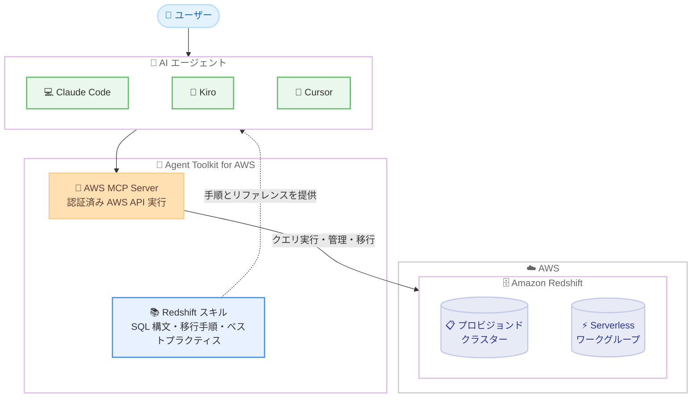

# Amazon Redshift - Agent Toolkit for AWS との統合による AI 支援型データウェアハウス管理

**リリース日**: 2026 年 8 月 27 日
**サービス**: Amazon Redshift
**機能**: Agent Toolkit for AWS 統合 (AWS MCP Server + Redshift スキル)

📊 [このアップデートのインフォグラフィックを見る](https://takech9203.github.io/aws-news-summary/20260827-redshift-agenttoolkit-for-ai-assisted-datawarehouse-mgmt.html)

## 概要

Amazon Redshift が Agent Toolkit for AWS と統合され、Claude Code、Kiro、Cursor などの AI エージェントから直接、Amazon Redshift データウェアハウスおよびデータレイクの構築、クエリ実行、トラブルシューティング、移行を実行できるようになりました。

この統合は、認証済みの AWS API 実行をユーザーに代わって提供する AWS MCP (Model Context Protocol) サーバーと、Redshift スキルを組み合わせたものです。Redshift スキルは、AI エージェントが Redshift タスクをより効果的に完了できるようにする、テスト済みの手順とリファレンス資料をキュレーションしたパッケージです。プロビジョンドクラスターと Redshift Serverless ワークグループの両方で動作し、既存インフラストラクチャの変更は不要です。

**アップデート前の課題**

このアップデート以前には、以下のような課題がありました。

- AI エージェントから Redshift を操作する場合、汎用的な知識に基づいてクエリや手順を生成するため、Redshift 固有の SQL 構文やベストプラクティスから外れた出力が発生しやすかった
- スキーマやデータの探索、データロード、マテリアライズドビューの設計などの定型作業を、ユーザーが手動で SQL を書いて実施する必要があった
- 他のデータウェアハウスから Amazon Redshift への移行では、アセスメント、スキーマ変換、データ移動、検証といった一連の作業を個別のツールと手作業で進める必要があった

**アップデート後の改善**

今回のアップデートにより、以下が可能になりました。

- AI エージェントが Redshift スキルを参照することで、SQL 構文リファレンスに基づいたクエリ生成エラーの削減が可能になった
- メタデータ探索スキルにより、SQL を手書きせずにスキーマとデータを探索できるようになった
- ディスカバリー、スキーマと SQL の変換、データ移動、検証、パフォーマンス比較を含む、エンドツーエンドのデータウェアハウス移行を AI エージェントがガイドできるようになった
- aws-data-analytics プラグインのインストール 1 回で、MCP Server 設定と Redshift スキルをまとめて導入できるようになった

## アーキテクチャ図



AI エージェントは Redshift スキルからテスト済みの手順とリファレンスを取得し、AWS MCP Server 経由で認証済みの AWS API を実行して Amazon Redshift を操作します。

## サービスアップデートの詳細

### 主要機能

1. **AWS MCP Server による認証済み API 実行**
   - AI エージェントがユーザーに代わって AWS API を実行するための認証済みインターフェースを提供
   - Claude Code、Kiro、Cursor などの MCP 対応エージェントから利用可能
   - 既存の Redshift インフラストラクチャへの変更は不要

2. **Redshift スキル**
   - AI エージェントが Redshift タスクを効果的に完了するための、テスト済み手順とリファレンス資料のキュレーションパッケージ
   - SQL 構文リファレンス: クエリ生成エラーを削減
   - メタデータ探索: SQL を手書きせずにスキーマとデータを探索
   - データロードパターン、マテリアライズドビューのベストプラクティス、関数とデータ型のガイダンス
   - Qualify、Pivot、Super などの拡張機能のガイダンス
   - スキルは今後も継続的に拡張予定

3. **エンドツーエンドのデータウェアハウス移行支援**
   - 他のデータウェアハウスから Amazon Redshift への移行をガイド
   - ディスカバリー、スキーマと SQL の変換、データ移動、検証、パフォーマンス比較までをカバー

4. **柔軟な導入方法**
   - aws-data-analytics プラグインをエージェントにインストールすると、MCP Server 設定と Redshift スキルを 1 ステップで導入可能
   - MCP Server にアクセスできるエージェントは、事前インストールなしで実行時にスキルを検出してロードすることも可能

## 技術仕様

### 統合コンポーネント

| 項目 | 詳細 |
|------|------|
| 対応 AI エージェント | Claude Code、Kiro、Cursor などの MCP 対応エージェント |
| 実行基盤 | AWS MCP (Model Context Protocol) Server |
| スキル提供形態 | GitHub リポジトリ aws/agent-toolkit-for-aws 内の specialized-skills/analytics-skills/redshift-guide |
| 導入方法 | aws-data-analytics プラグインのインストール、または実行時のスキル検出とロード |
| 対応 Redshift 環境 | プロビジョンドクラスター、Redshift Serverless ワークグループ |
| インフラ変更 | 不要 |
| 追加料金 | なし |

### Redshift スキルのカバー範囲

| カテゴリ | 内容 |
|----------|------|
| SQL 構文リファレンス | クエリ生成エラーの削減 |
| メタデータ探索 | SQL を手書きせずにスキーマとデータを探索 |
| データロード | データロードパターンのガイダンス |
| マテリアライズドビュー | ベストプラクティス |
| 関数とデータ型 | 利用ガイダンス |
| 拡張機能 | Qualify、Pivot、Super など |
| 移行 | ディスカバリー、スキーマと SQL の変換、データ移動、検証、パフォーマンス比較 |

## 設定方法

### 前提条件

1. Amazon Redshift のプロビジョンドクラスターまたは Serverless ワークグループが利用可能であること
2. Claude Code、Kiro、Cursor などの MCP 対応 AI エージェントを利用していること
3. AWS MCP Server が利用する AWS 認証情報と、Redshift 操作に必要な IAM 権限が設定されていること

### 手順

#### ステップ1: aws-data-analytics プラグインのインストール

```bash
# 例: Claude Code でのプラグインインストール
# aws/agent-toolkit-for-aws リポジトリの plugins/aws-data-analytics を参照
/plugin install aws-data-analytics
```

利用中の AI エージェントに aws-data-analytics プラグインをインストールします。このプラグインには MCP Server の設定と Redshift スキルがバンドルされており、1 ステップで導入が完了します。エージェントごとの具体的な手順は Agent Toolkit ドキュメントのクイックスタートを参照してください。

#### ステップ2: AWS 認証情報の設定

```bash
# AWS CLI の認証情報を設定
aws configure
```

AWS MCP Server はユーザーに代わって認証済みの AWS API を実行するため、AWS 認証情報を設定します。Redshift への操作に必要な IAM 権限を持つプロファイルを使用してください。

#### ステップ3: AI エージェントから Redshift を操作

AI エージェントに対して自然言語で指示します。例えば「Redshift の sales スキーマのテーブル構成を調べて、日次売上の集計クエリを作成して」のように依頼すると、エージェントが Redshift スキルを参照しながら MCP Server 経由でメタデータ探索とクエリ実行を行います。

なお、MCP Server にアクセスできるエージェントであれば、プラグインの事前インストールなしで実行時にスキルを検出してロードすることも可能です。

## メリット

### ビジネス面

- **運用工数の削減**: スキーマ探索、クエリ作成、トラブルシューティングといった作業を AI エージェントに委任でき、データエンジニアの作業時間を削減できる
- **移行プロジェクトの加速**: ディスカバリーから検証、パフォーマンス比較までの移行プロセス全体を AI エージェントがガイドするため、Redshift への移行の計画と実行を効率化できる
- **追加コストなし**: Amazon Redshift と AWS MCP Server が提供されるすべての AWS リージョンで、追加料金なしで利用できる

### 技術面

- **クエリ品質の向上**: SQL 構文リファレンスとテスト済み手順に基づくため、AI エージェントによるクエリ生成エラーを削減できる
- **既存環境への影響なし**: プロビジョンドクラスターと Serverless ワークグループの両方で動作し、既存インフラストラクチャの変更が不要
- **導入の容易さ**: aws-data-analytics プラグインにより MCP Server 設定とスキルを 1 ステップで導入でき、実行時のスキル検出にも対応

## デメリット・制約事項

### 制限事項

- MCP 対応の AI エージェント (Claude Code、Kiro、Cursor など) が前提となる
- Amazon Redshift と AWS MCP Server の両方が提供されているリージョンでの利用に限られる
- スキルのカバー範囲は現時点で公開されている内容が対象であり、今後の拡張が予定されている

### 考慮すべき点

- AWS MCP Server はユーザーに代わって AWS API を実行するため、エージェントに付与する IAM 権限は最小権限の原則に基づいて設計する必要がある
- 本番環境のデータウェアハウスに対する操作を AI エージェントに委任する場合は、実行内容の確認プロセスやガードレールの整備を検討すべきである
- AI エージェント自体の利用料金 (各エージェントのライセンスやトークン費用) は別途発生する

## ユースケース

### ユースケース1: SQL を書かないスキーマ・データ探索

**シナリオ**: 新しくチームに加わったアナリストが、Redshift 上のデータ構造を把握したい。テーブル定義や既存データの傾向を SQL を書かずに調べたい。

**実装例**:
```
AI エージェントへの指示:
「Redshift の analytics データベースにあるスキーマ一覧と、
 各スキーマの主要テーブルのカラム構成を教えて。
 orders テーブルのサンプルデータも確認したい」
```

**効果**: メタデータ探索スキルにより、SQL を手書きせずにスキーマとデータを探索でき、オンボーディングや調査の時間を短縮できる。

### ユースケース2: 他のデータウェアハウスから Redshift への移行

**シナリオ**: オンプレミスまたは他社データウェアハウスから Amazon Redshift への移行を計画しており、スキーマ変換や SQL 変換、移行後の検証を効率的に進めたい。

**実装例**:
```
AI エージェントへの指示:
「既存データウェアハウスから Redshift への移行を進めたい。
 まず移行対象のディスカバリーを行い、スキーマ変換案を作成して。
 その後、データ移動と検証、移行前後のパフォーマンス比較まで
 ガイドしてほしい」
```

**効果**: Redshift スキルがディスカバリー、スキーマと SQL の変換、データ移動、検証、パフォーマンス比較というエンドツーエンドの移行プロセスをガイドし、移行プロジェクトの負荷を軽減できる。

### ユースケース3: クエリ最適化とマテリアライズドビュー設計

**シナリオ**: ダッシュボードのレスポンス改善のため、頻繁に実行される集計クエリをマテリアライズドビュー化したいが、Redshift のベストプラクティスに沿った設計にしたい。

**実装例**:
```
AI エージェントへの指示:
「この集計クエリをもとに、Redshift のベストプラクティスに沿った
 マテリアライズドビューを設計して作成して。
 Qualify や Pivot が使える箇所があれば提案してほしい」
```

**効果**: マテリアライズドビューのベストプラクティスや Qualify、Pivot、Super などの拡張機能のガイダンスに基づき、Redshift に最適化された実装を短時間で得られる。

## 料金

Agent Toolkit for AWS との統合 (AWS MCP Server および Redshift スキル) は追加料金なしで利用できます。

Amazon Redshift 自体の利用料金 (プロビジョンドクラスターまたは Serverless ワークグループの料金) と、利用する AI エージェント側の費用は別途発生します。

## 利用可能リージョン

Amazon Redshift と AWS MCP Server が提供されているすべての AWS リージョンで利用可能です。

## 関連サービス・機能

- **Agent Toolkit for AWS**: AI エージェントから AWS を操作するためのツールキット。MCP Server とスキル群を提供する
- **AWS MCP Server**: Model Context Protocol に基づき、認証済みの AWS API 実行を AI エージェントに提供するサーバー
- **Amazon Redshift Serverless**: サーバーレスのデータウェアハウス。本統合はプロビジョンドクラスターと同様に Serverless ワークグループでも動作する
- **Kiro**: AWS が提供する AI 搭載 IDE。本統合の対応エージェントの 1 つ

## 参考リンク

- 📊 [インフォグラフィック](https://takech9203.github.io/aws-news-summary/20260827-redshift-agenttoolkit-for-ai-assisted-datawarehouse-mgmt.html)
- [公式発表 (What's New)](https://aws.amazon.com/about-aws/whats-new/2026/08/redshift-agenttoolkit-for-ai-assisted-datawarehouse-mgmt)
- [Agent Toolkit for AWS 製品ページ](https://aws.amazon.com/products/developer-tools/agent-toolkit-for-aws/)
- [AWS MCP Server ドキュメント](https://docs.aws.amazon.com/agent-toolkit/latest/userguide/mcp-server.html)
- [Agent Toolkit クイックスタート](https://docs.aws.amazon.com/agent-toolkit/latest/userguide/quick-start.html)
- [Amazon Redshift スキルドキュメント](https://docs.aws.amazon.com/redshift/latest/mgmt/agent-skills.html)
- [Redshift スキル (GitHub)](https://github.com/aws/agent-toolkit-for-aws/tree/main/skills/specialized-skills/analytics-skills/redshift-guide)
- [aws-data-analytics プラグイン (GitHub)](https://github.com/aws/agent-toolkit-for-aws/tree/main/plugins/aws-data-analytics)

## まとめ

Amazon Redshift が Agent Toolkit for AWS と統合され、Claude Code、Kiro、Cursor などの AI エージェントから、テスト済みの手順とリファレンスに基づいて Redshift の構築、クエリ、トラブルシューティング、移行を実行できるようになりました。既存インフラの変更不要かつ追加料金なしで利用できるため、Redshift を運用しているチームはまず aws-data-analytics プラグインを導入し、スキーマ探索やクエリ作成などの低リスクな作業から AI エージェントの活用を試すことを推奨します。
