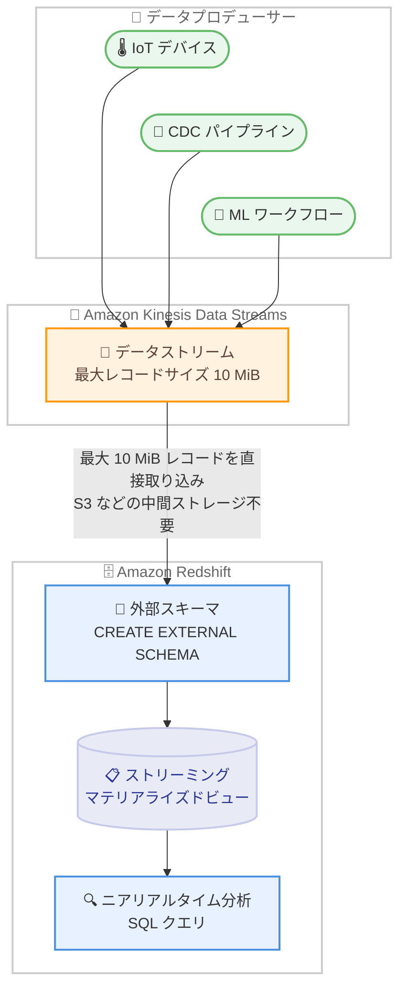

# Amazon Redshift - ストリーミングインジェスションで Amazon Kinesis Data Streams の 10 MiB レコード取り込みをサポート

**リリース日**: 2026 年 8 月 27 日
**サービス**: Amazon Redshift, Amazon Kinesis Data Streams
**機能**: ストリーミングインジェスションにおける Kinesis Data Streams 10 MiB レコードのサポート

📊 [このアップデートのインフォグラフィックを見る](https://takech9203.github.io/aws-news-summary/20260827-redshift-streaming-supports-kds-10mib-records.html)

## 概要

Amazon Redshift のストリーミングインジェスション機能が、Amazon Kinesis Data Streams (KDS) から最大 10 MiB のレコードを取り込めるようになりました。これは従来の 1 MiB 制限から 10 倍の拡大であり、KDS 自体がサポートする最大レコードサイズ (10 MiB) と完全に整合します。

Redshift のストリーミングインジェスションは、KDS や Amazon MSK から Redshift のマテリアライズドビューへ低レイテンシーかつ高スループットでデータを直接取り込む機能です。Amazon S3 などの一時的な中間ストレージを経由せず、ニアリアルタイム分析を実現します。今回のアップデートにより、大きなペイロードを持つレコードを事前に分割することなく、そのまま Redshift へストリーミングできるようになりました。

IoT テレメトリー、変更データキャプチャ (CDC) パイプライン、機械学習ワークフローなど、大きなレコードを断続的に処理するワークロードを持つユーザーにとって、取り込みパイプラインの簡素化と新しいユースケースの実現につながるアップデートです。

**アップデート前の課題**

- 以前は Redshift ストリーミングインジェスションが KDS から取り込めるレコードサイズは最大 1 MiB に制限されていた
- KDS 側は最大 10 MiB のレコードをサポートしていたにもかかわらず、Redshift へ取り込むには 1 MiB 以下に分割するか、S3 に本体を格納してメタデータのみをストリームに送る回避策が必要だった
- 1 MiB を超えるレコードは取り込み時にスキップされ、`SYS_STREAM_SCAN_ERRORS` システムテーブルにエラーとして記録されていた

**アップデート後の改善**

- KDS から最大 10 MiB のレコードを Redshift のマテリアライズドビューへ直接取り込めるようになった
- レコードの事前分割や S3 を経由する回避策が不要になり、取り込みパイプラインが簡素化された
- KDS の大容量レコードサポートと Redshift 側の取り込み上限が整合し、エンドツーエンドで大きなペイロードを扱えるようになった

## アーキテクチャ図



データプロデューサーが KDS に送信した最大 10 MiB のレコードを、Redshift ストリーミングインジェスションが中間ストレージを経由せずマテリアライズドビューへ直接取り込む構成です。

## サービスアップデートの詳細

### 主要機能

1. **最大レコードサイズの 10 倍拡大**
   - KDS からの取り込み上限が 1 MiB から 10 MiB (10,485,760 バイト) に拡大
   - KDS 自体がサポートする最大レコードサイズと完全に一致
   - レコードを分割せずにそのままストリーミング可能

2. **マテリアライズドビューの VARBYTE カラムサイズ拡大**
   - パッチ 203 以降で作成された KDS 向けストリーミングマテリアライズドビューは、VARBYTE データカラムのサイズが 16 MiB に設定される
   - Redshift が取り込めるレコードの理論上の最大サイズは VARBYTE 型の上限である 16,777,216 バイト (16 MiB) であり、KDS の場合は KDS 側の上限である 10 MiB まで取り込み可能

3. **エラーハンドリング**
   - サイズ上限を超えるレコードは引き続きスキップされ、マテリアライズドビューのリフレッシュ自体は成功する
   - スキップされたレコードの一部は `SYS_STREAM_SCAN_ERRORS` システムテーブルに記録され、確認できる

## 技術仕様

### レコードサイズ制限の比較

| 項目 | アップデート前 | アップデート後 |
|------|----------------|----------------|
| KDS からの最大取り込みサイズ | 1 MiB (1,048,576 バイト) | 10 MiB (10,485,760 バイト) |
| Amazon MSK からの最大取り込みサイズ | 16 MiB | 16 MiB (変更なし) |
| ストリーミングマテリアライズドビューの VARBYTE カラムサイズ (KDS) | 1 MiB | 16 MiB |
| KDS 側の最大レコードサイズ | 最大 10 MiB (設定により変更) | 最大 10 MiB (設定により変更) |

### KDS 側の大容量レコード設定

KDS 側でも、ストリームの最大レコードサイズをデフォルトの 1 MiB から引き上げる設定が必要です。

| 項目 | 詳細 |
|------|------|
| デフォルトの最大レコードサイズ | 1 MiB (既存・新規ストリームとも) |
| 設定可能な最大値 | 10 MiB |
| 設定方法 | コンソール、`UpdateMaxRecordSize` API、`CreateStream` の `MaxRecordSizeInKiB` パラメータ |
| シャードスループット | 書き込み 1 MB/秒、読み取り 2 MB/秒のシャード制限は変更なし (バーストキャパシティで大容量レコードを吸収) |
| 推奨される利用パターン | 大容量レコードは全トラフィックの 2% 未満に抑える断続的な利用 |

## 設定方法

### 前提条件

1. Amazon Redshift プロビジョンドクラスターまたは Amazon Redshift Serverless ワークグループが利用可能であること
2. Redshift クラスターがパッチ 203 以降で稼働していること (10 MiB サポートに必須)
3. KDS ストリームの最大レコードサイズが必要なサイズ (最大 10 MiB) に設定されていること
4. Redshift から KDS へアクセスするための IAM ロールが設定されていること

### 手順

#### ステップ 1: KDS ストリームの最大レコードサイズを更新

```bash
aws kinesis update-max-record-size \
    --stream-arn arn:aws:kinesis:ap-northeast-1:123456789012:stream/my-stream \
    --max-record-size-in-ki-b 10240
```

対象の KDS ストリームの最大レコードサイズを 10 MiB (10,240 KiB) に引き上げます。この設定は対象ストリームのみに適用されるため、事前にすべてのダウンストリームアプリケーションが大容量レコードを処理できることを確認します。

#### ステップ 2: Redshift で外部スキーマを作成

```sql
CREATE EXTERNAL SCHEMA kds_schema
FROM KINESIS
IAM_ROLE 'arn:aws:iam::123456789012:role/RedshiftStreamingRole';
```

KDS をデータソースとする外部スキーマを作成します。IAM ロールには対象ストリームへの読み取り権限が必要です。

#### ステップ 3: ストリーミングマテリアライズドビューを作成

```sql
CREATE MATERIALIZED VIEW my_streaming_mv AUTO REFRESH YES AS
SELECT
    approximate_arrival_timestamp,
    partition_key,
    shard_id,
    sequence_number,
    JSON_PARSE(kinesis_data) AS payload
FROM kds_schema.my_stream
WHERE CAN_JSON_PARSE(kinesis_data);
```

KDS ストリームからデータを取り込むマテリアライズドビューを作成します。`AUTO REFRESH YES` により、データ到着に応じて自動的にリフレッシュされます。JSON データは `JSON_PARSE` で SUPER 型に変換して格納するのが推奨されるベストプラクティスです。

**重要**: パッチ 203 より前に作成された既存のマテリアライズドビューは VARBYTE カラムが 1 MiB に設定されたままであり、引き続き 1 MiB までのレコードしか取り込めません。10 MiB のレコードを取り込むには、パッチ 203 以降でマテリアライズドビューを再作成する必要があります。

#### ステップ 4: 取り込みエラーの確認

```sql
SELECT * FROM SYS_STREAM_SCAN_ERRORS
ORDER BY record_time DESC
LIMIT 10;
```

サイズ超過などでスキップされたレコードの情報を確認します。パイプラインの正常性監視に活用できます。

## メリット

### ビジネス面

- **パイプラインの簡素化**: レコード分割ロジックや S3 経由の回避策が不要になり、開発・運用コストを削減できる
- **新しいユースケースの実現**: 大きなペイロードを持つ IoT、CDC、機械学習ワークロードのニアリアルタイム分析が直接実現できる
- **データ鮮度の向上**: 中間処理を挟まないことで、データ発生から分析可能になるまでのレイテンシーを短縮できる

### 技術面

- **エンドツーエンドの整合性**: KDS の 10 MiB サポートと Redshift の取り込み上限が一致し、ストリーム全体で一貫した設計が可能になる
- **アプリケーション変更が不要**: 取り込み上限の拡大は Redshift 側のパッチ適用とマテリアライズドビューの再作成で有効化され、SQL ベースの既存の設定方法は変わらない
- **exactly-once 処理の維持**: ストリーム、シャード、シーケンス番号に基づく exactly-once の取り込み保証は大容量レコードでも維持される

## デメリット・制約事項

### 制限事項

- 10 MiB サポートには Redshift のパッチ 203 以降が必要
- パッチ 203 より前に作成された KDS 向けマテリアライズドビューは VARBYTE カラムが 1 MiB のままであり、大容量レコードを取り込むには再作成が必要
- KDS 側のシャードスループット制限 (書き込み 1 MB/秒、読み取り 2 MB/秒) は変更されないため、大容量レコードの持続的な大量送信には向かない
- KPL で集約されたレコードのパース非サポート、VARBYTE の解凍非サポートなど、ストリーミングインジェスションの既存の制約は引き続き適用される

### 考慮すべき点

- KDS の大容量レコードは断続的な利用を想定した設計であり、全トラフィックの 2% 未満に抑えることが推奨される
- 大容量レコードはシャードのバーストキャパシティを消費するため、後続の書き込みがスロットリングされる可能性がある。プロデューサー側で指数バックオフ付きリトライと均一に分散されたパーティションキーを使用することが推奨される
- `JSON_EXTRACT_PATH_TEXT` には 16 MB のデータサイズ上限があり、カラムごとに JSON を再パースするため、大きな JSON レコードでは `JSON_PARSE` で SUPER 型に変換する方式が推奨される
- 継続的に大容量レコードを送信する必要がある場合は、ペイロードを S3 に格納しメタデータのみをストリームに送る従来のパターンも引き続き有効な選択肢である

## ユースケース

### ユースケース 1: IoT テレメトリーのニアリアルタイム分析

**シナリオ**: 製造ラインのセンサー群が、定期的に詳細な診断データを含む数 MiB のテレメトリーレコードを送信する。従来はレコードを分割して送信し、Redshift 側で再結合する処理が必要だった。

**実装例**:
```sql
CREATE MATERIALIZED VIEW iot_telemetry_mv AUTO REFRESH YES AS
SELECT
    approximate_arrival_timestamp AS arrival_time,
    JSON_PARSE(kinesis_data) AS telemetry
FROM kds_schema.factory_telemetry
WHERE CAN_JSON_PARSE(kinesis_data);
```

**効果**: 分割・再結合ロジックが不要になり、診断データ全体を 1 レコードとして取り込んでニアリアルタイムに異常検知クエリを実行できる。

### ユースケース 2: CDC パイプラインでの大きなトランザクションの取り込み

**シナリオ**: 基幹データベースからの変更データキャプチャで、大きなドキュメントカラムや一括更新を含む変更イベントが 1 MiB を超えることがあり、従来はサイズ超過レコードがスキップされてデータ欠損の原因になっていた。

**実装例**:
```sql
CREATE MATERIALIZED VIEW cdc_events_mv AUTO REFRESH YES AS
SELECT
    approximate_arrival_timestamp AS arrival_time,
    partition_key,
    JSON_PARSE(kinesis_data) AS change_event
FROM kds_schema.cdc_stream
WHERE CAN_JSON_PARSE(kinesis_data);
```

**効果**: 10 MiB までの変更イベントを欠損なく取り込めるようになり、`SYS_STREAM_SCAN_ERRORS` の監視負荷とリカバリー作業を削減できる。

### ユースケース 3: 機械学習ワークフローの特徴量データ取り込み

**シナリオ**: 機械学習パイプラインが生成する特徴量ベクトルや埋め込みデータは 1 レコードあたりのサイズが大きく、従来は S3 に書き出してから COPY コマンドでバッチロードしていたため、分析可能になるまでの遅延が大きかった。

**実装例**:
```sql
CREATE MATERIALIZED VIEW ml_features_mv AUTO REFRESH YES AS
SELECT
    approximate_arrival_timestamp AS arrival_time,
    JSON_PARSE(kinesis_data) AS feature_payload
FROM kds_schema.ml_feature_stream
WHERE CAN_JSON_PARSE(kinesis_data);
```

**効果**: S3 経由のバッチロードをストリーミングに置き換え、特徴量データを低レイテンシーで分析やモニタリングに利用できる。

## 料金

Redshift ストリーミングインジェスション機能自体に追加料金はありません。以下の標準料金が適用されます。

- **Amazon Redshift**: プロビジョンドクラスターのノード料金、または Redshift Serverless の RPU 時間に基づく料金。自動リフレッシュのクエリは通常のワークロードとして扱われるため、Serverless では取り込み頻度に応じて RPU 消費が発生する
- **Amazon Kinesis Data Streams**: プロビジョンドモードではシャード時間と PUT ペイロードユニット、オンデマンドモードでは取り込み・取得データ量に基づく料金。大容量レコードの送信はデータ量に応じた課金対象となる

詳細は各サービスの料金ページを参照してください。

## 利用可能リージョン

Amazon Redshift が利用可能なすべての AWS 商用リージョンで利用できます。

なお、KDS 側の大容量レコード機能 (最大レコードサイズの 10 MiB への引き上げ) は、東京 (ap-northeast-1)、大阪 (ap-northeast-3) を含む主要な商用リージョンおよび AWS GovCloud (US) でサポートされています。KDS 側の対応リージョンは [Kinesis Data Streams 開発者ガイド](https://docs.aws.amazon.com/streams/latest/dev/large-records.html)を参照してください。

## 関連サービス・機能

- **Amazon Kinesis Data Streams**: 大容量レコード機能により最大 10 MiB のレコードをサポート。`UpdateMaxRecordSize` API でストリームごとに上限を設定する
- **Amazon MSK**: Redshift ストリーミングインジェスションのもう 1 つのソース。MSK トピックからは最大 16 MiB のレコードを取り込み可能
- **Amazon Data Firehose**: KDS をソースとする場合、Redshift への大容量レコードの配信は非サポート。大容量レコードを Firehose 経由で Redshift へ届ける場合は S3 への配信と ETL の組み合わせが必要であり、今回の Redshift 直接取り込みが有力な代替手段となる
- **AWS Lambda**: KDS の大容量レコードを Lambda で処理する場合、ペイロード上限は 6 MiB であり、超過レコードには失敗時送信先の設定が必要

## 参考リンク

- 📊 [インフォグラフィック](https://takech9203.github.io/aws-news-summary/20260827-redshift-streaming-supports-kds-10mib-records.html)
- [公式発表 (What's New)](https://aws.amazon.com/about-aws/whats-new/2026/08/redshift-streaming-supports-kds-10mib-records)
- [AWS Blog: Amazon Kinesis Data Streams now supports 10x larger record sizes](https://aws.amazon.com/blogs/big-data/amazon-kinesis-data-streams-now-supports-10x-larger-record-sizes-simplifying-real-time-data-processing/)
- [ドキュメント: Streaming ingestion to a materialized view](https://docs.aws.amazon.com/redshift/latest/dg/materialized-view-streaming-ingestion.html)
- [ドキュメント: Handle large records (Kinesis Data Streams)](https://docs.aws.amazon.com/streams/latest/dev/large-records.html)
- [料金ページ: Amazon Redshift](https://aws.amazon.com/redshift/pricing/)
- [料金ページ: Amazon Kinesis Data Streams](https://aws.amazon.com/kinesis/data-streams/pricing/)

## まとめ

Amazon Redshift ストリーミングインジェスションの KDS レコードサイズ上限が 1 MiB から 10 MiB に拡大され、KDS の大容量レコードサポートとエンドツーエンドで整合しました。IoT、CDC、機械学習など大きなペイロードを扱うニアリアルタイム分析パイプラインを構築しているユーザーは、レコード分割や S3 経由の回避策を見直すことでアーキテクチャを簡素化できます。既存のマテリアライズドビューはパッチ 203 以降での再作成が必要な点と、KDS 側のシャードスループット制限は変わらない点に注意して導入を検討してください。
