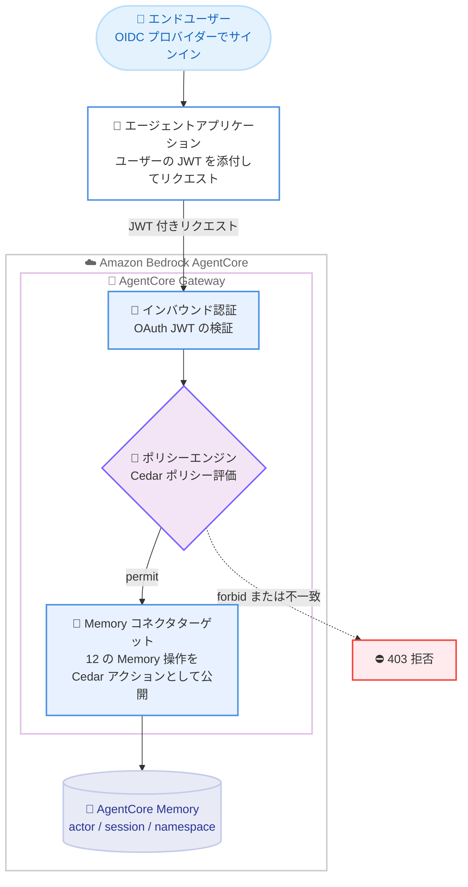

# Amazon Bedrock AgentCore Memory - きめ細かなアクセス制御 (FGAC) のサポート

**リリース日**: 2026 年 8 月 28 日
**サービス**: Amazon Bedrock AgentCore
**機能**: AgentCore Memory のきめ細かなアクセス制御 (Fine-Grained Access Control)

📊 [このアップデートのインフォグラフィックを見る](https://takech9203.github.io/aws-news-summary/20260828-agentcorememory-fine-grained-access-control.html)

## 概要

Amazon Bedrock AgentCore Memory が、きめ細かなアクセス制御 (FGAC) をサポートしました。AgentCore Gateway (OAuth/JWT 認証で構成) を Memory リソースの前段に配置し、Cedar ポリシーをアタッチすることで、認証済み呼び出し元の ID に基づいて Memory へのアクセスを制限できます。カスタムの認可ロジックを実装することなく、ユーザー単位・テナント単位のメモリ分離をインフラストラクチャレイヤーで実現できます。

従来の IAM ベースのアクセス制御は、Memory を呼び出す IAM プリンシパルに対してのみ条件を評価できました。しかし、エンドユーザーが OpenID Connect プロバイダー経由でサインインするエージェントアプリケーションでは、呼び出し元は OAuth/JWT で認証されるため IAM プリンシパルではなく、「この JWT の持ち主は自分の actor データにしかアクセスできない」といったルールを IAM では表現できませんでした。今回の FGAC により、リクエスト属性とトークンクレームを比較するポリシーを記述できるようになり、認可の実施をアプリケーションコードからインフラストラクチャレイヤーへ移行できます。

本機能は AgentCore Memory コネクタ (Gateway ターゲットと Memory データプレーンを接続するマネージドゲートウェイコネクタ) 上に構築されており、12 の Memory 操作が Cedar アクションとして公開されます。各操作のリクエスト属性 (パスパラメータやリクエストボディのフィールド) をポリシー条件で参照できます。

**アップデート前の課題**

このアップデート以前は、OAuth 認証されたエンドユーザー単位での Memory アクセス制御に課題がありました。

- IAM ポリシーは IAM プリンシパルに対してのみ評価されるため、OAuth/JWT で認証されたエンドユーザーの ID に基づくアクセス制御ルールを表現できなかった
- 「ユーザーは自分の actor データのみアクセス可能」といったユーザー単位の分離を実現するには、アプリケーションコード内にカスタム認可ロジックを実装する必要があった
- アプリケーション層での認可実装は、実装漏れやバグによるテナント間データ漏洩のリスクを伴い、監査も困難だった

**アップデート後の改善**

今回のアップデートにより、以下が可能になりました。

- リクエストの `actorId` が JWT の `sub` クレームと一致する場合のみアクセスを許可するなど、ユーザーごとに自分の actor データのみへのアクセスを強制できるようになった
- トークンクレームに含まれる namespace パスと一致する場合のみメモリレコードの取得を許可する、namespace 単位の分離が可能になった
- 12 の Memory 操作単位で許可/拒否を制御でき、暗号学的に検証された ID (JWT) に基づく認可をインフラストラクチャレイヤーで一元的に実施できるようになった

## アーキテクチャ図



Gateway が JWT を検証した後、ポリシーエンジンがリクエストのプリンシパル (呼び出し元)、アクション (Memory 操作)、リソース (Gateway)、コンテキスト (リクエスト属性) に対して Cedar ポリシーを評価し、許可された場合のみ Memory コネクタ経由で Memory データプレーンへ転送します。評価はデフォルト拒否で、`forbid` は `permit` より優先されます。

## サービスアップデートの詳細

### 主要機能

1. **OAuth/JWT アイデンティティに基づくアクセス制御**
   - Gateway のインバウンド認証で検証された JWT のクレーム (`sub`、`client_id`、カスタムクレームなど) をポリシー条件で参照可能
   - リクエストの `actorId` が JWT の `sub` クレームと一致する場合のみ許可する、ユーザー単位の分離パターンを実現
   - 特定の OAuth `client_id` を提示する呼び出し元のみにアクセスを許可することも可能

2. **namespace 単位の分離**
   - リクエストの `namespace` / `namespacePath` をリテラル値、またはトークンクレームに含まれる namespace パスと比較して制限
   - 長期メモリレコードをユーザーごとの namespace で整理している場合、`actorId` ではなく namespace ベースで分離を実施可能
   - Cedar は文字列連結をサポートしないため、呼び出し元の完全な namespace パスを保持するクレームを IdP 側で発行し、プリンシパルタグとして比較する方式を採用

3. **Memory 操作単位のアクション制御**
   - Memory コネクタが 12 の Memory 操作を Cedar アクションとして公開
   - 単一アクション、アクションのセット (`action in [...]`)、または全アクションの許可を選択可能 (アクション ID のワイルドカードは非サポート)
   - パスパラメータ (`memoryId`、`actorId`、`sessionId` など) やリクエストボディフィールド (`metadata`、`namespacePath` など) を条件に使用可能

4. **段階的な導入を支援するエンフォースメントモード**
   - ポリシーエンジンの `mode` で `ENFORCE` (強制) と `LOG_ONLY` (評価とログ記録のみ、ブロックなし) を切り替え可能
   - 既存の Memory への FGAC 導入時は、`LOG_ONLY` モードでポリシーを検証してから `ENFORCE` へ移行することで、意図しない拒否を回避

## 技術仕様

### Cedar アクションとして公開される 12 の Memory 操作

各 Memory 操作は `<target-name>___<METHOD>:<uri-template>` 形式の Cedar アクションとして公開されます (`<target-name>` はコネクタターゲット名)。

| Memory 操作 | Cedar アクション ID |
|------|------|
| ListEvents | `<target-name>___POST:/memories/{memoryId}/actor/{actorId}/sessions/{sessionId}` |
| CreateEvent | `<target-name>___POST:/memories/{memoryId}/events` |
| GetEvent | `<target-name>___GET:/memories/{memoryId}/actor/{actorId}/sessions/{sessionId}/events/{eventId}` |
| DeleteEvent | `<target-name>___DELETE:/memories/{memoryId}/actor/{actorId}/sessions/{sessionId}/events/{eventId}` |
| ListSessions | `<target-name>___POST:/memories/{memoryId}/actor/{actorId}/sessions` |
| ListActors | `<target-name>___POST:/memories/{memoryId}/actors` |
| RetrieveMemoryRecords | `<target-name>___POST:/memories/{memoryId}/retrieve` |
| ListMemoryRecords | `<target-name>___POST:/memories/{memoryId}/memoryRecords` |
| GetMemoryRecord | `<target-name>___GET:/memories/{memoryId}/memoryRecord/{memoryRecordId}` |
| DeleteMemoryRecord | `<target-name>___DELETE:/memories/{memoryId}/memoryRecords/{memoryRecordId}` |
| ListMemoryExtractionJobs | `<target-name>___POST:/memories/{memoryId}/extractionJobs` |
| StartMemoryExtractionJob | `<target-name>___POST:/memories/{memoryId}/extractionJobs/start` |

### ポリシー条件で使用できるリクエスト属性

Gateway はリクエストの属性を `context.input` 配下に公開します。参照前に `has` によるガードが推奨されます (例: `context has input && context.input has actorId`)。

| 分類 | フィールド |
|------|------|
| パスパラメータ | `context.input.memoryId`、`context.input.actorId`、`context.input.sessionId`、`context.input.eventId`、`context.input.memoryRecordId` |
| リクエストボディ (操作依存) | `context.input.namespace`、`context.input.namespacePath`、`context.input.metadata`、`context.input.filter`、`context.input.payload` など |

利用可能なフィールドは操作ごとに異なります。ある操作に存在するフィールド (例: ListEvents の `actorId`) が、同じポリシーにマッチする別の操作には存在しない場合があります。

### Cedar ポリシー例: ユーザー単位の分離

リクエストの `actorId` が JWT の `sub` クレームと一致する場合のみ、OAuth ユーザーにセッションへのアクセスを許可するポリシーです。

```cedar
permit(
  principal is AgentCore::OAuthUser,
  action == AgentCore::Action::"<target-name>___POST:/memories/{memoryId}/actor/{actorId}/sessions/{sessionId}",
  resource == AgentCore::Gateway::"<gw-arn>"
) when {
  principal.hasTag("sub") &&
  context has input && context.input has actorId &&
  context.input.actorId == principal.getTag("sub")
};
```

### Cedar ポリシー例: namespace 単位の分離

トークンクレーム `namespace` に含まれる namespace パスと、リクエストの `namespacePath` が一致する場合のみメモリレコードの取得を許可するポリシーです。

```cedar
permit(
  principal is AgentCore::OAuthUser,
  action == AgentCore::Action::"<target-name>___POST:/memories/{memoryId}/retrieve",
  resource == AgentCore::Gateway::"<gw-arn>"
) when {
  principal.hasTag("namespace") &&
  context has input && context.input has namespacePath &&
  context.input.namespacePath == principal.getTag("namespace")
};
```

## 設定方法

### 前提条件

1. AgentCore Memory リソースが作成済みであること
2. Memory コネクタターゲットを持つ AgentCore Gateway が構成済みであること (「Access AgentCore Memory through a gateway」を参照)
3. OAuth 認証の場合、Gateway のインバウンド認証で使用する OpenID Connect プロバイダーが構成済みであること

### 手順

#### ステップ 1: ポリシーエンジンの作成と Cedar ポリシーの追加

```bash
# ポリシーエンジンを作成し、CreatePolicy で Cedar ステートメントを
# ポリシー定義 (definition) として追加する
aws bedrock-agentcore-control create-policy \
  --policy-engine-id <policy-engine-id> \
  --definition '{"cedar": {"statement": "permit(principal is AgentCore::OAuthUser, ...);"}}'
```

ポリシーエンジンを作成し、`CreatePolicy` API で Cedar ポリシーを追加します。ポリシーは AWS Management Console、AWS SDK、AWS CLI のいずれからも設定できます。

#### ステップ 2: ポリシーエンジンを Gateway に関連付け

```bash
# 既存の Gateway にポリシーエンジンを関連付ける
aws bedrock-agentcore-control update-gateway \
  --gateway-identifier <gateway-id> \
  --policy-engine-configuration '{...}'
```

Memory リソースの前段に配置した Gateway の `policyEngineConfiguration` を設定します。`CreateGateway` での新規作成時に設定するか、`UpdateGateway` で後から追加できます。

#### ステップ 3: LOG_ONLY モードでのテストと ENFORCE への切り替え

ポリシーエンジンの `mode` を `LOG_ONLY` に設定してポリシーの評価結果をログで確認し、意図しない拒否がないことを検証してから `ENFORCE` に切り替えます。ポリシーが参照するフィールドをリクエストが持たない場合、ポリシー作成時にはエラーにならず実行時に 403 で拒否されるため、このテストステップが重要です。

## メリット

### ビジネス面

- **マルチテナント SaaS のデータ分離強化**: テナント間・ユーザー間のメモリデータ分離をインフラレイヤーで強制でき、アプリケーションのバグによるデータ漏洩リスクを低減
- **コンプライアンス対応の簡素化**: 暗号学的に検証された ID (JWT) に基づく一元的なアクセス制御により、監査対応やセキュリティレビューが容易に
- **開発コストの削減**: カスタム認可ロジックの実装・保守が不要になり、エージェント機能の開発に集中可能

### 技術面

- **認可のインフラレイヤーへの移行**: アプリケーションコードに散在しがちな認可チェックを、Gateway + Cedar ポリシーとして宣言的に一元管理
- **デフォルト拒否のセキュアな評価モデル**: 評価はデフォルト拒否で `forbid` が `permit` に優先するため、許可漏れよりも安全側に倒れる設計
- **柔軟な条件表現**: アクション、Gateway ARN、パスパラメータ、リクエストボディ、JWT クレーム、IAM ARN パターンを単一のポリシーで組み合わせ可能
- **全インバウンド認証モードで利用可能**: FGAC の適用は OAuth インバウンドだけでなく、IAM インバウンドの呼び出し元 (`AgentCore::IamEntity`) にも対応

## デメリット・制約事項

### 制限事項

- バッチ操作 (`BatchCreateMemoryRecords`、`BatchUpdateMemoryRecords`、`BatchDeleteMemoryRecords`) は Cedar アクションとして公開されず、FGAC で制御できない (1 リクエストに複数レコードが含まれ、個別評価が不可のため)。バッチ操作全体の許可/拒否は IAM ポリシーで制御する
- Cedar アクション ID のワイルドカードは非サポート。複数操作の許可は `action in [...]` で列挙する必要がある
- Cedar は文字列連結をサポートしないため、クレームから namespace パスをポリシー内で組み立てることはできず、IdP 側で完全なパスを持つクレームの発行が必要

### 考慮すべき点

- ポリシーが参照する `context.input` フィールドをリクエストが持たない場合、ポリシー作成は成功して `ACTIVE` になるものの、実行時に 403 で拒否される。フィールドを持つ操作にポリシーのスコープを絞り、`has` ガードを併用し、`LOG_ONLY` モードで事前テストを行うこと
- 既存デプロイで内部ユーザー ID を `actorId` として使用しており IdP の `sub` と一致しない場合、カスタム JWT クレームでの比較、namespace ベースの分離、または `actorId` を `sub` に揃える移行のいずれかの対応が必要
- FGAC は Gateway 経由のトラフィックにのみ適用されるため、Memory データプレーンへの直接アクセスは Memory のリソースベースポリシー (`aws:SourceArn`、`aws:PrincipalArn` 条件キーなど) で別途制限する必要がある

## ユースケース

### ユースケース 1: マルチユーザー対応のパーソナルアシスタント

**シナリオ**: エンドユーザーが OIDC プロバイダーでサインインするパーソナルアシスタントで、各ユーザーの会話履歴 (イベント) を他のユーザーから完全に分離したい。

**実装例**:
```cedar
permit(
  principal is AgentCore::OAuthUser,
  action == AgentCore::Action::"memory-target___POST:/memories/{memoryId}/actor/{actorId}/sessions/{sessionId}",
  resource == AgentCore::Gateway::"arn:aws:bedrock-agentcore:us-east-1:111122223333:gateway/my-gateway"
) when {
  principal.hasTag("sub") &&
  context has input && context.input has actorId &&
  context.input.actorId == principal.getTag("sub")
};
```

**効果**: `actorId` と JWT の `sub` クレームの一致をインフラレイヤーで強制し、アプリケーションのバグがあってもユーザーが他人の会話履歴へアクセスできないことを保証。

### ユースケース 2: テナント別 namespace による SaaS のデータ分離

**シナリオ**: マルチテナント SaaS で長期メモリレコードをテナントごとの namespace (例: `/tenants/<tenant-id>/`) に整理しており、各テナントは自テナントの namespace 配下のレコードのみ検索可能にしたい。

**実装例**:
```
IdP 側でトークンにテナントの namespace パスを保持するクレームを発行し、
プリンシパルタグ namespace として Gateway にマッピング。
RetrieveMemoryRecords アクションに対して
context.input.namespacePath == principal.getTag("namespace")
を条件とする permit ポリシーを設定。
```

**効果**: テナント境界の強制をアプリケーションコードから排除し、テナント間のメモリレコード漏洩を Gateway レイヤーで防止。

### ユースケース 3: 読み取り専用エージェントへの最小権限付与

**シナリオ**: 分析用エージェントには Memory の参照系操作 (イベント一覧とレコード検索) のみを許可し、イベント作成や削除などの書き込み系操作は一切許可したくない。

**実装例**:
```cedar
permit(
  principal,
  action in [
    AgentCore::Action::"memory-target___POST:/memories/{memoryId}/actor/{actorId}/sessions/{sessionId}",
    AgentCore::Action::"memory-target___POST:/memories/{memoryId}/retrieve"
  ],
  resource == AgentCore::Gateway::"arn:aws:bedrock-agentcore:us-east-1:111122223333:gateway/my-gateway"
);
```

**効果**: デフォルト拒否の評価モデルにより、列挙した 2 操作以外の Memory 操作はすべて拒否され、最小権限の原則を実現。

## 料金

What's New での追加料金の言及はありません。FGAC は AgentCore Gateway と AgentCore Memory を組み合わせて利用するため、それぞれの利用に応じた AgentCore の料金が適用されます。詳細は [Amazon Bedrock AgentCore の料金ページ](https://aws.amazon.com/bedrock/agentcore/pricing/)を参照してください。

## 利用可能リージョン

What's New では利用可能リージョンの明記はありません。AgentCore Gateway および AgentCore Memory が利用可能なリージョンでの提供となるため、最新のリージョン対応状況は [AWS ドキュメント](https://docs.aws.amazon.com/bedrock-agentcore/latest/devguide/)で確認してください。

## 関連サービス・機能

- **Amazon Bedrock AgentCore Gateway**: Memory リソースの前段に配置し、インバウンド認証 (OAuth/JWT または IAM) とポリシー評価を実施。ゲートウェイインターセプターによるコードベースのカスタム認可も併用可能
- **Amazon Bedrock AgentCore Memory コネクタ**: Gateway ターゲットと Memory データプレーンを接続するマネージドコネクタ。FGAC の基盤として 12 の Memory 操作を Cedar アクションとして公開
- **Policy in Amazon Bedrock AgentCore**: Cedar ポリシー言語、プリンシパルタイプ (`AgentCore::OAuthUser`、`AgentCore::IamEntity`)、ポリシーエンジン、ポリシー検証を提供する AgentCore の認可基盤
- **Cedar**: オープンソースのポリシー言語。Amazon Verified Permissions や AVP と同じ言語仕様で、宣言的な認可ポリシーを記述可能
- **Memory のリソースベースポリシー**: どの IAM プリンシパル (特定の Gateway を含む) が Memory を呼び出せるかを制御し、Gateway を経由しない直接アクセスの制限に使用

## 参考リンク

- 📊 [インフォグラフィック](https://takech9203.github.io/aws-news-summary/20260828-agentcorememory-fine-grained-access-control.html)
- [公式発表 (What's New)](https://aws.amazon.com/about-aws/whats-new/2026/08/agentcorememory-fine-grained-access-control)
- [ドキュメント: Fine-grained access control for Memory](https://docs.aws.amazon.com/bedrock-agentcore/latest/devguide/memory-gateway-fgac.html)
- [ドキュメント: Policy examples for Memory](https://docs.aws.amazon.com/bedrock-agentcore/latest/devguide/memory-gateway-fgac-policy-examples.html)
- [ドキュメント: Access AgentCore Memory through a gateway](https://docs.aws.amazon.com/bedrock-agentcore/latest/devguide/memory-gateway-connector.html)
- [Cedar Policy 公式サイト](https://www.cedarpolicy.com/)
- [料金ページ](https://aws.amazon.com/bedrock/agentcore/pricing/)

## まとめ

AgentCore Memory の FGAC サポートにより、OAuth/JWT で認証されたエンドユーザーの ID に基づくメモリアクセス制御を、アプリケーションコードではなく Gateway + Cedar ポリシーというインフラレイヤーで宣言的に実施できるようになりました。マルチテナント・マルチユーザーのエージェントアプリケーションを構築している場合は、`actorId == sub` によるユーザー分離パターンや namespace 分離パターンの適用を検討し、まずは `LOG_ONLY` モードでポリシーの評価結果を検証することを推奨します。
