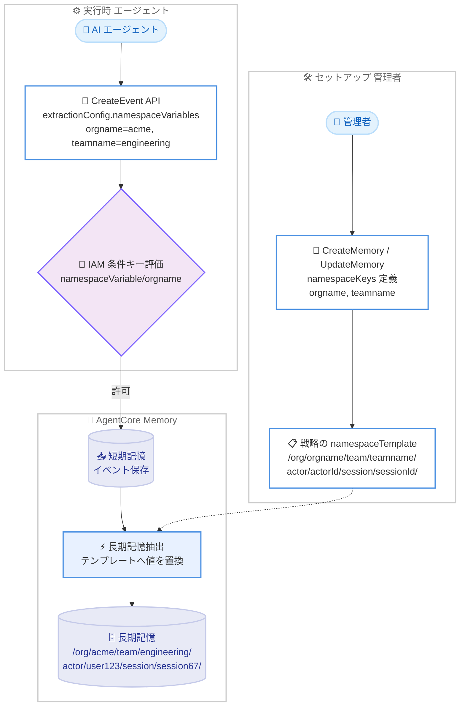

# Amazon Bedrock AgentCore Memory - 柔軟な namespace 変数のサポート

**リリース日**: 2026 年 8 月 28 日
**サービス**: Amazon Bedrock AgentCore (AgentCore Memory)
**機能**: Flexible Namespace Variables (カスタム namespace 変数)

📊 [このアップデートのインフォグラフィックを見る](https://takech9203.github.io/aws-news-summary/20260828-agentcorememory-flexible-namespaces.html)

## 概要

Amazon Bedrock AgentCore Memory が、カスタム namespace 変数 (Flexible Namespace Variables) をサポートしました。これにより、組織、テナント、チーム、環境など、アプリケーション固有の任意のディメンションで長期記憶 (long-term memory) をスコープできるようになります。

AgentCore Memory では、長期記憶を namespace という階層構造で論理的にグループ化します。これまでは `actorId`、`sessionId`、`memoryStrategyId` という組み込み変数のみが利用可能でしたが、今回のアップデートにより、Memory リソースに独自のキーを定義し、戦略 (strategy) の namespace テンプレートで参照できるようになりました。実行時には CreateEvent API の `extractionConfig.namespaceVariables` フィールドで値を供給し、長期記憶の抽出時にテンプレートへ置換されます。

マルチテナント SaaS や階層的な組織構造を持つエンタープライズアプリケーションを構築する開発者にとって、戦略の重複作成や組み込み変数のオーバーロード (本来の用途と異なる値の詰め込み) なしに、記憶の整理・分離・アクセス制御をきめ細かく行えるようになる重要なアップデートです。

**アップデート前の課題**

- namespace テンプレートで使用できる変数は組み込みの `actorId`、`sessionId`、`memoryStrategyId` の 3 つに限られていた
- テナントや環境ごとに記憶を分離するには、同じ内容の戦略をテナントごとに重複作成する必要があった
- あるいは `actorId` に `org-team-user` のような複合値を詰め込む (オーバーロードする) 回避策が必要で、可読性やアクセス制御の面で問題があった
- テナント単位での書き込みアクセス制御を IAM で直接表現する手段がなかった

**アップデート後の改善**

- Memory リソースに `namespaceKeys` パラメータでカスタムキーを定義し、任意のディメンション (組織、テナント、チーム、環境など) で長期記憶をスコープできるようになった
- 1 つのキーを複数の戦略の namespace テンプレートから参照できるため、戦略の重複作成が不要になった
- `allowedValues` や `regexPattern` による値のバリデーションルールを定義できるようになった
- IAM 条件キー `bedrock-agentcore:namespaceVariable/<key>` により、書き込みパスでのテナント分離を IAM ポリシーで強制できるようになった

## アーキテクチャ図



セットアップ時に Memory リソースへ namespace キーを定義して戦略のテンプレートから参照し、実行時に CreateEvent API で値を供給すると、長期記憶抽出時にテンプレートへ値が置換されてテナント単位の namespace に記憶が保存される流れを示しています。

## サービスアップデートの詳細

### 主要機能

1. **カスタム namespace キーの定義 (namespaceKeys)**
   - Memory リソースの作成時または更新時に `namespaceKeys` パラメータでカスタム変数キーを宣言する
   - 各キーは小文字英数字のみ、最大 32 文字で、組み込み変数名 (`actorId`、`sessionId`、`memoryStrategyId`) は使用不可
   - Memory リソースごとに最大 5 キーまで定義でき、1 つの `namespaceTemplate` で参照できるカスタム変数も最大 5 個
   - 戦略から参照されていないキーも定義可能で、将来の利用に備えた事前登録ができる
   - 1 つのキーを複数の戦略 (例: セマンティック戦略とサマリー戦略の両方) の `namespaceTemplate` から参照可能

2. **値のバリデーションルール**
   - **allowedValues**: 許可する値のリスト (最大 10 個、大文字小文字を区別)。値は小文字英数字で始まり、小文字英数字・ハイフン・アンダースコアのみ使用可能
   - **regexPattern**: 値が一致すべき正規表現パターン (最大 64 文字)
   - 両方を指定した場合は論理 AND として両方のルールが適用される

3. **実行時の値供給 (CreateEvent API)**
   - CreateEvent API の `extractionConfig.namespaceVariables` フィールドにキーと値のマップを渡す
   - 長期記憶の抽出時に、サービスが namespace テンプレートへ値を置換する
   - すべてのカスタム namespace 変数のキーと値は小文字である必要がある
   - 戦略のテンプレートで参照されている変数が CreateEvent リクエストで供給されない場合、その戦略の namespace 解決は行われず長期記憶抽出は開始されない (CreateEvent 自体は成功し、イベントは短期記憶に保存される)

4. **IAM 条件キーによる書き込みパスのアクセス制御**
   - 条件キー `bedrock-agentcore:namespaceVariable/<変数名>` を使用して、CreateEvent 時に呼び出し元が使用できる変数値を制御可能
   - 書き込みパスでのテナント分離を IAM ポリシーレベルで強制できる
   - 読み取りパス (`ListMemoryRecords`、`RetrieveMemoryRecords`) は解決済みの namespace を使用するため、既存の `bedrock-agentcore:namespace` および `bedrock-agentcore:namespacePath` 条件キーで追加設定なしにカバーされる

## 技術仕様

### namespace キーの制約

| 項目 | 詳細 |
|------|------|
| キー数の上限 | Memory リソースごとに最大 5 キー |
| テンプレートあたりの変数数 | `namespaceTemplate` ごとに最大 5 個のカスタム変数 |
| キーの文字種 | 小文字英数字のみ |
| キーの長さ | 最大 32 文字 |
| 予約語 | `actorId`、`sessionId`、`memoryStrategyId` はキー名として使用不可 |
| 値の大文字小文字 | キー・値ともに小文字必須 |
| allowedValues | 最大 10 個の許可値 |
| regexPattern | 最大 64 文字の正規表現 |
| キーの削除 | 戦略の `namespaceTemplate` から参照中のキーは削除不可 (先に参照を解除する必要あり) |
| キーの更新 | UpdateMemory の `namespaceKeys` は既存セットを完全に置き換えるため、全キーを含めて送信する必要あり |

### 組み込み変数とカスタム変数の比較

| 変数の種類 | 変数名 | 用途 |
|------|------|------|
| 組み込み | `actorId` | 記憶の所有者 (エンドユーザーなど) を識別 |
| 組み込み | `memoryStrategyId` | 使用中の記憶戦略を識別 (Memory 作成時に自動生成) |
| 組み込み | `sessionId` | 記憶の元となったセッションや会話を識別 |
| カスタム | 任意 (例: `orgname`、`teamname`) | 組織、テナント、チーム、環境など任意のディメンション |

### API変更履歴

| 日付 | サービス | 変更内容 |
|------|----------|----------|
| 2026/08/19 | [bedrock-agentcore](https://awsapichanges.com/archive/changes/4429ee-bedrock-agentcore.html) | 7 updated api methods - AgentCore Memory now supports Flexible Namespaces and Non-Conversational Payloads in CreateEvent API |
| 2026/08/19 | [bedrock-agentcore-control](https://awsapichanges.com/archive/changes/4429ee-bedrock-agentcore-control.html) | 3 updated api methods - AgentCore Memory now supports Flexible Namespaces and Non-Conversational Payloads in CreateEvent API |

### IAM ポリシー例 (書き込みパスのテナント分離)

以下のポリシーは、`orgname` が `acme` の場合のみ CreateEvent を許可し、`globex` の場合は明示的に拒否します。

```json
{
  "Version": "2012-10-17",
  "Statement": [
    {
      "Sid": "AllowCreateEventForAcme",
      "Effect": "Allow",
      "Action": "bedrock-agentcore:CreateEvent",
      "Resource": "arn:aws:bedrock-agentcore:us-east-1:123456789012:memory/memory_id",
      "Condition": {
        "StringEquals": {
          "bedrock-agentcore:namespaceVariable/orgname": "acme"
        }
      }
    },
    {
      "Sid": "DenyCreateEventForGlobex",
      "Effect": "Deny",
      "Action": "bedrock-agentcore:CreateEvent",
      "Resource": "arn:aws:bedrock-agentcore:us-east-1:123456789012:memory/memory_id",
      "Condition": {
        "StringEquals": {
          "bedrock-agentcore:namespaceVariable/orgname": "globex"
        }
      }
    }
  ]
}
```

ポリシーに `namespaceVariable` の条件があり、リクエストで該当変数が供給されない場合、条件を満たせないためリクエストは拒否されます。

## 設定方法

### 前提条件

1. AWS アカウントと AgentCore Memory へのアクセス権限 (`bedrock-agentcore-control:CreateMemory`、`bedrock-agentcore:CreateEvent` など)
2. AWS CLI または AWS SDK の最新バージョン (Flexible Namespaces 対応版)
3. AgentCore Memory が利用可能なリージョンでの利用

### 手順

#### ステップ1: namespace キーを定義して Memory リソースを作成

```bash
aws bedrock-agentcore-control create-memory \
    --name "MultiTenantAgentMemory" \
    --description "Memory for a multi-tenant AI agent" \
    --event-expiry-duration 10 \
    --memory-strategies '[
        {
            "semanticMemoryStrategy": {
                "name": "TenantScopedStrategy",
                "namespaceTemplates": ["/org/{orgname}/team/{teamname}/actor/{actorId}/session/{sessionId}/"]
            }
        }
    ]' \
    --namespace-keys '[
        {"key": "orgname", "validation": {"allowedValues": ["acme", "globex", "initech"]}},
        {"key": "teamname", "validation": {"regexPattern": "^[a-z][a-z0-9-]*$"}}
    ]'
```

`namespace-keys` でカスタムキー `orgname` と `teamname` をバリデーションルール付きで定義し、セマンティック戦略の `namespaceTemplates` からそれらのキーを組み込み変数と組み合わせて参照する Memory リソースを作成しています。`orgname` は 3 つの許可値のいずれか、`teamname` は正規表現に一致する値のみ受け付けます。

#### ステップ2: 実行時に CreateEvent API で変数値を供給

```bash
aws bedrock-agentcore create-event \
    --memory-id "MultiTenantAgentMemory-n29sh5ka8r" \
    --actor-id "user123" \
    --session-id "session67" \
    --event-timestamp "$(date -u +"%Y-%m-%dT%H:%M:%S.%3NZ")" \
    --payload '[
        {
            "conversational": {
                "content": {"text": "I need help debugging my application."},
                "role": "USER"
            }
        }
    ]' \
    --extraction-config '{
        "namespaceVariables": {
            "orgname": "acme",
            "teamname": "engineering"
        }
    }'
```

会話イベントを作成する際に、`extraction-config` の `namespaceVariables` でカスタム変数の値を供給しています。長期記憶の抽出時にサービスがテンプレートへ値を置換し、記憶は `/org/acme/team/engineering/actor/user123/session/session67/` という namespace に保存されます。

#### ステップ3: namespace キーの更新 (必要に応じて)

```python
# 現在の Memory 設定を取得
current = control_client.get_memory(memoryId="MultiTenantAgentMemory-n29sh5ka8r")
existing_keys = current['memory'].get('namespaceKeys', [])

# 既存キーを保持したまま新しいキーを追加
existing_keys.append({
    'key': 'category',
    'validation': {
        'allowedValues': ['backend', 'frontend', 'data']
    }
})

# 完全なセットで更新
control_client.update_memory(
    memoryId="MultiTenantAgentMemory-n29sh5ka8r",
    namespaceKeys=existing_keys
)
```

UpdateMemory の `namespaceKeys` は既存のキーセットを完全に置き換えるため、GetMemory で現在のキーを取得し、変更を加えた完全なリストを送信しています。戦略から参照中のキーを省略すると `ValidationException` が発生します。

## メリット

### ビジネス面

- **マルチテナント対応の簡素化**: テナントごとに Memory リソースや戦略を重複作成する必要がなくなり、SaaS アプリケーションの運用コストと管理負荷を削減できる
- **コンプライアンスとデータ分離**: テナントや組織単位で記憶を明確に分離し、IAM 条件キーで書き込みアクセスを強制できるため、データ分離要件への対応が容易になる
- **追加コストなし**: 既存の AgentCore Memory の料金体系のまま、追加料金なしで利用できる

### 技術面

- **戦略の再利用性向上**: 1 つのキーを複数戦略で参照できるため、セマンティック戦略とサマリー戦略で同じテナント階層を共有するといった構成がシンプルに実現できる
- **値のバリデーション**: `allowedValues` と `regexPattern` により、不正な namespace 値の混入をサービス側で防止できる
- **多層防御のアクセス制御**: 書き込みパスは `namespaceVariable` 条件キー、読み取りパスは既存の `namespace` / `namespacePath` 条件キーで、記憶のライフサイクル全体をカバーするアクセス制御を構成できる
- **将来の拡張に備えた設計**: 戦略から未参照のキーを事前登録できるため、段階的なスキーマ拡張が可能

## デメリット・制約事項

### 制限事項

- Memory リソースごとに定義できる namespace キーは最大 5 個、`namespaceTemplate` ごとのカスタム変数も最大 5 個
- カスタム namespace 変数のキーと値はすべて小文字である必要がある (キーは小文字英数字のみ、最大 32 文字)
- `allowedValues` は最大 10 個、`regexPattern` は最大 64 文字までの制約がある
- 戦略の `namespaceTemplate` から参照中のキーは削除できない (先に参照解除が必要)

### 考慮すべき点

- テンプレートで参照される変数が CreateEvent で供給されなかった場合、その戦略の長期記憶抽出はサイレントにスキップされる (CreateEvent は成功する) ため、vended logs を設定し `NamespaceResolutionFailure` メトリクス (`Operation`、`Resource`、`StrategyType`、`StrategyId` ディメンション) の監視が推奨される
- UpdateMemory での `namespaceKeys` 更新は完全置き換え方式のため、既存キーの取得と再送信を怠るとキーが意図せず削除されるリスクがある
- 既存の Memory リソースで namespace 設計を変更する場合、過去に抽出済みの長期記憶の namespace は変わらないため、移行戦略の検討が必要

## ユースケース

### ユースケース1: マルチテナント SaaS エージェントのテナント分離

**シナリオ**: 複数の企業顧客にカスタマーサポートエージェントを提供する SaaS で、顧客企業ごとに長期記憶を完全に分離したい。

**実装例**:
```
namespaceTemplate: /org/{orgname}/actor/{actorId}/
namespaceKeys: [{"key": "orgname", "validation": {"regexPattern": "^[a-z][a-z0-9-]*$"}}]
CreateEvent: extractionConfig.namespaceVariables = {"orgname": "acme"}
IAM: bedrock-agentcore:namespaceVariable/orgname 条件キーでテナントごとのロールを制限
```

**効果**: 単一の Memory リソースと戦略でテナント分離を実現し、IAM で書き込み時のテナント越境を防止できる。テナント追加時の設定変更も不要。

### ユースケース2: 開発・ステージング・本番環境での記憶の分離

**シナリオ**: 同一の Memory リソースを複数環境で共有しつつ、環境間で長期記憶が混在しないようにしたい。

**実装例**:
```
namespaceTemplate: /env/{envname}/actor/{actorId}/session/{sessionId}/
namespaceKeys: [{"key": "envname", "validation": {"allowedValues": ["dev", "staging", "prod"]}}]
CreateEvent: extractionConfig.namespaceVariables = {"envname": "staging"}
```

**効果**: `allowedValues` により想定外の環境名の混入を防ぎ、テスト中の会話が本番の長期記憶に影響を与えることを防止できる。

### ユースケース3: 組織階層に沿ったナレッジ共有の粒度制御

**シナリオ**: 社内 AI アシスタントで、チーム単位で共有する知見と個人単位の記憶を同じ Memory リソース内で階層的に管理したい。

**実装例**:
```
セマンティック戦略: /org/{orgname}/team/{teamname}/actor/{actorId}/
サマリー戦略: /org/{orgname}/team/{teamname}/
(1 つのキー orgname, teamname を両戦略で共有)
読み取り制御: bedrock-agentcore:namespacePath 条件キーで
  "org/acme/team/engineering/*" のようにチーム配下のみ許可
```

**効果**: 個人スコープの記憶とチームスコープのサマリーを同一階層体系で管理し、読み取りパスの IAM 条件キーと組み合わせてチーム越境アクセスを防止できる。

## 料金

カスタム namespace 変数の利用に追加料金はありません。既存の AgentCore Memory の料金体系 (短期記憶のイベント数、長期記憶の保存・取得などに基づく従量課金) がそのまま適用されます。詳細は [Amazon Bedrock AgentCore の料金ページ](https://aws.amazon.com/bedrock/agentcore/pricing/) を参照してください。

## 利用可能リージョン

AgentCore Memory が一般提供 (GA) されているすべての AWS リージョンで利用可能です。

## 関連サービス・機能

- **Amazon Bedrock AgentCore Runtime**: エージェントの実行環境。AgentCore Memory と組み合わせてステートフルなエージェントを構築できる
- **AgentCore Memory 長期記憶戦略 (セマンティック / サマリー / ユーザープリファレンス)**: カスタム namespace 変数は各戦略の namespaceTemplate から参照でき、1 つのキーを複数戦略で共有できる
- **AWS IAM**: 新しい条件キー `bedrock-agentcore:namespaceVariable/<key>` と既存の `bedrock-agentcore:namespace` / `namespacePath` 条件キーにより、書き込み・読み取り両パスのアクセス制御を実現
- **Amazon CloudWatch (vended logs)**: `NamespaceResolutionFailure` メトリクスにより、namespace 解決の失敗 (抽出スキップ) を検知できる

## 参考リンク

- 📊 [インフォグラフィック](https://takech9203.github.io/aws-news-summary/20260828-agentcorememory-flexible-namespaces.html)
- [公式発表 (What's New)](https://aws.amazon.com/about-aws/whats-new/2026/08/agentcorememory-flexible-namespaces)
- [ドキュメント: Specify long-term memory organization with namespaces](https://docs.aws.amazon.com/bedrock-agentcore/latest/devguide/specify-long-term-memory-organization.html)
- [API リファレンス: CreateEvent](https://docs.aws.amazon.com/bedrock-agentcore/latest/APIReference/API_CreateEvent.html)
- [API リファレンス: UpdateMemory](https://docs.aws.amazon.com/bedrock-agentcore-control/latest/APIReference/API_UpdateMemory.html)
- [料金ページ](https://aws.amazon.com/bedrock/agentcore/pricing/)

## まとめ

AgentCore Memory のカスタム namespace 変数により、マルチテナント SaaS や階層的な組織構造を持つアプリケーションで、戦略の重複作成なしに長期記憶をテナント・チーム・環境単位でスコープできるようになりました。IAM 条件キーによる書き込みパスの分離強制と組み合わせることで、エージェントの記憶に対する多層的なアクセス制御が可能です。マルチテナントエージェントを運用中または計画中の場合は、namespace 設計の見直しと `NamespaceResolutionFailure` メトリクスの監視設定を推奨します。
