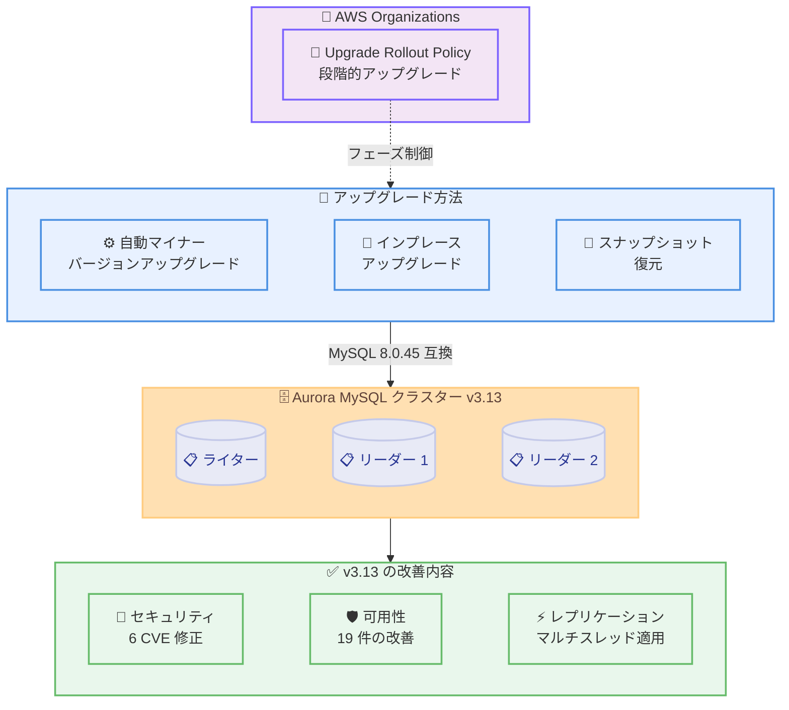

# Amazon Aurora MySQL 3.13 - MySQL 8.0.45 互換の一般提供開始

**リリース日**: 2026 年 8 月 28 日
**サービス**: Amazon Aurora MySQL
**機能**: Aurora MySQL 3.13 (MySQL 8.0.45 互換) の一般提供開始

📊 [このアップデートのインフォグラフィックを見る](https://takech9203.github.io/aws-news-summary/20260828-amazon-aurora-mysql-313-available.html)

## 概要

Amazon Aurora MySQL - Compatible Edition 3 (MySQL 8.0 互換) が、MySQL 8.0.45 をサポートする Aurora MySQL 3.13 の一般提供を開始しました。このリリースには、MySQL コミュニティ版の修正と Aurora 固有の改善が含まれています。

Aurora MySQL 3.13 では、High 1 件・Medium 5 件の CVE 修正に加え、パーティション操作や書き込み転送 (write forwarding)、Enhanced Binlog、Aurora Serverless のスケーリングなどに関連する予期しないインスタンス再起動を防止する 19 件の可用性改善が実施されています。また、リーダーインスタンスでライターからの変更をマルチスレッドで適用することによる Aurora 物理レプリケーションのパフォーマンス向上も含まれています。

アップグレードは、自動マイナーバージョンアップグレードを有効にすることでスケジュールされたメンテナンスウィンドウ中に実行できます。多数のデータベースを管理している場合は、自動マイナーバージョンアップグレードと AWS Organizations の Upgrade Rollout Policy を組み合わせることで、クラスター全体のアップグレードを段階的にオーケストレーションできます。マイナーバージョンアップグレードはインプレースまたはスナップショット復元で実行可能です。

**アップデート前の課題**

- CVE-2026-46863 (High) を含む既知のセキュリティ脆弱性への対応が必要だった
- `ALTER TABLE ... REORGANIZE PARTITION` などのパーティション操作と並行アクセスの競合により、データベースインスタンスが再起動する可能性があった
- 書き込み転送や Enhanced Binlog、Aurora Serverless のスケーリング操作などで、予期しない再起動やレプリケーション遅延が発生する可能性があった
- Aurora 物理レプリケーションの変更適用がリーダーインスタンス上でシングルスレッドで処理され、パフォーマンスに制約があった

**アップデート後の改善**

- High 1 件・Medium 5 件の CVE が修正され、セキュリティリスクが軽減された
- 19 件の可用性改善により、予期しないデータベース再起動のリスクが大幅に低減された
- リーダーインスタンスでの変更適用がマルチスレッド化され、Aurora 物理レプリケーションのパフォーマンスが向上した
- MySQL 8.0.45 までのコミュニティバグ修正がすべて取り込まれた

## アーキテクチャ図



Aurora MySQL 3.13 へのアップグレードは、自動マイナーバージョンアップグレード、インプレースアップグレード、またはスナップショット復元で実行できます。AWS Organizations の Upgrade Rollout Policy を使用すると、複数クラスターのアップグレードを段階的にオーケストレーションできます。

## サービスアップデートの詳細

### 主要機能

1. **セキュリティ修正**
   - High 重要度の CVE-2026-46863 を修正
   - CVE-2026-21936、CVE-2026-21937、CVE-2026-21941、CVE-2026-21948、CVE-2026-21968 の 5 件の Medium CVE を修正

2. **可用性改善 (19 件)**
   - `ALTER TABLE ... REORGANIZE PARTITION`、`DROP PARTITION`、`ADD PARTITION` 実行中に並行操作 (performance schema クエリ、全文検索の最適化、統計収集など) が同じテーブルにアクセスした場合の再起動を修正
   - ライターインスタンスでの DDL 操作がリーダーインスタンス上の特定の SQL ステートメントをブロックまたは強制終了する問題を修正
   - グローバルデータベースのスイッチオーバー中に一時テーブルのクリーンアップ処理でライターが再起動し、スイッチオーバー完了時間が長くなる問題を修正
   - binlog 有効時に大きなトランザクションのコミットでリードレプリカが再起動する問題を修正
   - Aurora Serverless のスケーリング中に InnoDB バッファプールのリサイズ遅延によりインスタンスが応答不能・再起動となる問題を修正
   - 書き込み転送有効時のライター・リーダー再起動に関する複数の問題を修正
   - Enhanced Binlog 有効時の再起動や、レプリカの一時的な切断・再接続による `AuroraReplicaLag` の一時的なスパイクを修正
   - OOM 回避メカニズムがメモリ逼迫時にメモリを回復しようとしてインスタンスが再起動する問題を修正
   - リーダーインスタンスでライターからの変更をマルチスレッドで適用することにより、Aurora 物理レプリケーションのパフォーマンスを改善

3. **一般的な改善 (12 件)**
   - 書き込み転送有効時に `aurora_replica_read_consistency` を `global` に設定したリーダーセッションで最新のコミット済み変更を読み取れない問題を修正
   - `ORDER BY DESC` と範囲比較・`LIMIT` の組み合わせで結果が昇順で返される問題を修正
   - Enhanced Binlog 有効時の binlog レプリカで `replica_preserve_commit_order` 設定を正しく尊重するようコミット順序を修正
   - `aurora_in_memory_relaylog` の固定キャッシュサイズ (128 MB) を超える binlog イベント処理時のレプリケーションエラーを修正
   - ZDP / ZDR 操作中のインスタンス可用性の遅延や、ゼロダウンタイムアップグレード後に接続状態が保持されない問題を修正
   - `INPLACE` アルゴリズムを使用したオンライン DDL 操作中にリーダーが `ERROR 1146` を報告する問題を修正

4. **MySQL コミュニティ版のバグ修正の統合**
   - MySQL 8.0.45 までのすべてのコミュニティバグ修正を含む
   - MySQL 8.0.42 で導入されたリグレッション (パーティションキー列が `DEFAULT CURRENT_TIMESTAMP` を使用する場合、プリペアドステートメントまたはストアドプロシージャによるパーティションテーブルへの挿入が `ERROR 1748` で失敗する問題、Bug#119784) を修正

5. **アップグレードと移行**
   - データベースクラスターのクローン操作の完了に長時間かかる問題を修正

## 技術仕様

### バージョン情報

| 項目 | 詳細 |
|------|------|
| Aurora MySQL バージョン | 3.13.0 |
| 互換 MySQL バージョン | 8.0.45 |
| リリースノート上の日付 | 2026 年 8 月 27 日 |
| 対象 | Aurora MySQL - Compatible Edition 3 |

### 修正された CVE

| CVE | 重要度 |
|-----|--------|
| CVE-2026-46863 | High |
| CVE-2026-21936 | Medium |
| CVE-2026-21937 | Medium |
| CVE-2026-21941 | Medium |
| CVE-2026-21948 | Medium |
| CVE-2026-21968 | Medium |

### アップグレード方法の比較

| 方法 | ダウンタイム | 特徴 |
|------|------------|------|
| 自動マイナーバージョンアップグレード | メンテナンスウィンドウ中 | 有効化するとメンテナンスウィンドウで自動適用 |
| インプレースアップグレード | ZDP により最小化 | 既存クラスターをそのままアップグレード |
| スナップショット復元 | 切り替え時間 | スナップショットから新バージョンのクラスターを作成 |
| Blue/Green デプロイメント | 最小限 (通常数秒) | Aurora MySQL v2 からのメジャーバージョンアップグレードにも利用可能 |

### AWS Organizations Upgrade Rollout Policy

多数のクラスターを運用する組織では、Upgrade Rollout Policy を使用してアップグレードを段階的に実行できます。

- 組織内のアカウント・クラスターをフェーズに分けてアップグレードを展開
- 開発環境から本番環境への段階的なロールアウトを一元管理
- 自動マイナーバージョンアップグレードと組み合わせて運用負荷を軽減

## 設定方法

### 前提条件

1. 既存の Aurora MySQL v3.x クラスターが稼働していること
2. 適切な IAM 権限 (rds:ModifyDBCluster など) を持つこと
3. アップグレード前にスナップショットを取得しておくこと

### 手順

#### ステップ 1: 現在のバージョンの確認

```bash
aws rds describe-db-clusters \
  --db-cluster-identifier my-aurora-cluster \
  --query 'DBClusters[0].EngineVersion'
```

現在の Aurora MySQL クラスターのエンジンバージョンを確認します。

#### ステップ 2: インプレースアップグレードの実行

```bash
aws rds modify-db-cluster \
  --db-cluster-identifier my-aurora-cluster \
  --engine-version 8.0.mysql_aurora.3.13.0 \
  --apply-immediately
```

DB クラスターを変更して Aurora MySQL 3.13.0 にインプレースでアップグレードします。`--apply-immediately` を指定すると即座に適用されます。省略するとメンテナンスウィンドウ中に適用されます。

#### ステップ 3: 自動マイナーバージョンアップグレードの有効化

```bash
aws rds modify-db-instance \
  --db-instance-identifier my-aurora-instance \
  --auto-minor-version-upgrade \
  --apply-immediately
```

自動マイナーバージョンアップグレードを有効にすると、今後のマイナーバージョンがメンテナンスウィンドウ中に自動的に適用されます。

#### ステップ 4: アップグレード後のバージョン確認

```bash
aws rds describe-db-clusters \
  --db-cluster-identifier my-aurora-cluster \
  --query 'DBClusters[0].{EngineVersion:EngineVersion,Status:Status}'
```

アップグレードが完了し、クラスターが `available` ステータスであることを確認します。

## メリット

### ビジネス面

- **セキュリティリスクの軽減**: High 1 件を含む 6 件の CVE が修正され、データベースのセキュリティ態勢が向上
- **可用性の向上**: 19 件の再起動原因となる問題が修正され、サービスの安定稼働に貢献
- **大規模環境の運用効率化**: Upgrade Rollout Policy により、組織全体のアップグレードを段階的かつ一元的に管理可能

### 技術面

- **レプリケーションパフォーマンスの向上**: リーダーインスタンスでの変更適用のマルチスレッド化により物理レプリケーションが高速化
- **書き込み転送の安定性向上**: 書き込み転送に関連する複数の再起動・整合性の問題を修正
- **Enhanced Binlog の信頼性向上**: コミット順序の保証やレプリカ再接続によるラグスパイクの修正

## デメリット・制約事項

### 制限事項

- マイナーバージョンアップグレードにはデータベースの再起動が必要 (ZDP が適用される場合を除く)
- Aurora MySQL v2 からのアップグレードはメジャーバージョンアップグレードとなり、別途計画が必要
- `aurora_in_memory_relaylog` のキャッシュサイズは 128 MB 固定

### 考慮すべき点

- アップグレード前にアプリケーションの互換性を開発環境でテストすること
- カスタムパラメータグループの設定が新バージョンと互換性があることを確認すること
- MySQL 8.0.42 のパーティション関連リグレッション (Bug#119784) の影響を受けていた場合は、本バージョンで解消されるため早期の適用を検討すること
- 自動マイナーバージョンアップグレードを有効にする場合は、メンテナンスウィンドウの時間帯が業務影響の少ない時間に設定されているか確認すること

## ユースケース

### ユースケース 1: セキュリティ脆弱性への迅速な対応

**シナリオ**: High 重要度の CVE-2026-46863 に対応するため、本番環境の Aurora MySQL クラスターを早急にアップグレードしたい。

**実装例**:
```bash
# Blue/Green デプロイメントで安全にアップグレード
aws rds create-blue-green-deployment \
  --blue-green-deployment-name security-upgrade-313 \
  --source arn:aws:rds:ap-northeast-1:123456789012:cluster:prod-aurora-cluster \
  --target-engine-version 8.0.mysql_aurora.3.13.0

# Green 環境でのテスト完了後にスイッチオーバー
aws rds switchover-blue-green-deployment \
  --blue-green-deployment-identifier security-upgrade-313 \
  --switchover-timeout 300
```

**効果**: Blue/Green デプロイメントにより、最小限のダウンタイムでセキュリティパッチを適用でき、問題発生時のロールバックも容易。

### ユースケース 2: Upgrade Rollout Policy による組織全体の段階的アップグレード

**シナリオ**: AWS Organizations 配下の複数アカウントで多数の Aurora MySQL クラスターを運用しており、開発環境から本番環境へ段階的にアップグレードを展開したい。

**実装例**:
```bash
# 各クラスターで自動マイナーバージョンアップグレードを有効化した上で、
# Organizations 管理アカウントから Upgrade Rollout Policy をアタッチ
aws organizations create-policy \
  --name aurora-mysql-phased-upgrade \
  --type UPGRADE_ROLLOUT_POLICY \
  --content file://upgrade-rollout-policy.json

aws organizations attach-policy \
  --policy-id p-examplepolicyid \
  --target-id ou-exampleouid
```

**効果**: 開発 → ステージング → 本番の順にフェーズを分けてアップグレードを自動展開でき、大規模環境でのアップグレード運用負荷とリスクを大幅に低減。

### ユースケース 3: レプリケーション遅延に課題のある読み取り負荷の高いワークロード

**シナリオ**: 読み取りクエリの多いワークロードで、リーダーインスタンスへの変更適用の遅延が課題となっている。

**実装例**:
```bash
# クラスターを 3.13.0 にアップグレードした後、レプリカラグを監視
aws cloudwatch get-metric-statistics \
  --namespace AWS/RDS \
  --metric-name AuroraReplicaLag \
  --dimensions Name=DBClusterIdentifier,Value=my-aurora-cluster \
  --start-time 2026-08-28T00:00:00Z \
  --end-time 2026-08-29T00:00:00Z \
  --period 300 \
  --statistics Average
```

**効果**: リーダーインスタンスでのマルチスレッド適用により物理レプリケーションのパフォーマンスが向上し、レプリカラグの改善が期待できる。

## 料金

Aurora MySQL 3.13 へのアップグレード自体に追加料金はありません。標準の Amazon Aurora MySQL 料金が適用されます。Blue/Green デプロイメントを使用する場合は、デプロイメント期間中の追加クラスターリソース料金が発生します。

| 項目 | 料金 |
|------|------|
| マイナーバージョンアップグレード | 無料 |
| Aurora MySQL クラスター | [標準料金](https://aws.amazon.com/rds/aurora/pricing/) |
| Blue/Green デプロイメント | デプロイメント期間中の追加リソース料金 |

## 利用可能リージョン

Aurora MySQL が利用可能なすべての AWS リージョンでサポートされます。

## 関連サービス・機能

- **AWS Organizations Upgrade Rollout Policy**: 組織全体でのアップグレードの段階的なオーケストレーション
- **Amazon RDS Blue/Green Deployments**: 最小限のダウンタイムでのデータベースアップグレード
- **Zero Downtime Patching (ZDP)**: 接続を維持したままのパッチ適用
- **Aurora Global Database**: マルチリージョンでの耐障害性 (本バージョンでスイッチオーバー時の問題も修正)
- **Amazon CloudWatch**: アップグレード中および後のデータベースモニタリング

## 参考リンク

- 📊 [インフォグラフィック](https://takech9203.github.io/aws-news-summary/20260828-amazon-aurora-mysql-313-available.html)
- [公式発表 (What's New)](https://aws.amazon.com/about-aws/whats-new/2026/08/amazon-aurora-mysql-313-available/)
- [Aurora MySQL 3.13.0 リリースノート](https://docs.aws.amazon.com/AmazonRDS/latest/AuroraMySQLReleaseNotes/AuroraMySQL.Updates.3130.html)
- [MySQL 8.0 リリースノート](https://dev.mysql.com/doc/relnotes/mysql/8.0/en/)
- [自動マイナーバージョンアップグレード](https://docs.aws.amazon.com/AmazonRDS/latest/AuroraUserGuide/USER_UpgradeDBInstance.Upgrading.html#USER_UpgradeDBInstance.Upgrading.AutoMinorVersionUpgrades)
- [Aurora MySQL の開始方法](https://docs.aws.amazon.com/AmazonRDS/latest/AuroraUserGuide/CHAP_GettingStartedAurora.html)
- [Amazon Aurora 製品ページ](https://aws.amazon.com/rds/aurora/)

## まとめ

Amazon Aurora MySQL 3.13 (MySQL 8.0.45 互換) の一般提供により、High 1 件を含む 6 件の CVE 修正、19 件の可用性改善、リーダーインスタンスでのマルチスレッド適用による物理レプリケーションのパフォーマンス向上が利用可能になりました。特に書き込み転送、Enhanced Binlog、Aurora Serverless、グローバルデータベースを利用している環境では多くの安定性改善が含まれるため、早期のアップグレードを推奨します。多数のクラスターを運用している場合は、自動マイナーバージョンアップグレードと AWS Organizations の Upgrade Rollout Policy の活用を検討してください。
