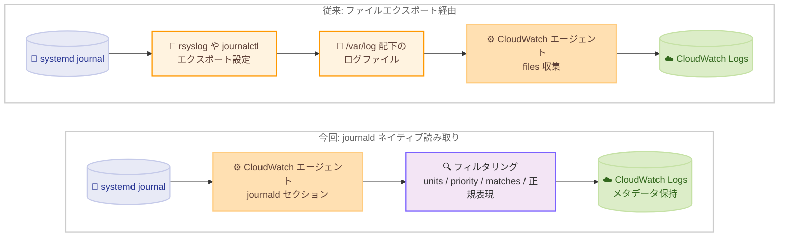

# Amazon CloudWatch - CloudWatch エージェントが journald ログの収集をサポート

**リリース日**: 2026 年 8 月 28 日
**サービス**: Amazon CloudWatch (CloudWatch エージェント)
**機能**: systemd journal (journald) ログのネイティブ収集

📊 [このアップデートのインフォグラフィックを見る](https://takech9203.github.io/aws-news-summary/20260828-amazon-cloudwatch-agent-journald.html)

## 概要

Amazon CloudWatch エージェントが、Linux インスタンス上の systemd journal (journald) からログエントリを直接読み取り、CloudWatch Logs に送信する機能をサポートしました。これまで必要だったディスク上のファイルへの書き出しを経由せずに、journald のログをそのまま収集できます。

Amazon Linux 2023 をはじめとする最近の Linux ディストリビューションでは、journald が主要なロギングシステムとして採用されており、`/var/log/messages` などの従来型のログファイルは既定では作成されません。このため、これまで CloudWatch Logs にシステムログを送るには、journal の内容をファイルにエクスポートする追加設定が必要でした。今回のアップデートにより、エージェントが journald をネイティブに読み取れるようになり、systemd unit、priority、プロセス情報といった journald が記録する構造化メタデータを保持したままログを収集できます。

さらに、systemd unit、priority レベル、journal フィールドマッチによるフィルタリングに加え、発行前の正規表現フィルタも適用できるため、ノイズの削減とログ量・コストの制御に有効です。EC2 やオンプレミスで Linux サーバーを運用し、システムログの一元管理を行いたいユーザーに広く役立つアップデートです。

**アップデート前の課題**

- Amazon Linux 2023 などの journald 中心のディストリビューションでは `/var/log/messages` などのログファイルが既定で作成されず、CloudWatch エージェントの `files` 収集で直接扱えなかった
- journal の内容を CloudWatch Logs に送るには、rsyslog の導入や `journalctl` によるファイルエクスポートなどの追加設定・運用が必要だった
- ファイル経由の収集では、systemd unit 名や priority などの journald の構造化メタデータが失われやすかった
- 中間ファイルの書き出しにより、ディスク I/O やログローテーションの管理といった余分な負担が発生していた

**アップデート後の改善**

- CloudWatch エージェントが systemd journal を直接読み取り、ファイルへの書き出しなしで CloudWatch Logs に送信できるようになった
- systemd unit、priority、プロセス情報などの構造化メタデータを保持したままログを収集できるようになった
- systemd unit、priority レベル、journal フィールドマッチによる柔軟なフィルタリングが可能になった
- 発行前に正規表現フィルタ (include / exclude) を適用でき、ノイズ削減とログ取り込みコストの最適化が可能になった

## アーキテクチャ図



従来はファイルへのエクスポートを挟む必要がありましたが、今回のアップデートによりエージェントが journald を直接読み取り、フィルタリングを適用した上でメタデータを保持したまま CloudWatch Logs に送信できます。

## サービスアップデートの詳細

### 主要機能

1. **journald ログのネイティブ収集**
   - Linux インスタンス上の systemd journal からログエントリを直接読み取り、CloudWatch Logs に送信
   - ディスク上のファイルへの中間書き出しが不要
   - エージェント設定ファイルに `journald` セクションを追加するだけで有効化可能
   - エージェント再起動時は、最後に収集した journal エントリから収集を再開 (過去のログは遡って収集しない)

2. **構造化メタデータの保持**
   - journald が記録する systemd unit、priority、プロセス情報などの構造化メタデータを保持
   - `_UID`、`_PID`、`_SYSTEMD_UNIT` などの trusted フィールドを活用したフィルタリングが可能

3. **柔軟なフィルタリング機能**
   - `units`: systemd unit 名の配列で対象を絞り込み。ワイルドカード対応 (例: `sshd*` は `sshd.service` と `sshd@1.service` にマッチ)
   - `priority`: 収集する最小の priority レベルを指定 (指定レベル以上の重要度を収集)。既定は `info`
   - `matches`: journal フィールドのマッチ条件で絞り込み。同一オブジェクト内は AND 条件、複数オブジェクト間は OR 条件
   - `filters`: 発行前に RE2 構文の正規表現で include / exclude フィルタを適用
   - `units`、`priority`、`matches` を同一エントリで併用した場合はすべての条件を満たすエントリのみ収集

## 技術仕様

### journald セクションの設定項目

| 項目 | 必須 | 詳細 |
|------|------|------|
| `collect_list` | 必須 | 収集対象の journal ログエントリの定義の配列 |
| `log_group_name` | 必須 | 送信先ロググループ名。`{instance_id}`、`{hostname}`、`{local_hostname}`、`{ip_address}` の変数を利用可能 |
| `log_stream_name` | 任意 | ログストリーム名。省略時はグローバル `logs` セクションの値、さらに既定値 `{instance_id}` にフォールバック |
| `units` | 任意 | 収集対象の systemd unit 名の配列。ワイルドカード対応。省略時は全 unit を収集 |
| `priority` | 任意 | 収集する最小 priority レベル。有効値: `emerg`、`alert`、`crit`、`err`、`warning`、`notice`、`info`、`debug`。既定は `info` |
| `matches` | 任意 | journal フィールドのマッチオブジェクトの配列。フィールド名は大文字・小文字を区別 |
| `filters` | 任意 | `type` (`include` / `exclude`) と `expression` (RE2 構文の正規表現) による発行前フィルタ |
| `retention_in_days` | 任意 | ロググループの保持期間。1〜3653 の定義済みの値から選択。`logs:PutRetentionPolicy` 権限が必要 |

### priority レベルの対応

| priority 指定 | 収集されるレベル |
|---------------|------------------|
| `err` | `emerg` (0)、`alert` (1)、`crit` (2)、`err` (3) |
| `info` (既定) | `info` 以上 (`debug` を除くすべて) |
| `debug` | すべてのレベル |

### 設定例

```json
{
  "logs": {
    "logs_collected": {
      "journald": {
        "collect_list": [
          {
            "log_group_name": "journald-all-logs",
            "log_stream_name": "{instance_id}",
            "retention_in_days": 7
          },
          {
            "log_group_name": "journald-errors",
            "log_stream_name": "{instance_id}",
            "priority": "err",
            "retention_in_days": 7
          },
          {
            "log_group_name": "journald-sshd",
            "log_stream_name": "{instance_id}",
            "units": ["sshd"],
            "filters": [
              { "type": "include", "expression": ".*user.*" },
              { "type": "exclude", "expression": ".*successful.*" }
            ],
            "retention_in_days": 7
          }
        ]
      }
    }
  }
}
```

## 設定方法

### 前提条件

1. 最新バージョンの CloudWatch エージェントに更新済みであること
2. インスタンスに CloudWatch Logs への書き込み権限 (`CloudWatchAgentServerPolicy` など) を持つ IAM ロールがアタッチされていること
3. エージェントを root 以外のユーザーで実行する場合、そのユーザーが `systemd-journal` グループに所属していること (journal の読み取りに必要)
4. SELinux 環境では amazon-cloudwatch-agent-selinux ポリシーのバージョン 1.1.0 以降が必要

### 手順

#### ステップ 1: CloudWatch エージェントを最新バージョンに更新

```bash
sudo yum update amazon-cloudwatch-agent
```

パッケージマネージャーを使用して CloudWatch エージェントを最新バージョンに更新します。journald サポートを利用するには最新のエージェントバージョンが必要です。

#### ステップ 2: エージェント設定ファイルに journald セクションを追加

```bash
sudo vi /opt/aws/amazon-cloudwatch-agent/etc/amazon-cloudwatch-agent.json
```

エージェント設定ファイルの `logs.logs_collected` 配下に `journald` セクションを追加します。前述の設定例のように、`collect_list` に送信先ロググループやフィルタ条件を定義します。

#### ステップ 3: エージェントを再起動して設定を反映

```bash
sudo /opt/aws/amazon-cloudwatch-agent/bin/amazon-cloudwatch-agent-ctl \
  -a fetch-config -m ec2 -s \
  -c file:/opt/aws/amazon-cloudwatch-agent/etc/amazon-cloudwatch-agent.json
```

`amazon-cloudwatch-agent-ctl` コマンドで新しい設定ファイルを読み込み、エージェントを再起動します。再起動後、journald のログエントリが CloudWatch Logs に送信され始めます。

#### ステップ 4: CloudWatch Logs でログを確認

```bash
aws logs tail journald-all-logs --follow
```

AWS CLI の `logs tail` コマンドで、指定したロググループに journald のログが到着していることを確認します。

## メリット

### ビジネス面

- **運用コストの削減**: journal のファイルエクスポート設定や rsyslog の導入・維持が不要になり、ロギング基盤の構築・運用工数を削減できる
- **ログコストの最適化**: priority や正規表現によるフィルタリングで不要なログの取り込みを抑制し、CloudWatch Logs の取り込み・保存コストを制御できる
- **コンプライアンス対応の強化**: sshd や systemd-logind などのセキュリティ関連 unit のログを確実に一元収集でき、監査要件への対応が容易になる

### 技術面

- **メタデータの保持**: systemd unit、priority、プロセス情報などの構造化メタデータが失われず、CloudWatch Logs Insights などでの分析精度が向上する
- **ディスク I/O の削減**: 中間ファイルへの書き出しが不要になり、ディスク使用量とログローテーション管理の負担が軽減される
- **モダンディストリビューションとの親和性**: Amazon Linux 2023 など journald 中心のディストリビューションで、追加設定なしにシステムログを収集できる

## デメリット・制約事項

### 制限事項

- Linux インスタンス専用の機能であり、Windows では利用できない
- エージェントは再起動時に最後に収集したエントリから再開するため、過去 (履歴) の journal エントリは収集されない
- 正規表現フィルタの構文はエージェントによって検証されないため、非効率な正規表現による性能低下 (ReDoS) に注意が必要

### 考慮すべき点

- root 以外のユーザーでエージェントを実行する場合、`systemd-journal` グループへの追加が必要
- `retention_in_days` を既存ロググループに設定すると、保持期間より古いログが削除されるため注意が必要
- journal フィールド名は大文字・小文字が区別され、trusted フィールドは `_UID` のようにアンダースコア始まりの大文字表記が一般的
- 複数のフィルタを使用する場合、除外率の高いフィルタを先に配置すると処理効率が向上する

## ユースケース

### ユースケース 1: Amazon Linux 2023 のシステムログ一元管理

**シナリオ**: Amazon Linux 2023 に移行したところ `/var/log/messages` が存在せず、これまでのファイルベースのログ収集設定が機能しなくなった。追加のエクスポート設定なしでシステムログを CloudWatch Logs に集約したい。

**実装例**:
```json
"journald": {
  "collect_list": [
    {
      "log_group_name": "/ec2/al2023/system",
      "log_stream_name": "{instance_id}",
      "retention_in_days": 30
    }
  ]
}
```

**効果**: rsyslog の導入や journal のエクスポート設定なしで、すべての systemd journal ログを CloudWatch Logs に集約でき、移行後の運用がシンプルになる。

### ユースケース 2: エラーログのみの選別収集によるコスト最適化

**シナリオ**: 大規模なフリートで全ログを取り込むとコストが増大するため、障害調査に必要なエラーレベル以上のログのみを収集したい。

**実装例**:
```json
"journald": {
  "collect_list": [
    {
      "log_group_name": "/ec2/fleet/errors",
      "log_stream_name": "{instance_id}",
      "priority": "err",
      "retention_in_days": 90
    }
  ]
}
```

**効果**: `emerg` から `err` までの重要度の高いログのみが取り込まれ、CloudWatch Logs の取り込みコストを抑えつつ障害検知・調査に必要な情報を確保できる。

### ユースケース 3: SSH アクセス監査ログの選別収集

**シナリオ**: セキュリティ監査のために sshd のログを収集したいが、成功ログなどのノイズを除外して監査対象のイベントに絞り込みたい。

**実装例**:
```json
"journald": {
  "collect_list": [
    {
      "log_group_name": "/security/sshd-audit",
      "log_stream_name": "{instance_id}",
      "units": ["sshd"],
      "filters": [
        { "type": "include", "expression": ".*user.*" },
        { "type": "exclude", "expression": ".*successful.*" }
      ],
      "retention_in_days": 365
    }
  ]
}
```

**効果**: sshd の unit に限定した上で正規表現フィルタによりノイズを除外し、監査に必要なログのみを長期保存できる。

## 料金

CloudWatch エージェントの journald サポート自体に追加料金はありません。取り込まれたログに対して、標準の Amazon CloudWatch Logs の料金 (取り込み、保存、分析) が適用されます。

フィルタリング機能を活用して取り込むログ量を絞り込むことで、コストを制御できます。詳細は [Amazon CloudWatch 料金ページ](https://aws.amazon.com/cloudwatch/pricing/) を参照してください。

## 利用可能リージョン

すべての AWS 商用リージョンおよび AWS GovCloud (US) リージョンで利用可能です。

## 関連サービス・機能

- **Amazon CloudWatch Logs**: journald ログの送信先。Logs Insights によるクエリ分析、メトリクスフィルタ、サブスクリプションフィルタと組み合わせて活用できる
- **AWS Systems Manager**: エージェント設定ファイルを SSM パラメータストアで管理し、Run Command でフリート全体に設定を配布できる
- **Amazon EC2 / Amazon Linux 2023**: journald を主要ロギングシステムとして採用しており、本機能の主な対象環境
- **Amazon CloudWatch Logs Insights**: 収集したログの検索・分析に利用でき、保持されたメタデータを活用した調査が可能

## 参考リンク

- 📊 [インフォグラフィック](https://takech9203.github.io/aws-news-summary/20260828-amazon-cloudwatch-agent-journald.html)
- [公式発表 (What's New)](https://aws.amazon.com/about-aws/whats-new/2026/08/amazon-cloudwatch-agent-journald/)
- [ドキュメント: CloudWatch エージェント設定ファイルの手動作成・編集](https://docs.aws.amazon.com/AmazonCloudWatch/latest/monitoring/CloudWatch-Agent-Configuration-File-Details.html)
- [料金ページ: Amazon CloudWatch Pricing](https://aws.amazon.com/cloudwatch/pricing/)

## まとめ

CloudWatch エージェントが journald をネイティブにサポートしたことで、Amazon Linux 2023 などのモダンな Linux ディストリビューションにおけるログ収集の追加設定が不要になり、構造化メタデータを保持したままシステムログを CloudWatch Logs に集約できるようになりました。unit、priority、フィールドマッチ、正規表現による多層的なフィルタリングはログ量とコストの制御にも有効です。Amazon Linux 2023 を利用中でファイルエクスポート経由のログ収集を行っている場合は、エージェントを最新バージョンに更新し、`journald` セクションへの移行を検討することを推奨します。
