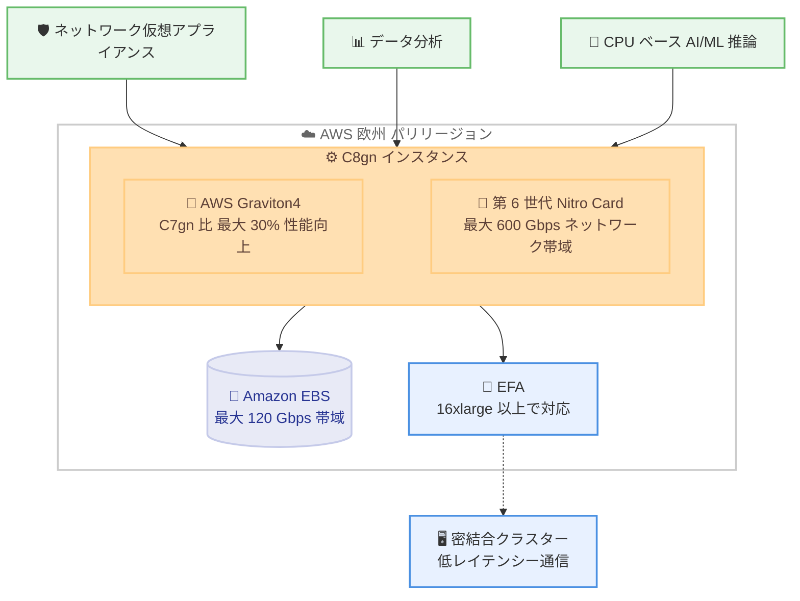

# Amazon EC2 - C8gn インスタンスが欧州 (パリ) リージョンで利用可能に

**リリース日**: 2026 年 8 月 28 日
**サービス**: Amazon EC2
**機能**: C8gn インスタンスの欧州 (パリ) リージョンへの拡大

📊 [このアップデートのインフォグラフィックを見る](https://takech9203.github.io/aws-news-summary/20260828-amazon-ec2-c8gn-europe-paris.html)

## 概要

AWS Graviton4 プロセッサを搭載した Amazon EC2 C8gn インスタンスが、欧州 (パリ) リージョンで利用可能になりました。C8gn インスタンスは、Graviton3 ベースの C7gn インスタンスと比較して最大 30% 優れたコンピューティングパフォーマンスを提供する、ネットワーク最適化されたコンピュート集約型インスタンスです。

C8gn インスタンスは最新の第 6 世代 AWS Nitro Card を搭載し、最大 600 Gbps のネットワーク帯域幅を提供します。これはネットワーク最適化 EC2 インスタンスの中で最高のネットワーク帯域幅です。ネットワーク仮想アプライアンス、データ分析、CPU ベースの AI/ML 推論など、ネットワーク集約型ワークロードのパフォーマンスとスループットを拡張しながら、コストを最適化できます。

フランス国内にデータレジデンシー要件を持つ企業や、欧州のユーザーに低レイテンシーでサービスを提供する必要があるワークロードにとって、最新世代のネットワーク最適化インスタンスをパリリージョンで直接利用できるようになったことは大きなメリットです。

**アップデート前の課題**

- 欧州 (パリ) リージョンでは C8gn インスタンスが利用できず、欧州では Frankfurt、Stockholm、Ireland、London、Spain、Zurich、Milan などのリージョンに限定されていた
- フランス国内のデータレジデンシー要件があるワークロードでは、最新の Graviton4 ベースのネットワーク最適化インスタンスを選択できなかった
- パリリージョンでネットワーク集約型ワークロードを実行する場合、旧世代の C7gn などを使用するか、他リージョンへの展開を検討する必要があった

**アップデート後の改善**

- 欧州 (パリ) リージョンで C8gn インスタンスが利用可能になり、C7gn 比で最大 30% 高いコンピュート性能を活用できるようになった
- フランス国内のデータレジデンシー要件を満たしながら、最大 600 Gbps のネットワーク帯域幅を利用できるようになった
- 欧州の主要リージョン間で一貫したインスタンスタイプを選択でき、マルチリージョン構成の設計が容易になった

## アーキテクチャ図



欧州 (パリ) リージョンで利用可能になった C8gn インスタンスの主要コンポーネントと、対象となるネットワーク集約型ワークロードの関係を示しています。

## サービスアップデートの詳細

### 主要機能

1. **AWS Graviton4 プロセッサ**
   - 最新世代の AWS 設計 ARM ベースプロセッサ Graviton4 を搭載
   - Graviton3 ベースの C7gn インスタンスと比較して最大 30% 優れたコンピューティングパフォーマンス
   - 優れた価格パフォーマンスとエネルギー効率を実現

2. **第 6 世代 AWS Nitro Card**
   - 最新の第 6 世代 Nitro Card により最大 600 Gbps のネットワーク帯域幅を実現
   - ネットワーク最適化 EC2 インスタンスの中で最高のネットワーク帯域幅
   - ネットワーク処理をオフロードし、Graviton4 の性能をワークロードに最大限活用可能

3. **スケーラブルなインスタンスサイズ**
   - 最大 48xlarge までのインスタンスサイズを提供
   - 最大 384 GiB のメモリ
   - Amazon EBS への最大 120 Gbps の帯域幅

4. **Elastic Fabric Adapter (EFA) サポート**
   - 16xlarge、24xlarge、48xlarge、metal-24xl、metal-48xl の各サイズで EFA をサポート
   - 密結合クラスターにデプロイされたワークロードのレイテンシーを低減
   - クラスター全体のスケーラビリティとパフォーマンスを向上

## 技術仕様

### インスタンス仕様

| 項目 | 詳細 |
|------|------|
| プロセッサ | AWS Graviton4 |
| Nitro Card | 第 6 世代 |
| 最大ネットワーク帯域幅 | 600 Gbps |
| 最大 EBS 帯域幅 | 120 Gbps |
| 最大インスタンスサイズ | 48xlarge (384 GiB メモリ) |
| ベアメタル | metal-24xl、metal-48xl |
| EFA サポート | 16xlarge、24xlarge、48xlarge、metal-24xl、metal-48xl |

### C7gn との比較

| 項目 | C7gn | C8gn |
|------|------|------|
| プロセッサ | Graviton3 | Graviton4 (最大 30% 性能向上) |
| Nitro Card | 第 5 世代 | 第 6 世代 |
| 最大ネットワーク帯域幅 | 200 Gbps | 600 Gbps |
| 最大インスタンスサイズ | 16xlarge | 48xlarge |

## 設定方法

### 前提条件

1. AWS アカウントを保有し、欧州 (パリ) リージョン (eu-west-3) が有効化されていること
2. EC2 インスタンスを起動する IAM 権限があること
3. ARM64 アーキテクチャ対応の AMI を使用すること (Amazon Linux 2023、Ubuntu など主要 OS は対応済み)

### 手順

#### ステップ 1: パリリージョンで利用可能なインスタンスタイプを確認

```bash
aws ec2 describe-instance-type-offerings \
  --region eu-west-3 \
  --filters "Name=instance-type,Values=c8gn.*" \
  --query "InstanceTypeOfferings[].InstanceType" \
  --output table
```

欧州 (パリ) リージョンで提供されている C8gn インスタンスサイズの一覧を取得します。

#### ステップ 2: C8gn インスタンスを起動

```bash
aws ec2 run-instances \
  --region eu-west-3 \
  --instance-type c8gn.xlarge \
  --image-id ami-xxxxxxxxxxxxxxxxx \
  --key-name my-key-pair \
  --subnet-id subnet-xxxxxxxx \
  --security-group-ids sg-xxxxxxxx
```

ARM64 対応 AMI を指定して、パリリージョンで c8gn.xlarge インスタンスを起動します。`image-id` には ARM64 アーキテクチャの AMI ID を指定してください。

#### ステップ 3: EFA 対応インスタンスの起動 (必要な場合)

```bash
aws ec2 run-instances \
  --region eu-west-3 \
  --instance-type c8gn.16xlarge \
  --image-id ami-xxxxxxxxxxxxxxxxx \
  --key-name my-key-pair \
  --network-interfaces "DeviceIndex=0,SubnetId=subnet-xxxxxxxx,Groups=sg-xxxxxxxx,InterfaceType=efa"
```

密結合クラスターワークロード向けに、EFA を有効化した c8gn.16xlarge インスタンスを起動します。EFA は 16xlarge 以上のサイズでのみ利用可能です。

## メリット

### ビジネス面

- **データレジデンシー対応**: フランス国内にデータを保持する要件を満たしながら、最新世代のネットワーク最適化インスタンスを利用可能
- **コスト最適化**: Graviton4 の優れた価格パフォーマンスにより、ネットワーク集約型ワークロードのコストを削減
- **欧州でのカバレッジ拡大**: 欧州 8 リージョンで C8gn が利用可能になり、欧州全域でのワークロード展開の選択肢が拡大

### 技術面

- **高ネットワークスループット**: 最大 600 Gbps のネットワーク帯域幅により、大量のデータ転送や高トラフィック処理が可能
- **低レイテンシー**: EFA サポートにより、密結合クラスターでの低レイテンシー通信を実現
- **スケーラビリティ**: medium から 48xlarge、ベアメタルまでの豊富なインスタンスサイズにより、ワークロードに応じた柔軟なスケーリングが可能

## デメリット・制約事項

### 制限事項

- ARM64 アーキテクチャのため、x86 向けにビルドされたアプリケーションはそのままでは動作せず、再コンパイルまたは ARM64 対応イメージへの切り替えが必要
- EFA は 16xlarge、24xlarge、48xlarge、metal-24xl、metal-48xl のサイズに限定される
- 最大 600 Gbps のネットワーク帯域幅を活用するには、大きいインスタンスサイズの選択と適切なネットワーク設計が必要

### 考慮すべき点

- 商用ソフトウェアやサードパーティ製エージェントを使用している場合、ARM64 対応状況を事前に確認する必要がある
- リージョンやサイズによってはキャパシティに制約がある場合があるため、大規模利用時はオンデマンドキャパシティ予約の活用を検討する

## ユースケース

### ユースケース 1: ネットワーク仮想アプライアンス

**シナリオ**: フランス国内のトラフィックを処理するファイアウォール、ロードバランサー、IDS/IPS などのネットワークセキュリティアプライアンスを、パリリージョンで高スループットに実行する必要がある。

**実装例**:
```
c8gn.16xlarge 以上のサイズでネットワーク仮想アプライアンスをデプロイし、
Gateway Load Balancer と組み合わせてトラフィックを分散処理する
```

**効果**: 最大 600 Gbps のネットワーク帯域幅により大規模なトラフィック処理が可能になり、セキュリティ検査を維持しながら高いスループットを実現できる。

### ユースケース 2: リアルタイムデータ分析

**シナリオ**: 欧州のユーザーから発生する大量のデータストリームを、フランス国内でリアルタイムに集約・分析する必要がある。

**実装例**:
```
c8gn.12xlarge で Apache Spark や Apache Flink のワーカーノードを構成し、
高いネットワーク帯域幅でノード間シャッフルとデータ取り込みを高速化する
```

**効果**: 高いネットワーク帯域幅と Graviton4 の優れたコンピューティングパフォーマンスにより、大量のデータを効率的に処理し、リアルタイム分析が可能になる。

### ユースケース 3: CPU ベース AI/ML 推論

**シナリオ**: データレジデンシー要件によりフランス国内で AI/ML モデルの推論を実行し、欧州のユーザーに低レイテンシーで結果を返す必要がある。

**実装例**:
```
c8gn.8xlarge で ONNX Runtime や llama.cpp などの ARM64 最適化された
推論ランタイムを実行し、Auto Scaling でリクエスト量に応じてスケールする
```

**効果**: Graviton4 の高いコンピューティングパフォーマンスと高ネットワーク帯域幅により、多数の推論リクエストを効率的に処理し、低レイテンシーで結果を返すことができる。

## 料金

C8gn インスタンスは、オンデマンドインスタンス、Savings Plans、スポットインスタンス、または専用インスタンスおよび専用ホストとして購入できます。料金はリージョンとインスタンスサイズによって異なります。

詳細な料金については、[Amazon EC2 料金ページ](https://aws.amazon.com/ec2/pricing/) を参照してください。

## 利用可能リージョン

C8gn インスタンスは、今回のパリリージョン追加により、以下の AWS リージョンで利用可能です。

- US East (N. Virginia、Ohio)
- US West (Oregon、N. California)
- Europe (Frankfurt、Stockholm、Ireland、London、Spain、Zurich、Milan、**Paris**)
- Asia Pacific (Singapore、Malaysia、Sydney、Thailand、Mumbai、Seoul、Melbourne、Jakarta、Hyderabad、Tokyo、Hong Kong)
- Middle East (UAE)
- Africa (Cape Town)
- Canada West (Calgary)、Canada (Central)
- South America (Sao Paulo)
- AWS GovCloud (US-East、US-West)

## 関連サービス・機能

- **AWS Graviton4**: 最新世代の AWS 設計の ARM ベースプロセッサ
- **AWS Nitro System**: EC2 インスタンスに高パフォーマンス、高セキュリティを提供する基盤。第 6 世代 Nitro Card が 600 Gbps のネットワーク帯域を実現
- **Elastic Fabric Adapter (EFA)**: HPC および ML アプリケーション向けの高スループット、低レイテンシーのネットワークインターフェース
- **Amazon EBS**: EC2 インスタンス向けの高性能ブロックストレージ。C8gn では最大 120 Gbps の EBS 帯域幅を利用可能

## 参考リンク

- 📊 [インフォグラフィック](https://takech9203.github.io/aws-news-summary/20260828-amazon-ec2-c8gn-europe-paris.html)
- [公式発表 (What's New)](https://aws.amazon.com/about-aws/whats-new/2026/08/amazon-ec2-c8gn-europe-paris/)
- [AWS Blog - New Amazon EC2 C8gn instances](https://aws.amazon.com/blogs/aws/new-amazon-ec2-c8gn-instances-powered-by-aws-graviton4-offering-up-to-600gbps-network-bandwidth/)
- [Amazon C8gn Instances](https://aws.amazon.com/ec2/instance-types/c8g/)
- [Level up your compute with AWS Graviton](https://aws.amazon.com/ec2/graviton/level-up-with-graviton/)

## まとめ

Amazon EC2 C8gn インスタンスが欧州 (パリ) リージョンで利用可能になり、フランス国内のデータレジデンシー要件を満たしながら、Graviton4 による最大 30% の性能向上と最大 600 Gbps のネットワーク帯域幅を活用できるようになりました。パリリージョンでネットワーク仮想アプライアンス、データ分析、CPU ベース AI/ML 推論などのネットワーク集約型ワークロードを運用している場合は、C8gn インスタンスへの移行を検討し、パフォーマンスとコストの最適化を実現してください。
