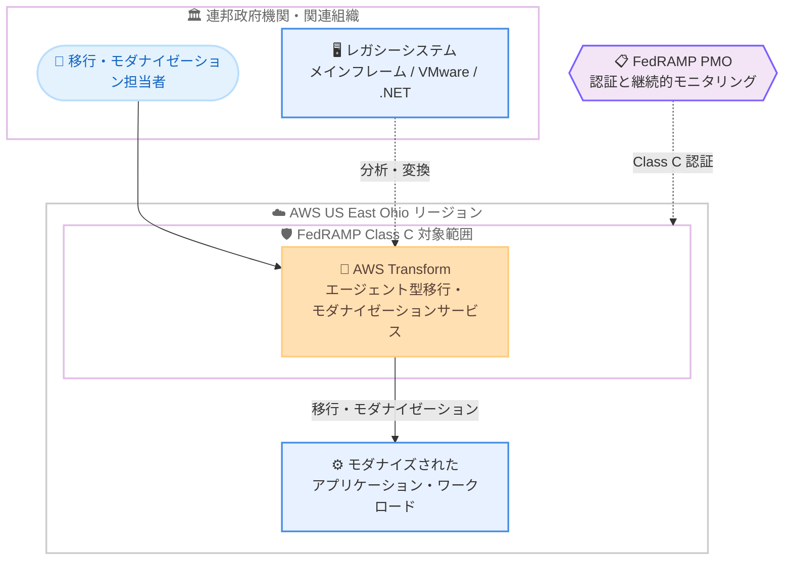

# AWS Transform - FedRAMP Class C 対象範囲に追加

**リリース日**: 2026 年 8 月 28 日
**サービス**: AWS Transform
**機能**: FedRAMP Class C (旧 Moderate ベースライン) 認証の取得

📊 [このアップデートのインフォグラフィックを見る](https://takech9203.github.io/aws-news-summary/20260828-aws-transform-fedramp-class-c.html)

## 概要

AWS Transform が US East (Ohio) リージョンにおいて FedRAMP Class C (旧 Moderate ベースライン) の対象範囲に追加されました。これにより、FedRAMP Class C 準拠が要求されるアプリケーションの構築やワークロードの実行に AWS Transform を利用できるようになります。

FedRAMP (Federal Risk and Authorization Management Program) は、クラウド製品・サービスのセキュリティ評価、認証、継続的モニタリングに対する標準化されたアプローチを提供する米国政府全体のプログラムです。2026 年の FedRAMP 統合規則 (CR26) により、従来の「Moderate ベースライン」は「Class C」、「High ベースライン」は「Class D」という名称に変更されており、今回の発表もこの新しい呼称に基づいています。

AWS Transform は、エージェント型 (agentic) の移行・モダナイゼーションサービスです。大規模なインフラストラクチャ移行から継続的な技術的負債の削減までを対象とし、移行プログラムを停滞させがちな手作業での引き継ぎやコンテキストの喪失を排除することで、エンタープライズの移行タイムラインを年単位から月単位に短縮するよう設計されています。今回の認証取得により、米国連邦政府機関やその関連組織、政府向けにサービスを提供する事業者が、コンプライアンス要件を満たしながら AWS Transform による移行・モダナイゼーションを実施できるようになりました。

**アップデート前の課題**

- FedRAMP Class C (旧 Moderate) 準拠が要求される連邦政府機関や関連組織は、AWS Transform を利用した移行・モダナイゼーションをコンプライアンス上の理由から採用できなかった
- 政府関連ワークロードの移行・モダナイゼーションでは、認証済みサービスの制約により手作業中心のアプローチを取らざるを得ず、プロジェクトが長期化しやすかった
- レガシーシステムの近代化を進めたい公共部門の組織にとって、エージェント型 AI サービスの活用にはコンプライアンス面の障壁があった

**アップデート後の改善**

- US East (Ohio) リージョンで、FedRAMP Class C 準拠が要求されるアプリケーション構築・ワークロード実行に AWS Transform を利用可能になった
- 連邦政府機関や関連組織が、コンプライアンス要件を維持したままエージェント型の移行・モダナイゼーションを実施できるようになった
- 公共部門においても、移行タイムラインを年単位から月単位へ短縮する AWS Transform の価値を享受できるようになった

## アーキテクチャ図



FedRAMP Class C 認証の対象範囲に含まれた AWS Transform を利用して、連邦政府機関がレガシーシステムをコンプライアンス要件を満たしながらモダナイズする構成を示しています。

## サービスアップデートの詳細

### 主要機能

1. **FedRAMP Class C 認証の取得**
   - US East (Ohio) リージョンにおいて、AWS Transform が FedRAMP Class C の対象範囲に追加された
   - Class C は 2026 年の FedRAMP 統合規則 (CR26) における新しい呼称で、従来の Moderate ベースラインに相当する
   - FedRAMP Class C 準拠が要求されるアプリケーションの構築とワークロードの実行に AWS Transform を利用可能

2. **エージェント型の移行・モダナイゼーション**
   - AWS Transform は AI エージェントが移行・モダナイゼーション作業を自律的に進めるサービス
   - 大規模なインフラストラクチャ移行から継続的な技術的負債の削減までを対象範囲とする
   - 手作業での引き継ぎやコンテキストの喪失といった、移行プログラムを停滞させる要因を排除する

3. **エンタープライズタイムラインの短縮**
   - 従来は年単位を要していたエンタープライズの移行・モダナイゼーションを月単位に短縮するよう設計されている
   - 公共部門の組織も、この短縮効果をコンプライアンス要件を満たしながら享受できる

## 技術仕様

### FedRAMP 認証の概要 (CR26 に基づく)

| 項目 | 詳細 |
|------|------|
| 認証レベル | FedRAMP Class C (旧 Moderate ベースライン) |
| 対象リージョン | US East (Ohio) |
| リージョングループ | AWS US East-West (FedRAMP ID: AGENCYAMAZONEW) |
| 準拠フレームワーク | NIST SP 800-53 に基づくセキュリティ管理策 (FISMA 要件対応) |
| DoD SRG 対応レベル | IL2 (US East-West リージョン) |
| 上位レベル | Class D (旧 High ベースライン) は AWS GovCloud (US) が対象 |

### FedRAMP CR26 における呼称変更

| 旧呼称 | 新呼称 (CR26) | 対応する AWS 環境 |
|--------|---------------|-------------------|
| Moderate ベースライン | Class C | AWS US East-West リージョン |
| High ベースライン | Class D | AWS GovCloud (US) |
| FedRAMP Authorized | FedRAMP Certified | - |
| JAB P-ATO | FedRAMP Certification に統合 | - |

## 設定方法

### 前提条件

1. AWS アカウントを保有していること
2. FedRAMP Class C 準拠が要求されるワークロードの場合、US East (Ohio) リージョンで AWS Transform を利用すること
3. 連邦政府機関の場合、FedRAMP Certified サービスの利用に加えて、リスク管理フレームワーク (RMF) に基づく自機関の ATO (Authority to Operate) を発行すること

### 手順

#### ステップ1: FedRAMP 対象サービスの確認

AWS の [FedRAMP 対象サービス一覧](https://aws.amazon.com/compliance/services-in-scope/FedRAMP/) で、AWS Transform が US East (Ohio) リージョンで Class C の対象範囲に含まれていることを確認します。

#### ステップ2: コンプライアンスドキュメントの取得

```bash
# AWS Artifact でパートナーパッケージを確認 (商用顧客の場合)
# マネジメントコンソール: https://console.aws.amazon.com/artifact/
```

商用顧客は AWS Artifact からパートナーパッケージにアクセスできます。政府機関のユーザーは、Package Access Request Form を package-access@fedramp.gov に提出することで、認証パッケージ全体をリクエストできます。

#### ステップ3: US East (Ohio) リージョンで AWS Transform を利用開始

US East (Ohio) リージョンで AWS Transform のジョブを構成し、移行・モダナイゼーション作業を開始します。対象ワークロードの分析、変換計画の作成、コード変換などをエージェントが実行します。詳細は [AWS Transform ユーザーガイド](https://docs.aws.amazon.com/transform/latest/userguide/what-is-service.html) を参照してください。

## メリット

### ビジネス面

- **公共部門での採用障壁の解消**: FedRAMP Class C 準拠が必須の連邦政府機関や関連組織が、AWS Transform を正式に採用できるようになった
- **移行期間の大幅短縮**: 年単位を要していたレガシーシステムの移行・モダナイゼーションを月単位に短縮でき、政府 IT 近代化の取り組みを加速できる
- **追加コスト不要のコンプライアンス**: FedRAMP 準拠のために追加の AWS サービスコストは発生しない

### 技術面

- **エージェント型アプローチ**: AI エージェントが移行作業を自律的に進めるため、手作業での引き継ぎやコンテキスト喪失によるプロジェクト停滞を回避できる
- **幅広い対象範囲**: 大規模インフラストラクチャ移行から継続的な技術的負債削減まで、モダナイゼーションのライフサイクル全体をカバーする
- **標準化されたセキュリティ評価**: NIST SP 800-53 に基づく管理策が第三者評価機関により検証されており、個別のセキュリティ評価の負担を軽減できる

## デメリット・制約事項

### 制限事項

- FedRAMP Class C の対象範囲は US East (Ohio) リージョンに限定される
- Class D (旧 High ベースライン) 相当の高影響度ワークロードは対象外であり、High 相当の要件がある場合は AWS GovCloud (US) の対象サービスを利用する必要がある
- FedRAMP Certified サービスの利用のみでは不十分で、政府機関は自機関の ATO を別途発行する必要がある

### 考慮すべき点

- CR26 により FedRAMP の呼称体系が変更されているため (Moderate → Class C、Authorized → Certified など)、組織内のコンプライアンス文書や調達要件の記載を新呼称と照合して確認することが望ましい
- FedRAMP は継続的モニタリングを前提としており、CR26 では四半期ごとの Ongoing Certification Report (OCR) や Significant Change Notification (SCN) などの仕組みが導入されている
- 日本国内の組織には FedRAMP 要件は直接適用されないが、米国政府向けにサービスを提供する場合や、政府調達水準のセキュリティ評価を参考にする場合に関連する

## ユースケース

### ユースケース1: 連邦政府機関のメインフレームモダナイゼーション

**シナリオ**: 連邦政府機関が、FedRAMP Moderate (現 Class C) 相当の管理下にあるメインフレームアプリケーションをクラウドネイティブなアーキテクチャへ移行したい。

**実装例**:
```text
1. US East (Ohio) リージョンで AWS Transform のジョブを作成
2. メインフレームのコードベースをエージェントが分析し、変換計画を作成
3. コード変換・テストを経てモダナイズされたアプリケーションをデプロイ
4. 自機関の ATO プロセスに AWS Transform の FedRAMP 認証情報を組み込む
```

**効果**: 年単位を要していたメインフレーム移行を月単位に短縮しつつ、FedRAMP Class C のコンプライアンス要件を維持できる。

### ユースケース2: 政府向け SaaS 事業者のワークロード移行

**シナリオ**: 米国政府機関向けに SaaS を提供する事業者が、FedRAMP Class C 認証取得のためにワークロードを対象リージョンへ移行・モダナイズしたい。

**実装例**:
```text
1. 既存のオンプレミスまたは他環境のワークロードを AWS Transform で分析
2. US East (Ohio) リージョンをターゲットとして移行を実行
3. AWS Artifact のパートナーパッケージを自社の FedRAMP 認証申請の証跡として活用
```

**効果**: 移行作業そのものを FedRAMP 対象サービスで実施でき、認証取得に向けたアーキテクチャ整備を効率化できる。

### ユースケース3: 公共部門における継続的な技術的負債の削減

**シナリオ**: 政府関連組織が、稼働中のシステム群に蓄積した技術的負債 (古いランタイム、非推奨フレームワークなど) を計画的に削減したい。

**実装例**:
```text
1. AWS Transform で対象アプリケーションのポートフォリオを分析
2. 技術的負債の優先順位付けと変換計画をエージェントが提示
3. 段階的にコード変換を実行し、継続的なモダナイゼーションサイクルを確立
```

**効果**: 一度きりの移行にとどまらず、コンプライアンスを維持しながら継続的にシステムの健全性を向上できる。

## 料金

FedRAMP 準拠のための追加の AWS サービスコストは発生しません。AWS Transform 自体の利用料金は、対象機能や利用量に応じて設定されています。詳細は [AWS Transform の料金ページ](https://aws.amazon.com/transform/pricing/) を参照してください。

## 利用可能リージョン

FedRAMP Class C の対象範囲として利用可能なリージョン:

- 米国東部 (オハイオ) - us-east-2

なお、AWS US East-West リージョングループ全体 (バージニア北部、オハイオ、オレゴン、北カリフォルニア) が FedRAMP Class C 認証 (FedRAMP ID: AGENCYAMAZONEW) を受けていますが、今回の発表で AWS Transform が対象範囲に含まれたのは US East (Ohio) リージョンです。

## 関連サービス・機能

- **AWS GovCloud (US)**: FedRAMP Class D (旧 High ベースライン) 認証を持つリージョン。高影響度ワークロードはこちらに配置する
- **AWS Artifact**: FedRAMP を含むコンプライアンスレポートやパートナーパッケージをセルフサービスで取得できるサービス
- **AWS Audit Manager**: FedRAMP などのフレームワークに対する証跡収集と監査準備を自動化するサービス
- **Amazon Q Developer**: コード変換支援などで AWS Transform と補完関係にある開発者向け生成 AI アシスタント

## 参考リンク

- 📊 [インフォグラフィック](https://takech9203.github.io/aws-news-summary/20260828-aws-transform-fedramp-class-c.html)
- [公式発表 (What's New)](https://aws.amazon.com/about-aws/whats-new/2026/08/aws-transform-fedramp-class-c/)
- [AWS Transform 製品ページ](https://aws.amazon.com/transform/)
- [AWS Transform ユーザーガイド](https://docs.aws.amazon.com/transform/latest/userguide/what-is-service.html)
- [AWS の FedRAMP コンプライアンス](https://aws.amazon.com/compliance/fedramp/)
- [FedRAMP 対象の AWS サービス一覧](https://aws.amazon.com/compliance/services-in-scope/FedRAMP/)

## まとめ

AWS Transform が US East (Ohio) リージョンで FedRAMP Class C (旧 Moderate ベースライン) の対象範囲に追加され、米国連邦政府機関や政府向け事業者がコンプライアンス要件を満たしながらエージェント型の移行・モダナイゼーションを利用できるようになりました。公共部門のレガシーシステム近代化を検討している組織は、FedRAMP 対象サービス一覧で認証状況を確認のうえ、US East (Ohio) リージョンでの AWS Transform 活用を検討することを推奨します。
