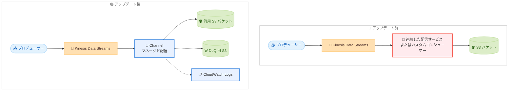

# Amazon Kinesis Data Streams - 汎用 Amazon S3 バケットへのデータ配信

**リリース日**: 2026年8月29日
**サービス**: Amazon Kinesis Data Streams
**機能**: 汎用 Amazon S3 バケットへのマネージドデータ配信 (Channel)

📊 [このアップデートのインフォグラフィックを見る](https://takech9203.github.io/aws-news-summary/20260829-data-delivery-general-purpose-s3-buckets.html)

## 概要

Amazon Kinesis Data Streams が、ストリーミングデータを汎用 Amazon S3 バケットへ直接配信する機能を発表しました。これまで S3 へのデータ配信には複数のサービスを組み合わせたパイプラインの構築や、独自のコンシューマーアプリケーションの開発・運用が必要でしたが、今回のアップデートにより、コンソールからの数クリックまたは API 経由の設定だけで、ストリームから S3 への配信を実現できます。

本機能は「Channel」と呼ばれる新しいリソースとして提供され、スケーリング、リトライ、配信の信頼性をサービス側が自動的に管理します。データは数分以内に S3 へ配信され、AWS の発表によると、セルフマネージド型の代替手段と比較して最大 60% のコスト削減が見込めるとされています。バッチ分析、ログ配信、コンプライアンス目的の長期保管、データの再生 (リプレイ) といったユースケースを持つユーザーに適しています。

**アップデート前の課題**

- 以前はストリーミングデータを S3 に格納するために、複数のサーバーレスサービスを連結する必要があり、コストと複雑性が増加していた
- 独自のコンシューマーアプリケーションをセルフマネージドなコンピューティング環境で構築・運用する場合、スケーリング、リトライ、インフラ運用を自前で管理する必要があった
- 配信パイプラインの監視や障害対応などの運用負荷が発生していた

**アップデート後の改善**

- コンソールから数クリック、または API 経由で S3 への配信を直接設定できるようになった
- サービス連結、カスタムアプリケーション、セルフマネージドなコンピューティングが不要になり、運用負荷が削減された
- スケーリング、リトライ、配信の信頼性がサービス側で自動管理され、データは数分以内に S3 へ配信される
- セルフマネージド型の代替手段と比較して最大 60% のコスト削減が見込める

## アーキテクチャ図



アップデート前は配信サービスの連結やカスタムコンシューマーの構築が必要でしたが、アップデート後は Channel リソースを設定するだけで、Kinesis Data Streams から汎用 S3 バケットへのマネージド配信が実現します。

## サービスアップデートの詳細

### 主要機能

1. **Channel によるマネージド配信**
   - ストリームと配信先 S3 バケットを紐づける「Channel」リソースを新たに提供
   - スケーリング、リトライ、配信の信頼性はサービス側が自動管理
   - データは数分以内に S3 へ配信される
   - `DataFreshnessInSeconds` パラメータで配信のバッファリング間隔を制御可能

2. **柔軟な出力設定**
   - 出力キーのテンプレート (`OutputKeyTemplate`) によるオブジェクトキーのカスタマイズ
   - ストレージクラスの選択: `STANDARD`、`INTELLIGENT_TIERING`、`GLACIER_IR`
   - 圧縮形式の選択: `NONE`、`GZIP`、`ZSTD`
   - レコード形式として `GSR_JSON` (AWS Glue Schema Registry)、`JSON`、`STRING`、`BYTE_ARRAY` をサポート

3. **信頼性・運用機能**
   - 配信に失敗したデータを別の S3 バケットへ出力するデッドレターキュー (DLQ) 設定
   - AWS KMS による暗号化設定
   - Amazon CloudWatch Logs へのログ出力設定
   - `DescribeLimits` と `DescribeStreamSummary` にチャネル数の情報が追加され、クォータの把握が容易

## 技術仕様

### Channel の主な設定項目

| 項目 | 詳細 |
|------|------|
| 配信先 | 汎用 S3 バケット (`BucketARN` で指定、`ExpectedBucketOwner` によるアカウント検証に対応) |
| データ鮮度 | `DataFreshnessInSeconds` で配信間隔を制御 |
| レコード形式 | `GSR_JSON` / `JSON` / `STRING` / `BYTE_ARRAY` |
| ストレージクラス | `STANDARD` / `INTELLIGENT_TIERING` / `GLACIER_IR` |
| 圧縮 | `NONE` / `GZIP` / `ZSTD` |
| エラー処理 | DLQ 用 S3 バケットと `ErrorOutputPrefix` を設定可能 |
| 暗号化 | AWS KMS (`EncryptionType: KMS`) |
| ログ | CloudWatch Logs へのロググループ / ログストリーム出力 |
| 実行ロール | `ServiceExecutionRoleARN` で S3 への書き込み権限を付与 |

### API変更履歴

| 日付 | サービス | 変更内容 |
|------|----------|----------|
| 2026/08/31 | [Amazon Kinesis](https://awsapichanges.com/archive/changes/65de2a-kinesis.html) | 5 new 2 updated api methods - S3 Tables および汎用 S3 バケットへのデータ配信をサポートする `CreateChannel`、`UpdateChannel`、`DeleteChannel`、`DescribeChannel`、`ListChannels` API を追加。`DescribeLimits` と `DescribeStreamSummary` にチャネル数関連のフィールドを追加 |

### CreateChannel API のリクエスト例

```json
{
  "ChannelName": "orders-to-s3",
  "ServiceExecutionRoleARN": "arn:aws:iam::123456789012:role/KinesisChannelRole",
  "StreamConfigurationList": [
    {
      "StreamARN": "arn:aws:kinesis:ap-northeast-1:123456789012:stream/orders",
      "RecordConfiguration": {
        "RecordFormatType": "JSON"
      }
    }
  ],
  "S3DestinationConfiguration": {
    "DataFreshnessInSeconds": 300,
    "StorageConfiguration": {
      "BucketARN": "arn:aws:s3:::my-analytics-bucket",
      "OutputKeyTemplate": "orders/",
      "StorageClass": "STANDARD",
      "CompressionType": "GZIP"
    },
    "DeadLetterQueueS3Configuration": {
      "BucketARN": "arn:aws:s3:::my-dlq-bucket",
      "ErrorOutputPrefix": "errors/"
    }
  }
}
```

## 設定方法

### 前提条件

1. 配信元となる Kinesis Data Streams のストリームが作成済みであること
2. 配信先となる汎用 S3 バケットが作成済みであること
3. Kinesis Data Streams が S3 バケットへ書き込むための IAM ロール (サービス実行ロール) が作成済みであること

### 手順

#### ステップ1: サービス実行ロールの準備

```bash
aws iam create-role \
  --role-name KinesisChannelRole \
  --assume-role-policy-document file://trust-policy.json
```

Kinesis Data Streams のサービスが引き受け、配信先 S3 バケットへの書き込み権限を持つ IAM ロールを作成します。信頼ポリシーと S3 書き込み権限のポリシーを適切に設定します。

#### ステップ2: Channel の作成

```bash
aws kinesis create-channel \
  --channel-name orders-to-s3 \
  --service-execution-role-arn arn:aws:iam::123456789012:role/KinesisChannelRole \
  --stream-configuration-list '[{"StreamARN":"arn:aws:kinesis:ap-northeast-1:123456789012:stream/orders","RecordConfiguration":{"RecordFormatType":"JSON"}}]' \
  --s3-destination-configuration '{"DataFreshnessInSeconds":300,"StorageConfiguration":{"BucketARN":"arn:aws:s3:::my-analytics-bucket","StorageClass":"STANDARD","CompressionType":"GZIP"}}'
```

ストリームと配信先 S3 バケットを指定して Channel を作成します。データ鮮度、ストレージクラス、圧縮形式などをここで設定します。コンソールからも数クリックで同様の設定が可能です。

#### ステップ3: Channel の状態確認

```bash
aws kinesis describe-channel \
  --channel-arn arn:aws:kinesis:ap-northeast-1:123456789012:channel/orders-to-s3
```

作成した Channel の状態を確認します。`ChannelStatus` が `ACTIVE` になると配信が開始され、以降はストリームに投入されたデータが数分以内に S3 バケットへ配信されます。

## メリット

### ビジネス面

- **コスト削減**: セルフマネージド型の代替手段と比較して最大 60% のコスト削減が見込める。課金は正常に配信されたデータに対してのみ発生し、初期費用や最低利用料金は不要
- **市場投入までの時間短縮**: パイプライン構築が不要になり、ストリーミングデータの S3 集約を短時間で開始できる
- **運用負荷の削減**: スケーリング、リトライ、インフラ運用をサービス側に任せられるため、チームは分析やアプリケーション開発に集中できる

### 技術面

- **アーキテクチャの簡素化**: サービスの連結やカスタムコンシューマーが不要になり、構成要素と障害点が減少する
- **柔軟な出力制御**: 出力キーテンプレート、ストレージクラス、圧縮形式、レコード形式を用途に応じて選択できる
- **信頼性の確保**: DLQ 設定により配信失敗データを別バケットへ退避でき、CloudWatch Logs によるロギングで運用監視も可能

## デメリット・制約事項

### 制限事項

- 配信は準リアルタイム (数分以内) であり、ミリ秒単位の低レイテンシー処理が必要な場合は従来どおりコンシューマーアプリケーションが必要
- アカウントごとに作成可能なチャネル数には上限があり、`DescribeLimits` API で確認が必要
- 対象のストリームは On Demand Advantage (ODA) および On Demand Standard (ODS) キャパシティモードをサポート

### 考慮すべき点

- 既存の配信パイプラインからの移行時は、出力形式やオブジェクトキー構造の互換性を確認する必要がある
- データ変換や動的パーティショニングなど高度な ETL 処理が必要な場合は、要件を満たせるか事前に検証が必要
- サービス実行ロールの権限設計 (S3 書き込み、KMS、CloudWatch Logs) を適切に行う必要がある

## ユースケース

### ユースケース1: ログデータの S3 集約とバッチ分析

**シナリオ**: アプリケーションログを Kinesis Data Streams に集約し、Amazon Athena でのバッチ分析のために S3 へ保存したい。

**実装例**:
```
1. アプリケーションから Kinesis Data Streams へログを送信
2. Channel を作成し、GZIP 圧縮 + JSON 形式で S3 バケットへ配信
3. Athena でテーブルを定義し、S3 上のログをクエリ
```

**効果**: 配信パイプラインの構築・運用なしで、ログの集約から分析までの基盤を短期間で構築できる。

### ユースケース2: コンプライアンス目的の長期保管

**シナリオ**: 金融取引イベントを規制要件に基づき低コストで長期間保管する必要がある。

**実装例**:
```
1. 取引イベントを Kinesis Data Streams へ送信
2. Channel のストレージクラスに GLACIER_IR、圧縮に ZSTD を指定
3. KMS 暗号化を有効化し、S3 バケットへ配信
```

**効果**: 低コストのストレージクラスへ直接配信することで、保管コストを抑えつつコンプライアンス要件を満たせる。

### ユースケース3: 障害時のデータ再生基盤

**シナリオ**: 下流の処理システムに障害が発生した場合に備え、ストリームデータの生データを S3 に保持し、再処理 (リプレイ) できるようにしたい。

**実装例**:
```
1. 本番ストリームに Channel を設定し、全データを S3 へ配信
2. DLQ 用バケットと ErrorOutputPrefix を設定し、配信失敗データも捕捉
3. 障害発生時は S3 上のデータをバッチ処理で再投入
```

**効果**: ストリームの保持期間を超えたデータも S3 から再生でき、障害復旧やバックフィルの選択肢が広がる。

## 料金

使用量ベースの料金体系で、初期費用や最低利用料金はありません。課金は正常に配信されたデータに対してのみ発生します。On Demand Advantage (ODA) および On Demand Standard (ODS) キャパシティモードをサポートします。

詳細な料金は [Amazon Kinesis Data Streams 料金ページ](https://aws.amazon.com/kinesis/data-streams/pricing/) を参照してください。

## 利用可能リージョン

Amazon Kinesis Data Streams が利用可能なすべての AWS リージョンで利用できます (AWS GovCloud (US) および中国リージョンを含む)。

## 関連サービス・機能

- **Amazon S3**: 配信先となる汎用バケット。ストレージクラスや暗号化設定と組み合わせて利用
- **Amazon S3 Tables**: 同時期の API 変更で Apache Iceberg ベースの S3 Tables への配信もサポートされており、分析用途ではこちらも選択肢となる
- **Amazon Data Firehose**: 従来から S3 配信に利用されてきたサービス。データ変換など高度な処理が必要な場合は引き続き有力な選択肢
- **AWS Glue Schema Registry**: レコード形式 `GSR_JSON` を使用する場合にスキーマ管理として連携
- **Amazon Athena**: S3 に配信されたデータのバッチ分析に活用

## 参考リンク

- 📊 [インフォグラフィック](https://takech9203.github.io/aws-news-summary/20260829-data-delivery-general-purpose-s3-buckets.html)
- [公式発表 (What's New)](https://aws.amazon.com/about-aws/whats-new/2026/08/kinesis/data-delivery-general-purpose-s3-buckets)
- [Amazon Kinesis Data Streams 開発者ガイド](https://docs.aws.amazon.com/streams/latest/dev/)
- [料金ページ](https://aws.amazon.com/kinesis/data-streams/pricing/)
- [API 変更詳細 (awsapichanges.com)](https://awsapichanges.com/archive/changes/65de2a-kinesis.html)

## まとめ

Kinesis Data Streams から汎用 S3 バケットへの配信が、Channel リソースの設定だけで実現できるようになりました。これまで配信パイプラインの構築や運用に工数をかけていた場合は、コスト削減 (最大 60%) と運用簡素化の観点から移行を検討する価値があります。まずは開発環境で Channel を作成し、出力形式やデータ鮮度の設定が要件に合うか検証することを推奨します。
