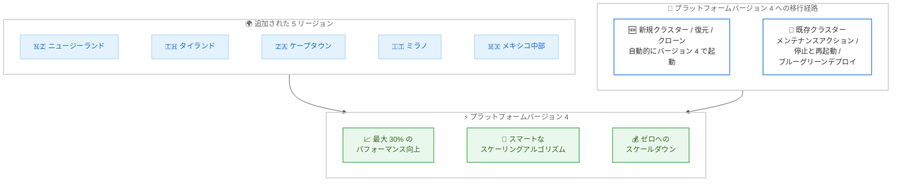

# Amazon Aurora - Aurora Serverless の 30% パフォーマンス向上とスマートスケーリングが追加リージョンで利用可能に

**リリース日**: 2026 年 8 月 31 日
**サービス**: Amazon Aurora
**機能**: Aurora Serverless プラットフォームバージョン 4 (最大 30% のパフォーマンス向上と強化されたスケーリング) の追加リージョン展開

📊 [このアップデートのインフォグラフィックを見る](https://takech9203.github.io/aws-news-summary/20260831-amazon-aurora-serverless-performance-improvement-additional-regions.html)

## 概要

Amazon Aurora Serverless の最大 30% のパフォーマンス向上と強化されたスケーリングが、新たに 5 つの AWS リージョンで利用可能になりました。今回追加されたのは、アジアパシフィック (ニュージーランド)、アジアパシフィック (タイランド)、アフリカ (ケープタウン)、欧州 (ミラノ)、メキシコ (中部) の各リージョンです。この機能強化は Aurora PostgreSQL 互換エディションと Aurora MySQL 互換エディションの両方に適用されます。

Aurora Serverless は、需要の高いワークロードに対して自動的にスケールアップし、アイドル時にはゼロまでスケールダウンするため、実際の使用量に対してのみ課金されます。今回展開された更新版のスケーリングアルゴリズムは、複数のタスクがリソースを奪い合うワークロード (ビジー状態の Web アプリケーションや API サービスなど) を効率的に処理します。トラフィックのバースト、長いアイドル期間、予測不可能な需要を特徴とするエージェント型 AI アプリケーションにも適しています。

これらの機能強化は**プラットフォームバージョン 4** として追加コストなしで提供されます。新規クラスター、復元、クローンは自動的にプラットフォームバージョン 4 で起動します。既存クラスターは、保留中のメンテナンスアクション、停止と再起動、またはブルー/グリーンデプロイのいずれかの方法でアップグレードできます。

**アップデート前の課題**

- 上記 5 リージョンの Aurora Serverless では、プラットフォームバージョン 4 によるパフォーマンス向上と改善されたスケーリングアルゴリズムを利用できなかった
- 複数のタスクがリソースを奪い合うワークロードでは、従来のスケーリング動作が需要変化に最適に追従できない場合があった
- グローバル展開するアプリケーションで、リージョンによって Aurora Serverless の性能特性に差が生じていた

**アップデート後の改善**

- 上記 5 リージョンでも最大 30% のパフォーマンス向上と強化されたスケーリングを追加コストなしで利用できるようになった
- 更新されたスケーリングアルゴリズムにより、リソース競合が発生するワークロードやエージェント型 AI のような予測不可能なワークロードを効率的に処理できるようになった
- 新規クラスター、復元、クローンは自動的にプラットフォームバージョン 4 で起動するため、新規利用では追加作業が不要になった

## アーキテクチャ図



追加された 5 リージョンでプラットフォームバージョン 4 の機能強化が利用可能になり、新規クラスターは自動的に、既存クラスターは 3 つの移行経路のいずれかでバージョン 4 に移行できることを示しています。

## サービスアップデートの詳細

### 主要機能

1. **最大 30% のパフォーマンス向上**
   - Aurora Serverless のデータベースパフォーマンスが従来比で最大 30% 向上
   - Aurora PostgreSQL 互換エディションと Aurora MySQL 互換エディションの両方に適用
   - 追加コストなしで利用可能

2. **強化されたスケーリングアルゴリズム**
   - 複数のタスクがリソースを奪い合うワークロードを効率的に処理
   - ビジー状態の Web アプリケーションや API サービスに有効
   - トラフィックのバースト、アイドル期間、予測不可能な需要を持つエージェント型 AI アプリケーションに適合

3. **プラットフォームバージョン 4 としての提供**
   - 新規クラスター、復元、クローンは自動的にプラットフォームバージョン 4 で起動
   - 既存クラスターは保留中のメンテナンスアクション、停止と再起動、またはブルー/グリーンデプロイでアップグレード可能

## 技術仕様

### 今回追加されたリージョン

| リージョン | リージョンコード |
|------|------|
| アジアパシフィック (ニュージーランド) | ap-southeast-6 |
| アジアパシフィック (タイランド) | ap-southeast-7 |
| アフリカ (ケープタウン) | af-south-1 |
| 欧州 (ミラノ) | eu-south-1 |
| メキシコ (中部) | mx-central-1 |

### プラットフォームバージョン 4 への移行方法

| 対象 | 移行方法 |
|------|------|
| 新規クラスター | 自動的にプラットフォームバージョン 4 で起動 |
| スナップショットからの復元 | 自動的にプラットフォームバージョン 4 で起動 |
| クローン | 自動的にプラットフォームバージョン 4 で起動 |
| 既存クラスター | 保留中のメンテナンスアクションの適用、停止と再起動、またはブルー/グリーンデプロイ |

## 設定方法

### 前提条件

1. AWS アカウントを保有していること
2. 対象リージョンで Aurora PostgreSQL 互換または Aurora MySQL 互換のクラスターを利用すること
3. 既存クラスターをアップグレードする場合は、メンテナンスウィンドウまたは移行方法を計画すること

### 手順

#### ステップ1: 新規 Aurora Serverless クラスターの作成

```bash
aws rds create-db-cluster \
  --db-cluster-identifier my-serverless-cluster \
  --engine aurora-postgresql \
  --engine-version 17.4 \
  --serverless-v2-scaling-configuration MinCapacity=0,MaxCapacity=64 \
  --master-username admin \
  --manage-master-user-password \
  --region af-south-1
```

対象リージョン (例: アフリカ (ケープタウン)) に Aurora Serverless クラスターを作成します。新規クラスターは自動的にプラットフォームバージョン 4 で起動し、最小キャパシティを 0 ACU に設定することでアイドル時のゼロスケールが有効になります。

#### ステップ2: サーバーレスインスタンスの追加

```bash
aws rds create-db-instance \
  --db-instance-identifier my-serverless-instance \
  --db-cluster-identifier my-serverless-cluster \
  --db-instance-class db.serverless \
  --engine aurora-postgresql \
  --region af-south-1
```

クラスターに `db.serverless` インスタンスクラスのインスタンスを追加します。これにより、設定したキャパシティ範囲内で自動スケーリングが行われます。

#### ステップ3: 既存クラスターの保留中メンテナンスアクションの確認と適用

```bash
# 保留中のメンテナンスアクションを確認
aws rds describe-pending-maintenance-actions \
  --region af-south-1

# メンテナンスアクションを即時適用
aws rds apply-pending-maintenance-action \
  --resource-identifier arn:aws:rds:af-south-1:123456789012:cluster:my-serverless-cluster \
  --apply-action system-update \
  --opt-in-type immediate \
  --region af-south-1
```

既存クラスターに対して保留中のメンテナンスアクションを確認し、即時適用することでプラットフォームバージョン 4 にアップグレードします。ダウンタイムを最小化したい場合は、ブルー/グリーンデプロイの利用を検討してください。

## メリット

### ビジネス面

- **追加コストなしの性能向上**: 既存の料金体系のまま最大 30% のパフォーマンス向上を得られるため、コストパフォーマンスが改善される
- **グローバル展開の一貫性**: 追加された 5 リージョンでも同等の性能特性が得られ、リージョン間で一貫したユーザー体験を提供できる
- **従量課金の最適化**: アイドル時のゼロスケールと組み合わせることで、使用した分のみの支払いを維持しながら性能を向上できる

### 技術面

- **リソース競合への対応力向上**: 更新されたスケーリングアルゴリズムにより、複数タスクがリソースを奪い合うワークロードを効率的に処理できる
- **エージェント型 AI への適合**: バースト、アイドル、予測不可能な需要という特性を持つ AI エージェントのワークロードに対応できる
- **移行の柔軟性**: メンテナンスアクション、停止と再起動、ブルー/グリーンデプロイという複数の移行経路から選択できる

## デメリット・制約事項

### 制限事項

- 機能強化はプラットフォームバージョン 4 で提供されるため、既存クラスターは何らかのアップグレード操作が必要
- 保留中のメンテナンスアクションの適用や停止と再起動では、一時的なダウンタイムが発生する可能性がある

### 考慮すべき点

- ダウンタイムの影響を最小化したい本番環境では、ブルー/グリーンデプロイによる移行を検討する
- パフォーマンス向上の効果 (最大 30%) はワークロードの特性によって異なるため、移行後に実際の性能を検証することを推奨
- ゼロスケールを利用する場合、再開時のレイテンシーがアプリケーション要件に適合するか確認する

## ユースケース

### ユースケース1: 新興リージョンでの Web アプリケーション / API サービス

**シナリオ**: タイランドやニュージーランドなどの新しいリージョンで、トラフィック変動の大きい Web アプリケーションや API サービスを運用する。

**実装例**:
```
Aurora PostgreSQL Serverless クラスター (MinCapacity=0.5, MaxCapacity=128) を
ap-southeast-7 に作成し、更新されたスケーリングアルゴリズムで
複数の API リクエストによるリソース競合を効率的に処理
```

**効果**: ピーク時の性能を確保しながら、閑散時のコストを最小化できる。

### ユースケース2: エージェント型 AI アプリケーションのバックエンド

**シナリオ**: AI エージェントが必要なときに突発的にデータベースへクエリを発行し、その後長時間アイドル状態になるアプリケーションを、追加されたリージョンで展開する。

**実装例**:
```
Aurora MySQL Serverless クラスター (MinCapacity=0, MaxCapacity=64) を
mx-central-1 に作成し、ゼロスケールとバースト対応を両立
```

**効果**: アイドル期間のコストをゼロに抑えつつ、バースト時にはスマートなスケーリングで需要に追従できる。

### ユースケース3: 既存クラスターのプラットフォームバージョン 4 への移行

**シナリオ**: ケープタウンリージョンで稼働中の既存 Aurora Serverless クラスターに、ダウンタイムを最小化しながら性能向上を適用する。

**実装例**:
```
ブルー/グリーンデプロイを作成し、グリーン環境で
プラットフォームバージョン 4 の動作を検証した後、切り替えを実行
```

**効果**: 本番トラフィックへの影響を最小限に抑えながら、最大 30% のパフォーマンス向上を安全に適用できる。

## 料金

プラットフォームバージョン 4 による機能強化は**追加コストなし**で提供されます。Aurora Serverless の料金は従来どおり、使用した ACU 時間 (Aurora Capacity Unit) に基づく従量課金です。アイドル時に 0 ACU までスケールダウンした場合、コンピューティング料金は発生しません (ストレージおよび I/O 料金は別途発生)。

詳細は [Amazon Aurora の料金ページ](https://aws.amazon.com/rds/aurora/pricing/) を参照してください。

## 利用可能リージョン

今回のアップデートにより、以下の 5 リージョンで新たに利用可能になりました。

- アジアパシフィック (ニュージーランド)
- アジアパシフィック (タイランド)
- アフリカ (ケープタウン)
- 欧州 (ミラノ)
- メキシコ (中部)

既存の提供リージョンについては、公式ドキュメントを参照してください。

## 関連サービス・機能

- **Amazon Aurora PostgreSQL 互換エディション**: 今回の機能強化の適用対象。PostgreSQL 互換のフルマネージドデータベース
- **Amazon Aurora MySQL 互換エディション**: 今回の機能強化の適用対象。MySQL 互換のフルマネージドデータベース
- **Amazon RDS ブルー/グリーンデプロイ**: 既存クラスターをダウンタイムを最小化しながらプラットフォームバージョン 4 へ移行する手段
- **Aurora Serverless の高速スケーリング**: 2026 年 8 月に発表された、スケールアップ時に 1 秒以内で最大 12 ACU を確保する機能強化 (プラットフォームバージョン 3 / 4 で有効)

## 参考リンク

- 📊 [インフォグラフィック](https://takech9203.github.io/aws-news-summary/20260831-amazon-aurora-serverless-performance-improvement-additional-regions.html)
- [公式発表 (What's New)](https://aws.amazon.com/about-aws/whats-new/2026/08/amazon-aurora-serverless-performance-improvement-additional-regions/)
- [Amazon Aurora Serverless 製品ページ](https://aws.amazon.com/rds/aurora/serverless/)
- [ドキュメント: Aurora Serverless v2 ユーザーガイド](https://docs.aws.amazon.com/AmazonRDS/latest/AuroraUserGuide/aurora-serverless-v2.html)
- [料金ページ](https://aws.amazon.com/rds/aurora/pricing/)

## まとめ

Aurora Serverless の最大 30% のパフォーマンス向上とスマートなスケーリングが、ニュージーランド、タイランド、ケープタウン、ミラノ、メキシコ中部の 5 リージョンに拡大されました。追加コストなしで利用でき、新規クラスターは自動的にプラットフォームバージョン 4 で起動します。対象リージョンで既存の Aurora Serverless クラスターを運用している場合は、メンテナンスアクションまたはブルー/グリーンデプロイによるプラットフォームバージョン 4 への移行を検討してください。
