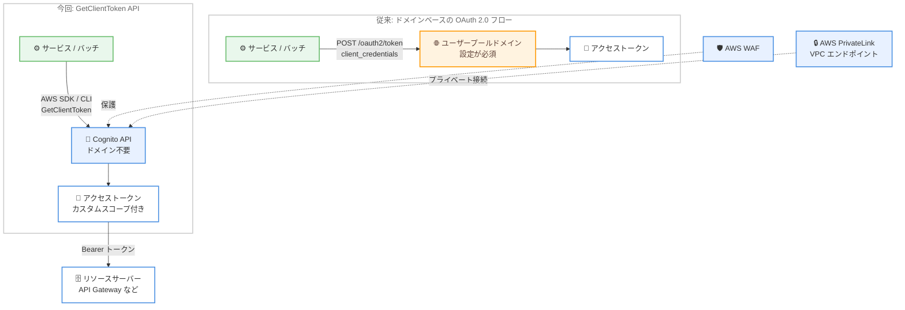

# Amazon Cognito - ユーザープールドメイン不要のマシン間認可 GetClientToken API

**リリース日**: 2026 年 8 月 31 日
**サービス**: Amazon Cognito
**機能**: GetClientToken API によるマシン間 (M2M) 認可

📊 [このアップデートのインフォグラフィックを見る](https://takech9203.github.io/aws-news-summary/20260831-amazon-cognito-get-client-token.html)

## 概要

Amazon Cognito が新しい API オペレーション `GetClientToken` をサポートしました。これにより、アプリクライアントはユーザープールドメインを設定することなく、AWS SDK、CLI、または API を通じて直接マシン間 (M2M) 認可用のアクセストークンを取得できるようになりました。アプリケーション、マイクロサービス、自動化ワークロードにおけるサービス間通信の認可に、新しい選択肢が追加されたことになります。

`GetClientToken` API では、アプリクライアントがクライアント ID とクライアントシークレットで認証を行い、リソースサーバーのカスタムスコープが付与されたアクセストークンを受け取ります。AWS ネイティブの API オペレーションであるため、AWS SDK とシームレスに統合され、AWS WAF や VPC インターフェイスエンドポイント (AWS PrivateLink) にも対応します。なお、従来のユーザープールドメインベースの OAuth 2.0 クライアントクレデンシャルフローも引き続き利用可能です。

**アップデート前の課題**

- M2M 認可 (OAuth 2.0 クライアントクレデンシャルフロー) を利用するには、ユーザープールドメインの設定が必須だった
- トークン取得はユーザープールドメイン上の `/oauth2/token` エンドポイントへの HTTP リクエストで行う必要があり、AWS SDK のネイティブな認証情報管理やエラーハンドリングの恩恵を受けられなかった
- ドメインエンドポイント経由のアクセスでは、VPC 内に閉じたプライベートなトークン取得経路の構成が難しかった

**アップデート後の改善**

- ユーザープールドメインを設定せずに、`GetClientToken` API で M2M 用アクセストークンを直接取得できるようになった
- AWS SDK / CLI / API から呼び出せるネイティブオペレーションとなり、既存の AWS ツールチェーンに統合しやすくなった
- AWS WAF による保護と、VPC インターフェイスエンドポイント (AWS PrivateLink) 経由のプライベートアクセスに対応した

## アーキテクチャ図



従来はユーザープールドメイン上の OAuth 2.0 トークンエンドポイントが必須でしたが、今回のアップデートにより AWS SDK / CLI から `GetClientToken` を呼び出すだけでアクセストークンを取得できるようになりました。

## サービスアップデートの詳細

### 主要機能

1. **ユーザープールドメイン不要のトークン取得**
   - `GetClientToken` API オペレーションにより、ドメイン設定なしで M2M 用アクセストークンを発行
   - アプリクライアントはクライアント ID とクライアントシークレットで認証
   - 取得したトークンには、リソースサーバーに定義したカスタムスコープが付与される

2. **AWS ネイティブ API としての統合**
   - AWS SDK、CLI、API から直接呼び出し可能
   - AWS WAF によるリクエスト保護に対応 (ユーザープールに関連付けた Web ACL で評価)
   - VPC インターフェイスエンドポイント (AWS PrivateLink) 経由のプライベートアクセスに対応

3. **専用の認証フロー ALLOW_CLIENT_TOKEN_AUTH**
   - アプリクライアントで `ALLOW_CLIENT_TOKEN_AUTH` 認証フローを有効化して利用
   - このフローはユーザー認証フローと排他であり、アプリクライアントに設定する唯一の認証フローである必要がある
   - 既存のドメインベース OAuth 2.0 クライアントクレデンシャルフローは引き続き利用可能

## 技術仕様

### GetClientToken API の仕様

| 項目 | 詳細 |
|------|------|
| リクエスト: ClientId | アクセストークンを要求するアプリクライアントの ID (必須) |
| リクエスト: Secret | アプリクライアントの有効なシークレット (必須、24〜64 文字) |
| リクエスト: Scopes | 認可するカスタムスコープの配列。`リソースサーバー識別子/スコープ名` 形式、最大 50 件。省略時はアプリクライアントに設定済みのスコープを認可 |
| リクエスト: ClientMetadata | Lambda トリガーに渡すカスタムキーバリューペア (任意) |
| レスポンス | `ClientAuthenticationResult` オブジェクト (`AccessToken`、`ExpiresIn`、`TokenType`) |
| 前提条件 | アプリクライアントにクライアントシークレットの設定と `ALLOW_CLIENT_TOKEN_AUTH` フローの有効化が必要 |
| IAM 認可 | この API では IAM ポリシーは評価されない (IAM 認証情報による認可は不可) |

### API変更履歴

| 日付 | サービス | 変更内容 |
|------|----------|----------|
| 2026/08/28 | [cognito-idp](https://awsapichanges.com/archive/changes/b6cdac-cognito-idp.html) | 2 new api methods - `GetClientToken` (SDK 経由の M2M 認可) と `DescribeTermsByClient` (アプリクライアントに関連付けられた Terms の取得) を追加 |

### リクエスト / レスポンス例

```json
// リクエスト
{
  "ClientId": "1example23456789",
  "Secret": "abcdef123456example",
  "Scopes": ["my-api/read", "my-api/write"]
}

// レスポンス
{
  "ClientAuthenticationResult": {
    "AccessToken": "eyJraWQiOi...",
    "ExpiresIn": 3600,
    "TokenType": "Bearer"
  }
}
```

## 設定方法

### 前提条件

1. Amazon Cognito ユーザープールが作成済みであること
2. ユーザープールにリソースサーバーとカスタムスコープが定義済みであること
3. AWS CLI または AWS SDK が利用可能であること

### 手順

#### ステップ1: リソースサーバーとカスタムスコープの作成

```bash
aws cognito-idp create-resource-server \
  --user-pool-id <ユーザープール ID> \
  --identifier my-api \
  --name "My API" \
  --scopes ScopeName=read,ScopeDescription="Read access" ScopeName=write,ScopeDescription="Write access"
```

ユーザープールにリソースサーバー `my-api` を作成し、`read` と `write` の 2 つのカスタムスコープを定義しています。

#### ステップ2: M2M 用アプリクライアントの作成

```bash
aws cognito-idp create-user-pool-client \
  --user-pool-id <ユーザープール ID> \
  --client-name m2m-client \
  --generate-secret \
  --explicit-auth-flows ALLOW_CLIENT_TOKEN_AUTH \
  --allowed-o-auth-scopes my-api/read my-api/write
```

クライアントシークレット付きのアプリクライアントを作成し、認証フローとして `ALLOW_CLIENT_TOKEN_AUTH` のみを有効化しています。このフローはユーザー認証フローと併用できないため、単独で設定する必要があります。

#### ステップ3: GetClientToken によるアクセストークンの取得

```bash
aws cognito-idp get-client-token \
  --client-id <クライアント ID> \
  --secret <クライアントシークレット> \
  --scopes my-api/read
```

クライアント ID とシークレットで認証し、カスタムスコープ `my-api/read` が付与されたアクセストークンを取得しています。取得したトークンは、API Gateway などのリソースサーバーへのリクエストで Bearer トークンとして使用できます。

## メリット

### ビジネス面

- **セットアップの簡素化**: ユーザープールドメインの設計・管理が不要になり、M2M 認可の導入までの時間を短縮できる
- **運用負荷の軽減**: ドメインエンドポイントの管理が不要になり、AWS ネイティブの運用ツールに統合できる
- **セキュリティ要件への対応**: PrivateLink 対応により、インターネットを経由しないトークン取得が求められる企業要件を満たしやすい

### 技術面

- **AWS SDK / CLI とのネイティブ統合**: 認証情報の管理、リトライ、エラーハンドリングなど SDK の機能をそのまま活用できる
- **プライベートネットワーク対応**: VPC インターフェイスエンドポイント経由でトークンを取得でき、閉域構成が可能
- **AWS WAF による保護**: ユーザープールに関連付けた Web ACL でトークン発行リクエストを保護できる

## デメリット・制約事項

### 制限事項

- `ALLOW_CLIENT_TOKEN_AUTH` フローはユーザー認証フローと排他であり、アプリクライアントに設定する唯一の認証フローである必要がある
- アプリクライアントにはクライアントシークレットの設定が必須
- この API では IAM ポリシーが評価されないため、IAM 認証情報による認可や IAM ポリシーでの権限付与はできない
- Scopes は最大 50 件、`リソースサーバー識別子/スコープ名` 形式のカスタムスコープのみ指定可能

### 考慮すべき点

- クライアントシークレットの安全な管理が必要 (AWS Secrets Manager などの利用を推奨)
- `ClientMetadata` は保存・検証・暗号化されないため、機密情報を含めない
- 既存のドメインベース OAuth 2.0 フローを利用中のワークロードは、移行の要否を含めてどちらの方式を採用するか検討が必要

## ユースケース

### ユースケース1: マイクロサービス間の API 認可

**シナリオ**: バックエンドのマイクロサービスが、API Gateway で公開された別サービスの API を呼び出す際にアクセストークンによる認可を行いたい。

**実装例**:
```python
import boto3
import requests

client = boto3.client("cognito-idp")
resp = client.get_client_token(
    ClientId="1example23456789",
    Secret="<クライアントシークレット>",
    Scopes=["orders-api/read"],
)
token = resp["ClientAuthenticationResult"]["AccessToken"]

requests.get(
    "https://api.example.com/orders",
    headers={"Authorization": f"Bearer {token}"},
)
```

**効果**: ユーザープールドメインを構成せずに、SDK だけでサービス間認可を実装できる。

### ユースケース2: VPC 内に閉じたバッチワークロードの認可

**シナリオ**: プライベートサブネットで動作するバッチ処理が、インターネットに出ることなくアクセストークンを取得したい。

**実装例**:
```bash
# Cognito 用の VPC インターフェイスエンドポイントを作成し、
# バッチ処理から get-client-token を呼び出す
aws cognito-idp get-client-token \
  --client-id <クライアント ID> \
  --secret <クライアントシークレット> \
  --scopes batch-api/execute
```

**効果**: AWS PrivateLink 経由でトークンを取得でき、閉域ネットワーク要件を満たしたまま M2M 認可を実現できる。

### ユースケース3: CI/CD パイプラインからの保護された API 呼び出し

**シナリオ**: デプロイパイプラインがデプロイ後の検証のために、カスタムスコープで保護された内部 API を呼び出したい。

**実装例**:
```bash
TOKEN=$(aws cognito-idp get-client-token \
  --client-id "$CLIENT_ID" \
  --secret "$CLIENT_SECRET" \
  --scopes deploy-api/verify \
  --query 'ClientAuthenticationResult.AccessToken' \
  --output text)

curl -H "Authorization: Bearer $TOKEN" https://internal.example.com/verify
```

**効果**: パイプラインに OAuth 用の HTTP クライアント実装を持ち込むことなく、AWS CLI のみで認可付き API 呼び出しを構成できる。

## 料金

標準の Amazon Cognito M2M 料金が適用されます。M2M 認可の料金は、月あたりの M2M アプリクライアント数とトークンリクエスト数に基づいて課金されます。詳細は [Amazon Cognito 料金ページ](https://aws.amazon.com/cognito/pricing/) を参照してください。

## 利用可能リージョン

Amazon Cognito ユーザープールが利用可能なすべての AWS リージョンで利用できます (東京、大阪リージョンを含む)。

## 関連サービス・機能

- **Amazon API Gateway**: Cognito オーソライザーと組み合わせて、取得したアクセストークンのスコープに基づく API 認可を実現
- **AWS PrivateLink**: VPC インターフェイスエンドポイントにより、閉域ネットワークからのトークン取得をサポート
- **AWS WAF**: ユーザープールに関連付けた Web ACL でトークン発行リクエストを保護
- **AWS Secrets Manager**: クライアントシークレットの安全な保管とローテーションに活用

## 参考リンク

- 📊 [インフォグラフィック](https://takech9203.github.io/aws-news-summary/20260831-amazon-cognito-get-client-token.html)
- [公式発表 (What's New)](https://aws.amazon.com/about-aws/whats-new/2026/08/amazon-cognito-get-client-token/)
- [GetClientToken API リファレンス](https://docs.aws.amazon.com/cognito-user-identity-pools/latest/APIReference/API_GetClientToken.html)
- [Amazon Cognito 開発者ガイド - スコープ、M2M、リソースサーバー](https://docs.aws.amazon.com/cognito/latest/developerguide/cognito-user-pools-define-resource-servers.html)
- [料金ページ](https://aws.amazon.com/cognito/pricing/)

## まとめ

`GetClientToken` API の登場により、ユーザープールドメインを設定せずに AWS SDK / CLI だけでマシン間認可のアクセストークンを取得できるようになりました。PrivateLink や AWS WAF に対応した AWS ネイティブな経路が加わったことで、閉域要件のあるワークロードやマイクロサービス間認可の構成が大幅に簡素化されます。M2M 認可を利用中または検討中の場合は、`ALLOW_CLIENT_TOKEN_AUTH` フローの排他制約を確認したうえで、新方式の採用を検討することを推奨します。
