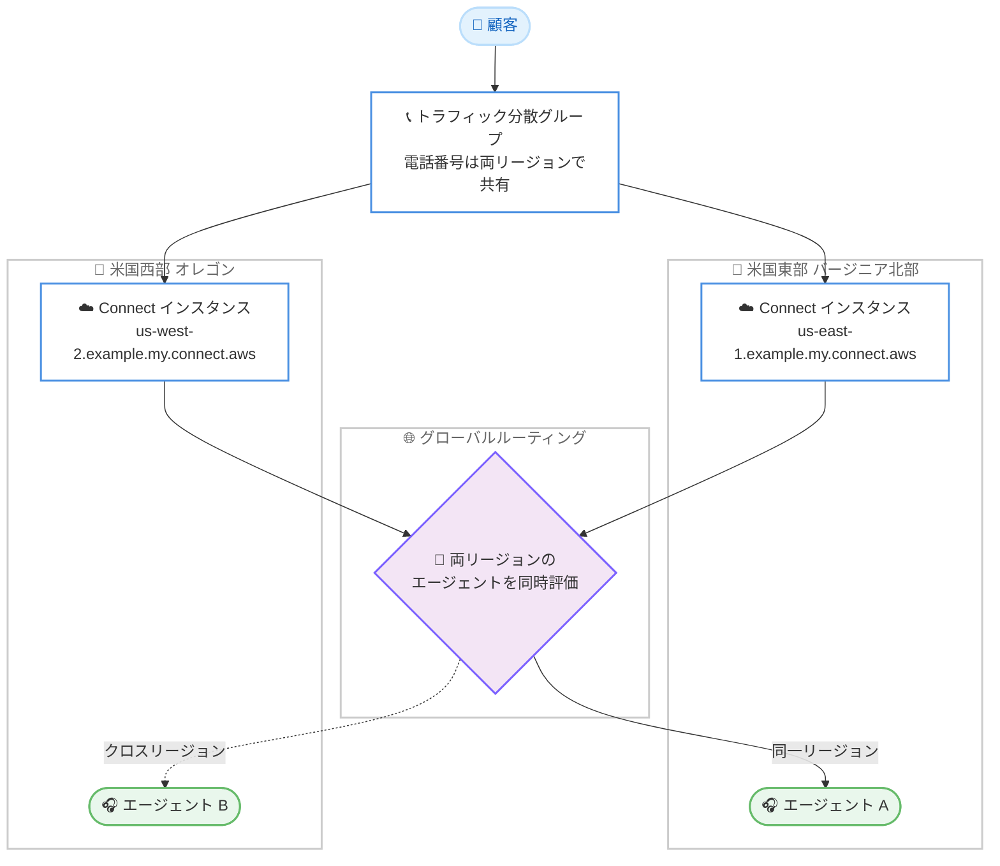

# Amazon Connect - Global Resiliency のクロスリージョンルーティング対応

**リリース日**: 2026 年 8 月 31 日
**サービス**: Amazon Connect
**機能**: Amazon Connect Global Resiliency クロスリージョンルーティング (グローバルルーティング)

📊 [このアップデートのインフォグラフィックを見る](https://takech9203.github.io/aws-news-summary/20260831-amazon-connect-global-resiliency-cross-region-routing.html)

## 概要

Amazon Connect Global Resiliency (ACGR) が、リンクされた 2 つの AWS リージョン間でコンタクトをクロスリージョンルーティングできるようになりました。これにより、両リージョンが常にアクティブな状態でトラフィックを処理する「アクティブ / アクティブ」構成のコンタクトセンターを実現できます。たとえば、米国東部 (バージニア北部) に着信したコールを、米国西部 (オレゴン) にサインインしているエージェントに接続できます。

従来の ACGR では、各リージョンのインスタンスが独立してルーティングを判断していたため、あるリージョンに着信したコンタクトは同じリージョンのエージェントにしか接続できませんでした。今回のアップデートにより、ルーティングサービスが両リージョンのエージェントを同時に評価し、エージェントがどちらのリージョンにサインインしていても、最も長く応対可能な状態にあるマッチするエージェントにコンタクトを提供します。

さらに、マネージャーは両リージョンをまたいだ分析とコンタクト検索の統合ビューを利用できます。両リージョンが継続的に本番トラフィックを処理するため、設定やインテグレーションが常に検証された状態となり、必要なときにどちらのリージョンでも全ワークロードを引き受けられるという高い信頼性が得られます。大規模なコンタクトセンターを運用し、地理的冗長性に関する規制要件や最高レベルの事業継続性を求める企業に有用なアップデートです。

**アップデート前の課題**

- 以前は各 Connect インスタンスが独立してルーティングを判断していたため、コンタクトは着信したリージョンにサインインしているエージェントにしか接続できなかった
- セカンダリリージョンは実質的にスタンバイとなり、本番トラフィックで継続的に検証されないため、フェイルオーバー時に設定やインテグレーションが正しく動作するかの確信を持ちにくかった
- リアルタイムメトリクスやコンタクト検索がリージョンごとに分断されており、両リージョンを横断した運用状況の把握が困難だった

**アップデート後の改善**

- コンタクトが着信したリージョンに関係なく、両リージョンのエージェントから最も長く応対可能なマッチするエージェントにルーティングされるようになった
- 両リージョンが常時アクティブにトラフィックを処理するため、設定とインテグレーションが継続的に検証され、リージョン切り替え時の信頼性が向上した
- リアルタイム / 履歴メトリクス、ダッシュボード、コンタクト検索が両リージョンを統合したグローバルビューで提供されるようになった
- トラフィック分散の制御は引き続き利用でき、必要に応じて新規コンタクトとエージェントをいつでも単一リージョンに集約できる

## アーキテクチャ図



グローバルルーティングでは、いずれかのリージョンに着信したコンタクトに対して両リージョンのエージェントが同時に評価され、エージェントのサインイン先リージョンに関係なく最適なエージェントに接続されます。コンタクト自体はライフサイクルを通じて着信元リージョンに留まり、ルーティングの判断のみがリージョンをまたいで行われます。

## サービスアップデートの詳細

### 主要機能

1. **クロスリージョンルーティング (グローバルルーティング)**
   - あるリージョンで発生したコンタクトを、リンクされたもう一方のリージョンにサインインしているエージェントへルーティング可能
   - ルーティングサービスが両リージョンのエージェントを同時に評価し、最も長く応対可能なマッチするエージェントにコンタクトを提供
   - コンタクト自体は発生元リージョンに留まり、ルーティング判断のみがリージョンをまたぐ
   - 音声通話、チャット、タスク、E メール、キューコールバックのクロスリージョンルーティングに対応

2. **統合されたメトリクスとコンタクト検索**
   - リアルタイムメトリクスとダッシュボードが両リージョンの合計値を表示 (例: キューの応対可能エージェント数は両リージョンの合算)
   - `GetMetricDataV2`、`GetCurrentUserData`、`GetCurrentMetricData` の各 API はどちらのリージョンから呼び出しても同じグローバルビューを返す
   - コンタクト検索では、両インスタンスで処理されたコンタクトをエージェント詳細、分析、通話録音、トランスクリプトを含めて単一ビューで確認可能

3. **クロスリージョンルーティングの制御 API**
   - 新しい `GetCrossRegionRouting` API と `UpdateCrossRegionRouting` API により、リンクされたインスタンス間のクロスリージョンルーティングの状態確認と有効化 / 無効化が可能
   - 無効化しても、他リージョンのエージェントが対応中のコンタクトは切断されず、応対完了まで継続される
   - 統合レポート、コンタクト検索、リソースレプリケーションは、ルーティングを無効化した後もグローバルに動作し続ける

4. **既存のトラフィック分散との連携**
   - 従来どおり `UpdateTrafficDistribution` API で電話トラフィックとエージェントのリージョン間分散を 10% 刻みで制御可能
   - 新規コンタクトとエージェントをいつでも単一リージョンに集約可能
   - エージェントを全員他リージョンに移した場合でも、グローバルルーティングが有効であれば元のリージョンに残っているキュー内コンタクトを他リージョンのエージェントが処理でき、事業継続性が向上

5. **サブドメインベースのインスタンスエイリアス**
   - グローバルルーティングの利用には、ソースとレプリカが同一エイリアス名をリージョンプレフィックスで区別するサブドメイン形式が必要 (例: `us-east-1.example.my.connect.aws` と `us-west-2.example.my.connect.aws`)
   - Amazon Connect Streams で構築したカスタム CCP では `secondaryCCPUrl` と `enableGlobalResiliency` パラメータの設定が必要

## 技術仕様

### イベントストリームの動作

| ストリーム種別 | 動作 |
|------|------|
| コンタクトイベントストリーム (CES) | コンタクトの発生元に関係なく両リージョンで出力。`globalResiliencyMetadata` オブジェクトの `originRegion` と `activeRegion` フィールドでフィルタリング可能 |
| エージェントイベントストリーム (AES) | エージェントがアクティブなリージョンでのみ出力。もう一方のリージョンには Login と Offline イベントのみ出力 |
| コンタクトレコード (CTR) | コンタクトの発生元リージョンで出力 (例: us-east-1 発生のコンタクトを us-west-2 のエージェントが応対した場合、CTR は us-east-1) |

### クロスリージョンルーティング対応機能

| 機能 | 対応状況 |
|------|------|
| 音声通話 | 対応 (アプリ内通話、Web 通話、ビデオ通話、画面共有は非対応) |
| キューコールバック / カスタマーファーストコールバック | 対応 |
| チャット | 対応 (クイックレスポンスは自動レプリケーション対象外) |
| タスク | 対応 (タスクテンプレートは自動レプリケーション対象外) |
| E メール | 対応 (メッセージテンプレートは自動レプリケーション対象外。E メール中心のワークロードは単一リージョンへの集約を推奨) |
| 拡張マルチパーティ通話のモニタリング / バージイン | 対応 (3 者間通話モニタリングは非対応) |
| エージェントキュー / 優先エージェントルーティング | 対応 (Transfer to agent ベータ版フローブロックは非対応) |
| 通話録音 | 同一リージョン / クロスリージョンともに生成され、発生元リージョンに保存 |
| 画面録画 | 同一リージョンのコンタクトのみ生成 (クロスリージョンは非対応) |
| ライブメディアストリーミング (KVS) | コンタクトの発生元リージョンでストリーミング |
| Salesforce CTI Adapter | v5.33 以降 (Lambda パッケージ v5.27 以降) で対応 |

### API 変更履歴

| 日付 | サービス | 変更内容 |
|------|----------|----------|
| 2026/08/31 | [Amazon Connect Service](https://awsapichanges.com/archive/changes/65de2a-connect.html) | 2 new 1 updated api methods - Global Resiliency インスタンスのグローバルルーティング対応。新 API `GetCrossRegionRouting` と `UpdateCrossRegionRouting` により、リンクされたインスタンス間のクロスリージョンルーティングの参照と制御が可能に |

### カスタム CCP の設定例

```javascript
connect.core.initCCP(containerDiv, {
  ccpUrl: "https://us-east-1.example.my.connect.aws/ccp-v2/",
  secondaryCCPUrl: "https://us-west-2.example.my.connect.aws/ccp-v2/",
  enableGlobalResiliency: true,
  loginUrl: "<SSO プロバイダーの URL>"
  // その他の initCCP パラメータ
});
```

## 設定方法

### 前提条件

1. Amazon Connect Global Resiliency (ACGR) が利用可能なリージョンペアでインスタンスを運用していること
2. 機能へのアクセスについて AWS アカウントチームまたは AWS 担当者に連絡すること (2026 年 9 月 1 日以降に作成された新規 ACGR インスタンスではデフォルトで有効)
3. サブドメインベースのインスタンスエイリアスを使用すること (ファイアウォールの許可リストへの追加が必要な場合あり)

### 手順 (既存 ACGR インスタンスの移行)

#### ステップ 1: インテグレーションとファイアウォールの更新

```text
1. レプリカリージョンのインスタンスエイリアスを利用するインテグレーション (カスタム CCP を含む) を
   新しいサブドメインベースのエイリアスに更新
2. ワイルドカードを使用していない場合、ファイアウォールルールに新しいサブドメインベースの
   エイリアスを追加
```

カスタムレポート、ワークフォースマネジメントソリューション、イベントストリームやコンタクトレコードに依存するサードパーティインテグレーションについても、必要な変更を洗い出します。

#### ステップ 2: カスタム CCP の更新

```javascript
// Streams JS に secondaryCCPUrl と enableGlobalResiliency を追加
connect.core.initCCP(containerDiv, {
  ccpUrl: "https://us-east-1.example.my.connect.aws/ccp-v2/",
  secondaryCCPUrl: "https://us-west-2.example.my.connect.aws/ccp-v2/",
  enableGlobalResiliency: true
});
```

Amazon Connect Streams で構築したカスタムエージェントデスクトップに、両リージョンのインスタンス URL とグローバルレジリエンシー有効化フラグを設定します。

#### ステップ 3: レプリケーションの実行と検証

```bash
# ソースリージョンからレプリケーションを実行 (グローバルルーティングが有効化される)
aws connect replicate-instance \
  --instance-id <ソースインスタンス ID> \
  --replica-region us-west-2 \
  --replica-alias <レプリカエイリアス>

# レプリケーション状態を監視 (INSTANCE_REPLICATION_COMPLETE になるまで待機)
aws connect describe-instance --instance-id <インスタンス ID>
```

`ReplicateInstance` API をソースリージョンから呼び出すことで、グローバルルーティング、統合分析、統合コンタクト検索が有効になります。`DescribeInstance` API でレプリケーション状態を監視し、完了後にレプリカリージョンへエージェントをサインインさせてクロスリージョンルーティングの動作を検証します。すでにサインイン中のエージェントは、サインアウトして再サインインするまでクロスリージョンコンタクトを受信できない点に注意してください。

#### ステップ 4: クロスリージョンルーティングの制御 (必要に応じて)

```bash
# クロスリージョンルーティングの現在の状態を確認
aws connect get-cross-region-routing --instance-id <インスタンス ID>

# クロスリージョンルーティングを一時的に無効化 / 再有効化
aws connect update-cross-region-routing \
  --instance-id <インスタンス ID> \
  --cross-region-routing-status <ステータス>
```

`GetCrossRegionRouting` API でルーティング状態を確認し、`UpdateCrossRegionRouting` API で一時的な無効化や再有効化を制御します。無効化してもすでに接続中のコンタクトは切断されません。

## メリット

### ビジネス面

- **エージェント稼働率の向上**: 両リージョンのエージェントプール全体からマッチングが行われるため、リージョン単位のエージェント余剰と顧客の待ち時間のミスマッチが減り、応答時間の短縮とエージェント活用の最適化が期待できる
- **事業継続性の強化**: 両リージョンが常時本番トラフィックを処理する「アクティブ / アクティブ」構成のため、切り替え先が未検証のスタンバイである不安がなくなり、規制要件や BCP 要件に自信を持って対応できる
- **運用の可視性向上**: マネージャーはどちらのリージョンにサインインしていても、両リージョンを統合したメトリクスとコンタクト検索で運用状況を一元的に把握できる

### 技術面

- **継続的に検証される冗長構成**: 設定とインテグレーションが両リージョンで常に本番トラフィックにさらされるため、フェイルオーバー時の未知の不具合リスクを低減できる
- **既存のトラフィック分散との統合**: `UpdateTrafficDistribution` による 10% 刻みのトラフィック / エージェント分散制御と組み合わせて利用でき、段階的な切り替えや即時の全量切り替えの柔軟性を維持できる
- **API によるルーティング制御**: `GetCrossRegionRouting` / `UpdateCrossRegionRouting` により、メンテナンスや障害対応の際にクロスリージョンルーティングのみを一時的に停止するといった細かな制御が可能

## デメリット・制約事項

### 制限事項

- 機能の利用には AWS アカウントチームまたは AWS 担当者への連絡が必要 (2026 年 9 月 1 日以降に作成された新規 ACGR インスタンスはデフォルトで有効。既存インスタンスはリクエストによる移行が必要)
- アプリ内通話、Web 通話、ビデオ通話、画面共有はクロスリージョンルーティング非対応
- 画面録画はクロスリージョンコンタクトでは生成されない
- 3 者間通話モニタリングはクロスリージョンでは非対応 (拡張マルチパーティ通話モニタリングは対応)
- チャットのクイックレスポンス、タスクテンプレート、E メールメッセージテンプレート、サードパーティアプリケーションは自動レプリケーションされないため、一貫したエージェント体験のためには手動でのレプリケーションが必要

### 考慮すべき点

- サブドメインベースのインスタンスエイリアスへの移行が必要で、カスタム CCP、ファイアウォールルール、インスタンス URL を参照するインテグレーションの更新が発生する
- AES と CTR はリージョンごとに出力されるため、サードパーティ連携パイプラインは両リージョンからデータを取り込むように更新する必要がある
- コンタクトに対する変更系 API (`UpdateContactAttributes`、`TransferContact` など) はコンタクトの発生元リージョン、エージェントに対する変更系 API (`PutUserStatus` など) はエージェントのアクティブリージョンに対して呼び出す必要があり、AWS SDK を直接使うカスタムアプリケーションは更新が必要な場合がある
- E メール中心のワークロードでは機能制約を避けるため、トラフィック分散グループを分けて E メール担当エージェントを単一リージョンに集約する構成が推奨されている
- グローバルルーティング有効化前からサインインしているエージェントは、再サインインするまでクロスリージョンコンタクトを受信できない (デフォルトのセッションタイムアウトである 12 時間の経過を待ってから分散を開始することが推奨されている)

## ユースケース

### ユースケース 1: 2 リージョンにまたがるグローバルコンタクトセンターの待ち時間短縮

**シナリオ**: 東京と大阪の 2 リージョンで ACGR を運用する国内コンタクトセンターで、時間帯によって一方のリージョンのエージェントが逼迫し、もう一方には余裕があるという偏りが発生している。

**実装例**:
```text
1. トラフィック分散グループで電話トラフィックとエージェントを 50% / 50% で分散
2. グローバルルーティングを有効化
3. 東京に着信したコールでも、大阪で最も長く応対可能なエージェントが
   マッチすればそのまま大阪に接続
```

**効果**: 両リージョンのエージェントプールが単一のプールとして機能し、リージョン間の偏りによる待ち時間の増加とエージェントの遊休を同時に削減できる。

### ユースケース 2: 定期的なリージョン切り替え訓練を不要にするアクティブ / アクティブ運用

**シナリオ**: 金融機関のコンタクトセンターが、地理的に離れた拠点間の冗長性を求める規制要件に対応するため ACGR を導入しているが、セカンダリリージョンが本番トラフィックで検証されておらず、切り替え訓練のコストが大きい。

**実装例**:
```text
1. グローバルルーティングを有効化し、両リージョンで常時本番トラフィックを処理
2. 平常時から設定・フロー・インテグレーションが両リージョンで検証される状態を維持
3. 障害時は UpdateTrafficDistribution で新規コンタクトとエージェントを
   正常なリージョンへ 100% シフト
```

**効果**: 両リージョンが継続的に検証されるため、切り替え時の未知の不具合リスクが低減し、規制対応と訓練コストの削減を両立できる。

### ユースケース 3: リージョン切り替え時のキュー内コンタクトの救済

**シナリオ**: us-east-1 で障害の兆候を検知し、エージェントと新規コンタクトを us-west-2 へ 100% シフトしたが、us-east-1 のキューにはまだ応対待ちのコンタクトが残っている。

**実装例**:
```bash
# エージェントと新規コンタクトを us-west-2 に 100% シフト
aws connect update-traffic-distribution \
  --id <トラフィック分散グループ ID> \
  --telephony-config 'Distributions=[{Region=us-west-2,Percentage=100}]' \
  --agent-config 'Distributions=[{Region=us-west-2,Percentage=100}]'

# グローバルルーティングが有効であれば、us-east-1 のキューに残った
# コンタクトも us-west-2 のエージェントが処理可能
```

**効果**: 従来はシフト後も元リージョンのキューに取り残されていたコンタクトを、切り替え先リージョンのエージェントが処理できるため、リージョン切り替え時の顧客影響を最小化できる。

## 料金

公式発表に料金に関する記載はありません。Amazon Connect は使用した分だけ支払う従量課金制で、Global Resiliency に関する費用の詳細は Amazon Connect の料金ページを参照してください。

## 利用可能リージョン

グローバルルーティングは、Amazon Connect Global Resiliency が利用可能なすべてのリージョンペアで利用できます。

- 米国東部 (バージニア北部) / 米国西部 (オレゴン)
- 欧州 (フランクフルト) / 欧州 (ロンドン)
- アジアパシフィック (大阪) / アジアパシフィック (東京)

利用には AWS アカウントチームまたは AWS 担当者への連絡が必要です。

## 関連サービス・機能

- **Amazon Connect Global Resiliency (ACGR)**: 本機能の基盤。リンクされたインスタンスのプロビジョニング、グローバル電話番号、トラフィック分散グループによるリージョン間分散を提供
- **Amazon Connect Streams (StreamsJS)**: カスタム CCP でクロスリージョンコンタクトを扱うために `secondaryCCPUrl` と `enableGlobalResiliency` の設定が必要
- **Amazon Kinesis Video Streams**: ライブメディアストリーミングはコンタクトの発生元リージョンで提供されるため、ボイスメール取得や通話分析のパイプラインは両リージョンに構築が必要
- **Amazon Connect Contact Lens**: 統合コンタクト検索から、クロスリージョンコンタクトを含む録音・トランスクリプト・分析にどちらのリージョンからでもアクセス可能

## 参考リンク

- 📊 [インフォグラフィック](https://takech9203.github.io/aws-news-summary/20260831-amazon-connect-global-resiliency-cross-region-routing.html)
- [公式発表 (What's New)](https://aws.amazon.com/about-aws/whats-new/2026/08/amazon-connect-global-resiliency-cross-region-routing/)
- [ドキュメント: Set up Amazon Connect Global Resiliency](https://docs.aws.amazon.com/connect/latest/adminguide/setup-connect-global-resiliency.html)
- [ドキュメント: Global routing across ACGR Regions](https://docs.aws.amazon.com/connect/latest/adminguide/global-routing-across-acgr-regions.html)
- [ドキュメント: Global Resiliency 対応リージョン](https://docs.aws.amazon.com/connect/latest/adminguide/regions.html#gr_region)
- [API リファレンス: UpdateCrossRegionRouting](https://docs.aws.amazon.com/connect/latest/APIReference/API_UpdateCrossRegionRouting.html)
- [料金ページ](https://aws.amazon.com/connect/pricing/)

## まとめ

Amazon Connect Global Resiliency のクロスリージョンルーティング対応により、2 つのリージョンが常時アクティブにコンタクトを処理する真のアクティブ / アクティブ構成が実現し、エージェント稼働率の向上とリージョン切り替え時の信頼性向上を両立できます。すでに ACGR を利用している場合は、サブドメインベースのエイリアスへの移行やイベントストリーム連携の見直しなどの移行手順を確認したうえで、AWS アカウントチームに機能の有効化を相談することを推奨します。
