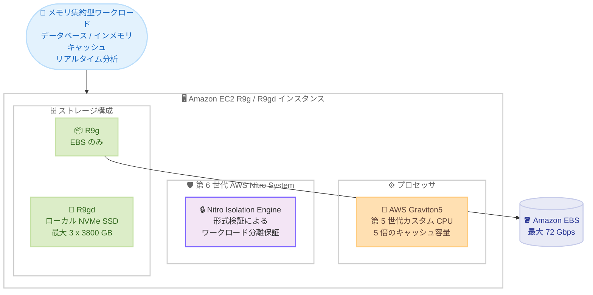

# Amazon EC2 - R9g / R9gd メモリ最適化インスタンスの一般提供開始

**リリース日**: 2026 年 8 月 31 日
**サービス**: Amazon EC2
**機能**: AWS Graviton5 搭載メモリ最適化インスタンス R9g / R9gd

📊 [このアップデートのインフォグラフィックを見る](https://takech9203.github.io/aws-news-summary/20260831-amazon-ec2-r9g-and-r9gd-memory-optimized-instances-are-now-available.html)

## 概要

AWS は、最新世代のカスタム設計 CPU である AWS Graviton5 プロセッサを搭載したメモリ最適化インスタンス、Amazon EC2 R9g および R9gd の一般提供を開始しました。R9g は EBS ストレージのみ、R9gd はローカル NVMe SSD ストレージを備えたバリアントです。前世代の Graviton4 ベースの R8g / R8gd インスタンスと比較して、最大 25% 高いコンピューティング性能を実現し、データベースで最大 30%、Web アプリケーションと機械学習で最大 35% の高速化を実現します。

Graviton5 は前世代比 5 倍のキャッシュ容量と、クラウドのプロセッサインスタンスの中で最速クラスのメモリ性能を備えています。また、第 6 世代 AWS Nitro System 上に構築されており、形式検証によってワークロードの分離を数学的に保証する Nitro Isolation Engine を初めて搭載したインスタンスです。

データベース、インメモリキャッシュ、リアルタイムビッグデータ分析など、メモリ集約型ワークロードを運用するユーザーにとって、価格性能比のさらなる向上が期待できるアップデートです。

**アップデート前の課題**

Graviton ベースのメモリ最適化インスタンスは R8g / R8gd (Graviton4) が最新世代でした。

- より高いコンピューティング性能やメモリ帯域を必要とするワークロードでは、スケールアウトや上位サイズへの変更で対応する必要があった
- キャッシュ容量やメモリ性能がボトルネックになるインメモリデータベースや分析ワークロードでは、性能向上の選択肢が限られていた
- ワークロード分離の保証は従来の Nitro System のアーキテクチャに依存しており、形式検証に基づく数学的な分離保証は提供されていなかった

**アップデート後の改善**

Graviton5 搭載の新世代インスタンスにより、以下が可能になりました。

- R8g / R8gd 比で最大 25% 高いコンピューティング性能、データベースで最大 30%、Web アプリケーションと機械学習で最大 35% の高速化
- 前世代比 5 倍のキャッシュ容量と高速なメモリ性能により、メモリ集約型ワークロードの価格性能比が向上
- Nitro Isolation Engine により、形式検証を用いて他の顧客や AWS オペレーターからのワークロード分離を数学的に保証
- R9gd ではローカル NVMe SSD により、低レイテンシーなブロックレベルストレージを利用可能

## アーキテクチャ図



R9g / R9gd インスタンスの主要コンポーネント構成です。Graviton5 プロセッサと第 6 世代 Nitro System を基盤とし、R9g は EBS のみ、R9gd はローカル NVMe SSD を追加で備えています。

## サービスアップデートの詳細

### 主要機能

1. **AWS Graviton5 プロセッサ**
   - AWS が設計した第 5 世代のカスタム Arm ベース CPU
   - Graviton4 比で最大 25% 高いコンピューティング性能
   - 前世代比 5 倍のキャッシュ容量と、クラウドのプロセッサインスタンスの中で最速クラスのメモリ性能
   - vCPU ごとの専用キャッシュ、常時有効なメモリ暗号化、ポインタ認証などのセキュリティ機能

2. **ワークロード別の性能向上**
   - データベース: 最大 30% 高速化
   - Web アプリケーション: 最大 35% 高速化
   - 機械学習 (推論): 最大 35% 高速化

3. **第 6 世代 AWS Nitro System と Nitro Isolation Engine**
   - Nitro Isolation Engine を初めて搭載したインスタンスファミリー
   - 形式検証を用いて、他の顧客や AWS オペレーターからのワークロード分離を数学的に保証

4. **2 つのストレージバリアント**
   - R9g: EBS ストレージのみのモデル
   - R9gd: ローカル NVMe SSD ブロックレベルストレージを搭載し、低レイテンシーなローカルストレージを必要とするワークロードに対応

## 技術仕様

### R9g インスタンス仕様 (EBS のみ)

| インスタンスサイズ | vCPU | メモリ (GiB) | ネットワーク帯域 (Gbps) | EBS 帯域 (Gbps) |
|------|------|------|------|------|
| r9g.medium | 1 | 8 | 最大 15 | 最大 12 |
| r9g.large | 2 | 16 | 最大 15 | 最大 12 |
| r9g.xlarge | 4 | 32 | 最大 15 | 最大 12 |
| r9g.2xlarge | 8 | 64 | 最大 17 | 最大 12 |
| r9g.4xlarge | 16 | 128 | 最大 17 | 最大 12 |
| r9g.8xlarge | 32 | 256 | 17 | 12 |
| r9g.12xlarge | 48 | 384 | 25 | 18 |
| r9g.16xlarge | 64 | 512 | 34 | 24 |
| r9g.24xlarge | 96 | 768 | 50 | 36 |
| r9g.48xlarge | 192 | 1,536 | 100 | 72 |
| r9g.metal-48xl | 192 | 1,536 | 100 | 72 |

### R9gd インスタンス仕様 (ローカル NVMe SSD 搭載)

| インスタンスサイズ | vCPU | メモリ (GiB) | NVMe SSD ストレージ | ネットワーク帯域 (Gbps) | EBS 帯域 (Gbps) |
|------|------|------|------|------|------|
| r9gd.medium | 1 | 8 | 1 x 59 GB | 最大 15 | 最大 12 |
| r9gd.large | 2 | 16 | 1 x 118 GB | 最大 15 | 最大 12 |
| r9gd.xlarge | 4 | 32 | 1 x 237 GB | 最大 15 | 最大 12 |
| r9gd.2xlarge | 8 | 64 | 1 x 474 GB | 最大 17 | 最大 12 |
| r9gd.4xlarge | 16 | 128 | 1 x 950 GB | 最大 17 | 最大 12 |
| r9gd.8xlarge | 32 | 256 | 1 x 1,900 GB | 17 | 12 |
| r9gd.12xlarge | 48 | 384 | 3 x 950 GB | 25 | 18 |
| r9gd.16xlarge | 64 | 512 | 1 x 3,800 GB | 34 | 24 |
| r9gd.24xlarge | 96 | 768 | 3 x 1,900 GB | 50 | 36 |
| r9gd.48xlarge | 192 | 1,536 | 3 x 3,800 GB | 100 | 72 |
| r9gd.metal-48xl | 192 | 1,536 | 3 x 3,800 GB | 100 | 72 |

メモリと vCPU の比率は R ファミリー標準の 8:1 (GiB / vCPU) です。

## 設定方法

### 前提条件

1. AWS アカウントと EC2 インスタンスを起動するための IAM 権限があること
2. 対応リージョン (米国東部バージニア北部 / オハイオ、米国西部オレゴン、欧州フランクフルト) を使用すること
3. Arm64 (aarch64) アーキテクチャに対応した AMI とアプリケーションを用意すること

### 手順

#### ステップ1: 利用可能なインスタンスタイプの確認

```bash
aws ec2 describe-instance-type-offerings \
  --region us-east-1 \
  --filters "Name=instance-type,Values=r9g.*,r9gd.*" \
  --query "InstanceTypeOfferings[].InstanceType" \
  --output table
```

指定したリージョンで利用可能な R9g / R9gd インスタンスタイプの一覧を取得します。

#### ステップ2: Arm64 対応 AMI の確認

```bash
aws ssm get-parameters \
  --names /aws/service/ami-amazon-linux-latest/al2023-ami-kernel-default-arm64 \
  --region us-east-1 \
  --query "Parameters[].Value" \
  --output text
```

SSM パラメータストアから最新の Amazon Linux 2023 Arm64 AMI の ID を取得します。

#### ステップ3: インスタンスの起動

```bash
aws ec2 run-instances \
  --region us-east-1 \
  --instance-type r9g.xlarge \
  --image-id ami-xxxxxxxxxxxxxxxxx \
  --key-name my-key-pair \
  --subnet-id subnet-xxxxxxxx \
  --security-group-ids sg-xxxxxxxx
```

取得した Arm64 AMI を使用して r9g.xlarge インスタンスを起動します。ローカル NVMe SSD が必要な場合は `--instance-type r9gd.xlarge` のように R9gd を指定します。

## メリット

### ビジネス面

- **価格性能比の向上**: 前世代比で最大 25% 高いコンピューティング性能により、同等のワークロードをより少ないインスタンス数や小さいサイズで実行でき、コスト最適化につながる
- **柔軟な購入オプション**: Savings Plans、オンデマンド、スポット、Dedicated Instances、Dedicated Hosts に対応し、ワークロード特性に応じたコスト戦略を選択可能
- **持続可能性**: Graviton ベースのインスタンスはエネルギー効率に優れ、サステナビリティ目標への貢献が期待できる

### 技術面

- **メモリ性能の大幅向上**: 5 倍のキャッシュ容量と高速なメモリにより、インメモリデータベースやキャッシュのレイテンシーとスループットが改善
- **強化された分離保証**: Nitro Isolation Engine の形式検証により、マルチテナント環境におけるワークロード分離が数学的に保証される
- **幅広いソフトウェア対応**: C/C++、Rust、Go、Java、Python、.NET Core、Node.js、Ruby、PHP などの主要言語と、EKS / ECS などのコンテナ環境で利用可能

## デメリット・制約事項

### 制限事項

- 提供リージョンは現時点で米国東部 (バージニア北部、オハイオ)、米国西部 (オレゴン)、欧州 (フランクフルト) の 4 リージョンに限定され、東京リージョンでは未提供
- Arm64 アーキテクチャのため、x86 専用のバイナリやライブラリに依存するワークロードはそのまま移行できない
- R9gd のローカル NVMe SSD はインスタンスの停止や終了でデータが失われるエフェメラルストレージである

### 考慮すべき点

- 既存の R8g / R7g からの移行時は、性能向上と料金差を比較して費用対効果を検証することを推奨
- サードパーティ製の商用ソフトウェアを使用している場合、Arm64 対応状況とライセンス条件を事前に確認する必要がある

## ユースケース

### ユースケース1: 大規模インメモリデータベースの高速化

**シナリオ**: Redis や Valkey、Memcached などのインメモリキャッシュ、または SAP HANA 以外のオープンソースインメモリデータベースを R7g / R8g で運用しており、キャッシュヒット時のレイテンシーとスループットをさらに改善したい。

**実装例**:
```
r9g.16xlarge (64 vCPU / 512 GiB) 上で Valkey クラスターを構成し、
既存の r8g.16xlarge クラスターから順次切り替え
```

**効果**: 5 倍のキャッシュ容量と高速メモリにより、データベースワークロードで最大 30% の性能向上が期待でき、同一性能要件であればノード数削減によるコスト最適化も可能です。

### ユースケース2: ローカル NVMe を活用したリアルタイム分析

**シナリオ**: Apache Spark や ClickHouse などの分散リアルタイム分析基盤で、シャッフルデータや中間データの書き込みに低レイテンシーなローカルストレージが必要。

**実装例**:
```
r9gd.12xlarge (48 vCPU / 384 GiB / 3 x 950 GB NVMe) を
ワーカーノードとして使用し、NVMe SSD をシャッフル領域に割り当て
```

**効果**: ローカル NVMe SSD により EBS を経由しない低レイテンシー I/O を実現し、分析ジョブの実行時間短縮が期待できます。

### ユースケース3: コンテナ化されたメモリ集約型マイクロサービス

**シナリオ**: Amazon EKS 上で稼働するメモリ集約型のマイクロサービス群のコスト効率と性能を改善したい。

**実装例**:
```
EKS マネージドノードグループに r9g.2xlarge の Arm64 ノードを追加し、
マルチアーキテクチャイメージで段階的に移行
```

**効果**: Web アプリケーションで最大 35% の性能向上により、Pod あたりの処理能力が向上し、ノード数の削減とコスト最適化が期待できます。

## 料金

R9g / R9gd インスタンスは、Savings Plans、オンデマンド、スポットインスタンス、Dedicated Instances、Dedicated Hosts で購入できます。料金はリージョンとサイズにより異なるため、最新の情報は Amazon EC2 料金ページを参照してください。

## 利用可能リージョン

- 米国東部 (バージニア北部)
- 米国東部 (オハイオ)
- 米国西部 (オレゴン)
- 欧州 (フランクフルト)

## 関連サービス・機能

- **AWS Graviton**: AWS が設計する Arm ベースプロセッサファミリー。Graviton5 は C9g などの他ファミリーにも展開が見込まれる
- **AWS Nitro System**: EC2 の仮想化基盤。第 6 世代では Nitro Isolation Engine による形式検証ベースの分離保証が追加
- **Amazon EBS**: R9g のプライマリストレージ。最大 72 Gbps の EBS 帯域に対応
- **Amazon EKS / ECS**: R9g / R9gd を Arm64 ノードとして利用可能なコンテナオーケストレーションサービス

## 参考リンク

- 📊 [インフォグラフィック](https://takech9203.github.io/aws-news-summary/20260831-amazon-ec2-r9g-and-r9gd-memory-optimized-instances-are-now-available.html)
- [公式発表 (What's New)](https://aws.amazon.com/about-aws/whats-new/2026/08/amazon-ec2-r9g-and-r9gd-memory-optimized-instances-are-now-available/)
- [Amazon EC2 R9g インスタンス](https://aws.amazon.com/ec2/instance-types/r9g/)
- [AWS Graviton プロセッサ](https://aws.amazon.com/ec2/graviton/)
- [Amazon EC2 料金ページ](https://aws.amazon.com/ec2/pricing/)

## まとめ

Graviton5 を搭載した R9g / R9gd インスタンスは、前世代比最大 25% の性能向上と 5 倍のキャッシュ容量により、メモリ集約型ワークロードの価格性能比を大きく引き上げるアップデートです。Nitro Isolation Engine による形式検証ベースの分離保証は、セキュリティ要件の厳しいワークロードにも有効です。対象リージョンで R8g / R7g を利用中の場合は、ベンチマークを実施して移行効果を検証することを推奨します。
