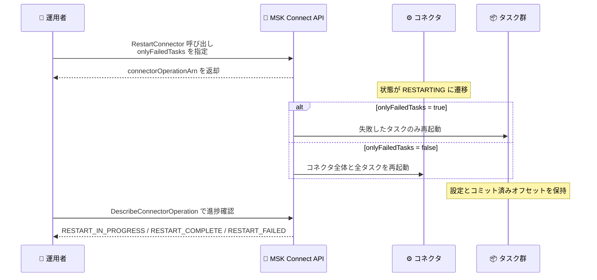

# Amazon MSK Connect - コネクタ再起動機能

**リリース日**: 2026 年 8 月 31 日
**サービス**: Amazon MSK Connect (Amazon Managed Streaming for Apache Kafka Connect)
**機能**: コネクタおよびタスクの再起動 (RestartConnector API)

📊 [このアップデートのインフォグラフィックを見る](https://takech9203.github.io/aws-news-summary/20260831-amazon-msk-connect-restart.html)

## 概要

Amazon MSK Connect が、コネクタとそのタスクを再起動する機能をサポートしました。MSK Connect は Apache Kafka Connect のマネージドサービスであり、Amazon MSK クラスターと外部システム (データベース、Amazon S3、検索インデックスなど) の間でストリーミングデータを連携するコネクタを実行します。今回のアップデートにより、コネクタ全体とすべてのタスクを再起動することも、失敗したタスクのみを選択的に再起動することも可能になり、ストリーミングデータパイプラインの迅速な復旧が実現します。

再起動は障害からの復旧だけでなく、失敗したタスクがない正常なコネクタに対しても実行できます。これにより、一時的な問題への対処や、外部システム・依存関係の変更 (認証情報のローテーション、接続先データベースの設定変更など) をコネクタに反映させる用途にも活用できます。再起動時にはコネクタの設定とコミット済みオフセットが保持されるため、データの重複や欠落を最小限に抑えながら処理を再開できます。

本機能は Amazon MSK コンソール、AWS CLI、AWS SDK、AWS CDK から利用でき、追加料金なしで、Amazon MSK Connect が利用可能なすべての AWS リージョンで提供されます。

**アップデート前の課題**

- コネクタやタスクが失敗した場合、復旧するにはコネクタを削除して再作成する必要があり、ダウンタイムと運用負荷が発生していた
- 削除・再作成の間はデータパイプラインが停止し、ストリーミング処理の遅延やデータ滞留の原因となっていた
- 一時的な障害や外部システムの変更 (認証情報の更新など) を反映するための軽量な手段がなかった

**アップデート後の改善**

- コネクタ全体、または失敗したタスクのみを API 1 回の呼び出しで再起動できるようになった
- 設定とコミット済みオフセットが保持されるため、削除・再作成なしで処理を継続でき、復旧時間が大幅に短縮された
- 正常なコネクタに対しても再起動を実行でき、一時的な問題の解消や外部依存関係の変更反映に利用できるようになった

## アーキテクチャ図



RestartConnector API は非同期で動作し、返却されたオペレーション ARN を DescribeConnectorOperation で追跡することで、再起動の進捗と結果を確認できます。

## サービスアップデートの詳細

### 主要機能

1. **コネクタ全体の再起動**
   - コネクタとそのすべてのタスクをまとめて再起動できる
   - コネクタの設定とコミット済みオフセットは保持されるため、再起動後は前回の処理位置から再開される
   - コネクタの削除・再作成が不要になり、ダウンタイムを最小化できる

2. **失敗したタスクのみの選択的再起動**
   - `onlyFailedTasks` パラメータを `true` に設定することで、失敗したタスクだけを再起動できる
   - 正常に稼働しているタスクには影響を与えず、部分的な障害からピンポイントで復旧できる

3. **正常なコネクタへの再起動**
   - 失敗したタスクが存在しない正常なコネクタに対しても再起動を実行できる
   - 一時的な問題の解消や、外部システム・依存関係の変更 (認証情報のローテーションなど) の反映に活用できる

4. **非同期オペレーションとしての追跡**
   - RestartConnector はコネクタオペレーション ARN を返す非同期 API として実装されている
   - DescribeConnectorOperation および ListConnectorOperations で再起動の状態 (`RESTART_IN_PROGRESS`、`RESTART_COMPLETE`、`RESTART_FAILED`) を確認できる
   - 再起動中のコネクタ状態として `RESTARTING` が追加された

## 技術仕様

### RestartConnector API

| 項目 | 詳細 |
|------|------|
| API 名 | `RestartConnector` (新規追加) |
| リクエストパラメータ | `connectorArn` (対象コネクタの ARN)、`onlyFailedTasks` (true / false) |
| レスポンス | `connectorArn`、`connectorOperationArn` |
| 実行方式 | 非同期 (オペレーション ARN で進捗を追跡) |
| コネクタ状態の追加値 | `RESTARTING` |
| オペレーション状態の追加値 | `RESTART_IN_PROGRESS`、`RESTART_COMPLETE`、`RESTART_FAILED` |
| オペレーションタイプの追加値 | `RESTART_CONNECTOR` |
| 保持されるもの | コネクタ設定、コミット済みオフセット |
| 利用インターフェイス | Amazon MSK コンソール、AWS CLI、AWS SDK、AWS CDK |

### API 変更履歴

| 日付 | サービス | 変更内容 |
|------|----------|----------|
| 2026/08/31 | [kafkaconnect](https://awsapichanges.com/archive/changes/65de2a-kafkaconnect.html) | 1 new 7 updated api methods - `RestartConnector` の新規追加、`CreateConnector` / `DeleteConnector` / `DescribeConnector` / `DescribeConnectorOperation` / `ListConnectorOperations` / `ListConnectors` / `UpdateConnector` への `RESTARTING` 状態などの追加 |

### API リクエスト・レスポンス例

```python
# Python (boto3) での呼び出し例
response = client.restart_connector(
    connectorArn='arn:aws:kafkaconnect:ap-northeast-1:123456789012:connector/my-connector/xxxx',
    onlyFailedTasks=True
)

# レスポンス
# {
#     'connectorArn': 'arn:aws:kafkaconnect:...:connector/my-connector/xxxx',
#     'connectorOperationArn': 'arn:aws:kafkaconnect:...:connector-operation/...'
# }
```

## 設定方法

### 前提条件

1. Amazon MSK Connect でコネクタが作成済みであること
2. AWS CLI または SDK を利用する場合は、`kafkaconnect:RestartConnector` を含む IAM 権限が付与されていること
3. 最新の AWS CLI / SDK バージョンを使用していること (RestartConnector API に対応したバージョン)

### 手順

#### ステップ 1: 対象コネクタの状態を確認する

```bash
aws kafkaconnect describe-connector \
  --connector-arn arn:aws:kafkaconnect:ap-northeast-1:123456789012:connector/my-connector/xxxx
```

対象コネクタの現在の状態 (`connectorState`) と、`stateDescription` に含まれる失敗理由を確認します。失敗したタスクがある場合は選択的再起動を検討します。

#### ステップ 2: コネクタを再起動する

```bash
# 失敗したタスクのみを再起動する場合
aws kafkaconnect restart-connector \
  --connector-arn arn:aws:kafkaconnect:ap-northeast-1:123456789012:connector/my-connector/xxxx \
  --only-failed-tasks

# コネクタ全体とすべてのタスクを再起動する場合
aws kafkaconnect restart-connector \
  --connector-arn arn:aws:kafkaconnect:ap-northeast-1:123456789012:connector/my-connector/xxxx \
  --no-only-failed-tasks
```

RestartConnector API を呼び出してコネクタの再起動を開始します。`--only-failed-tasks` を指定すると失敗したタスクのみが再起動され、正常なタスクは影響を受けません。レスポンスとしてコネクタオペレーション ARN が返されます。

#### ステップ 3: 再起動の進捗を確認する

```bash
aws kafkaconnect describe-connector-operation \
  --connector-operation-arn arn:aws:kafkaconnect:ap-northeast-1:123456789012:connector-operation/...
```

ステップ 2 で返されたオペレーション ARN を指定し、再起動オペレーションの状態を確認します。`connectorOperationState` が `RESTART_COMPLETE` になれば再起動は完了です。`RESTART_FAILED` の場合は `errorInfo` フィールドで失敗原因を確認します。

## メリット

### ビジネス面

- **ダウンタイムの削減**: コネクタの削除・再作成が不要になり、データパイプラインの停止時間を最小化できる
- **運用コストの低減**: 障害復旧の手順が API 1 回の呼び出しに簡素化され、運用チームの負荷が軽減される
- **データ鮮度の維持**: 迅速な復旧により、下流の分析システムやアプリケーションへのデータ供給遅延を抑制できる

### 技術面

- **オフセットの保持**: コミット済みオフセットが保持されるため、再起動後に前回の処理位置から正確に再開でき、データの重複・欠落リスクを抑えられる
- **選択的な復旧**: `onlyFailedTasks` により失敗したタスクだけを再起動でき、正常なタスクの処理を中断させない
- **自動化との親和性**: 非同期 API とオペレーション追跡 API が提供されるため、CloudWatch アラームと組み合わせた自動復旧の仕組みを構築しやすい

## デメリット・制約事項

### 制限事項

- コネクタ全体を再起動する場合、再起動中は当該コネクタのデータ処理が一時的に停止する
- 再起動は障害の根本原因 (接続先の認証エラー、設定ミスなど) を解決するものではなく、原因が残っている場合はタスクが再度失敗する可能性がある
- 再起動オペレーションは非同期であり、完了までの時間はコネクタの構成やタスク数に依存する

### 考慮すべき点

- 再起動を自動化する場合は、失敗が繰り返し発生した際の無限リトライを避けるため、再試行回数の上限やアラート通知を設計に含めることを推奨
- IAM ポリシーで `kafkaconnect:RestartConnector` の権限を必要な運用ロールにのみ付与し、最小権限の原則を維持する
- 根本原因の調査には、CloudWatch Logs などに配信されるワーカーログの確認を併用する

## ユースケース

### ユースケース 1: 失敗したタスクの迅速な復旧

**シナリオ**: S3 シンクコネクタの一部タスクが一時的なネットワーク障害で `FAILED` 状態になり、パーティションの一部でデータ配信が停止している。

**実装例**:
```bash
aws kafkaconnect restart-connector \
  --connector-arn <connector-arn> \
  --only-failed-tasks
```

**効果**: 失敗したタスクのみが再起動され、正常なタスクの処理を中断することなくパイプライン全体を復旧できる。コミット済みオフセットから再開されるため、データの欠落を防げる。

### ユースケース 2: 外部システムの認証情報ローテーション後の反映

**シナリオ**: 接続先データベースのパスワードをローテーションしたため、コネクタに新しい接続を確立させたい。コネクタ自体は正常に稼働している。

**実装例**:
```bash
aws kafkaconnect restart-connector \
  --connector-arn <connector-arn> \
  --no-only-failed-tasks
```

**効果**: コネクタを削除・再作成することなく、全タスクが再起動されて新しい認証情報で接続が再確立される。設定変更を伴わない依存関係の更新を短時間で反映できる。

### ユースケース 3: CloudWatch アラームと連携した自動復旧

**シナリオ**: コネクタのタスク失敗を検知したら、自動的に失敗タスクを再起動する自己修復型のパイプラインを構築したい。

**実装例**:
```python
# Lambda 関数での自動復旧処理の例
import boto3

client = boto3.client('kafkaconnect')

def handler(event, context):
    connector_arn = event['connectorArn']
    response = client.restart_connector(
        connectorArn=connector_arn,
        onlyFailedTasks=True
    )
    return {'operationArn': response['connectorOperationArn']}
```

**効果**: 障害検知から復旧までを自動化し、運用者の手動対応なしでパイプラインの可用性を向上できる。オペレーション ARN を追跡することで復旧結果の監視も自動化できる。

## 料金

本機能は追加料金なしで利用できます。Amazon MSK Connect の通常料金 (コネクタが使用する MSK Connect Unit (MCU) 単位の時間課金) のみが適用されます。再起動操作自体に対する課金は発生しません。

## 利用可能リージョン

Amazon MSK Connect が利用可能なすべての AWS リージョンで提供されます (東京リージョンを含む)。

## 関連サービス・機能

- **Amazon MSK**: MSK Connect のコネクタが接続する Apache Kafka クラスターを提供するマネージドサービス
- **Apache Kafka Connect**: MSK Connect の基盤となるオープンソースフレームワーク。セルフマネージドの Kafka Connect では REST API による再起動が可能であり、今回のアップデートで同等の運用性がマネージド環境でも実現された
- **Amazon CloudWatch**: コネクタのメトリクスやワーカーログの監視に使用し、再起動の自動化トリガーとして活用できる
- **AWS Lambda**: 障害検知時に RestartConnector を呼び出す自動復旧処理の実装に利用できる

## 参考リンク

- 📊 [インフォグラフィック](https://takech9203.github.io/aws-news-summary/20260831-amazon-msk-connect-restart.html)
- [公式発表 (What's New)](https://aws.amazon.com/about-aws/whats-new/2026/08/amazon-msk-connect-restart/)
- [Amazon MSK Connect 機能ページ](https://aws.amazon.com/msk/features/msk-connect/)
- [Amazon MSK Connect ドキュメント](https://docs.aws.amazon.com/msk/latest/developerguide/mskconnect.html)
- [API 変更詳細 (awsapichanges.com)](https://awsapichanges.com/archive/changes/65de2a-kafkaconnect.html)
- [Amazon MSK 料金ページ](https://aws.amazon.com/msk/pricing/)

## まとめ

Amazon MSK Connect のコネクタ再起動機能により、これまで削除・再作成が必要だった障害復旧が API 1 回の呼び出しで完結し、ストリーミングデータパイプラインのダウンタイムと運用負荷が大幅に削減されます。MSK Connect を利用しているチームは、既存の障害対応 Runbook を RestartConnector ベースの手順に更新し、CloudWatch アラームと組み合わせた自動復旧の導入を検討することを推奨します。
