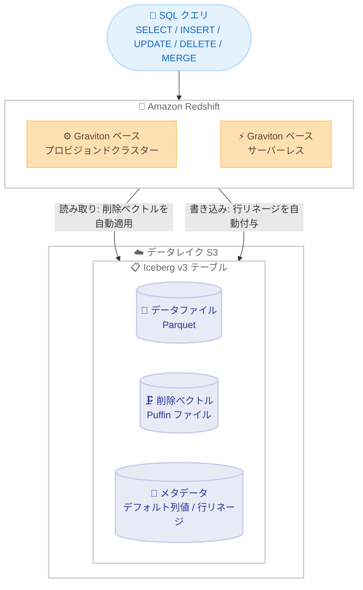

# Amazon Redshift - Apache Iceberg v3 テーブルのサポート

**リリース日**: 2026 年 8 月 31 日
**サービス**: Amazon Redshift
**機能**: Apache Iceberg v3 テーブルの読み取り / 書き込みサポート

📊 [このアップデートのインフォグラフィックを見る](https://takech9203.github.io/aws-news-summary/20260831-amazon-redshift-supports-apache-iceberg-v3.html)

## 概要

Amazon Redshift が、データレイク上の Apache Iceberg v3 テーブルの読み取りと書き込みをサポートしました。Apache Iceberg はオープンなテーブルフォーマットであり、v3 リリースではデフォルト列値、行リネージ (row lineage)、削除ベクトル (deletion vectors) という 3 つの主要機能が導入されています。Redshift ユーザーは新規に v3 テーブルを作成できるほか、既存の v2 テーブルをインプレースで v3 にアップグレードできます。

このアップデートは、Redshift をデータレイクの分析エンジンとして活用しているユーザー、特に更新・削除が頻繁に発生するワークロードや、増分処理 / CDC (Change Data Capture) パイプラインを構築しているデータエンジニアにとって重要な機能強化です。

**アップデート前の課題**

Iceberg v2 テーブルには以下の課題がありました。

- 既存テーブルへの列追加時にデフォルト値を定義できず、スキーマ進化の際にデータファイルの書き換えや後処理が必要だった
- 行単位の変更履歴を追跡する仕組みがなく、増分パイプラインや CDC ワークフローでは変更行の特定に独自の工夫が必要だった
- 行レベルの削除が位置削除ファイル (positional delete files) として蓄積され、更新・削除が多いワークロードでは小さな削除ファイルが大量に生成されて読み書き性能が低下した

**アップデート後の改善**

今回のアップデートにより以下が可能になりました。

- デフォルト列値により、データファイルを書き換えずに既存テーブルへ列を追加でき、スキーマ進化が容易になった
- `_row_id` と `_last_updated_sequence_number` の擬似列により、変更された行のみを対象とする増分パイプラインや CDC ワークフローを構築できるようになった
- 削除ベクトル (コンパクトな圧縮ビットマップ) により、位置削除ファイルの蓄積が解消され、更新・削除が頻繁なワークロードの読み書きが高速化された

## アーキテクチャ図



Amazon Redshift の Graviton ベースのプロビジョンドクラスターおよびサーバーレスから、S3 上の Iceberg v3 テーブルに対して読み書きを行う構成です。削除ベクトルは Puffin ファイルとしてテーブルデータと同じ S3 ロケーションに保存され、読み取り時に自動適用されます。

## サービスアップデートの詳細

### 主要機能

1. **デフォルト列値 (Default column values)**
   - 列に値が指定されなかった場合に適用される事前定義の初期値を設定できる
   - 既存テーブルに新しい列を追加する際、データファイルを書き換えることなく、過去のデータファイルの読み取り時にデフォルト値が自動的に返される
   - `CREATE TABLE` 時の定義に加え、`ALTER TABLE ADD COLUMN ... DEFAULT`、`ALTER COLUMN ... SET DEFAULT`、`ALTER COLUMN ... DROP DEFAULT` に対応
   - デフォルト値としてサポートされるのはリテラル値のみで、ネスト型はサポート対象外
   - `CREATE TABLE AS SELECT` はソーステーブルのデフォルト値を継承しない (作成後に `ALTER TABLE` で設定する)

2. **行リネージ (Row lineage)**
   - 各行の ID と最終更新シーケンス番号を追跡する 2 つの擬似列を提供
   - `_row_id` (BIGINT): 書き込み時に自動採番される行の一意識別子
   - `_last_updated_sequence_number` (BIGINT): その行を最後に変更した書き込み操作のスナップショットシーケンス番号
   - Redshift が自動管理するため、ユーザーが値を設定する必要はない
   - 変更行のみを処理する増分パイプラインや CDC ワークフローの構築に活用できる

3. **削除ベクトル (Deletion vectors)**
   - Iceberg v2 の位置削除ファイルを置き換える、行レベル削除の新しい追跡メカニズム
   - データファイル内の削除済み行位置を圧縮ビットマップとして記録し、Puffin ファイルとしてテーブルデータと同じ S3 ロケーションに保存
   - データファイルごとに削除ベクトルは最大 1 つで、同一データファイルへの後続の削除は既存の削除内容とマージされるため、小さな削除ファイルの蓄積を回避
   - `DELETE`、`UPDATE`、`MERGE` 実行時に自動的に使用され、SQL 構文の変更は不要
   - コンパクトな形式により、v2 の位置削除ファイルと比較して読み書きが高速化

4. **v2 から v3 へのインプレースアップグレード**
   - `ALTER TABLE ... SET TABLE PROPERTIES ('format-version' = '3')` でメタデータのみの操作としてアップグレードでき、既存データファイルの書き換えは発生しない
   - 既存の v2 位置削除ファイルは有効なまま読み取り時に適用され、後続の書き込み操作で削除ベクトルへ順次マージされる
   - アップグレード後最初の書き込み操作で、テーブル全体の行リネージ値が生成される (メタデータのみの操作)

## 技術仕様

### Iceberg v2 と v3 の比較

| 項目 | Iceberg v2 | Iceberg v3 |
|------|-----------|-----------|
| デフォルト列値 | 非対応 (指定するとエラー) | 対応 (リテラル値のみ) |
| 行リネージ擬似列 | NULL を返す | `_row_id` / `_last_updated_sequence_number` を自動管理 |
| 行レベル削除 | 位置削除ファイル | 削除ベクトル (Puffin ファイル内の圧縮ビットマップ) |
| `timestamptz` 型のマッピング | Redshift の TIMESTAMP 型 | Redshift の TIMESTAMPTZ 型 |
| クエリ / DML の SQL 構文 | INSERT / DELETE / UPDATE / MERGE | v2 と同一構文 |

### 行リネージ擬似列

| 列名 | データ型 | 説明 |
|------|----------|------|
| `_row_id` | BIGINT | テーブル内の各行を一意に識別。書き込み操作時に自動採番 |
| `_last_updated_sequence_number` | BIGINT | 行を最後に変更した書き込み操作のスナップショットシーケンス番号 |

擬似列は `SELECT *` には含まれず、SELECT リストで明示的に指定する必要があります。WHERE、ORDER BY、GROUP BY、JOIN 句で使用できます。

## 設定方法

### 前提条件

1. Amazon Redshift の Graviton ベースのプロビジョンドクラスターまたはサーバーレスワークグループを使用していること
2. Iceberg テーブルを配置する S3 バケットと外部スキーマへのアクセス権限が設定されていること
3. v2 からのアップグレードの場合、既存の Iceberg v2 テーブルが存在すること

### 手順

#### ステップ 1: Iceberg v3 テーブルの新規作成

```sql
CREATE TABLE my_schema.orders (
  id int,
  status varchar DEFAULT 'pending',
  priority int DEFAULT 0
)
USING ICEBERG
LOCATION 's3://amzn-s3-demo-bucket/orders/'
TABLE PROPERTIES ('format-version'='3');
```

TABLE PROPERTIES に `'format-version'='3'` を指定して Iceberg v3 テーブルを作成します。`format-version` を指定しない場合は v2 テーブルとして作成されます。この例では `status` 列と `priority` 列にデフォルト値を定義しています。

#### ステップ 2: 既存 v2 テーブルの v3 へのアップグレード

```sql
ALTER TABLE my_schema.my_iceberg_table
SET TABLE PROPERTIES ('format-version' = '3');
```

既存の Iceberg v2 テーブルを v3 にアップグレードします。メタデータのみの操作であり、既存データファイルの書き換えは発生しません。なお、v3 から v2 へのダウングレードはサポートされていません。

#### ステップ 3: デフォルト値付きの列追加

```sql
ALTER TABLE my_schema.orders
ADD COLUMN region varchar DEFAULT 'ap-northeast-1';
```

デフォルト値を指定して新しい列を追加します。既存のデータファイルを書き換えることなく、読み取り時に新しい列のデフォルト値が返されます。

#### ステップ 4: 行リネージを使用した増分クエリ

```sql
SELECT _row_id, _last_updated_sequence_number, *
FROM my_schema.orders
WHERE _last_updated_sequence_number >= 3
ORDER BY _row_id;
```

行リネージ擬似列を SELECT リストで明示的に指定し、特定のシーケンス番号以降に変更された行のみを抽出します。増分処理や CDC パイプラインの基盤として活用できます。

## メリット

### ビジネス面

- **データレイク運用コストの削減**: スキーマ進化時のデータファイル書き換えが不要になり、大規模テーブルの列追加に伴う処理時間とコンピューティングコストを削減できる
- **コンプライアンス対応の効率化**: 削除ベクトルにより、GDPR などの規制に基づくレコード削除が頻繁に発生するワークロードでも性能劣化を抑えられる
- **オープンフォーマットによる相互運用性**: Apache Iceberg というオープンなテーブルフォーマットの最新仕様に対応することで、他のエンジンとのデータ共有やベンダーロックインの回避に寄与する

### 技術面

- **読み書き性能の向上**: 削除ベクトルはコンパクトな圧縮ビットマップであり、v2 の位置削除ファイルの蓄積による小さなファイルの増加を回避し、読み書きを高速化する
- **CDC / 増分パイプラインの簡素化**: `_row_id` と `_last_updated_sequence_number` により、変更行のみを対象とした処理を SQL だけで実現できる
- **安全なインプレースアップグレード**: v2 から v3 へのアップグレードはメタデータのみの操作で、既存の位置削除ファイルも有効なまま段階的に削除ベクトルへマージされる

## デメリット・制約事項

### 制限事項

- v3 から v2 へのダウングレードはサポートされない
- 複合型 (struct、list、map、variant) の読み書きはサポートされない
- struct、list、map、variant、geometry、geography、binary、uuid、time、timestamp_ns、timestamptz_ns、unknown の各データ型はサポートされない
- デフォルト値はリテラル値のみサポートされ、ネスト型には設定できない
- 行リネージ擬似列は `SELECT *` に含まれず、明示的な指定が必要
- v3 テーブルでは新規の位置削除ファイルを追加できない (既存の位置削除ファイルの読み取りは可能)

### 考慮すべき点

- Graviton ベースのプロビジョンドクラスターおよびサーバーレスでのサポートであり、利用中のクラスター構成の確認が必要
- v3 へのアップグレード後、Iceberg の `timestamptz` 型のマッピングが Redshift の TIMESTAMP 型から TIMESTAMPTZ 型に変わるため、タイムゾーンに依存するクエリ結果への影響を確認する必要がある
- v2 からアップグレードしたテーブルでは、アップグレード後最初の書き込み操作まで既存データの行リネージ値は NULL を返す
- `CREATE TABLE AS SELECT` はデフォルト列値を継承しないため、作成後に `ALTER TABLE` での再設定が必要
- Redshift 以外のエンジンからも同じテーブルにアクセスする場合、各エンジンの Iceberg v3 対応状況の確認が必要

## ユースケース

### ユースケース 1: 頻繁な削除を伴うコンプライアンス対応データレイク

**シナリオ**: 個人情報保護規制への対応として、ユーザーからの削除依頼に基づき、データレイク上の大規模テーブルから特定レコードを日次で削除する必要がある。v2 では位置削除ファイルが蓄積し、クエリ性能が徐々に低下していた。

**実装例**:
```sql
-- v3 テーブルでは削除ベクトルが自動的に使用される
DELETE FROM my_schema.user_events
WHERE user_id IN (SELECT user_id FROM my_schema.deletion_requests);
```

**効果**: 削除はデータファイルごとに単一の削除ベクトルへ集約されるため、小さな削除ファイルの蓄積がなくなり、削除処理と後続のクエリの両方が高速化される。

### ユースケース 2: 行リネージを活用した増分 ETL パイプライン

**シナリオ**: データレイク上の Iceberg テーブルからデータマートへ変換処理を行う ETL パイプラインで、毎回全件を処理しており実行時間とコストが課題となっている。

**実装例**:
```sql
-- 前回処理したシーケンス番号以降の変更行のみを抽出
SELECT _row_id, _last_updated_sequence_number, *
FROM my_schema.sales_orders
WHERE _last_updated_sequence_number > 42;
```

**効果**: 変更された行のみを対象とする増分処理に切り替えることで、パイプラインの実行時間とコンピューティングコストを大幅に削減できる。

### ユースケース 3: データファイル書き換え不要のスキーマ進化

**シナリオ**: 数十 TB 規模の Iceberg テーブルに新しい属性列を追加したいが、既存データの書き換えには長時間の処理と高いコストがかかるため、スキーマ変更に踏み切れない。

**実装例**:
```sql
ALTER TABLE my_schema.customer_profiles
ADD COLUMN loyalty_tier varchar DEFAULT 'standard';
```

**効果**: 既存データファイルを一切書き換えることなく列を追加でき、過去データの読み取り時にはデフォルト値が自動的に返されるため、低コストかつ即時にスキーマ進化を実現できる。

## 料金

Iceberg v3 サポート自体に追加料金はありません。Amazon Redshift のプロビジョンドクラスターまたはサーバーレスの通常の料金体系、および S3 のストレージ / リクエスト料金が適用されます。

## 利用可能リージョン

公式発表ではリージョンの明記はありません。Amazon Redshift の Graviton ベースのプロビジョンドクラスターおよびサーバーレスでサポートされます。利用予定のリージョンでの対応状況は公式ドキュメントで確認してください。

## 関連サービス・機能

- **Amazon S3**: Iceberg テーブルのデータファイル、削除ベクトル (Puffin ファイル)、メタデータの保存先
- **AWS Glue Data Catalog**: Iceberg テーブルのカタログ管理。Redshift からの外部スキーマ経由のアクセスに使用
- **Amazon S3 Tables**: Iceberg ネイティブなフルマネージドテーブルストレージ。Iceberg エコシステムの関連サービス
- **Amazon Athena / Amazon EMR**: 同じ Iceberg テーブルにアクセス可能な分析エンジン。マルチエンジン構成では各エンジンの v3 対応状況の確認が必要

## 参考リンク

- 📊 [インフォグラフィック](https://takech9203.github.io/aws-news-summary/20260831-amazon-redshift-supports-apache-iceberg-v3.html)
- [公式発表 (What's New)](https://aws.amazon.com/about-aws/whats-new/2026/08/amazon-redshift-supports-apache-iceberg-v3)
- [ドキュメント: Apache Iceberg v3 features in Amazon Redshift](https://docs.aws.amazon.com/redshift/latest/dg/iceberg-v3-features.html)
- [Amazon Redshift ドキュメント](https://docs.aws.amazon.com/redshift/)
- [料金ページ](https://aws.amazon.com/redshift/pricing/)

## まとめ

Amazon Redshift が Apache Iceberg v3 テーブルの読み書きに対応し、デフォルト列値、行リネージ、削除ベクトルという v3 の主要機能を SQL から利用できるようになりました。更新・削除が頻繁なデータレイクワークロードや増分 / CDC パイプラインを運用しているユーザーは、大きな性能改善と運用簡素化が期待できます。まずは開発環境で既存 v2 テーブルのインプレースアップグレードを検証し、`timestamptz` 型のマッピング変更やサポート対象外のデータ型などの制約を確認した上で、段階的な移行を計画することを推奨します。
