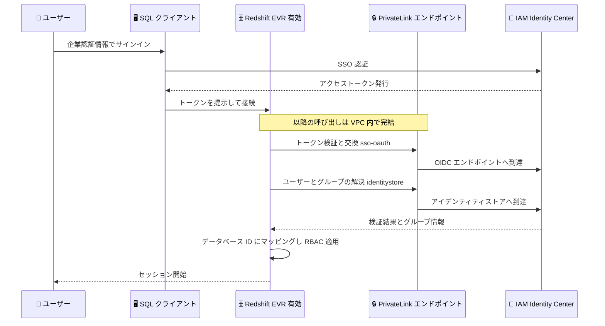

# Amazon Redshift - 拡張 VPC ルーティング環境での AWS IAM Identity Center 認証サポート

**リリース日**: 2026 年 8 月 31 日
**サービス**: Amazon Redshift
**機能**: AWS IAM Identity Center authentication with enhanced VPC routing

📊 [このアップデートのインフォグラフィックを見る](https://takech9203.github.io/aws-news-summary/20260831-amazon-redshift-supports-idc-evr.html)

## 概要

Amazon Redshift が、拡張 VPC ルーティング (Enhanced VPC Routing、EVR) を有効にしたプロビジョンドクラスターおよび Redshift Serverless ワークグループで、AWS IAM Identity Center 認証をサポートしました。これにより、認証トラフィックを含むすべての通信を Amazon VPC と AWS ネットワーク内に閉じたまま、企業の認証情報によるシングルサインオン (SSO) で Redshift にサインインできるようになります。

拡張 VPC ルーティングを有効にすると、Redshift とほかの AWS サービス間のトラフィックはお客様の VPC を経由してルーティングされ、セキュリティグループ、ネットワーク ACL、エンドポイントポリシーで制御し、VPC Flow Logs で監視できます。今回のアップデートにより、Redshift は IAM Identity Center トークンの検証と交換を AWS PrivateLink インターフェイス VPC エンドポイント経由で VPC 内から実行するため、認証もほかの Redshift トラフィックと同じ統制されたネットワーク経路をたどります。

データレジデンシー要件、規制要件、またはパブリックインターネットへの外向き通信を禁止するネットワーク分離要件を持つお客様にとって特に重要なアップデートです。また、IAM Identity Center のマルチリージョンレプリケーションにも対応しており、Redshift が IAM Identity Center のプライマリインスタンスと異なるリージョンで稼働している場合にも利用できます。

**アップデート前の課題**

- 拡張 VPC ルーティングを有効にした Redshift では、IAM Identity Center への認証呼び出し (トークン検証、ユーザー / グループ解決) が VPC 内から到達できず、SSO サインインを成立させることが困難だった
- パブリックインターネットへの外向き通信を禁止する要件を持つ組織では、IAM Identity Center によるシングルサインオンと閉域ネットワーク構成の両立が難しかった
- 信頼された ID 伝播 (Trusted Identity Propagation) を利用した BI ツールなどからの接続も、同様のネットワーク制約の影響を受けていた

**アップデート後の改善**

- インターフェイス VPC エンドポイント (`sso-oauth` と `identitystore`) を作成することで、拡張 VPC ルーティング環境でも IAM Identity Center 認証が可能になった
- 認証トラフィックが AWS ネットワーク内に閉じるため、セキュリティグループ、ネットワーク ACL、エンドポイントポリシーによる制御と VPC Flow Logs による監視が認証経路にも適用できるようになった
- IAM Identity Center のマルチリージョンレプリケーションと組み合わせることで、IAM Identity Center インスタンスと異なるリージョンの Redshift でも利用できるようになった

## アーキテクチャ図



Redshift はクライアントが提示したトークンをそのまま受け入れるのではなく、Redshift 自身が IAM Identity Center に対してトークンの検証・交換とユーザー / グループの解決を実行します。拡張 VPC ルーティング環境では、これらのアウトバウンド呼び出しがインターフェイス VPC エンドポイント経由で AWS ネットワーク内を流れます。

## サービスアップデートの詳細

### 主要機能

1. **拡張 VPC ルーティング環境での IAM Identity Center 認証**
   - プロビジョンドクラスターと Redshift Serverless ワークグループの両方に対応
   - Query Editor v2 からの対話的なサインインと、信頼された ID 伝播で取得したトークンによる接続の両方に適用
   - IAM ユーザーとローカルデータベースユーザーは別の認証メカニズムを使用するため影響を受けない

2. **PrivateLink 経由のトークン検証と交換**
   - Redshift が IAM Identity Center のアクセストークンを検証し、Redshift セッションにスコープされたトークンに交換する処理を、インターフェイス VPC エンドポイント経由で実行
   - ユーザーと IAM Identity Center グループメンバーシップの解決もアイデンティティストア用エンドポイント経由で実行
   - 認証経路をセキュリティグループ、ネットワーク ACL、エンドポイントポリシーで制御し、VPC Flow Logs で監視可能

3. **IAM Identity Center マルチリージョンレプリケーションへの対応**
   - Redshift が IAM Identity Center のプライマリインスタンスと異なるリージョンで稼働している場合に有効
   - マルチリージョンレプリケーションを使用しない場合は、クロスリージョンエンドポイントオプションで IAM Identity Center のリージョンに到達させる構成も可能

## 技術仕様

### 必要なインターフェイス VPC エンドポイント

クラスターまたはワークグループが存在する VPC に、以下の 2 つのインターフェイス VPC エンドポイント (AWS PrivateLink) を作成します。両方が必須であり、いずれかが欠けているか到達不能な場合、IAM Identity Center によるサインインは失敗します。

| エンドポイント | 役割 |
|------|------|
| `com.amazonaws.{region}.sso-oauth` | サインイン時に提示されたアクセストークンを検証し、Redshift セッションにスコープされたトークンに交換 |
| `com.amazonaws.{region}.identitystore` | IAM Identity Center アイデンティティストアからユーザーとグループメンバーシップを解決 |

レイクハウス構成では、必要に応じて以下のエンドポイントも追加します。

| エンドポイント | 役割 |
|------|------|
| `com.amazonaws.{region}.glue` | データレイククエリ時の Data Catalog メタデータ取得 (オプション) |
| `com.amazonaws.{region}.lakeformation` | アクセス許可チェックと認証情報の払い出し (オプション) |
| `com.amazonaws.{region}.s3` (ゲートウェイ型) | COPY、UNLOAD、S3 Tables のアクセス |

### エンドポイント作成時の要件

| 項目 | 詳細 |
|------|------|
| プライベート DNS 名 | 有効化が必須。Redshift は `oidc.{region}.amazonaws.com` などの標準 DNS 名で接続するため、無効の場合はパブリックアドレスに解決されエンドポイントを経由しない |
| 作成リージョン | IAM Identity Center はリージョナルサービスのため、IAM Identity Center インスタンスが稼働するリージョンに作成 |
| サブネット | クラスターまたはワークグループが使用するアベイラビリティーゾーンのサブネットを選択 |
| セキュリティグループ | クラスター / ワークグループのサブネットからの TCP 443 のインバウンドを許可 |
| エンドポイントポリシー | デフォルトポリシーを推奨。制限が必要な場合はアクションではなくプリンシパルでスコープし、サインインの成功を検証 |
| VPC の DNS 属性 | `DNS hostnames` と `DNS resolution` の両方を有効化 |

### AWS Network Firewall を使用する場合

インターフェイス VPC エンドポイントの代わりに AWS Network Firewall でアウトバウンドトラフィックをフィルタリングする場合は、以下のドメインを許可リストに追加します。

- `oidc.{region}.amazonaws.com`: トークンの検証と交換
- `.sso.{region}.amazonaws.com`: IAM Identity Center アプリケーションと割り当ての解決
- `identitystore.{region}.amazonaws.com`: ユーザーとグループメンバーシップの解決

デフォルト拒否ポリシーの場合は、Amazon S3 や AWS Glue など、拡張 VPC ルーティング下で Redshift が一般的に使用するドメインの許可も必要です。

## 設定方法

### 前提条件

1. Amazon Redshift プロビジョンドクラスター (パッチ 204 以降) または Redshift Serverless ワークグループ
2. IAM Identity Center インスタンスと、Redshift 用 IAM Identity Center アプリケーションの構成
3. クラスター / ワークグループがパブリックアクセス不可であること (拡張 VPC ルーティングの要件)
4. VPC で `DNS hostnames` と `DNS resolution` が有効であること

### 手順

#### ステップ 1: 拡張 VPC ルーティングを有効化する

```bash
aws redshift modify-cluster \
  --cluster-identifier my-cluster \
  --enhanced-vpc-routing \
  --no-publicly-accessible
```

プロビジョンドクラスターで拡張 VPC ルーティングを有効化し、パブリックアクセスを無効化します。この変更によりクラスターが再起動されるため、メンテナンスウィンドウでの実施を推奨します。

#### ステップ 2: インターフェイス VPC エンドポイントを作成する

```bash
aws ec2 create-vpc-endpoint \
  --vpc-id vpc-xxxxxxxx \
  --vpc-endpoint-type Interface \
  --service-name com.amazonaws.ap-northeast-1.sso-oauth \
  --subnet-ids subnet-aaaa subnet-bbbb \
  --security-group-ids sg-xxxxxxxx \
  --private-dns-enabled

aws ec2 create-vpc-endpoint \
  --vpc-id vpc-xxxxxxxx \
  --vpc-endpoint-type Interface \
  --service-name com.amazonaws.ap-northeast-1.identitystore \
  --subnet-ids subnet-aaaa subnet-bbbb \
  --security-group-ids sg-xxxxxxxx \
  --private-dns-enabled
```

トークン検証用 (`sso-oauth`) とユーザー / グループ解決用 (`identitystore`) の 2 つのインターフェイス VPC エンドポイントを、プライベート DNS 名を有効にして作成します。セキュリティグループはクラスターのサブネットからの TCP 443 インバウンドを許可しておきます。

#### ステップ 3: サインインを検証する

```sql
SELECT event, auth_method, remotehost
FROM sys_connection_log
WHERE auth_method LIKE '%Idc%'
ORDER BY record_time DESC;
```

Query Editor v2 または JDBC クライアント (ドライバー 2.1.0.30 以降、`BrowserIdcAuthPlugin`、`issuer_url` と `idc_region` プロパティを指定) からサインインし、`sys_connection_log` で `authenticated` イベントを確認します。さらに CloudTrail で `CreateTokenWithIAM` (イベントソース `sso-oauth.amazonaws.com`) や `DescribeUser` などのイベントに `vpcEndpointId` フィールドが含まれることを確認すると、プライベート経路で認証されたことを検証できます。

## メリット

### ビジネス面

- **コンプライアンス要件への適合**: データレジデンシー、規制、ネットワーク分離の要件でパブリックインターネットへの外向き通信が禁止されている環境でも、SSO による利便性を維持できる
- **統一されたアイデンティティ管理**: 企業の ID プロバイダーと連携した IAM Identity Center の認証基盤を、閉域構成のデータウェアハウスにも拡大できる
- **監査性の向上**: 認証トラフィックが VPC Flow Logs と CloudTrail の両方で追跡可能になり、監査対応が容易になる

### 技術面

- **一貫したネットワーク統制**: 認証呼び出しがデータトラフィックと同じ VPC 経路をたどるため、セキュリティグループ、ネットワーク ACL、エンドポイントポリシーによる一元的な制御が可能
- **サーバー側でのトークン検証**: クライアントが提示したトークンを Redshift 自身が OIDC エンドポイントで検証・交換するため、認証の信頼性が高い
- **マルチリージョン構成への対応**: IAM Identity Center のマルチリージョンレプリケーションやクロスリージョンエンドポイントにより、リージョンをまたぐ構成でも利用できる

## デメリット・制約事項

### 制限事項

- プロビジョンドクラスターはパッチ 204 以降が必要
- `sso-oauth` と `identitystore` の両方のエンドポイントが必須で、いずれかが欠けるとサインインが失敗する
- 拡張 VPC ルーティングの有効化 / 無効化はプロビジョンドクラスターの再起動を伴う
- 拡張 VPC ルーティングではクラスター / ワークグループをパブリックアクセス不可にする必要がある
- IAM ユーザーとローカルデータベースユーザーには適用されない (別の認証メカニズムを使用)

### 考慮すべき点

- プライベート DNS 名が無効の場合、標準 DNS 名がパブリックアドレスに解決されてしまい、エンドポイントを経由しないため必ず有効化する
- IAM Identity Center はリージョナルサービスのため、エンドポイントは IAM Identity Center インスタンスのリージョンに到達できるよう構成する必要がある
- アイデンティティストア関連の CloudTrail イベントは、IAM Identity Center インスタンスを所有するアカウント (委任管理者または管理アカウント) に記録される点に注意する
- Query Editor v2 はマネージドプロキシを経由するため、VPC 内の SQL クライアントからのテストの方がプライベート経路の検証として確実である

## ユースケース

### ユースケース 1: 金融機関の閉域データウェアハウス

**シナリオ**: 規制によりパブリックインターネットへの外向き通信が禁止された金融機関が、アナリストに SSO で Redshift へのアクセスを提供したい。

**実装例**:
```
1. Redshift クラスターで拡張 VPC ルーティングを有効化し、パブリックアクセスを無効化
2. sso-oauth と identitystore のインターフェイス VPC エンドポイントを作成
3. IAM Identity Center アプリケーションと Redshift のロールベースアクセス制御を構成
4. VPC Flow Logs と CloudTrail で認証経路を監視
```

**効果**: インターネットへの経路を持たない構成のまま、企業認証情報による SSO と、グループベースの RBAC を実現できる。

### ユースケース 2: BI ツールからの信頼された ID 伝播

**シナリオ**: Amazon QuickSight などの BI ツールから、エンドユーザーの ID を Redshift まで伝播させてきめ細かなアクセス制御を行いたいが、Redshift は閉域構成になっている。

**実装例**:
```
1. BI ツールと Redshift を IAM Identity Center の信頼された ID 伝播で連携
2. Redshift 側の VPC に sso-oauth と identitystore のエンドポイントを配置
3. ユーザーのグループメンバーシップに基づくデータベースロールを定義
```

**効果**: BI ツールから渡されたトークンの検証もプライベート経路で完結し、エンドユーザー単位の監査とアクセス制御を閉域構成で実現できる。

### ユースケース 3: マルチリージョン構成での SSO

**シナリオ**: IAM Identity Center インスタンスは米国リージョンにあるが、データレジデンシー要件により Redshift は東京リージョンで運用している。

**実装例**:
```
1. IAM Identity Center のマルチリージョンレプリケーションを構成
2. 東京リージョンの VPC にインターフェイス VPC エンドポイントを作成
3. 東京リージョンの Redshift で IAM Identity Center 認証を構成
```

**効果**: アイデンティティ基盤を一元管理しつつ、データを国内リージョンに保持したまま SSO を利用できる。

## 料金

この機能自体に追加料金はありません。ただし、以下のコストが発生します。

- **AWS PrivateLink インターフェイスエンドポイント**: エンドポイントの時間課金とデータ処理料金 (エンドポイントごと、アベイラビリティーゾーンごと)
- **Amazon Redshift / IAM Identity Center**: Redshift は通常の料金体系、IAM Identity Center は追加料金なし

詳細は [AWS PrivateLink 料金ページ](https://aws.amazon.com/privatelink/pricing/) を参照してください。

## 利用可能リージョン

Amazon Redshift と AWS IAM Identity Center の両方が提供されているすべての AWS リージョンで利用可能です (東京リージョン、大阪リージョンを含む)。

## 関連サービス・機能

- **AWS IAM Identity Center**: 企業の ID プロバイダーと連携した SSO と信頼された ID 伝播の基盤
- **AWS PrivateLink**: VPC 内から AWS サービスへプライベートに接続するインターフェイスエンドポイントを提供
- **Amazon VPC**: セキュリティグループ、ネットワーク ACL、VPC Flow Logs による認証経路の制御と監視
- **AWS Network Firewall**: エンドポイントの代替として、ドメイン許可リストによるアウトバウンド制御が可能
- **AWS CloudTrail**: `CreateTokenWithIAM` などの認証関連イベントの監査

## 参考リンク

- 📊 [インフォグラフィック](https://takech9203.github.io/aws-news-summary/20260831-amazon-redshift-supports-idc-evr.html)
- [公式発表 (What's New)](https://aws.amazon.com/about-aws/whats-new/2026/08/amazon-redshift-supports-idc-evr)
- [AWS Blog: Integrate Amazon Redshift and IAM Identity Center with enhanced VPC routing](https://aws.amazon.com/blogs/big-data/integrate-amazon-redshift-and-iam-identity-center-with-enhanced-vpc-routing/)
- [ドキュメント: Using AWS IAM Identity Center authentication with enhanced VPC routing](https://docs.aws.amazon.com/redshift/latest/mgmt/redshift-iam-access-control-idp-connect-evr.html)
- [ドキュメント: IAM Identity Center のマルチリージョンレプリケーション](https://docs.aws.amazon.com/singlesignon/latest/userguide/multi-region-iam-identity-center.html)
- [料金ページ: AWS PrivateLink](https://aws.amazon.com/privatelink/pricing/)

## まとめ

拡張 VPC ルーティングを有効にした Amazon Redshift で IAM Identity Center 認証がサポートされ、閉域ネットワーク要件と SSO の両立が可能になりました。厳格なネットワーク分離要件を持つ組織は、`sso-oauth` と `identitystore` のインターフェイス VPC エンドポイントを作成し、プライベート DNS 名の有効化とセキュリティグループの設定を確認したうえで、この構成への移行を検討することを推奨します。
