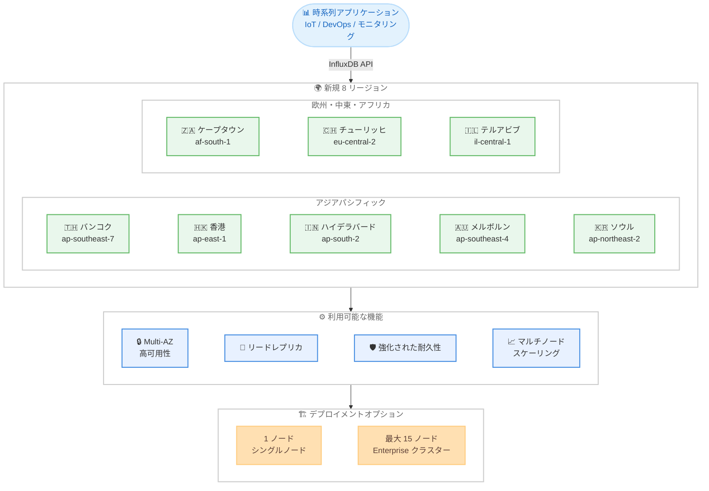

# Amazon Timestream for InfluxDB - 8 つの追加 AWS リージョンでの提供開始

**リリース日**: 2026 年 8 月 31 日
**サービス**: Amazon Timestream for InfluxDB
**機能**: ケープタウン、バンコク、香港、ハイデラバード、メルボルン、ソウル、チューリッヒ、テルアビブの 8 リージョンでの提供開始

📊 [このアップデートのインフォグラフィックを見る](https://takech9203.github.io/aws-news-summary/20260831-amazon-timestream-influxdb-regions.html)

## 概要

Amazon Timestream for InfluxDB が、アフリカ (ケープタウン)、アジアパシフィック (バンコク)、アジアパシフィック (香港)、アジアパシフィック (ハイデラバード)、アジアパシフィック (メルボルン)、アジアパシフィック (ソウル)、欧州 (チューリッヒ)、イスラエル (テルアビブ) の 8 つの AWS リージョンで新たに利用可能になった。このサービスは、アプリケーション開発者や DevOps チームがオープンソースの InfluxDB API を使用して、リアルタイムの時系列アプリケーション向けにフルマネージドの InfluxDB データベースを AWS 上で実行できるようにするものである。

今回のリージョン拡張により、アフリカ、アジアパシフィック、欧州、中東の広範な地域のお客様が、データレジデンシー要件を満たしながら低レイテンシで時系列データベースを利用できるようになった。サービスは Multi-AZ 高可用性、リードレプリカ、強化された耐久性、マルチノードスケーリングを提供し、シングルノード構成から最大 15 ノードの Enterprise クラスターまで、アーキテクチャを再設計することなくスケール可能である。

**アップデート前の課題**

- ケープタウン、バンコク、香港、ハイデラバード、メルボルン、ソウル、チューリッヒ、テルアビブの各リージョンでは Timestream for InfluxDB が利用できず、これらの地域のお客様は他のリージョンを使用する必要があった
- アフリカ、東南アジア、中東などのお客様がデータレジデンシー要件を満たしながら InfluxDB のフルマネージドサービスを利用することが困難だった
- 地理的に離れたリージョンへの接続によりレイテンシが増加し、リアルタイム時系列アプリケーションのパフォーマンスに影響していた

**アップデート後の改善**

- 上記 8 リージョンでフルマネージドの InfluxDB を直接利用できるようになった
- 各地域のお客様がデータレジデンシー要件を満たしつつ、低レイテンシで時系列データを処理できるようになった
- Multi-AZ 高可用性やマルチノードスケーリングを含む機能がこれらのリージョンで利用可能になった

## アーキテクチャ図



この図は、新たに追加された 8 リージョンで利用可能な Timestream for InfluxDB の機能とデプロイメントオプションの関係を示している。

## サービスアップデートの詳細

### 主要機能

1. **8 リージョンでの新規提供**
   - アフリカ (ケープタウン) / af-south-1: アフリカ地域のお客様向け
   - アジアパシフィック (バンコク) / ap-southeast-7: 東南アジア (タイ) のお客様向け
   - アジアパシフィック (香港) / ap-east-1: 東アジアのお客様向け
   - アジアパシフィック (ハイデラバード) / ap-south-2: インド国内の冗長構成や DR 要件向け
   - アジアパシフィック (メルボルン) / ap-southeast-4: オーストラリア国内の冗長構成や DR 要件向け
   - アジアパシフィック (ソウル) / ap-northeast-2: 韓国のお客様向け
   - 欧州 (チューリッヒ) / eu-central-2: スイスのデータレジデンシー要件向け
   - イスラエル (テルアビブ) / il-central-1: 中東地域のお客様向け

2. **フルマネージド InfluxDB**
   - オープンソースの InfluxDB API との互換性を維持
   - データベースのプロビジョニング、パッチ適用、バックアップ、リカバリを AWS が管理
   - 既存の InfluxDB クライアントやツールをそのまま利用可能

3. **エンタープライズグレードの機能**
   - Multi-AZ 高可用性によるフェイルオーバー対応
   - リードレプリカによる読み取りスループットの向上
   - 強化された耐久性でデータ保護を実現
   - シングルノードから最大 15 ノードの Enterprise クラスターまで、アーキテクチャの再設計なしでスケーリング可能

## 技術仕様

### リージョン情報

| リージョン名 | リージョンコード | 提供状況 |
|-------------|-----------------|---------|
| アフリカ (ケープタウン) | af-south-1 | 新規追加 |
| アジアパシフィック (バンコク) | ap-southeast-7 | 新規追加 |
| アジアパシフィック (香港) | ap-east-1 | 新規追加 |
| アジアパシフィック (ハイデラバード) | ap-south-2 | 新規追加 |
| アジアパシフィック (メルボルン) | ap-southeast-4 | 新規追加 |
| アジアパシフィック (ソウル) | ap-northeast-2 | 新規追加 |
| 欧州 (チューリッヒ) | eu-central-2 | 新規追加 |
| イスラエル (テルアビブ) | il-central-1 | 新規追加 |

### デプロイメントオプション

| 構成 | ノード構成 | 用途 |
|-------------|-----------|------|
| シングルノード | 1 ノード | 開発・テスト、小規模ワークロード |
| Enterprise クラスター | 最大 15 ノード | 本番環境、高可用性が必要なワークロード |

### サポートされる機能

| 機能 | 説明 |
|------|------|
| Multi-AZ 高可用性 | 複数のアベイラビリティゾーンにまたがるデプロイメント |
| リードレプリカ | 読み取りクエリの水平スケーリング |
| 強化された耐久性 | データの冗長保存による保護 |
| マルチノードスケーリング | 最大 15 ノードへのクラスター拡張 |
| InfluxDB API 互換 | オープンソース InfluxDB API を使用したデータ操作 |

## 設定方法

### 前提条件

1. AWS アカウントを持ち、対象リージョンでのサービス利用が有効であること
2. IAM ポリシーで Timestream for InfluxDB へのアクセス権限が設定されていること
3. VPC とサブネットが対象リージョンに作成済みであること

### 手順

#### ステップ 1: リージョンの選択と DB インスタンスの作成

```bash
aws timestream-influxdb create-db-instance \
  --region ap-northeast-2 \
  --name my-influxdb-instance \
  --db-instance-type db.influx.medium \
  --allocated-storage 20 \
  --vpc-subnet-ids subnet-xxxxxxxx subnet-yyyyyyyy \
  --vpc-security-group-ids sg-xxxxxxxx \
  --username admin \
  --password MySecurePassword123! \
  --organization my-org \
  --bucket my-bucket
```

ソウルリージョンに InfluxDB インスタンスを作成するコマンド。リージョンコードを `eu-central-2` や `il-central-1` などに変更することで、他の新規リージョンでも作成可能である。

#### ステップ 2: Multi-AZ 高可用性の有効化

```bash
aws timestream-influxdb create-db-instance \
  --region eu-central-2 \
  --name my-influxdb-ha \
  --db-instance-type db.influx.xlarge \
  --allocated-storage 100 \
  --vpc-subnet-ids subnet-xxxxxxxx subnet-yyyyyyyy \
  --vpc-security-group-ids sg-xxxxxxxx \
  --deployment-type WITH_MULTI_AZ_STANDBY \
  --username admin \
  --password MySecurePassword123! \
  --organization my-org \
  --bucket my-bucket
```

チューリッヒリージョンに Multi-AZ スタンバイを有効化した InfluxDB インスタンスを作成するコマンド。複数のアベイラビリティゾーンにまたがるデプロイメントにより高可用性を実現する。

#### ステップ 3: インスタンスの状態確認

```bash
aws timestream-influxdb get-db-instance \
  --region eu-central-2 \
  --identifier <db-instance-id>
```

作成した DB インスタンスの状態を確認するコマンド。ステータスが `AVAILABLE` になれば、InfluxDB API を使用してデータの書き込みとクエリが可能になる。

## メリット

### ビジネス面

- **データレジデンシー要件への対応**: スイス、イスラエル、韓国、インド、タイなど、データの国内保存が求められる地域の規制要件に準拠したデータ保存が可能になった
- **低レイテンシアクセス**: 各地域のエンドユーザーに近い場所でデータベースを運用することで、リアルタイム性が向上する
- **災害復旧戦略の強化**: インドのお客様はムンバイとハイデラバード、オーストラリアのお客様はシドニーとメルボルンを組み合わせた国内 DR 構成が可能になった

### 技術面

- **フルマネージド運用**: データベースのプロビジョニング、パッチ適用、バックアップを AWS に委任し、アプリケーション開発に集中できる
- **既存ツールとの互換性**: オープンソース InfluxDB API との互換性により、既存のクライアント、Grafana ダッシュボード、Telegraf エージェントをそのまま利用可能
- **柔軟なスケーリング**: シングルノードから最大 15 ノードの Enterprise クラスターまで、アーキテクチャを再設計することなくワークロードの成長に応じてスケール可能

## デメリット・制約事項

### 制限事項

- 新規リージョンでの提供開始直後は、インスタンスタイプの選択肢が他のリージョンと異なる場合がある
- リージョン間のデータレプリケーションは Timestream for InfluxDB のネイティブ機能としては提供されていない
- Enterprise クラスターの最大ノード数は 15 ノードに制限される

### 考慮すべき点

- 新規リージョンでの料金は他のリージョンと異なる場合があるため、事前に料金ページを確認すること
- 既存のリージョンから新規リージョンへの移行にはデータのエクスポートとインポートが必要となる
- リージョンごとの機能提供状況の詳細は、AWS リージョン別サービス一覧で最新情報を確認すること

## ユースケース

### ユースケース 1: インド国内の災害復旧構成

**シナリオ**: ムンバイリージョンで Timestream for InfluxDB を運用しているが、規制要件によりインド国内でのデータ保持を維持しつつ DR 構成が必要な場合。

**実装例**:
```
構成:
- プライマリ: ap-south-1 (ムンバイ) - Enterprise クラスター
- DR: ap-south-2 (ハイデラバード) - Enterprise クラスター
- アプリケーション側で書き込みの二重化、または定期的なデータ同期を実装
```

**効果**: インド国内の 2 リージョンを活用した DR 構成により、データレジデンシー要件を満たしながらリージョン障害時にも時系列データベースの可用性を維持できる。

### ユースケース 2: スイスの金融・製造業向けモニタリング基盤

**シナリオ**: スイス国内のデータ保存が求められる金融機関や製造業のお客様が、システムメトリクスや設備データをリアルタイムで収集・分析する必要がある場合。

**実装例**:
```bash
# チューリッヒリージョンにマルチノード構成のインスタンスを作成
aws timestream-influxdb create-db-instance \
  --region eu-central-2 \
  --name monitoring-cluster \
  --db-instance-type db.influx.xlarge \
  --allocated-storage 500 \
  --deployment-type WITH_MULTI_AZ_STANDBY \
  --vpc-subnet-ids subnet-xxxxxxxx subnet-yyyyyyyy \
  --vpc-security-group-ids sg-xxxxxxxx \
  --username admin \
  --password MySecurePassword123! \
  --organization monitoring-org \
  --bucket system-metrics
```

**効果**: スイス国内でデータを保持しながら、Multi-AZ 高可用性により大量の時系列データをリアルタイムで処理できる。

### ユースケース 3: 韓国の IoT・ゲームメトリクス基盤

**シナリオ**: 韓国国内のユーザーやデバイスから発生する大量の時系列データを、低レイテンシで収集・可視化したい場合。

**実装例**:
```
構成:
- リージョン: ap-northeast-2 (ソウル)
- Telegraf エージェント -> Timestream for InfluxDB -> Grafana ダッシュボード
- InfluxDB API を使用してメトリクスを書き込み、Grafana で可視化
```

**効果**: ソウルリージョンでのローカル運用により、低レイテンシでメトリクスを収集・参照でき、リアルタイムモニタリングの品質が向上する。

## 料金

Amazon Timestream for InfluxDB の料金は、DB インスタンスタイプ、ストレージ容量、およびデプロイメント構成に基づいて課金される。料金はリージョンによって異なるため、新規リージョンでの利用を検討する場合は、各リージョンの料金を事前に確認することを推奨する。

### 料金要素

| 項目 | 説明 |
|------|------|
| DB インスタンス料金 | 選択したインスタンスタイプに基づく時間単位の課金 |
| ストレージ料金 | 割り当てたストレージ容量に基づく月額課金 |
| Multi-AZ スタンバイ | スタンバイインスタンスに対する追加課金 |
| データ転送 | リージョン外へのデータ転送に対する課金 |

詳細な料金については [AWS Timestream 料金ページ](https://aws.amazon.com/timestream/pricing/) を参照すること。

## 利用可能リージョン

今回のアップデートにより、以下の 8 リージョンで新たに利用可能になった。

- アフリカ (ケープタウン) / af-south-1
- アジアパシフィック (バンコク) / ap-southeast-7
- アジアパシフィック (香港) / ap-east-1
- アジアパシフィック (ハイデラバード) / ap-south-2
- アジアパシフィック (メルボルン) / ap-southeast-4
- アジアパシフィック (ソウル) / ap-northeast-2
- 欧州 (チューリッヒ) / eu-central-2
- イスラエル (テルアビブ) / il-central-1

既存の提供リージョンと合わせて、グローバルでの利用範囲が拡大された。全リージョンの一覧は [AWS リージョン別サービス一覧](https://docs.aws.amazon.com/general/latest/gr/timestream.html) を参照すること。

## 関連サービス・機能

- **Amazon Timestream for LiveAnalytics**: AWS のサーバーレス時系列データベースサービス。InfluxDB 互換ではなく独自のクエリインターフェースを提供するが、時系列データの分析で補完的に利用可能
- **Amazon Managed Service for Grafana**: Grafana のフルマネージドサービス。Timestream for InfluxDB をデータソースとして接続し、時系列データの可視化に利用可能
- **Amazon Managed Service for Prometheus**: メトリクス収集と監視に特化したマネージドサービス。Timestream for InfluxDB と組み合わせて、包括的な可観測性基盤を構築可能

## 参考リンク

- 📊 [インフォグラフィック](https://takech9203.github.io/aws-news-summary/20260831-amazon-timestream-influxdb-regions.html)
- [公式発表 (What's New)](https://aws.amazon.com/about-aws/whats-new/2026/08/amazon-timestream-influxdb-regions/)
- [ドキュメント](https://docs.aws.amazon.com/timestream/latest/developerguide/timestream-for-influxdb.html)
- [リージョン別エンドポイント一覧](https://docs.aws.amazon.com/general/latest/gr/timestream.html)
- [料金ページ](https://aws.amazon.com/timestream/pricing/)

## まとめ

Amazon Timestream for InfluxDB がケープタウン、バンコク、香港、ハイデラバード、メルボルン、ソウル、チューリッヒ、テルアビブの 8 リージョンで新たに利用可能になった。これにより、アフリカ、アジアパシフィック、欧州、中東のお客様がデータレジデンシー要件を満たしながら、フルマネージドの InfluxDB データベースを低レイテンシで利用できるようになった。対象地域で時系列ワークロードを運用しているお客様は、ローカルリージョンへの移行や国内 DR 構成の検討を推奨する。
