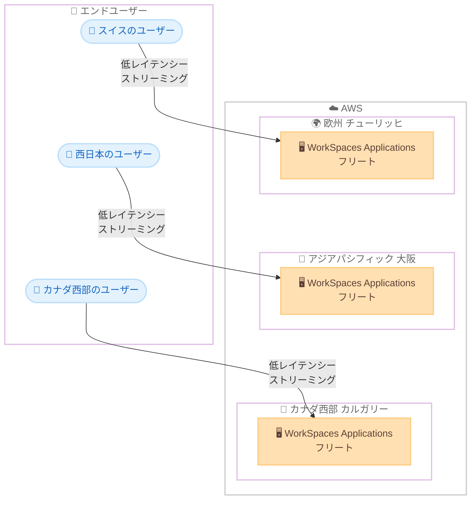

# Amazon WorkSpaces Applications - 3 つの新規 AWS リージョンで利用可能に

**リリース日**: 2026 年 8 月 31 日
**サービス**: Amazon WorkSpaces Applications
**機能**: リージョン拡大 (欧州 (チューリッヒ)、アジアパシフィック (大阪)、カナダ西部 (カルガリー))

📊 [このアップデートのインフォグラフィックを見る](https://takech9203.github.io/aws-news-summary/20260831-amazon-workspaces-applications-region-expansion.html)

## 概要

AWS は、Amazon WorkSpaces Applications のリージョン提供範囲を拡大し、新たに欧州 (チューリッヒ)、アジアパシフィック (大阪)、カナダ西部 (カルガリー) の 3 リージョンで利用可能になったことを発表しました。これにより、これらのリージョンにアプリケーションやデスクトップをデプロイし、WorkSpaces Applications を使用してストリーミング配信できるようになります。

Amazon WorkSpaces Applications は、フルマネージドかつセキュアなアプリケーションストリーミングサービスです。ユーザーはソフトウェアをローカルにダウンロード、インストール、管理することなく、AWS からデスクトップアプリケーションやデスクトップ環境を任意のデバイスにストリーミングして即座に利用できます。WorkSpaces Applications はアプリケーションのホストと実行に必要な AWS リソースを管理し、自動的にスケールして、オンデマンドでユーザーにアクセスを提供します。

エンドユーザーに近いリージョンにアプリケーションをデプロイすることで、より応答性の高いストリーミング体験を提供できます。特に日本のお客様にとっては、大阪リージョンへの対応により、国内でのマルチリージョン構成やディザスタリカバリ (DR) 構成、データレジデンシー要件への対応の選択肢が広がる重要なアップデートです。

**アップデート前の課題**

このアップデート以前は、以下の課題がありました。

- スイス、日本 (大阪)、カナダ西部のユーザーは、地理的に離れたリージョンからアプリケーションをストリーミングする必要があり、レイテンシーが増加していた
- 日本国内では東京リージョンのみの提供であり、国内でのマルチリージョン構成や DR 構成を組むことができなかった
- スイスやカナダなど、データレジデンシーやコンプライアンス要件が厳しい地域のお客様は、要件を満たすリージョンの選択肢が限られていた

**アップデート後の改善**

今回のアップデートにより、以下が可能になりました。

- 欧州 (チューリッヒ)、アジアパシフィック (大阪)、カナダ西部 (カルガリー) の各リージョンでアプリケーションとデスクトップをデプロイし、ストリーミング配信できるようになった
- エンドユーザーに近いリージョンからの配信により、より応答性の高いユーザー体験を提供できるようになった
- 欧州、アジアパシフィック、カナダのお客様がデータレジデンシーおよびコンプライアンス要件を満たすためのリージョン選択肢が増えた
- 日本国内では東京と大阪の 2 リージョン構成が可能になり、国内完結の DR 構成を実現できるようになった

## アーキテクチャ図



新たに追加された 3 リージョンにアプリケーションをデプロイすることで、各地域のエンドユーザーは地理的に近いリージョンから低レイテンシーでアプリケーションをストリーミング利用できます。

## サービスアップデートの詳細

### 主要機能

1. **3 つの新規リージョンへの対応**
   - 欧州 (チューリッヒ)、アジアパシフィック (大阪)、カナダ西部 (カルガリー) の 3 リージョンが追加された
   - WorkSpaces Applications マネジメントコンソールで新リージョンを選択するだけで利用を開始できる
   - 既存リージョンと同様のフルマネージドなアプリケーションストリーミング機能を利用できる

2. **エンドユーザー体験の向上**
   - エンドユーザーに近いリージョンからの配信により、ストリーミングのレイテンシーが低減される
   - 描画の応答性や操作感が向上し、CAD やグラフィックスなど対話性の高いアプリケーションでも快適に利用できる

3. **データレジデンシーとコンプライアンスへの対応**
   - スイス、日本、カナダの各国内にデータを保持する構成が取りやすくなった
   - 金融、公共、医療などデータの所在地に関する要件が厳しい業界での採用がしやすくなった

## 技術仕様

### Amazon WorkSpaces Applications の概要

| 項目 | 詳細 |
|------|------|
| サービス形態 | フルマネージドのアプリケーションストリーミングサービス |
| 配信対象 | デスクトップアプリケーションおよびデスクトップ環境 |
| クライアント要件 | ソフトウェアのローカルインストール不要 (Web ブラウザやクライアントアプリからアクセス) |
| スケーリング | 需要に応じた自動スケーリング |
| 料金モデル | 従量課金 (pay-as-you-go) |
| 追加リージョン | 欧州 (チューリッヒ)、アジアパシフィック (大阪)、カナダ西部 (カルガリー) |

## 設定方法

### 前提条件

1. AWS アカウントを保有していること
2. WorkSpaces Applications で配信するアプリケーションのイメージを準備していること (既存イメージを利用する場合は新リージョンへのコピーが必要)
3. 新リージョンで利用する VPC やサブネットなどのネットワークリソースを準備していること

### 手順

#### ステップ1: 新リージョンの選択

WorkSpaces Applications マネジメントコンソールにサインインし、リージョンセレクタから欧州 (チューリッヒ)、アジアパシフィック (大阪)、カナダ西部 (カルガリー) のいずれかを選択します。

#### ステップ2: イメージの準備

```bash
# 既存リージョンのイメージを新リージョンにコピーする例 (大阪リージョンへコピー)
aws appstream copy-image \
  --source-image-name my-app-image \
  --destination-image-name my-app-image-osaka \
  --destination-region ap-northeast-3
```

既存リージョンで作成済みのアプリケーションイメージを新リージョンへコピーします。イメージを新規作成する場合は、Image Builder を新リージョンで起動してアプリケーションをインストールします。

#### ステップ3: フリートとスタックの作成

```bash
# フリートの作成例 (大阪リージョン)
aws appstream create-fleet \
  --name my-fleet-osaka \
  --instance-type stream.standard.medium \
  --compute-capacity DesiredInstances=2 \
  --image-name my-app-image-osaka \
  --region ap-northeast-3

# スタックの作成とフリートの関連付け
aws appstream create-stack --name my-stack-osaka --region ap-northeast-3
aws appstream associate-fleet \
  --fleet-name my-fleet-osaka \
  --stack-name my-stack-osaka \
  --region ap-northeast-3
```

新リージョンでストリーミング用のフリート (ストリーミングインスタンス群) を作成し、ユーザーへの配信単位であるスタックに関連付けます。作成後、ユーザーにアクセス権を付与するとストリーミングを開始できます。

## メリット

### ビジネス面

- **ユーザー体験の向上**: エンドユーザーに近いリージョンからの配信により応答性が向上し、業務アプリケーションの生産性が高まる
- **コンプライアンス対応**: スイス、日本、カナダ国内へのデータ保持が可能になり、データレジデンシー要件のある業界でも採用しやすくなる
- **事業継続性の強化**: 日本国内では東京・大阪の 2 リージョン構成による国内完結の DR 戦略を実現できる

### 技術面

- **低レイテンシー**: ユーザーとストリーミングインスタンス間の物理距離が短縮され、ストリーミングの遅延が低減される
- **既存機能との互換性**: 新リージョンでも既存リージョンと同じ運用手順、API、自動スケーリング機能を利用できる
- **マルチリージョン構成**: 複数リージョンにフリートを配置し、ユーザーの所在地に応じた最適な配信構成を設計できる

## デメリット・制約事項

### 制限事項

- 利用可能なインスタンスタイプやイメージは、リージョンによって異なる場合があるため、事前に確認が必要
- 既存リージョンで作成したイメージは、新リージョンで利用する前にコピーが必要

### 考慮すべき点

- リージョンによって料金が異なる場合があるため、料金ページで対象リージョンの単価を確認すること
- 大阪リージョンなど比較的小規模なリージョンでは、キャパシティやアベイラビリティゾーン数が東京などの大規模リージョンと異なる点を考慮すること
- Active Directory 連携やファイルサーバーなど周辺リソースも新リージョンに配置するか、リージョン間接続のレイテンシーを考慮した設計が必要

## ユースケース

### ユースケース1: 西日本拠点向けの低レイテンシーなアプリケーション配信

**シナリオ**: 大阪や西日本に拠点を持つ企業が、CAD や業務アプリケーションを従業員にストリーミング配信したい。従来は東京リージョンからの配信で、西日本のユーザーには遅延が課題だった。

**実装例**:
```
1. 大阪リージョン ap-northeast-3 にアプリケーションイメージをコピー
2. 大阪リージョンでフリートとスタックを作成
3. 西日本のユーザーを大阪リージョンのスタックに割り当て
```

**効果**: 西日本のユーザーはより近いリージョンからストリーミングを受けられ、操作の応答性が向上します。

### ユースケース2: 東京・大阪による国内 DR 構成

**シナリオ**: 金融機関が、アプリケーションストリーミング基盤の事業継続計画 (BCP) として、国内完結のマルチリージョン構成を求めている。

**実装例**:
```
1. 東京リージョンをプライマリ、大阪リージョンをセカンダリとして同一イメージを配置
2. 平常時は東京リージョンのスタックへ接続
3. 障害時は大阪リージョンのスタックへユーザーを切り替え
```

**効果**: データを国内に保持したまま、リージョン障害時にも業務アプリケーションの提供を継続できます。

### ユースケース3: スイス国内でのデータレジデンシー要件対応

**シナリオ**: スイスの金融機関や公共機関が、データを国内に保持するという規制要件を満たしながら、セキュアなアプリケーション配信基盤を構築したい。

**実装例**:
```
1. 欧州 チューリッヒ リージョンにアプリケーション環境をデプロイ
2. ユーザーデータやセッション情報をスイス国内のリージョンで完結
3. 各種コンプライアンス要件に沿ったアクセス制御を設定
```

**効果**: データレジデンシー要件を満たしつつ、フルマネージドなアプリケーションストリーミングを利用できます。

## 料金

WorkSpaces Applications は従量課金 (pay-as-you-go) モデルを採用しています。ストリーミングインスタンスの稼働時間やインスタンスタイプに応じて料金が発生します。リージョンごとに単価が異なる場合があるため、詳細は料金ページで新リージョンの料金を確認してください。

## 利用可能リージョン

今回のアップデートにより、以下の 3 リージョンが追加されました。

- 欧州 (チューリッヒ)
- アジアパシフィック (大阪)
- カナダ西部 (カルガリー)

利用可能なリージョンの全リストは [AWS リージョン別サービス表](https://aws.amazon.com/about-aws/global-infrastructure/regional-product-services/) を参照してください。

## 関連サービス・機能

- **Amazon WorkSpaces**: フルマネージドの仮想デスクトップ (DaaS) サービス。デスクトップ全体を永続的に利用する場合はこちらが適する
- **Amazon WorkSpaces Secure Browser**: セキュアなブラウザアクセスを提供するサービス。Web アプリケーションのみを配信する場合の選択肢
- **Amazon EC2**: WorkSpaces Applications のストリーミングインスタンスの基盤となるコンピューティングサービス

## 参考リンク

- 📊 [インフォグラフィック](https://takech9203.github.io/aws-news-summary/20260831-amazon-workspaces-applications-region-expansion.html)
- [公式発表 (What's New)](https://aws.amazon.com/about-aws/whats-new/2026/08/amazon-workspaces-applications-region-expansion)
- [Amazon WorkSpaces Applications 製品ページ](https://aws.amazon.com/workspaces-family/applications/)
- [Amazon WorkSpaces Applications 料金ページ](https://aws.amazon.com/workspaces-family/applications/pricing/)
- [AWS リージョン別サービス表](https://aws.amazon.com/about-aws/global-infrastructure/regional-product-services/)

## まとめ

Amazon WorkSpaces Applications が欧州 (チューリッヒ)、アジアパシフィック (大阪)、カナダ西部 (カルガリー) の 3 リージョンに拡大されました。特に大阪リージョンへの対応は、日本のお客様にとって西日本ユーザーへの低レイテンシー配信や国内完結の DR 構成を実現できる重要なアップデートです。該当地域にエンドユーザーを持つ場合は、新リージョンへのデプロイを検討することを推奨します。
