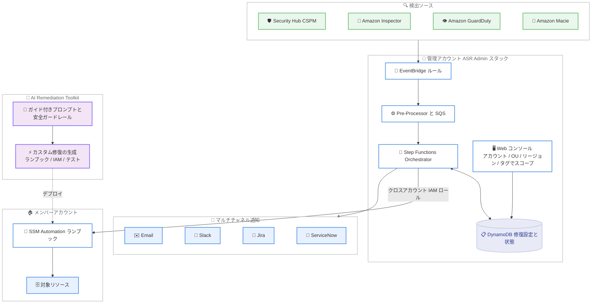

# Automated Security Response on AWS - AI Remediation Toolkit によるカスタム修復の生成

**リリース日**: 2026 年 8 月 31 日
**サービス**: Automated Security Response on AWS (AWS ソリューション)
**機能**: AI Remediation Toolkit、Inspector / GuardDuty / Macie 対応、強化された Web コンソール、マルチチャネル通知

📊 [このアップデートのインフォグラフィックを見る](https://takech9203.github.io/aws-news-summary/20260831-automated-security-response-adds-AI-toolkit.html)

## 概要

AWS Security Hub の検出結果 (findings) を自動修復する AWS ソリューション「Automated Security Response on AWS (ASR)」が、バージョン 4.0.0 で大幅に機能強化されました。目玉となるのは **AI Remediation Toolkit** です。任意の AI アシスタントと組み合わせて使えるガイド付きプロンプトと安全ガードレールにより、新しいセキュリティコントロールに対するカスタム修復 (SSM Automation ランブックや関連コード一式) を自然言語から生成できます。これにより、カスタム修復の開発期間を数週間から数時間に短縮できるとされています。

さらに、Amazon Inspector、Amazon GuardDuty、Amazon Macie の検出結果の自動修復に対応し、認証情報の侵害、未パッチの脆弱性、機密データの露出といった脅威にも最小限の手動トリアージで対応できるようになりました。強化された Web コンソールでは、100 を超えるセキュリティコントロールの修復設定をアカウント、OU、リージョン、リソースタグ単位で一元的にスコープ設定できます。加えて、Email、Slack、Jira、ServiceNow への通知アダプターが追加され、重要度ベースのフィルタリングと期限管理を備えた通知運用が可能になりました。

**アップデート前の課題**

これまでの ASR には以下の課題がありました。

- カスタム修復の開発には SSM Automation、CDK / TypeScript、IAM ロール設計などの深い専門知識が必要で、数週間の開発期間を要していた
- 修復対象は主に AWS Security Hub CSPM のコントロール検出結果に限られ、Inspector / GuardDuty / Macie の検出結果への自動対応は別途作り込みが必要だった
- 修復の有効化やスコープ設定は DynamoDB テーブルや SSM ドキュメントの手動設定に依存しており、ミスが発生しやすかった
- 通知は SNS 中心で、チームが日常的に使う Slack や ITSM ツールへの連携は個別実装が必要だった

**アップデート後の改善**

今回のアップデートにより以下が可能になりました。

- AI Remediation Toolkit のガイド付きプロンプトと安全ガードレールにより、コーディング不要で新しいコントロール向けのカスタム修復を生成・デプロイできるようになった
- Inspector (脆弱性)、GuardDuty (脅威検出)、Macie (機密データ) の検出結果を自動修復の対象に追加できるようになった
- Web コンソールから 100 以上のコントロールをバリデーション付きで一元管理し、アカウント、OU、リージョン、リソースタグで修復スコープを制御できるようになった
- Email、Slack、Jira、ServiceNow への通知アダプターにより、修復リンク、対応期限、根本対応用の IaC コードスニペットを含む通知を重要度フィルタ付きで配信できるようになった

## アーキテクチャ図



Security Hub に集約された各サービスの検出結果を EventBridge 経由で受け取り、管理アカウントの Step Functions がメンバーアカウントの SSM Automation ランブックを実行して修復します。AI Remediation Toolkit は、この仕組みに組み込む新しいカスタム修復ランブック一式を AI アシスタントで生成するための開発支援コンポーネントです。

## サービスアップデートの詳細

### 主要機能

1. **AI Remediation Toolkit**
   - GitHub リポジトリの `ai-assets/prompts/` に含まれるシステムプロンプトを、任意の AI アシスタント (エージェント型のコーディング支援ツールやチャット型アシスタント) に読み込ませて使用する
   - 対象のコントロール ID (例: `S3.9`) を指定するだけで、READ → CREATE → BUILD → TEST → DEPLOY → VERIFY のワークフローに沿って修復ランブック (YAML)、コントロールランブック (TypeScript)、IAM ロール定義、テストコードまで一式を生成する
   - 安全ガードレールが組み込まれており、AWS 環境を変更する前に必ずスコープ (GENERATE / FULL / FULL TEST) の確認を求める、全文字列パラメータに厳格な `allowedPattern` を付与する、修復後にリソースを読み直して効果を検証するステップを必須とする、といったルールが強制される

2. **Inspector / GuardDuty / Macie の検出結果への対応**
   - Security Hub に集約される Amazon Inspector (脆弱性)、Amazon GuardDuty (脅威検出)、Amazon Macie (機密データ検出) の検出結果を自動修復の対象に追加
   - 認証情報の侵害、未パッチの脆弱性、機密データの露出などの脅威に、手動トリアージを最小限にして対応可能

3. **強化された Web コンソール**
   - 100 を超えるセキュリティコントロールの修復設定を一元管理
   - アカウント、OU、リージョン、リソースタグによる修復スコープの制御が可能
   - 従来はエラーが発生しやすかった DynamoDB と SSM の手動設定を、バリデーション付きの UI 操作に置き換え
   - Amazon Cognito 認証、API Gateway レート制限、AWS WAF (マネージドルール + レートベースルール) で保護される

4. **マルチチャネル通知アダプター**
   - Email、Slack、Jira、ServiceNow 向けの通知アダプターを追加
   - Security Hub の検出結果に対して、重要度ベースのフィルタリングと期限 (デッドライン) の設定・強制が可能
   - 通知には修復へのリンク、対応期限、根本原因に対処するための IaC コードスニペットが含まれる
   - Slack / Jira / ServiceNow の認証情報は AWS Secrets Manager に保存される (チャネルごとに 1 シークレット)

## 技術仕様

### ソリューション基本情報

| 項目 | 詳細 |
|------|------|
| ソリューションバージョン | 4.0.0 (2026 年 8 月リリース) |
| デプロイ方式 | CloudFormation (Admin スタック、Member スタック、Member Roles スタック) |
| 推定デプロイ時間 | 約 30 分 |
| 対応プレイブック | CIS v1.2.0 / v1.4.0 / v3.0.0、AWS FSBP v1.0.0、PCI DSS v3.2.1、NIST SP 800-53 Rev. 5、SC (Consolidated Control Findings) |
| 修復実行基盤 | AWS Systems Manager Automation ドキュメント (メンバーアカウント側で実行) |
| オーケストレーション | AWS Step Functions + Lambda (管理アカウント側) |
| ライセンス | Apache License 2.0 (GitHub でソースコード公開) |

### AI Remediation Toolkit の実行スコープ

| スコープ | 実行内容 | AWS 環境の変更 |
|------|------|------|
| GENERATE (デフォルト) | ソースファイル生成 + ビルド + 簡易テスト | なし |
| FULL | 上記 + 非本番の開発アカウントへのデプロイ | あり (スタック) |
| FULL TEST | 上記 + 全テストスイート + 実際の FAILED 検出結果に対する修復検証 | あり (スタック + 実リソース) |

### AI 生成ランブックの安全ガードレール例

```yaml
# 生成されるランブックには検証ステップが必須
- name: VerifyRemediation
  action: 'aws:assertAwsResourceProperty'
  inputs:
    Service: rds
    Api: DescribeDBInstances
    DBInstanceIdentifier: '{{ GetInstanceId.Id }}'
    PropertySelector: '$.DBInstances[0].PubliclyAccessible'
    DesiredValues: ['False']
  isEnd: true
```

修復ランブックは末尾で対象リソースを再読み込みし、修正が反映されたことを検証するステップを必ず含むよう強制されます。また、`AutomationAssumeRole` を含むすべての文字列パラメータには厳格な `allowedPattern` が付与されます。

## 設定方法

### 前提条件

1. AWS Security Hub が管理アカウントおよびメンバーアカウントで有効化されていること
2. 管理アカウントに ASR Admin スタック、各メンバーアカウントに Member スタックと Member Roles スタックをデプロイできる権限があること
3. AI Remediation Toolkit を使用する場合は、GitHub リポジトリをクローンできる開発環境と任意の AI アシスタント

### 手順

#### ステップ 1: ソリューションのデプロイ

```bash
# CloudFormation テンプレート (Admin スタック) の URL
# https://solutions-reference.s3.amazonaws.com/automated-security-response-on-aws/latest/automated-security-response-admin.template
```

AWS Solutions Library のページから Admin スタック、Member スタック、Member Roles スタックの順にデプロイします。Web コンソールを使用する場合は `ShouldDeployWebUI` パラメータを有効にし、`AdminUserEmail` に管理者のメールアドレスを指定します。

#### ステップ 2: Web コンソールでの修復スコープ設定

デプロイ後、Web コンソールにサインインし、対象コントロールごとに修復の有効化と、アカウント、OU、リージョン、リソースタグによるスコープを設定します。通知設定画面で Email、Slack、Jira、ServiceNow のチャネルと重要度フィルタ、対応期限を構成します。

#### ステップ 3: AI Remediation Toolkit によるカスタム修復の生成

```bash
# ソリューションのリポジトリをクローン
git clone https://github.com/aws-solutions/automated-security-response-on-aws.git
cd automated-security-response-on-aws

# システムプロンプトを確認
cat ai-assets/prompts/remediation-generator-system-prompt.md
```

リポジトリをクローンし、`ai-assets/prompts/remediation-generator-system-prompt.md` を AI アシスタントのシステムプロンプトとして設定します。その後、対象のコントロール ID (例: `ElastiCache.2`) を指定すると、AI アシスタントが既存の修復パターンを読み込み、ランブック、IAM ロール、テストコード一式を生成します。生成物はまず `GENERATE` スコープでビルドとユニットテストまでを実施し、内容を確認したうえで非本番アカウントでのデプロイ検証に進むことが推奨されます。

## メリット

### ビジネス面

- **修復開発の大幅な高速化**: カスタム修復の開発期間が数週間から数時間に短縮され、新しい脅威やコンプライアンス要件への対応リードタイムが短くなる
- **運用負荷の削減**: Inspector / GuardDuty / Macie の検出結果まで自動修復の対象が広がり、セキュリティチームの手動トリアージ工数を削減できる
- **組織全体のガバナンス強化**: OU やタグ単位のスコープ設定により、マルチアカウント環境全体で一貫した修復ポリシーを適用できる

### 技術面

- **専門知識への依存を低減**: SSM Automation や CDK の深い知識がなくても、ガイド付きプロンプトでプロジェクトの規約に沿った修復コードを生成できる
- **安全性を担保した AI 活用**: スコープ確認、厳格な入力バリデーション、必須の検証ステップなどのガードレールにより、AI 生成コードによる設定ミスのリスクを低減できる
- **既存ワークフローとの統合**: Slack や Jira、ServiceNow への通知に修復リンクと IaC スニペットが含まれるため、検出から根本対応までの流れを既存の運用ツール上で完結できる

## デメリット・制約事項

### 制限事項

- ASR はマネージドサービスではなく AWS ソリューションであり、デプロイ、バージョンアップ、カスタマイズの管理はユーザー自身の責任となる
- AI Remediation Toolkit は AI アシスタント自体を含まない。別途、利用する AI アシスタント (およびその利用コスト) を用意する必要がある
- 修復はリソースを直接変更するため、CloudFormation などの IaC で管理しているリソースではドリフトが発生する可能性がある

### 考慮すべき点

- AI が生成した修復は、GENERATE スコープでのコードレビューとテスト、非本番環境での検証を経てから本番適用するべきである
- 自動修復の有効化は、誤検出や意図しないリソース変更の影響を考慮し、コントロール単位で段階的に行うことが推奨される
- KMS キーがアカウント × リージョンごとに作成されるため、大規模環境ではコストの大部分を KMS が占める (1,000 アカウント × 10 リージョンの例では月額約 10,000 USD)

## ユースケース

### ユースケース 1: 未対応コントロールへのカスタム修復の迅速な追加

**シナリオ**: 社内のセキュリティ基準で必須となっている Security Hub コントロールが、ASR の標準プレイブックに含まれていない。

**実装例**:
```text
1. AI アシスタントに remediation-generator-system-prompt.md を設定
2. 「S3.9 の修復を SC と NIST80053 プレイブックに追加して」と指示
3. GENERATE スコープで生成物をレビューし、ユニットテストを確認
4. 開発アカウントで FULL TEST を実施し、FAILED 検出結果が PASSED になることを確認
```

**効果**: 従来数週間かかっていたカスタム修復の追加を数時間で完了し、コンプライアンスギャップを迅速に解消できる。

### ユースケース 2: GuardDuty / Macie 検出結果への自動対応

**シナリオ**: 認証情報の漏えいや S3 バケット上の機密データ露出が検出された際、営業時間外でも即座に初動対応を行いたい。

**実装例**:
```text
1. Web コンソールで GuardDuty / Macie 関連の修復を有効化
2. 本番 OU では手動承認、サンドボックス OU では全自動というようにスコープを設定
3. 重要度 CRITICAL / HIGH の検出結果を Slack と ServiceNow に通知するよう構成
```

**効果**: 侵害の初動対応を自動化し、平均対応時間 (MTTR) を短縮しながら、重要環境では人間の承認を挟む柔軟な運用ができる。

### ユースケース 3: 通知と期限管理による根本対応の徹底

**シナリオ**: 自動修復は応急処置であり、IaC テンプレート側の修正 (根本対応) が放置されがちになっている。

**実装例**:
```text
1. Jira アダプターを構成し、修復実行時に自動でチケットを作成
2. 通知に含まれる IaC コードスニペットを開発チームがテンプレートに反映
3. 期限 (デッドライン) を設定し、未対応チケットをエスカレーション
```

**効果**: 応急処置と根本対応を分離して追跡でき、同じ検出結果の再発を防止できる。

## 料金

ASR ソリューション自体は無料ですが、デプロイされる AWS サービス (Systems Manager Automation、Step Functions、Lambda、DynamoDB、KMS、Web コンソール有効時は API Gateway / WAF / CloudFront / Cognito など) の利用料金が発生します。

### 料金例

| 使用量 | 月額料金 (概算) |
|--------|------------------|
| 小規模: 10 アカウント、1 リージョン、300 修復 / 月 | 約 14.70 USD |
| 小規模 + Web コンソール有効 | 約 49.31 USD |
| 中規模: 100 アカウント、1 リージョン、3,000 修復 / 月 | 約 106.49 USD |
| 大規模: 1,000 アカウント、10 リージョン、30,000 修復 / 月 | 約 7,360.00 USD |

大規模環境ではアカウント × リージョンごとの KMS キー料金が支配的になる点に注意してください。Slack / Jira / ServiceNow チャネルを構成する場合は、チャネルごとに Secrets Manager のシークレット料金 (1 シークレットあたり月額 0.40 USD) が追加されます。

## 利用可能リージョン

すべての商用リージョンおよびオプトインリージョンにデプロイ可能です。AWS GovCloud (US) および中国リージョンにも対応しています。

## 関連サービス・機能

- **AWS Security Hub**: 検出結果の集約元。ASR は Security Hub CSPM の検出結果イベントを EventBridge 経由で受信して修復を実行する
- **Amazon Inspector / Amazon GuardDuty / Amazon Macie**: 今回のアップデートで自動修復の対象に加わった検出ソース。脆弱性、脅威、機密データ露出をカバーする
- **AWS Systems Manager Automation**: 修復処理の実行基盤。AI Remediation Toolkit が生成するのもこの Automation ドキュメントが中心となる
- **AWS Step Functions**: 管理アカウントで修復のオーケストレーションを担当し、クロスアカウント IAM ロールでメンバーアカウントの修復を起動する

## 参考リンク

- 📊 [インフォグラフィック](https://takech9203.github.io/aws-news-summary/20260831-automated-security-response-adds-AI-toolkit.html)
- [公式発表 (What's New)](https://aws.amazon.com/about-aws/whats-new/2026/08/automated-security-response-adds-AI-toolkit/)
- [ソリューションページ / 実装ガイド](https://docs.aws.amazon.com/solutions/automated-security-response-on-aws/)
- [コスト詳細](https://docs.aws.amazon.com/solutions/latest/automated-security-response-on-aws/cost.html)
- [GitHub リポジトリ](https://github.com/aws-solutions/automated-security-response-on-aws)

## まとめ

Automated Security Response on AWS v4.0.0 は、AI Remediation Toolkit によるカスタム修復の生成、Inspector / GuardDuty / Macie への対応拡大、Web コンソールとマルチチャネル通知の強化により、Security Hub を中心としたセキュリティ運用の自動化を大きく前進させるアップデートです。すでに ASR を利用している組織はバージョンアップを検討し、未導入の組織はまず小規模環境で標準プレイブックと Web コンソールを試したうえで、AI Remediation Toolkit による独自コントロールの修復追加を評価することを推奨します。
