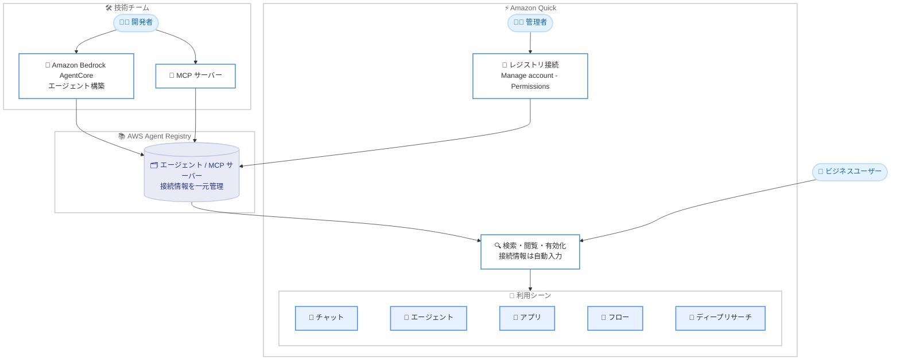

# Amazon Quick - AWS Agent Registry のエージェントと MCP サーバーの統合

**リリース日**: 2026 年 8 月 31 日
**サービス**: Amazon Quick / AWS Agent Registry
**機能**: AWS Agent Registry のエージェントおよび MCP サーバーを Amazon Quick から検索・利用可能に

📊 [このアップデートのインフォグラフィックを見る](https://takech9203.github.io/aws-news-summary/20260831-aws-agent-registry-agents-mcp-servers-quick.html)

## 概要

Amazon Quick が AWS Agent Registry との統合を発表しました。この統合により、組織の AWS Agent Registry に登録されたリソースを Amazon Quick 内から直接検索・利用できるようになります。AWS Agent Registry は MCP サーバーとエージェントをサポートしており、ユーザーは Amazon Quick の画面上でこれらを検索・閲覧し、必要なエージェントや MCP サーバーを見つけたら数クリックで有効化できます。接続情報はレジストリからあらかじめ自動入力されるため、手動での設定は不要です。

有効化したリソースはチームと共有でき、チャット、エージェント、アプリ、フロー、ディープリサーチといった Amazon Quick の各機能で活用できます。この統合は、Amazon Bedrock AgentCore でエージェントを構築する技術チームと、Amazon Quick で業務を行うビジネスユーザーの間のギャップを埋めるものです。

**アップデート前の課題**

このアップデート以前には、以下の課題がありました。

- AWS Agent Registry に既に存在するエージェントやツールを Amazon Quick で使うには、接続を手動で設定する必要があった
- 技術チームが構築したエージェントをビジネスユーザーが見つける手段が限られていた
- 同じエージェントや MCP サーバーの接続設定を組織内で重複して行う必要があった

**アップデート後の改善**

今回のアップデートにより、以下が可能になりました。

- Amazon Quick 内から組織の AWS Agent Registry のエージェントと MCP サーバーを直接検索・閲覧できるようになった
- 接続情報がレジストリから自動入力され、数クリックで有効化できるようになった
- 有効化したリソースをチームと共有し、チャット、エージェント、アプリ、フロー、ディープリサーチで利用できるようになった

## アーキテクチャ図



技術チームが Amazon Bedrock AgentCore で構築したエージェントや MCP サーバーを AWS Agent Registry に登録すると、Amazon Quick のユーザーがそれらを検索・有効化し、チャットやフローなどの各機能で利用できます。

## サービスアップデートの詳細

### 主要機能

1. **レジストリ内リソースの検索・閲覧**
   - 組織の AWS Agent Registry に登録されたエージェントと MCP サーバーを Amazon Quick 内から直接検索・閲覧できる
   - 技術チームが構築済みのリソースをビジネスユーザーが自分で発見できる

2. **数クリックでの有効化と接続情報の自動入力**
   - 必要なエージェントや MCP サーバーを見つけたら、数クリックで有効化できる
   - 接続情報はレジストリからあらかじめ自動入力されるため、手動設定が不要

3. **チームへの共有と幅広い利用シーン**
   - 有効化したリソースはチームと共有できる
   - チャット、エージェント、アプリ、フロー、ディープリサーチの各機能で利用できる

## 技術仕様

### 統合の構成要素

| 項目 | 詳細 |
|------|------|
| 統合元 | AWS Agent Registry (Amazon Bedrock AgentCore の機能) |
| 統合先 | Amazon Quick |
| 対応リソース | エージェント、MCP サーバー |
| 接続設定 | レジストリから接続情報を自動入力 |
| 利用可能な機能 | チャット、エージェント、アプリ、フロー、ディープリサーチ |
| 設定場所 | Amazon Quick 管理コンソールの [Manage account] - [Permissions] - [AWS Agent Registry] |

### API変更履歴

同日に AWS Agent Registry 関連の API 更新が公開されています。

| 日付 | サービス | 変更内容 |
|------|----------|----------|
| 2026/08/31 | [Agent Registry Control](https://awsapichanges.com/archive/changes/65de2a-agent-registry-control.html) | 8 updated api methods - CreateRegistry、GetRegistry、ListRegistryRecords などが更新され、AWS Agent Registry が一般提供に |
| 2026/08/31 | [Agent Registry](https://awsapichanges.com/archive/changes/65de2a-agent-registry.html) | 3 updated api methods - AWS Agent Registry の一般提供に伴う更新 |

## 設定方法

### 前提条件

1. Amazon Quick のアカウントと管理者権限があること
2. 組織で AWS Agent Registry (Amazon Bedrock AgentCore) を利用しており、エージェントまたは MCP サーバーが登録されていること
3. Amazon Quick と Amazon Bedrock AgentCore の両方が利用可能なリージョンであること

### 手順

#### ステップ1: レジストリの接続

Amazon Quick 管理コンソールを開き、[Manage account] から [Permissions]、[AWS Agent Registry] の順に進み、組織のレジストリを接続します。この操作により、Amazon Quick が AWS Agent Registry のリソースを参照できるようになります。

#### ステップ2: エージェント・MCP サーバーの検索と有効化

Amazon Quick 内で組織のレジストリに登録されたエージェントや MCP サーバーを検索・閲覧します。必要なリソースを見つけたら数クリックで有効化します。接続情報はレジストリから自動入力されます。

#### ステップ3: チームへの共有と利用

有効化したリソースをチームと共有します。共有されたリソースは、チャット、エージェント、アプリ、フロー、ディープリサーチの各機能で利用できます。

## メリット

### ビジネス面

- **重複作業の排除**: レジストリに既に存在するエージェントやツールへの接続を手動で設定する必要がなくなり、組織全体の作業の重複を削減できる
- **ビジネスユーザーの自律性向上**: ビジネスユーザーが慣れ親しんだ Amazon Quick のワークスペースから、技術チームが構築したエージェントに自分でアクセスできる
- **組織内の AI 資産の活用促進**: 技術チームが構築したエージェントの発見性が高まり、投資した AI 資産の利用が組織全体に広がる

### 技術面

- **接続設定の自動化**: 接続情報がレジストリから自動入力されるため、設定ミスのリスクを低減できる
- **一元管理**: AWS Agent Registry でエージェントと MCP サーバーを一元管理し、Amazon Quick 側はそれを参照するだけでよい
- **技術チームとビジネスユーザーの橋渡し**: Amazon Bedrock AgentCore でエージェントを構築する技術チームと Amazon Quick を使うビジネスユーザーの間のギャップを埋められる

## デメリット・制約事項

### 制限事項

- Amazon Quick と Amazon Bedrock AgentCore の両方が利用可能なリージョンでのみ利用できる
- レジストリの接続には Amazon Quick の管理コンソールでの設定が必要

### 考慮すべき点

- どのエージェントや MCP サーバーをビジネスユーザーに共有するか、組織としてのガバナンスポリシーを検討する必要がある
- レジストリに登録するエージェントや MCP サーバーの品質・セキュリティは技術チーム側で担保する必要がある

## ユースケース

### ユースケース1: 社内ナレッジ検索エージェントの全社展開

**シナリオ**: 技術チームが Amazon Bedrock AgentCore で社内ドキュメント検索エージェントを構築し、AWS Agent Registry に登録している。営業部門やサポート部門のビジネスユーザーにもこのエージェントを使ってもらいたい。

**実装例**:
```
1. 技術チームがエージェントを AWS Agent Registry に登録
2. Amazon Quick 管理者が Manage account - Permissions - AWS Agent Registry でレジストリを接続
3. 各部門のユーザーが Amazon Quick 内でエージェントを検索し、数クリックで有効化
4. チャットやディープリサーチでエージェントを利用
```

**効果**: 手動の接続設定なしで、全社のビジネスユーザーが社内ナレッジ検索エージェントを利用できる。

### ユースケース2: 業務システム連携用 MCP サーバーの共有

**シナリオ**: 社内の CRM やチケット管理システムに接続する MCP サーバーを技術チームが構築・登録している。業務部門がこれらのツールを Amazon Quick のフローやアプリで使いたい。

**実装例**:
```
1. 技術チームが MCP サーバーを AWS Agent Registry に登録
2. 業務部門のユーザーが Amazon Quick 内で MCP サーバーを検索・有効化
   接続情報はレジストリから自動入力される
3. 有効化した MCP サーバーをチームと共有し、フローやアプリに組み込む
```

**効果**: 接続情報の手動設定や重複設定が不要になり、業務システム連携の展開スピードが向上する。

### ユースケース3: エージェント資産のガバナンスを保った展開

**シナリオ**: 組織として承認済みのエージェントのみをビジネスユーザーに提供したい。個別の接続設定が乱立すると管理が困難になる。

**実装例**:
```
1. 承認済みのエージェント・MCP サーバーのみを AWS Agent Registry に登録
2. Amazon Quick からはレジストリ経由でのみリソースを有効化
3. 有効化されたリソースの共有範囲をチーム単位で管理
```

**効果**: レジストリを単一の情報源として、承認済みリソースのみを統制の取れた形で組織に展開できる。

## 料金

今回の発表では、この統合機能自体の追加料金に関する記載はありません。Amazon Quick および Amazon Bedrock AgentCore それぞれの料金体系が適用されます。詳細は各サービスの料金ページを確認してください。

## 利用可能リージョン

Amazon Quick と Amazon Bedrock AgentCore の両方が利用可能なすべての AWS リージョンで利用できます。以下のリージョンが含まれます。

- 米国東部 (バージニア北部)
- 米国西部 (オレゴン)
- アジアパシフィック (シドニー)
- アジアパシフィック (東京)
- 欧州 (フランクフルト)
- 欧州 (アイルランド)

## 関連サービス・機能

- **Amazon Bedrock AgentCore**: 技術チームがエージェントを構築・デプロイするためのサービス。AWS Agent Registry はその機能の一つ
- **AWS Agent Registry**: エージェントと MCP サーバーを組織で一元管理するレジストリ。今回 Amazon Quick からの検索・利用が可能になった
- **Model Context Protocol (MCP)**: エージェントと外部ツール・データソースを接続するためのオープンプロトコル。レジストリに登録された MCP サーバーを Amazon Quick から利用できる

## 参考リンク

- 📊 [インフォグラフィック](https://takech9203.github.io/aws-news-summary/20260831-aws-agent-registry-agents-mcp-servers-quick.html)
- [公式発表 (What's New)](https://aws.amazon.com/about-aws/whats-new/2026/08/aws-agent-registry-agents-mcp-servers-quick/)
- [Amazon Quick Integrations ドキュメント](https://docs.aws.amazon.com/quick/latest/userguide/aws-agent-registry-integration.html)
- [AWS Agent Registry ドキュメント](https://docs.aws.amazon.com/bedrock-agentcore/latest/devguide/registry.html)

## まとめ

Amazon Quick と AWS Agent Registry の統合により、技術チームが Amazon Bedrock AgentCore で構築したエージェントや MCP サーバーを、ビジネスユーザーが手動設定なしで検索・有効化できるようになりました。組織内の AI エージェント資産を全社に展開したい場合は、まず Amazon Quick 管理コンソールの [Manage account] - [Permissions] - [AWS Agent Registry] からレジストリを接続し、共有するリソースのガバナンスポリシーを検討することを推奨します。
