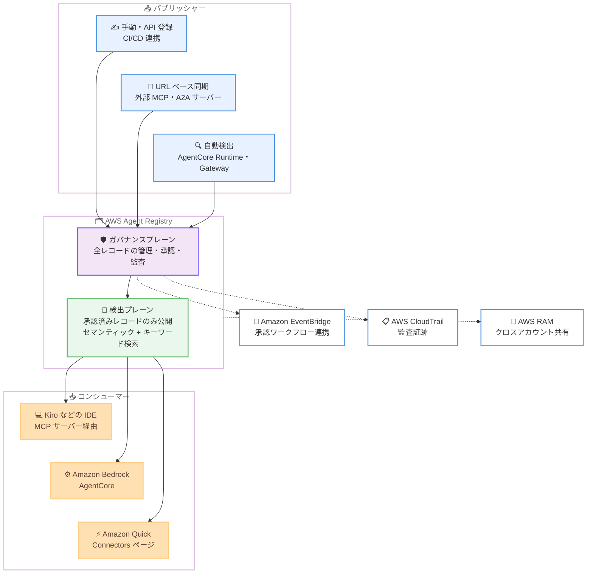

# AWS Agent Registry - エージェントの一元的な検出とガバナンスを実現するレジストリが一般提供開始

**リリース日**: 2026 年 8 月 31 日
**サービス**: AWS Agent Registry
**機能**: エージェント、ツール、スキル、MCP サーバーの一元的なカタログ・検出・ガバナンス機能の一般提供 (GA)

📊 [このアップデートのインフォグラフィックを見る](https://takech9203.github.io/aws-news-summary/20260831-aws-agent-registry-generally-available.html)

## 概要

AWS Agent Registry が一般提供 (GA) されました。AWS Agent Registry は、組織内のエージェント、ツール、スキル、MCP サーバー、カスタムリソースを対象とした、プライベートでガバナンスの効いたカタログおよび検出レイヤーを提供するサービスです。チームが組織内の AI 資産を横断的に可視化できるようになり、既存の機能を再構築することなく発見・再利用できます。

AWS Agent Registry は、AWS Agent Registry コンソール、AWS CLI、AWS SDK からアクセスできるほか、Amazon Bedrock AgentCore、Amazon Quick、Kiro IDE からも検出可能です。さらにレジストリ自体が MCP サーバーとして公開されるため、開発者は IDE から直接レジストリをクエリできます。コンソールではセマンティック検索とキーワード検索を組み合わせたハイブリッド検索と、専用のブラウズ体験が提供されます。

GA にあたり、プレビューで提供されていた機能 (手動および URL ベースのレコード作成、承認ワークフロー、セマンティック・キーワード検索、AWS CloudTrail による監査証跡) に加えて、Infrastructure as Code 対応、タグ付け、AWS RAM によるクロスアカウント共有、AgentCore 上のエージェントの自動検出、Amazon Quick 統合といったエンタープライズ向け機能が追加されました。

**アップデート前の課題**

プレビュー段階の AWS Agent Registry には、エンタープライズ規模での運用に必要な機能がいくつか不足していました。

- レジストリの作成・管理はコンソールや API 経由の手動操作が中心で、CloudFormation や Terraform などの IaC ツールでプロビジョニングできなかった
- レジストリは単一アカウント内での利用が前提であり、組織全体で共有するレジストリを構築する仕組みがなかった
- エージェントや MCP サーバーのレコードは手動または URL ベースで登録する必要があり、デプロイ済みエージェントの把握漏れ (いわゆる Shadow AI) を防ぐことが困難だった
- タグによる整理、コスト配分、アクセス制御ができなかった

**アップデート後の改善**

今回の GA により、以下が可能になりました。

- AWS CloudFormation、Terraform、AWS CDK を使用してレジストリを IaC でプロビジョニングできるようになった
- AWS Resource Access Manager (AWS RAM) を使用してレジストリとレコードをクロスアカウント共有し、組織全体のレジストリを構築できるようになった
- AWS Organizations 全体で AgentCore Runtime および AgentCore Gateway 上のエージェントを自動検出し、手動での登録作業なしにレコードを最新に保てるようになった
- レジストリとレコードにタグを付与し、整理、コスト配分、アクセス制御に活用できるようになった
- Amazon Quick の Connectors ページからレジストリ内のカスタムコネクタを検出できるようになった

## アーキテクチャ図



AWS Agent Registry は、全レコードを管理するガバナンスプレーンと、承認済みレコードのみを公開する検出プレーンの 2 層構造で構成されます。パブリッシャーは手動登録、URL ベース同期、自動検出の 3 つの方法でレコードを登録し、コンシューマーは IDE、AgentCore、Amazon Quick から承認済みリソースを検出・利用します。

## サービスアップデートの詳細

### 主要機能

1. **2 プレーン構成によるカタログとガバナンス**
   - ガバナンスプレーン: ライフサイクル状態に関係なく、登録された全リソースを管理する信頼できる唯一のストア。コンプライアンス・セキュリティシグナル、エンタイトルメントベースの検出ポリシー、カスタムメタデータスキーマ (コストセンター、データ分類、SLA ティアなど) を管理者が設定可能
   - 検出プレーン: 承認済みレコードのみを表示するコンシューマー向けのキュレーションされたビュー。高スループットなクエリに最適化され、セマンティック検索とキーワード検索を組み合わせたハイブリッド検索を提供
   - レコードタイプは MCP (サーバー、ツール、リソース、プロンプト)、Agent (A2A エージェントカード)、Skill (Markdown 定義とコード・パッケージ)、Custom (任意の有効な JSON 記述子) の 4 種類をサポート

2. **組織全体の自動検出 (GA 新機能)**
   - AWS Organizations レベルで一度有効化すると、全アカウントの AgentCore Runtime および AgentCore Gateway 上のエージェントと MCP サーバーを自動検出
   - 検出されたリソースは Detected Endpoints ビューに表示され、ドラフトレコードとして取り込まれる
   - 新しいエージェントがデプロイされるたびに継続的に検出されるため、手動での登録作業なしにレコードを最新に保ち、Shadow AI の問題に対処できる

3. **承認ワークフローとライフサイクル管理**
   - レコードは DRAFT → PENDING_APPROVAL → APPROVED / REJECTED の状態遷移で管理され、キュレーターによる DEPRECATED 設定も可能
   - レコードが承認待ち状態になると Amazon EventBridge にイベントが発行され、セキュリティスキャン、重複排除、人間による承認などの独自ワークフローを組み込める
   - `auto_approve` フラグによる手動レビューのスキップにも対応
   - すべての操作は AWS CloudTrail に記録される

4. **エンタープライズ向け管理機能 (GA 新機能)**
   - Infrastructure as Code: AWS CloudFormation、Terraform、AWS CDK によるレジストリのプロビジョニング
   - タグ付け: レジストリとレコードへのタグ付与による整理、コスト配分、アクセス制御
   - クロスアカウント共有: AWS RAM によるレジストリ共有と組織全体のレジストリ構築
   - AWS PrivateLink によるクローズドなネットワーク環境からのアクセスにも対応

5. **MCP サーバーとしての公開と各種サービス統合**
   - レジストリ自体が MCP サーバーとして公開され、エージェントや IDE からプログラム的にクエリ可能
   - MCP 互換 IDE (Kiro など) は Dynamic Client Registration によりネイティブに接続でき、OAuth クレデンシャルの事前プロビジョニングが不要。開発者は IdP (IAM Identity Center など) で一度認証するだけでよい
   - Amazon Quick 統合: 承認済みリソースが Quick の Integrations ページに表示され、Quick Chat、Automations、Flows、Deep Research から利用可能。Connectors ページからカスタムコネクタも検出できる

## 技術仕様

### レコードタイプと登録方法

| 項目 | 詳細 |
|------|------|
| レコードタイプ | MCP (サーバー、ツール、リソース、プロンプト)、Agent (A2A エージェントカード)、Skill、Custom (任意の JSON) |
| 登録方法 | 手動・プログラマティック登録 (コンソール、CLI、API)、URL ベース同期 (OAuth、IAM、未認証アクセス)、組織全体の自動検出 |
| ライフサイクル状態 | DRAFT、PENDING_APPROVAL、APPROVED、REJECTED、DEPRECATED |
| 検索 | セマンティック検索 + キーワード検索のハイブリッド検索、専用ブラウズ体験 |
| ペルソナ | Admin (ガードレール設定)、Publisher (登録)、Consumer (利用、自律エージェント含む)、Curator (承認・却下・非推奨化) |
| ワークフロー連携 | Amazon EventBridge によるイベント駆動の承認フロー |
| 監査 | AWS CloudTrail による全操作の記録 |
| ネットワーク | AWS PrivateLink 対応 |
| 暗号化 | AWS KMS カスタマーマネージドキーによる暗号化設定に対応 |

### API変更履歴

| 日付 | サービス | 変更内容 |
|------|----------|----------|
| 2026/08/31 | [Agent Registry Control](https://awsapichanges.com/archive/changes/65de2a-agent-registry-control.html) | 8 updated api methods - GA に伴い `CreateRegistry`、`UpdateRegistry`、`GetRegistry`、`ListRegistries`、`CreateRegistryRecord`、`UpdateRegistryRecord`、`GetRegistryRecord`、`ListRegistryRecords` が更新。自動検出設定 (`autoDetectionConfiguration`) や KMS 暗号化設定 (`encryptionConfiguration`) などが追加 |
| 2026/08/31 | [Agent Registry](https://awsapichanges.com/archive/changes/65de2a-agent-registry.html) | 3 updated api methods - 検出プレーン向けの `SearchDiscoverableRegistryRecords`、`ListDiscoverableRegistryRecords`、`BatchGetDiscoverableRegistryRecord` が更新 |

### CreateRegistry API のパラメータ例

```json
{
  "name": "my-org-registry",
  "description": "Organization-wide agent registry",
  "encryptionConfiguration": {
    "kmsKeyArn": "arn:aws:kms:us-east-1:123456789012:key/example-key-id"
  },
  "autoDetectionConfiguration": {
    "enabled": true,
    "scope": "ORGANIZATION"
  },
  "discoveryConfiguration": {
    "authorizerConfiguration": {
      "customJWTAuthorizer": {
        "discoveryUrl": "https://idp.example.com/.well-known/openid-configuration",
        "allowedAudience": ["my-audience"],
        "allowedClients": ["my-client-id"]
      }
    }
  }
}
```

## 設定方法

### 前提条件

1. AWS アカウントと、AWS Agent Registry を操作できる IAM 権限
2. 自動検出を利用する場合は AWS Organizations の設定と組織レベルでの有効化
3. クロスアカウント共有を利用する場合は AWS RAM の利用権限
4. IDE から利用する場合は MCP 互換 IDE (Kiro など) と IdP (IAM Identity Center など) の認証設定

### 手順

#### ステップ1: レジストリの作成

```bash
aws agent-registry create-registry \
  --name "my-org-registry" \
  --description "Organization-wide agent registry" \
  --auto-detection-configuration enabled=true,scope=ORGANIZATION
```

組織全体の自動検出を有効にしたレジストリを作成します。`autoDetectionConfiguration` を有効化すると、AgentCore Runtime および Gateway 上のエージェントが自動的に検出され、ドラフトレコードとして取り込まれます。CloudFormation、Terraform、AWS CDK による作成も可能です。

#### ステップ2: レコードの登録

```bash
aws agent-registry create-registry-record \
  --registry-id <registry-id> \
  --name "customer-support-agent" \
  --record-type AGENT
```

エージェントのレコードを手動で登録します。URL ベースの同期を設定すると、外部の MCP サーバーや A2A サーバーからメタデータを直接取得することもできます。登録されたレコードは DRAFT 状態から承認フローに進みます。

#### ステップ3: 承認とレコードの検索

```bash
aws agent-registry search-discoverable-registry-records \
  --registry-id <registry-id> \
  --query-text "customer support automation"
```

キュレーターがレコードを承認すると、検出プレーンに公開されます。コンシューマーはセマンティック検索でレコードを検索できます。EventBridge イベントを利用して、承認前のセキュリティスキャンや人間によるレビューを組み込むことも可能です。

**注意**: 上記の CLI コマンドはパラメータ構造を示すための例です。正確なコマンド体系とパラメータは [AWS Agent Registry ドキュメント](https://docs.aws.amazon.com/agent-registry/) を参照してください。

## メリット

### ビジネス面

- **重複開発の防止**: 組織内の既存エージェント、ツール、スキルを横断的に検索できるため、チームが同じ機能を再構築する無駄を削減できる
- **Shadow AI 対策**: 組織全体の自動検出により、把握されていないエージェントのデプロイを継続的に検出し、ガバナンスの対象に取り込める
- **監査対応の効率化**: CloudTrail による全操作の記録と承認ワークフローにより、AI 資産の利用状況に対する説明責任を果たしやすくなる

### 技術面

- **IaC による標準化**: CloudFormation、Terraform、CDK によるプロビジョニングにより、レジストリの構成をコードとして管理し、環境間で再現できる
- **組織全体での共有**: AWS RAM によるクロスアカウント共有により、マルチアカウント環境でも単一の組織レジストリを構築できる
- **開発者体験の向上**: レジストリが MCP サーバーとして公開され、Dynamic Client Registration により IDE から事前設定なしで接続できるため、開発フローに自然に組み込める

## デメリット・制約事項

### 制限事項

- 利用可能リージョンは 5 リージョン (バージニア北部、オレゴン、アイルランド、東京、シドニー) に限定される
- 自動検出の対象は現時点で AgentCore Runtime および AgentCore Gateway 上のリソースに限られる (EC2、EKS、ECS、Quick への拡大はロードマップ上の予定)
- 承認ワークフロー自体は組み込みでは提供されず、EventBridge イベントを起点に独自に構築する必要がある

### 考慮すべき点

- レコードのメタデータには内部エンドポイント情報が含まれ得るため、登録権限を適切に制限し、レジストリへのクエリを監査することが推奨される
- 単一レジストリと複数レジストリのどちらで運用するかの設計判断が必要。コンプライアンス分離、認証モデルの違い (OAuth と IAM)、事業部門の境界がなければ、できるだけ少ないインスタンス数で開始することが推奨される
- 承認済みレコードを更新すると DRAFT 状態に戻るため、更新頻度の高いリソースでは承認フローの自動化 (`auto_approve` や EventBridge 連携) を検討する必要がある

## ユースケース

### ユースケース1: 組織全体のエージェント資産の可視化と Shadow AI 対策

**シナリオ**: 複数の事業部門がそれぞれ AgentCore 上でエージェントを開発しており、経営層やセキュリティチームが組織全体でどのようなエージェントが稼働しているかを把握できていない。

**実装例**:
```bash
# 組織レベルで自動検出を有効にしたレジストリを作成
aws agent-registry create-registry \
  --name "enterprise-registry" \
  --auto-detection-configuration enabled=true,scope=ORGANIZATION

# AWS RAM で組織内の全アカウントにレジストリを共有
aws ram create-resource-share \
  --name "agent-registry-share" \
  --resource-arns <registry-arn> \
  --principals <organization-arn>
```

**効果**: 全アカウントの AgentCore 上のエージェントと MCP サーバーが自動的に検出・登録され、セキュリティチームは Detected Endpoints ビューで未承認のデプロイを継続的に監視できる。

### ユースケース2: IDE からの社内ツール検索による開発効率化

**シナリオ**: 開発者が新しいエージェントを構築する際に、社内に既存の MCP ツールやスキルがあるかを確認したいが、これまでは各チームへのヒアリングが必要だった。

**実装例**:
```json
// Kiro などの MCP 互換 IDE の設定にレジストリの MCP サーバーを追加
{
  "mcpServers": {
    "agent-registry": {
      "url": "https://<registry-endpoint>/mcp"
    }
  }
}
```

**効果**: 開発者は IDE から離れることなくセマンティック検索で社内の承認済みツール・スキルを発見でき、Dynamic Client Registration により事前の OAuth クレデンシャル設定なしで IdP 認証のみで接続できる。

### ユースケース3: EventBridge を活用したガバナンス付き公開フロー

**シナリオ**: 全社共有レジストリへのレコード公開時に、セキュリティスキャンと管理者承認を必須にしたい。

**実装例**:
```json
{
  "source": ["aws.agent-registry"],
  "detail-type": ["Registry Record State Change"],
  "detail": {
    "state": ["PENDING_APPROVAL"]
  }
}
```

**効果**: レコードが承認待ち状態になると EventBridge ルールが起動し、Lambda によるセキュリティスキャン、重複チェック、承認担当者への通知を自動化できる。すべての操作は CloudTrail に記録され、監査に対応できる。

## 料金

AWS Agent Registry は従量課金制で、AWS 無料利用枠が用意されています。料金の詳細は Amazon Bedrock AgentCore の料金ページで確認できます。

## 利用可能リージョン

以下の 5 リージョンで利用可能です。

- 米国東部 (バージニア北部)
- 米国西部 (オレゴン)
- 欧州 (アイルランド)
- アジアパシフィック (東京)
- アジアパシフィック (シドニー)

## 関連サービス・機能

- **Amazon Bedrock AgentCore**: AgentCore Runtime および Gateway 上のエージェント・MCP サーバーが自動検出の対象。AgentCore からレジストリのリソースを検出可能
- **Amazon Quick**: 承認済みリソースが Integrations ページに表示され、Quick Chat、Automations、Flows、Deep Research から利用可能。Connectors ページからカスタムコネクタも検出できる
- **Kiro**: MCP 互換 IDE としてレジストリにネイティブ接続し、社内ツール・スキルを IDE 内から検索可能
- **AWS Resource Access Manager**: レジストリのクロスアカウント共有による組織全体レジストリの構築に使用
- **Amazon EventBridge**: 承認ワークフローのイベント駆動連携に使用
- **AWS CloudTrail**: レジストリに対する全操作の監査証跡を記録

## 参考リンク

- 📊 [インフォグラフィック](https://takech9203.github.io/aws-news-summary/20260831-aws-agent-registry-generally-available.html)
- [公式発表 (What's New)](https://aws.amazon.com/about-aws/whats-new/2026/08/aws-agent-registry-generally-available)
- [AWS Blog: Manage agents, tools, and skills at scale with AWS Agent Registry](https://aws.amazon.com/blogs/machine-learning/manage-agents-tools-and-skills-at-scale-with-aws-agent-registry/)
- [AWS Agent Registry ドキュメント](https://docs.aws.amazon.com/agent-registry/)

## まとめ

AWS Agent Registry の GA により、組織はエージェント、ツール、スキル、MCP サーバーを一元的にカタログ化し、検出・ガバナンス・監査を単一のサービスで実現できるようになりました。特に組織全体の自動検出、AWS RAM によるクロスアカウント共有、IaC 対応の追加により、マルチアカウントのエンタープライズ環境でも本番運用に耐える構成が可能です。AgentCore 上でエージェントを運用している組織は、まず自動検出を有効化して既存資産の棚卸しから始めることを推奨します。
