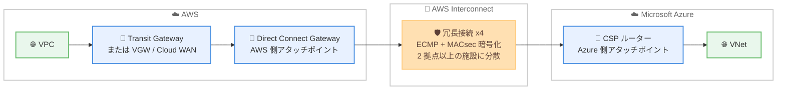
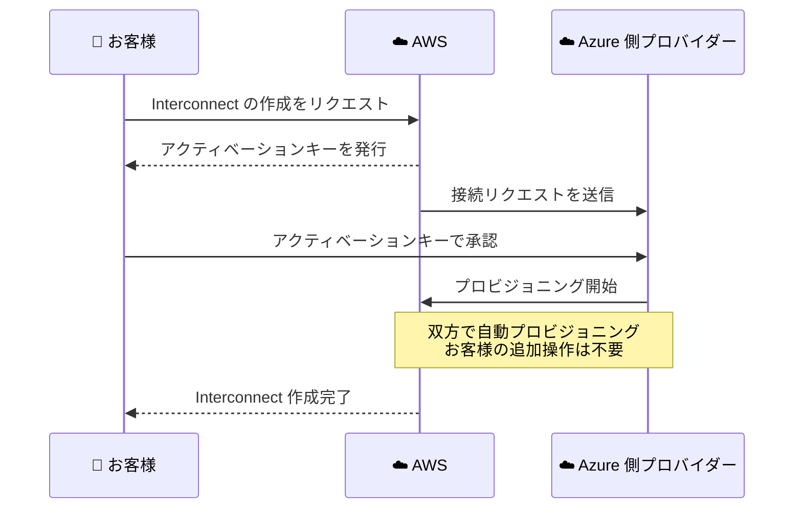

# AWS Interconnect - Microsoft Azure とのマルチクラウド接続 (プレビュー)

**リリース日**: 2026 年 8 月 31 日
**サービス**: AWS Interconnect
**機能**: AWS Interconnect - multicloud connectivity with Microsoft Azure (Preview)

📊 [このアップデートのインフォグラフィックを見る](https://takech9203.github.io/aws-news-summary/20260831-aws-announces-AWS-interconnect-multicloud-microsoft-azure-preview.html)

## 概要

AWS は、AWS Interconnect による Microsoft Azure とのマルチクラウド接続のパブリックプレビューを発表しました。AWS Interconnect は、他のクラウドプロバイダーへのプライベート接続を、迅速かつ高い回復性とスケーラビリティをもって構築できるマネージド接続サービスです。公式発表では「この種のものとしては初の専用設計プロダクト」と位置付けられています。

AWS Interconnect は 2025 年の re:Invent でプレビューとして初めて発表され、同時にネットワーク相互運用性のためのオープン仕様 (github.com/aws/Interconnect) が公開されました。この仕様は任意のプロバイダーが採用でき、すでに OCI (一般提供) と Google Cloud (一般提供) が対応しています。今回、Microsoft Azure がこの仕様を採用する最新のクラウドプロバイダーとして加わりました。AWS と Azure の両方でワークロードを運用するお客様は、単一のマネージドな体験で両クラウド間の接続を扱えるようになります。

**アップデート前の課題**

マルチクラウド戦略を採用するお客様には、以下のような課題がありました。

- 以前はクラウド間接続を「自前で構築する (do-it-yourself)」アプローチに頼る必要があり、グローバルで多層的なネットワークを大規模に運用する複雑さが生じていた
- 物理・仮想ルーターの設定、クロスコネクトの発注、BGP ピアリングの管理など、多くのネットワーク作業を自身で行う必要があった
- AWS と Azure の間の冗長構成や暗号化を、複数のコンポーネントを組み合わせて設計・運用する必要があった

**アップデート後の改善**

- 今回のアップデートにより、AWS と Microsoft Azure の VPC/VNet 間のプライベート接続を、単一のマネージドな体験で構築できるようになった
- AWS リージョン、必要なネットワーク容量、接続先プロバイダーを選択するだけで、冗長構成のネットワーク機器上に容量が数分で自動プロビジョニングされる
- 帯域幅は AWS コンソールから直接増減でき、再プロビジョニングやサポートへの依頼が不要になった

## アーキテクチャ図



AWS 側は Direct Connect Gateway をアタッチポイントとして VPC (Transit Gateway、Virtual Private Gateway、Cloud WAN 経由) を接続し、Azure 側の CSP ルーターとの間を、MACsec で暗号化された冗長接続で結びます。利用者からは単一の「Interconnect」オブジェクトとして見えます。

### Interconnect 作成フロー



作成は Create/Accept の 2 段階フローです。一方がアクティベーションキーを生成し、他方がそのキーで承認することで、双方の検証を経てから自動プロビジョニングが行われます。

## サービスアップデートの詳細

### 主要機能

1. **Microsoft Azure とのマネージドなプライベート接続 (プレビュー)**
   - AWS と Azure 間の接続を単一のマネージド体験で構築・運用できる
   - AWS Management Console、CLI、API からプレビューの Interconnect を作成可能
   - 物理・仮想ルーターの設定、クロスコネクトの発注、BGP ピアリングの管理が不要

2. **オープン仕様によるマルチクラウド相互運用性**
   - AWS はネットワーク相互運用性のオープン仕様を GitHub (github.com/aws/Interconnect) で公開
   - 任意のクラウドプロバイダーが仕様を採用可能
   - 対応プロバイダー: OCI (GA)、Google Cloud (GA)、Microsoft Azure (今回プレビューで追加)

3. **組み込みの回復性とセキュリティ**
   - すべての Interconnect は、独立した電源とネットワークを持つ 2 つ以上の物理施設にまたがる冗長ネットワーク機器上にプロビジョニングされる
   - 4 接続モデルと ECMP (Equal-Cost Multi-Path) ロードバランシングにより、計画メンテナンス中も少なくとも 1 つのリンクが稼働
   - AWS とプロバイダー機器間の物理接続は IEEE 802.1AE MACsec でデフォルト暗号化され、暗号化セッションがアクティブな場合のみトラフィックを転送

4. **迅速なプロビジョニングと柔軟なスケーリング**
   - 事前プロビジョニングされた容量により、新しい Interconnect は通常数分で開通
   - 開通後は AWS コンソールから帯域幅を直接増減可能で、ピーク時のスケールアップとコスト最適化のためのスケールダウンに対応

5. **ネットワークモニタリング**
   - すべての Interconnect に CloudWatch Network Synthetic Monitor が 1 つ追加費用なしで付属し、ラウンドトリップレイテンシーとパケットロスのメトリクスを取得可能
   - 帯域使用率 (パーセンテージ) メトリクスを CloudWatch で確認でき、しきい値アラームによる輻輳の予防が可能
   - Network Health Indicator 機能は現時点で Interconnect では未サポート

## 技術仕様

### 主要コンセプト

| 項目 | 詳細 |
|------|------|
| Interconnect | AWS とプロバイダー間にプロビジョニングされるマネージド接続オブジェクト。冗長インフラを単一の論理オブジェクトとして抽象化 |
| アタッチポイント | 接続の両端を固定する論理識別子。AWS 側は常に Direct Connect Gateway、マルチクラウドの場合リモート側は CSP ルーター |
| Direct Connect Gateway | Virtual Private Gateway、Transit Gateway、Cloud WAN などの AWS ネットワークサービスと Interconnect を接続するグローバル分散オブジェクト |
| アクティベーションキー | 接続作成時に生成されるトークン。AWS とプロバイダーの双方が検証してからリソースをコミット |
| 暗号化 | IEEE 802.1AE MACsec によるデフォルト暗号化 |
| 冗長性 | 2 つ以上の物理施設にまたがる 4 接続モデル + ECMP ロードバランシング |

### AWS ネットワークサービスとの接続構成

| 接続方式 | 到達範囲 |
|----------|----------|
| Virtual Private Gateway / Transit Gateway | Direct Connect Gateway 経由で、同一リージョン内の Interconnect のみ到達可能 |
| Cloud WAN | ネイティブ Direct Connect アタッチメントを使用し、同じ Direct Connect Gateway に接続されたグローバルの任意の Interconnect に、任意の Core Network Edge から到達可能 |

## 設定方法

### 前提条件

1. AWS アカウントを保有していること
2. プレビュー対象の 4 リージョンのいずれかを利用できること
3. 接続先の Microsoft Azure 環境 (VNet など) を保有していること
4. AWS 側のアタッチポイントとして Direct Connect Gateway、および VPC 接続用の Transit Gateway / Virtual Private Gateway / Cloud WAN を用意すること

### 手順

#### ステップ 1: Interconnect の作成

AWS Management Console、CLI、または API から新しい Interconnect の作成をリクエストします。AWS リージョン、必要なネットワーク容量、プロバイダー (Microsoft Azure) を選択すると、AWS からアクティベーションキーが発行されます。

#### ステップ 2: アクティベーションキーによる承認

発行されたアクティベーションキーを使用して、リモート側 (Azure 側) でリクエストを承認します。双方の検証が完了すると、AWS とプロバイダーによる自動プロビジョニングが開始されます。以降の追加操作は不要です。

#### ステップ 3: AWS ネットワークへのアタッチと監視

作成された Interconnect は AWS 側で Direct Connect Gateway にアタッチされます。Transit Gateway や Cloud WAN 経由で VPC と接続し、CloudWatch で帯域使用率やレイテンシー、パケットロスのメトリクスを監視します。必要に応じてコンソールから帯域幅を調整します。

## メリット

### ビジネス面

- **マルチクラウド戦略の加速**: AWS と Azure をまたぐワークロードの接続構築が数分で完了し、マルチクラウドプロジェクトの立ち上げ期間を短縮できる
- **運用負荷の削減**: 物理インフラ、VLAN、BGP セッションの構成とメンテナンスを AWS とプロバイダーが管理するため、ネットワークチームはアプリケーションに集中できる
- **コスト管理の柔軟性**: 帯域幅を需要に応じて増減できるエラスティックなモデルにより、ピークに合わせた過剰プロビジョニングを回避できる

### 技術面

- **高い回復性**: 2 つ以上の物理施設にまたがる冗長機器と 4 接続 + ECMP モデルにより、機器・クロスコネクト・施設レベルの単一障害点を排除
- **デフォルトのセキュリティ**: MACsec による暗号化が標準で有効であり、暗号化セッションがアクティブな場合のみトラフィックが流れる
- **AWS グローバルバックボーンの活用**: トラフィックはプロバイダーへの直接ハンドオフまで AWS グローバルバックボーン上を転送され、複雑な中間ホップが不要

## デメリット・制約事項

### 制限事項

- Microsoft Azure との接続はプレビュー段階であり、一般提供 (GA) ではない (OCI と Google Cloud は GA)
- プレビューは米国東部 (バージニア北部)、米国西部 (北カリフォルニア)、アジアパシフィック (シドニー)、欧州 (フランクフルト) の 4 リージョンに限定される
- Virtual Private Gateway / Transit Gateway 経由の場合、同一リージョン内の Interconnect にしか到達できない
- Network Health Indicator 機能は Interconnect では未サポート (レイテンシーとパケットロスのメトリクスはサポート)

### 考慮すべき点

- プレビュー期間中は機能や提供リージョンが変更される可能性があるため、本番ワークロードへの適用は GA を待つことを推奨
- 料金の詳細は公式発表に記載されていないため、利用前に最新の料金情報を確認する必要がある
- Azure 側のネットワーク構成 (VNet、ルーティングなど) は別途 Azure 側で設計・管理する必要がある

## ユースケース

### ユースケース 1: AWS と Azure にまたがる分散アプリケーション

**シナリオ**: 基幹データベースを AWS 上で運用し、Azure 上の分析サービスや Microsoft 系ワークロード (Active Directory、.NET アプリケーションなど) と低レイテンシーで連携させたい。

**実装例**:
```
1. バージニア北部リージョンで Azure 向け Interconnect を作成
2. Transit Gateway - Direct Connect Gateway 経由で AWS VPC を接続
3. Azure 側 VNet とのプライベート通信を確立
4. CloudWatch でレイテンシー / パケットロスを監視
```

**効果**: インターネットを経由しないプライベートで冗長な接続により、クラウド間連携の信頼性とセキュリティを確保できる。

### ユースケース 2: マルチクラウド DR / データレプリケーション

**シナリオ**: 規制要件や事業継続性の観点から、AWS 上のデータを Azure 側にもレプリケーションし、クラウド障害時の復旧手段を確保したい。

**実装例**:
```
1. フランクフルトリージョンで Interconnect を作成
2. レプリケーショントラフィック用に必要な帯域幅を設定
3. 定期レプリケーションのピーク時間帯に合わせて帯域幅をスケールアップ
4. 平常時はスケールダウンしてコストを最適化
```

**効果**: 再プロビジョニング不要の帯域幅変更により、レプリケーション性能とコストのバランスを柔軟に調整できる。

### ユースケース 3: Cloud WAN によるグローバルマルチクラウドネットワーク

**シナリオ**: 複数リージョンに展開するグローバル企業が、AWS Cloud WAN を中核として Azure を含むマルチクラウド全体のネットワークを統合管理したい。

**実装例**:
```
1. Cloud WAN の Core Network Edge を各リージョンに配置
2. Direct Connect アタッチメントで Direct Connect Gateway に接続
3. 同じ Direct Connect Gateway に Azure 向け Interconnect をアタッチ
4. 任意の CNE からグローバルの Interconnect に到達
```

**効果**: Cloud WAN を使用すると、任意のリージョンの Core Network Edge からグローバルの Interconnect に到達でき、マルチクラウド接続を一元的なネットワークポリシーで管理できる。

## 料金

公式発表 (What's New) には料金の詳細は記載されていません。なお、すべての Interconnect には CloudWatch Network Synthetic Monitor が 1 つ追加費用なしで含まれます。最新の料金情報は AWS Interconnect の公式ページを確認してください。

## 利用可能リージョン

Microsoft Azure とのマルチクラウド接続のプレビューは、以下の 4 つの AWS リージョンで利用可能です。

- 米国東部 (バージニア北部)
- 米国西部 (北カリフォルニア)
- アジアパシフィック (シドニー)
- 欧州 (フランクフルト)

## 関連サービス・機能

- **AWS Direct Connect**: Direct Connect Gateway が Interconnect の AWS 側アタッチポイントとして機能し、既存の Direct Connect エコシステムと統合される
- **AWS Transit Gateway / Virtual Private Gateway**: リージョン内の VPC を Direct Connect Gateway 経由で Interconnect に接続する
- **AWS Cloud WAN**: グローバルネットワークの Core Network Edge から任意のリージョンの Interconnect に到達でき、マルチクラウド接続の一元管理を実現する
- **Amazon CloudWatch**: Network Synthetic Monitor によるレイテンシー / パケットロス監視と、帯域使用率メトリクスによるキャパシティ管理を提供する

## 参考リンク

- 📊 [インフォグラフィック](https://takech9203.github.io/aws-news-summary/20260831-aws-announces-AWS-interconnect-multicloud-microsoft-azure-preview.html)
- [公式発表 (What's New)](https://aws.amazon.com/about-aws/whats-new/2026/08/aws-announces-AWS-interconnect-multicloud-microsoft-azure-preview/)
- [ドキュメント: What is AWS Interconnect?](https://docs.aws.amazon.com/interconnect/latest/userguide/what-is-interconnect.html)
- [オープン仕様 (GitHub)](https://github.com/aws/Interconnect)

## まとめ

AWS Interconnect による Microsoft Azure とのマルチクラウド接続プレビューは、OCI、Google Cloud に続く対応プロバイダーの拡大であり、主要クラウド間のプライベート接続をマネージドかつ数分で構築できる点で、マルチクラウド戦略を持つ企業にとって重要なアップデートです。AWS と Azure の両方を利用している場合は、プレビュー対象リージョンで接続の構築と帯域幅スケーリングの挙動を検証し、GA に向けた移行計画の検討を始めることを推奨します。
