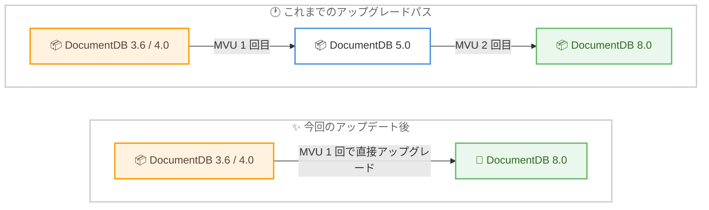

# Amazon DocumentDB - バージョン 8.0 への直接メジャーバージョンアップグレード対応

**リリース日**: 2026 年 8 月 31 日
**サービス**: Amazon DocumentDB (with MongoDB compatibility)
**機能**: バージョン 3.6 / 4.0 からバージョン 8.0 への直接インプレースメジャーバージョンアップグレード (MVU)

📊 [このアップデートのインフォグラフィックを見る](https://takech9203.github.io/aws-news-summary/20260831-documentdb-major-version-upgrade-8-0.html)

## 概要

Amazon DocumentDB が、エンジンバージョン 3.6 および 4.0 のクラスターからバージョン 8.0 への直接インプレースメジャーバージョンアップグレード (MVU) をサポートしました。これにより、中間バージョン (5.0) を経由することなく、1 回のアップグレード操作で最新のバージョン 8.0 に移行できます。

アップグレードは既存のデータ、設定、クラスター設定を保持したまま実行され、エンドポイント、ストレージ、タグも維持されるため、アプリケーション側の接続設定を変更する必要がありません。旧バージョン (3.6 / 4.0) を利用中のユーザーが、最新のセキュリティパッチ、パフォーマンス改善、新しい開発者向け機能 (コレーション、ビュー、Zstd 圧縮など) を最短経路で利用できるようになる、移行負荷を大きく下げるアップデートです。

**アップデート前の課題**

このアップデート以前は、旧バージョンから 8.0 への移行に複数のステップが必要でした。

- バージョン 3.6 / 4.0 のクラスターは、まず 5.0 へアップグレードしてから 8.0 へアップグレードする 2 段階の作業が必要だった
- アップグレードのたびにメンテナンスウィンドウの調整、事前検証、ダウンタイムの計画が必要で、運用負荷と停止時間が倍増していた
- DocumentDB 8.0 の発表当初は、5.0 クラスターからの移行手段として AWS DMS の利用が案内されており、移行の手間が大きかった

**アップデート後の改善**

今回のアップデートにより、以下が可能になりました。

- バージョン 3.6 / 4.0 から 8.0 へ、1 回のインプレース MVU で直接アップグレードできるようになった
- 中間バージョン (5.0) を経由する段階的アップグレードが不要になり、計画・検証・停止時間を 1 回分に集約できるようになった
- 既存のデータ、設定、エンドポイントを保持したままアップグレードできるため、アプリケーションの変更が不要になった

## アーキテクチャ図



これまで 2 段階必要だったバージョン 3.6 / 4.0 から 8.0 へのアップグレードが、1 回の直接インプレース MVU で完了するようになりました。

## サービスアップデートの詳細

### 主要機能

1. **バージョン 3.6 / 4.0 から 8.0 への直接アップグレード**
   - 中間バージョン 5.0 を経由せず、1 回の MVU で 8.0 へ移行可能
   - ターゲットには 8.0 系の公開済みの任意のマイナーバージョンを選択可能
   - 従来どおり 5.0 を経由した段階的アップグレード (3.6 / 4.0 → 5.0 → 8.0) も引き続きサポート

2. **データ・設定・エンドポイントの保持**
   - 既存のデータ、設定、クラスター設定を保持したままアップグレード
   - クラスターエンドポイント、ストレージ、タグが維持されるため、アプリケーションの接続変更が不要
   - アップグレードプロセスが自動的にアップグレード前スナップショット (`preupgrade-` プレフィックス) を作成

3. **DocumentDB 8.0 の新機能を利用可能**
   - MongoDB API ドライバー 6.0 / 7.0 / 8.0 に対応
   - クエリレイテンシーが最大 7 倍改善、Zstd 辞書ベース圧縮により圧縮率が最大 5 倍改善
   - コレーション、ビュー、Text Index V2、`$vectorSearch` や `$merge` などの新しい集計ステージをサポート

## 技術仕様

### サポートされるアップグレードパス

| ソースバージョン | ターゲットバージョン | 備考 |
|------|------|------|
| DocumentDB 3.6 | DocumentDB 8.0 (任意の公開マイナーバージョン) | 今回のアップデートで追加 |
| DocumentDB 4.0 | DocumentDB 8.0 (任意の公開マイナーバージョン) | 今回のアップデートで追加 |
| DocumentDB 3.6 | DocumentDB 5.0 (任意の公開マイナーバージョン) | 従来からサポート |
| DocumentDB 4.0 | DocumentDB 5.0 (任意の公開マイナーバージョン) | 従来からサポート |
| DocumentDB 5.0 | DocumentDB 8.0 (任意の公開マイナーバージョン) | 従来からサポート |

### 8.0 へのアップグレード後に変わる主な動作

| 項目 | 詳細 |
|------|------|
| コレーション | アップグレード後に作成される新しいコレクションとインデックスでデフォルト有効 |
| テキストインデックス | 新規作成分は Text Index V2 を使用 (既存のテキストインデックスは影響なし) |
| クエリプランナー | カスタムパラメータグループ未使用の場合、Planner Version 3 が選択された新しいデフォルトパラメータグループが作成され、ビューが利用可能 |
| 圧縮 | 新しいコレクションは Zstd 圧縮がデフォルト有効 (既存コレクションは設定を維持) |
| TLS | TLS 1.2 以上が必須 (TLS 1.0 / 1.1 は非サポート) |
| インデックス再構築 | 3.6 / 4.0 から直接 8.0 へアップグレードした場合、最適なクエリパフォーマンスのため `reIndex` によるインデックス再構築を推奨 |

## 設定方法

### 前提条件

1. バースタブルインスタンス (db.t3.medium / db.t4g.medium など) を使用している場合、アップグレード前にプライマリインスタンスを db.r5.large または db.r6g.large 以上にスケールアップする (完了後に戻すことが可能)
2. db.r4 系インスタンスはバージョン 4.0 以降で非サポートのため、事前に db.r5 系以降へ変更する
3. すべてのインスタンスで保留中の OS メンテナンスを事前に適用する
4. ターゲットバージョン用のクラスターパラメータグループを準備する (未指定の場合は `default.docdb8.0` が使用される)
5. アップグレード前に手動スナップショットを作成する

### 手順

#### ステップ 1: クローンを使用した事前テスト

```bash
# 保留中のアップグレードスケジュールを確認
aws docdb describe-db-clusters \
  --region ap-northeast-1 \
  --db-cluster-identifier mydocdbcluster
```

本番クラスターのクローンを作成して MVU をテストし、機能差異とアップグレード所要時間を事前に確認します。上記コマンドでは `PendingModifiedValues.EngineVersion` を確認し、既にアップグレードが予約されていないかを検証します。

#### ステップ 2: メジャーバージョンアップグレードの実行

```bash
aws docdb modify-db-cluster \
  --db-cluster-identifier mydocdbcluster \
  --allow-major-version-upgrade \
  --engine-version 8.0.0 \
  --apply-immediately \
  --db-cluster-parameter-group-name mydocdb80parametergroup \
  --region ap-northeast-1
```

`--allow-major-version-upgrade` フラグを付与して `modify-db-cluster` を実行し、ターゲットエンジンバージョンとして 8.0 系を指定します。`--apply-immediately` の代わりに次回メンテナンスウィンドウでの適用も選択できます。マネジメントコンソールからは、クラスターの [変更] からエンジンバージョンとパラメータグループを選択して実行します。

#### ステップ 3: アップグレードの監視と事後作業

```bash
# アップグレードイベントの監視
aws docdb describe-events \
  --source-identifier mydocdbcluster \
  --source-type db-cluster
```

アップグレード中はイベントで進捗を監視します。完了後は「Database cluster major version has been upgraded」イベントが生成され、クラスターステータスが `upgrading` から `available` に戻ります。完了後は手動スナップショットの取得、ドライバーの更新、アプリケーションの動作検証を実施します。3.6 / 4.0 からアップグレードした場合は、インデックスの再構築を推奨します。

## メリット

### ビジネス面

- **移行コストの削減**: 2 回分のアップグレード計画・検証・実施作業が 1 回に集約され、運用工数とダウンタイムの合計を削減できる
- **サポート終了リスクへの対応**: 旧バージョン (3.6 / 4.0) を利用中のシステムが、サポート期限を見据えて最新バージョンへ最短経路で移行できる
- **追加費用なし**: インプレース MVU は追加料金なしで利用できる

### 技術面

- **アプリケーション変更が不要**: エンドポイント、ストレージ、タグが維持されるため、接続設定の変更なしでアップグレードできる
- **最新機能の即時利用**: クエリレイテンシー最大 7 倍改善、Zstd 圧縮による圧縮率最大 5 倍改善、コレーション、ビューなど 8.0 の機能をすぐに活用できる
- **自動ロールバック**: アップグレード失敗時は自動的にロールバックが試行され、アップグレード前の状態でクラスターを継続利用できる

## デメリット・制約事項

### 制限事項

- アップグレード中はクラスターが利用不可となり、複数回再起動が発生する (ダウンタイムはコレクション数、インデックス数、データベース数、インスタンス数に依存)
- 一度アップグレードすると以前のバージョンへのダウングレードは不可 (アップグレード前スナップショットから新しいクラスターへの復元は可能)
- グローバルクラスターおよびエラスティッククラスターではインプレース MVU は非サポート (グローバルクラスターはセカンダリを削除しリージョナルクラスターに変換してから実施)
- 58 文字以上の名前を持つコレクションがある場合、事前チェックで失敗するため事前にリネームが必要

### 考慮すべき点

- アップグレード直後はインデックスメタデータの再計算が実行され、完了まで一時的なパフォーマンス低下や高 CPU 使用率が発生する可能性がある (通常は数分、最大 2 時間程度)
- メタデータ再計算中はライターインスタンスの再起動、フェイルオーバー、スケール変更を行わない
- 8.0 は TLS 1.2 以上が必須のため、TLS 1.0 / 1.1 を使用しているクライアントは事前に対応が必要
- 5.0 から 8.0 へのアップグレードでは、`$type` 演算子で特定の BSON 型を指定した `partialFilterExpression` を持つ部分インデックスがあると失敗するため、事前に削除して完了後に再作成する
- サーバーレスライターインスタンスを使用している場合、最大 DCU を 3 以上に設定する必要がある

## ユースケース

### ユースケース 1: サポート終了が近い旧バージョンからの一括移行

**シナリオ**: バージョン 3.6 で長年運用してきた基幹系ドキュメントデータベースを、サポート期限前に最新バージョンへ移行したい。

**実装例**:
```bash
# クローンでテスト後、本番クラスターを直接 8.0 へアップグレード
aws docdb modify-db-cluster \
  --db-cluster-identifier legacy-docdb-cluster \
  --allow-major-version-upgrade \
  --engine-version 8.0.0 \
  --no-apply-immediately
```

**効果**: 従来 2 回必要だったメンテナンス調整とダウンタイムが 1 回で済み、移行プロジェクトの期間とリスクを大幅に削減できる。

### ユースケース 2: ストレージコスト削減を目的とした 8.0 移行

**シナリオ**: バージョン 4.0 のクラスターでストレージと I/O コストが増大しており、8.0 の Zstd 辞書ベース圧縮でコストを削減したい。

**実装例**:
```javascript
// 8.0 へのアップグレード後、新しいコレクションは Zstd 圧縮がデフォルト有効
// 既存コレクションは圧縮設定を変更して適用
db.runCommand({
  collMod: "mycollection",
  compression: { enable: true }
})
```

**効果**: 圧縮率が最大 5 倍改善し、ストレージコストと I/O コストを削減できる。

### ユースケース 3: 最新 MongoDB API ドライバーへの対応

**シナリオ**: アプリケーション側で MongoDB ドライバー 6.0 / 7.0 / 8.0 系への更新が必要だが、DocumentDB 3.6 が古い API のみ対応のため更新できない。

**実装例**:
```bash
# 8.0 へアップグレード後、ドライバーを更新して新機能を活用
# コレーション、ビュー、$vectorSearch などが利用可能
aws docdb modify-db-cluster \
  --db-cluster-identifier app-docdb-cluster \
  --allow-major-version-upgrade \
  --engine-version 8.0.0 \
  --apply-immediately
```

**効果**: 最新の MongoDB API バージョンに対応し、アプリケーションのモダナイゼーションとベクトル検索などの新機能活用が可能になる。

## 料金

インプレースメジャーバージョンアップグレード自体は追加料金なしで利用できます。アップグレードプロセスが作成する自動スナップショットは、保持期間内であれば追加料金は発生しません。アップグレード後のクラスターは、選択したインスタンスタイプ、ストレージ、I/O に応じた通常の Amazon DocumentDB の料金が適用されます。

なお、3.6 / 4.0 からのアップグレード後にインデックス再構築 (`reIndex`) を実施する場合は、追加の I/O が発生します。

## 利用可能リージョン

バージョン 3.6 および 4.0 がサポートされているすべての AWS リージョンで利用可能です (東京リージョン、大阪リージョンを含む)。

## 関連サービス・機能

- **Amazon DocumentDB 8.0**: 移行先となる最新メジャーバージョン。クエリレイテンシー最大 7 倍改善、Zstd 圧縮、コレーション、ビュー、`$vectorSearch` などをサポート
- **Amazon DocumentDB クラスタークローン**: アップグレード前のテストに使用。データを変更しない限りストレージコストが発生しないため、本番相当の環境で MVU を事前検証できる
- **Amazon SNS / イベントサブスクリプション**: `create-event-subscription` によりアップグレードの進捗イベントをメールなどで受け取ることが可能
- **AWS Database Migration Service (DMS)**: インプレース MVU が使えない構成 (エラスティッククラスターなど) での移行手段

## 参考リンク

- 📊 [インフォグラフィック](https://takech9203.github.io/aws-news-summary/20260831-documentdb-major-version-upgrade-8-0.html)
- [公式発表 (What's New)](https://aws.amazon.com/about-aws/whats-new/2026/08/documentdb-major-version-upgrade-8-0/)
- [ドキュメント: Amazon DocumentDB in-place major version upgrade](https://docs.aws.amazon.com/documentdb/latest/developerguide/docdb-mvu.html)
- [ドキュメント: バージョンサポート期限](https://docs.aws.amazon.com/documentdb/latest/developerguide/docdb-version-support-dates.html)
- [公式発表: Amazon DocumentDB 8.0 (2025 年 11 月)](https://aws.amazon.com/about-aws/whats-new/2025/11/documentdb-8-o/)
- [料金ページ](https://aws.amazon.com/documentdb/pricing/)

## まとめ

Amazon DocumentDB 3.6 / 4.0 から 8.0 への直接インプレースアップグレードにより、旧バージョン利用者は中間バージョンを経由せず 1 回の操作で最新バージョンへ移行できるようになりました。旧バージョンを運用中の場合は、まずクラスタークローンでアップグレードのテストと所要時間の見積もりを行い、メンテナンスウィンドウでの本番アップグレードを計画することを推奨します。
