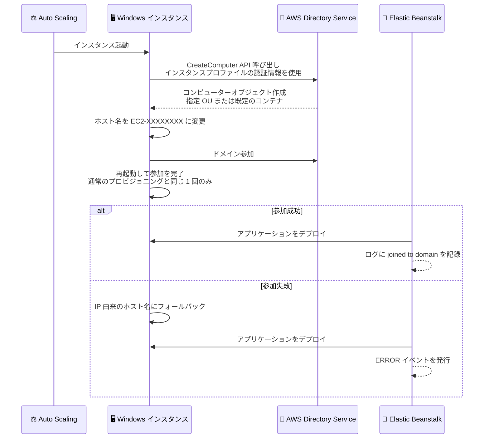

# AWS Elastic Beanstalk - Windows Server 環境の Active Directory ドメイン参加サポート

**リリース日**: 2026 年 8 月 31 日
**サービス**: AWS Elastic Beanstalk
**機能**: Active Directory domain join for Windows Server environments

📊 [このアップデートのインフォグラフィックを見る](https://takech9203.github.io/aws-news-summary/20260831-elastic-beanstalk-active-directory-domain-join.html)

## 概要

AWS Elastic Beanstalk が、Windows Server 環境の EC2 インスタンスを Active Directory ドメインへ自動参加させる機能をサポートしました。AWS Directory Service で管理するディレクトリ (AWS Managed Microsoft AD、Simple AD、または AD Connector 経由のセルフマネージド AD) を対象に、`aws:elasticbeanstalk:windows:activedirectory` 名前空間の設定オプションを数個設定するだけで、環境内のすべてのインスタンスが起動時 (アプリケーションのデプロイ前) にドメインへ参加します。Auto Scaling によって後から追加されるインスタンスも自動的にドメインへ参加します。

ドメインに参加したインスタンスでは、Windows 統合認証の利用、グループポリシーの適用、ファイル共有などのドメインリソースへのアクセス、Windows 認証を使用した SQL Server データベースへの接続が可能になります。エンタープライズの Windows ワークロードを Elastic Beanstalk で運用するユーザーにとって、AD 統合の運用負荷を大きく削減するアップデートです。

**アップデート前の課題**

- 以前は Elastic Beanstalk の Windows インスタンスをドメインへ参加させるには、ユーザー自身がカスタム参加スクリプト (ebextensions など) を作成・保守する必要があった
- スケールアウトで追加されるインスタンスの参加処理も自作ロジックでカバーする必要があり、実装や障害時の切り分けが煩雑だった
- ホスト名がプライベート IPv4 アドレス由来 (例: `IP-0A010203`) のため、IP アドレスの再利用によりディレクトリ内の古いコンピューターオブジェクトと名前が衝突するリスクがあった

**アップデート後の改善**

- 設定オプションを数個設定するだけで、カスタムスクリプトなしにすべてのインスタンスが起動時にドメインへ自動参加するようになった
- Auto Scaling で追加されるインスタンスも自動的にドメインへ参加し、コンピューターオブジェクトを指定の組織単位 (OU) に配置できるようになった
- ホスト名がインスタンス ID 由来 (`EC2-XXXXXXXX`) となり、グローバルに一意なため古いコンピューターオブジェクトとの名前衝突がほぼ発生しなくなった
- 参加に失敗してもデプロイはブロックされず、環境イベントとログで問題を確認できる回復性の高い設計になった

## アーキテクチャ図



インスタンス起動からドメイン参加、アプリケーションデプロイまでの流れです。ドメイン参加はデプロイ前に完了し、参加に失敗した場合でもデプロイは継続されます。

## サービスアップデートの詳細

### 主要機能

1. **設定オプションによる自動ドメイン参加**
   - `aws:elasticbeanstalk:windows:activedirectory` 名前空間の設定オプションで有効化
   - `DirectoryId` (必須、設定すると機能が有効化)、`DirectoryName` (必須、ディレクトリの完全修飾 DNS 名)、`DirectoryOU` (任意、コンピューターオブジェクトを作成する OU の識別名) の 3 オプション
   - 設定ファイル (ebextensions)、AWS CLI など、通常の設定オプションの設定方法がすべて利用可能

2. **対応ディレクトリタイプ**
   - AWS Managed Microsoft AD
   - Simple AD
   - AD Connector 経由のセルフマネージド Active Directory

3. **インスタンス ID 由来の予測可能なホスト名**
   - 各インスタンスはインスタンス ID の末尾 8 文字を大文字にした `EC2-XXXXXXXX` にリネームされる
   - インスタンス ID はグローバルに一意のため、古いコンピューターオブジェクトとの名前衝突リスクがほぼ解消
   - ドメイン参加時の再起動は、Elastic Beanstalk の Windows インスタンスが通常のプロビジョニングで行う 1 回限りの再起動と同一で、追加の再起動は発生しない

4. **回復性の高い失敗時動作**
   - ドメイン参加の失敗はデプロイをブロックしない (フォールバックして IP 由来のホスト名で継続)
   - 参加状態と設定の不一致を検出すると `ERROR` イベントを発行して可視化
   - 参加処理の出力は `C:\cfn\log\eb-ad-join.log` に記録され、失敗時はデプロイログにもコピーされるため、インスタンスに接続せずに原因を確認可能

## 技術仕様

### 設定オプション (aws:elasticbeanstalk:windows:activedirectory 名前空間)

| オプション | 必須 | 説明 |
|------|------|------|
| `DirectoryId` | 必須 | 参加するディレクトリの ID (例: `d-1234567890`)。設定すると機能が有効化される |
| `DirectoryName` | 必須 | ディレクトリの完全修飾 DNS 名 (例: `corp.example.com`) |
| `DirectoryOU` | 任意 | コンピューターオブジェクトを作成する OU の識別名 (例: `OU=WebServers,DC=corp,DC=example,DC=com`)。OU は事前に存在している必要がある |

### 動作仕様

| 項目 | 詳細 |
|------|------|
| 参加タイミング | インスタンス起動時、アプリケーションデプロイ前 |
| コンピューターオブジェクト作成 | AWS Directory Service の `CreateComputer` API をインスタンスプロファイルの認証情報で呼び出し |
| ホスト名 | `EC2-XXXXXXXX` (インスタンス ID 末尾 8 文字の大文字) |
| 失敗時の動作 | デプロイは継続、IP 由来ホスト名にフォールバック、`ERROR` イベントを発行 |
| ログ | `C:\cfn\log\eb-ad-join.log`、失敗時はデプロイログにもコピー |
| 設定変更時の動作 | 名前空間内のオプションを追加・変更・削除するとインスタンスが再プロビジョニングされ、ローリング更新が実行される |
| オブジェクトのクリーンアップ | インスタンスや環境の終了時にコンピューターオブジェクトは削除されない (ユーザー側で定期的な削除が必要) |

### API 変更履歴

今回のアップデートは設定オプション (名前空間) の追加であり、関連する API の変更は確認されませんでした。

### インスタンスプロファイルに必要な IAM 権限

環境のインスタンスプロファイル (例: `aws-elasticbeanstalk-ec2-role`) に、対象ディレクトリへの `ds:CreateComputer` 権限が必要です。最小権限の原則に従い、ディレクトリを限定したポリシーの追加が推奨されます。

```json
{
  "Version": "2012-10-17",
  "Statement": [
    {
      "Effect": "Allow",
      "Action": "ds:CreateComputer",
      "Resource": "arn:aws:ds:us-east-2:123456789012:directory/d-1234567890"
    }
  ]
}
```

代替として、アカウント内のすべてのディレクトリに対する `ds:CreateComputer` 権限を含む `AmazonSSMDirectoryServiceAccess` マネージドポリシーをアタッチすることも可能です。

## 設定方法

### 前提条件

1. AWS Directory Service のディレクトリ (AWS Managed Microsoft AD、Simple AD、または AD Connector) が作成済みであること
2. 環境がディレクトリへ到達可能な VPC で稼働し、インスタンスがディレクトリの DNS 名を解決できること (通常はディレクトリの DNS サーバーを指す DHCP オプションセットを VPC に関連付ける。DNS 解決の欠如はドメイン参加失敗の一般的な原因)
3. インスタンスプロファイルに `ds:CreateComputer` 権限があること
4. 2026 年 8 月 18 日以降にリリースされた Windows Server プラットフォームバージョンで環境が稼働していること (それ以前のバージョンは本名前空間をサポートせず、検証時にオプションを拒否する)
5. `DirectoryOU` を設定する場合、その OU がディレクトリ内に事前に存在すること (Elastic Beanstalk は OU を作成しない)

### 手順

#### ステップ 1: インスタンスプロファイルに権限を追加

```bash
aws iam put-role-policy \
    --role-name aws-elasticbeanstalk-ec2-role \
    --policy-name EBDirectoryJoin \
    --policy-document '{
      "Version": "2012-10-17",
      "Statement": [
        {
          "Effect": "Allow",
          "Action": "ds:CreateComputer",
          "Resource": "arn:aws:ds:us-east-2:123456789012:directory/d-1234567890"
        }
      ]
    }'
```

環境のインスタンスプロファイルが使用する IAM ロールに、対象ディレクトリへの `ds:CreateComputer` を許可するインラインポリシーを追加します。インスタンスはこの権限を使用してディレクトリにコンピューターオブジェクトを作成します。

#### ステップ 2: 環境に Active Directory オプションを設定

```bash
aws elasticbeanstalk update-environment \
    --environment-name my-env \
    --option-settings '[
      {"Namespace": "aws:elasticbeanstalk:windows:activedirectory", "OptionName": "DirectoryId", "Value": "d-1234567890"},
      {"Namespace": "aws:elasticbeanstalk:windows:activedirectory", "OptionName": "DirectoryName", "Value": "corp.example.com"},
      {"Namespace": "aws:elasticbeanstalk:windows:activedirectory", "OptionName": "DirectoryOU", "Value": "OU=WebServers,DC=corp,DC=example,DC=com"}
    ]'
```

稼働中の環境にドメイン参加の設定オプションを適用します。`DirectoryOU` の値にはカンマが含まれるため、`--option-settings` には JSON 構文を使用します。このコマンドによりインスタンスが再プロビジョニングされ、ローリング更新が実行されます。

#### ステップ 3: ドメイン参加を確認

```bash
aws elasticbeanstalk describe-events \
    --environment-name my-env \
    --severity ERROR
```

環境のイベントに参加失敗を示す `ERROR` イベントがないことを確認します。加えて、ディレクトリ内に `EC2-XXXXXXXX` という名前のコンピューターオブジェクトが指定 OU (または既定のコンテナ) に存在すること、またはデプロイログに `Active Directory: joined to <directory-name>` の行があることを確認します。

## メリット

### ビジネス面

- **運用コスト削減**: カスタム参加スクリプトの作成・保守が不要になり、エンタープライズ Windows ワークロードの運用負荷を削減
- **エンタープライズ移行の促進**: Windows 統合認証やグループポリシーに依存する既存のオンプレミス .NET アプリケーションを、Elastic Beanstalk へ移行しやすくなる
- **ガバナンス強化**: OU 単位でのグループポリシー適用により、組織のセキュリティポリシーをインスタンスへ一貫して適用可能

### 技術面

- **スケーリングとの完全な統合**: Auto Scaling で追加されるインスタンスも自動的にドメインへ参加し、手動対応が不要
- **名前衝突の解消**: インスタンス ID 由来のホスト名により、IP アドレス再利用に起因する古いコンピューターオブジェクトとの衝突リスクがほぼ解消
- **高い可用性**: 参加失敗がデプロイをブロックしないため、ディレクトリ側の一時的な問題が環境全体の停止につながらない
- **追加の再起動なし**: ドメイン参加の再起動は通常のプロビジョニングの再起動と共通のため、起動時間への追加影響が最小限

## デメリット・制約事項

### 制限事項

- 2026 年 8 月 18 日以降にリリースされた Windows Server プラットフォームバージョンが必要 (それ以前のバージョンではオプションが検証エラーになる)
- Elastic Beanstalk は OU を作成しないため、`DirectoryOU` に指定する OU は事前に作成が必要
- インスタンスや環境の終了時にコンピューターオブジェクトは自動削除されず、古いオブジェクトの定期的なクリーンアップはユーザーの責任
- Windows Server 環境専用の機能 (Linux プラットフォームは対象外)

### 考慮すべき点

- 名前空間内のオプションを追加・変更・削除するとインスタンスの再プロビジョニング (ローリング更新) が発生するため、変更のタイミングに注意が必要
- ディレクトリの DNS 解決が前提となるため、VPC の DHCP オプションセットの設定を事前に確認する必要がある
- 参加失敗時も環境は Ready 状態で正常と報告され得るため、`ERROR` イベントの監視を運用に組み込むことが望ましい
- 別のディレクトリへ設定を変更した場合、置き換え後のインスタンスは新しいディレクトリに参加するが、旧ディレクトリのコンピューターオブジェクトは残存する

## ユースケース

### ユースケース 1: Windows 認証を使用する SQL Server 接続

**シナリオ**: Elastic Beanstalk 上の .NET アプリケーションから、SQL 認証ではなく Windows 認証で SQL Server (RDS for SQL Server や EC2 上の SQL Server) に接続したい。

**実装例**:
```
# .ebextensions/ad-join.config
option_settings:
  aws:elasticbeanstalk:windows:activedirectory:
    DirectoryId: d-1234567890
    DirectoryName: corp.example.com
```

**効果**: 接続文字列にパスワードを埋め込まずに `Integrated Security=true` で接続でき、認証情報管理のリスクとコストを削減できる。

### ユースケース 2: グループポリシーによるセキュリティ統制

**シナリオ**: 社内のセキュリティ基準に基づくグループポリシー (監査設定、パスワードポリシー、ソフトウェア制限など) を、Elastic Beanstalk のインスタンスにも一貫して適用したい。

**実装例**:
```
# .ebextensions/ad-join.config
option_settings:
  aws:elasticbeanstalk:windows:activedirectory:
    DirectoryId: d-1234567890
    DirectoryName: corp.example.com
    DirectoryOU: OU=WebServers,DC=corp,DC=example,DC=com
```

**効果**: Web サーバー用 OU に配置されたインスタンスへ対象のグループポリシーが自動適用され、スケールアウトで追加されるインスタンスにも同じ統制が維持される。

### ユースケース 3: ファイル共有への Windows 統合認証アクセス

**シナリオ**: アプリケーションが Amazon FSx for Windows File Server などのドメイン参加済みファイル共有へアクセスする必要がある。

**実装例**:
```
# ドメイン参加後、アプリケーションから UNC パスでアクセス
\\fileserver.corp.example.com\share
```

**効果**: インスタンスがドメインメンバーになることで、ドメインリソースであるファイル共有へ Windows 統合認証でシームレスにアクセスできる。

## 料金

この機能自体に追加料金はありません。Elastic Beanstalk は無料で、作成される AWS リソース (EC2 インスタンスなど) の料金のみが発生します。AWS Directory Service (AWS Managed Microsoft AD、Simple AD、AD Connector) の利用料金は別途発生します。

## 利用可能リージョン

Elastic Beanstalk が利用可能なすべての AWS 商用リージョンおよび AWS GovCloud (US) リージョンで利用できます。詳細は [AWS リージョン別サービス一覧](https://aws.amazon.com/about-aws/global-infrastructure/regional-product-services/) を参照してください。

## 関連サービス・機能

- **AWS Directory Service**: 参加先ディレクトリの提供元。AWS Managed Microsoft AD、Simple AD、AD Connector をサポート
- **Amazon EC2 Auto Scaling**: スケールアウトで追加されるインスタンスも自動的にドメインへ参加
- **AWS IAM**: インスタンスプロファイルに `ds:CreateComputer` 権限が必要
- **Amazon FSx for Windows File Server**: ドメイン参加により Windows 統合認証でアクセス可能になる代表的なドメインリソース
- **Amazon RDS for SQL Server**: Windows 認証によるデータベース接続と組み合わせて利用可能

## 参考リンク

- 📊 [インフォグラフィック](https://takech9203.github.io/aws-news-summary/20260831-elastic-beanstalk-active-directory-domain-join.html)
- [公式発表 (What's New)](https://aws.amazon.com/about-aws/whats-new/2026/08/elastic-beanstalk-active-directory-domain-join/)
- [ドキュメント: Joining instances to an Active Directory domain](https://docs.aws.amazon.com/elasticbeanstalk/latest/dg/dotnet-activedirectory.html)
- [Windows Server プラットフォームリリースノート (2026 年 8 月 18 日)](https://docs.aws.amazon.com/elasticbeanstalk/latest/relnotes/release-2026-08-18-windows.html)
- [AWS Directory Service ドキュメント](https://docs.aws.amazon.com/directoryservice/latest/admin-guide/what_is.html)

## まとめ

Elastic Beanstalk の Windows Server 環境で、カスタムスクリプトなしに Active Directory ドメインへの自動参加が可能になりました。Windows 統合認証やグループポリシーに依存するエンタープライズ .NET ワークロードの移行・運用が大幅に簡素化されます。対象環境を 2026 年 8 月 18 日以降の Windows Server プラットフォームバージョンへ更新したうえで、`aws:elasticbeanstalk:windows:activedirectory` 名前空間の設定オプションによる導入を検討してください。
