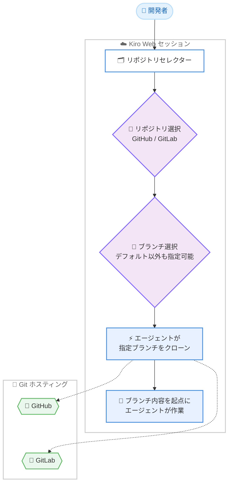

# Kiro - リポジトリ選択時のブランチ指定

**リリース日**: 2026 年 8 月 31 日
**サービス**: Kiro
**機能**: Pick a Branch When You Pick a Repository

📊 [このアップデートのインフォグラフィックを見る](https://takech9203.github.io/aws-news-summary/20260831-kiro-changelog-2026-08-31.html)

## 概要

Kiro Web は、セッション開始時のリポジトリ選択で作業対象のブランチを指定できる機能を発表しました。GitHub または GitLab のリポジトリをセッション用に選択する際、リポジトリセレクター内でそのまま作業を始めたいブランチを選択できます。エージェントは選択されたブランチをクローンし、その内容を起点として作業を進めます。

これまで Kiro Web のセッションはリポジトリのデフォルトブランチから開始する必要がありましたが、今回のアップデートにより、フィーチャーブランチやリリースブランチなど、任意のブランチを直接指定してエージェントに作業を依頼できるようになりました。ブランチ戦略を運用しているチームや、進行中の作業ブランチに対して AI エージェントの支援を受けたい開発者にとって有用なアップデートです。

**アップデート前の課題**

このアップデート以前は、Kiro Web のセッション開始時に以下の課題がありました。

- セッションは常にリポジトリのデフォルトブランチ (main など) を起点として開始する必要があった
- 進行中のフィーチャーブランチやリリースブランチの内容を前提とした作業をエージェントに直接依頼できなかった
- デフォルトブランチ以外の内容を扱う場合、セッション開始後にブランチを切り替える追加の指示や手順が必要だった

**アップデート後の改善**

今回のアップデートにより、以下が可能になりました。

- リポジトリセレクター内で、セッションの起点となるブランチをリポジトリ選択と同時に指定できるようになった
- エージェントが指定ブランチをクローンし、そのブランチの内容を前提として作業を積み上げられるようになった
- GitHub と GitLab のどちらのリポジトリでも、同じ操作でブランチを指定できるようになった

## アーキテクチャ図



セッション開始時にリポジトリとブランチをセレクター内で選択し、エージェントが指定ブランチをクローンして作業を開始するフローを示しています。

## サービスアップデートの詳細

### 主要機能

1. **リポジトリセレクター内でのブランチ選択**
   - GitHub または GitLab のリポジトリをセッション用に選択する際、同じセレクター内で作業対象のブランチを選択可能
   - デフォルトブランチから開始する必要がなくなり、任意のブランチを起点にできる
   - リポジトリ選択とブランチ選択が 1 つの操作フローにまとまり、セッション開始前に作業起点が確定する

2. **指定ブランチのクローンと作業の継続**
   - エージェントは選択されたブランチをクローンし、そのブランチの内容を前提に作業を積み上げる
   - 進行中のフィーチャーブランチに対する追加実装や修正をエージェントに直接依頼できる

3. **GitHub と GitLab の両方に対応**
   - GitHub リポジトリ、GitLab リポジトリのいずれでも同じ操作でブランチを指定可能
   - 複数の Git ホスティングサービスを併用する環境でも一貫した体験で利用できる

## 技術仕様

### 機能仕様

| 項目 | 詳細 |
|------|------|
| 対象プラットフォーム | Kiro Web (セッション) |
| 対応 Git ホスティング | GitHub、GitLab |
| ブランチ指定のタイミング | セッション用のリポジトリ選択時 (リポジトリセレクター内) |
| デフォルト動作 | 従来はデフォルトブランチから開始、今回から任意のブランチを選択可能 |
| エージェントの動作 | 指定されたブランチをクローンし、その内容を起点に作業 |

## 設定方法

### 前提条件

1. Kiro Web を利用できるアカウントを持っていること
2. GitHub または GitLab のリポジトリを Kiro に接続済みであること
3. 作業対象のブランチがリモートリポジトリに存在すること

### 手順

#### ステップ 1: Kiro Web で新しいセッションを開始する

Kiro Web にサインインし、新しいセッションを作成します。

#### ステップ 2: リポジトリセレクターでリポジトリとブランチを選択する

セッション用のリポジトリを選択する際、リポジトリセレクター内で作業を開始したいブランチを選択します。デフォルトブランチ以外のフィーチャーブランチやリリースブランチも指定できます。

#### ステップ 3: エージェントに作業を依頼する

エージェントが指定したブランチをクローンした状態でセッションが開始されるため、そのブランチの内容を前提としたタスクをそのまま依頼します。

## メリット

### ビジネス面

- **開発サイクルの短縮**: 進行中のブランチに対する作業をエージェントへ直接依頼でき、ブランチ切り替えのための余分な手順や待ち時間を削減できる
- **ブランチ戦略との整合**: GitFlow やリリースブランチ運用など、既存のブランチ戦略を崩さずに AI エージェントをワークフローへ組み込める
- **チームコラボレーションの円滑化**: レビュー中や開発中のブランチをそのままセッションの起点にでき、チームの作業状況に沿った支援を受けられる

### 技術面

- **正確な作業コンテキスト**: エージェントが指定ブランチの最新内容をクローンして作業するため、デフォルトブランチとの差分に起因する不整合を避けられる
- **操作の簡素化**: セッション開始後にブランチを切り替える指示が不要になり、リポジトリ選択と同時に作業起点が確定する
- **マルチプラットフォーム対応**: GitHub と GitLab の両方で同じ操作性が提供され、ホスティングサービスごとの手順差異がない

## デメリット・制約事項

### 制限事項

- 本機能は Kiro Web のセッションに関するアップデートであり、Changelog には IDE や CLI に関する記載はありません
- 対応する Git ホスティングサービスとして記載されているのは GitHub と GitLab です

### 考慮すべき点

- エージェントは選択したブランチをクローンして作業するため、意図したブランチを選択しているかセッション開始前に確認することが望ましい
- 作業対象のブランチが古い場合、リモートの最新状態を反映してからセッションを開始するとエージェントの作業結果と実際のコードベースの乖離を防げる

## ユースケース

### ユースケース 1: フィーチャーブランチでの追加実装

**シナリオ**: 開発者が `feature/user-auth` ブランチで認証機能を実装中であり、残りのタスクをエージェントに依頼したい。

**実装例**:
```
1. Kiro Web で新しいセッションを作成する
2. リポジトリセレクターで対象リポジトリを選択し、ブランチに feature/user-auth を指定する
3. 「テストコードの追加とエラーハンドリングの実装」をエージェントに依頼する
```

**効果**: 進行中の実装内容を前提にエージェントが作業を積み上げるため、デフォルトブランチとの差分を意識せずに開発を継続できる。

### ユースケース 2: リリースブランチへのバグ修正

**シナリオ**: リリース準備中の `release/2.0` ブランチで発見されたバグを、main ブランチの新機能開発と切り離して修正したい。

**実装例**:
```
1. セッション作成時にリポジトリセレクターで release/2.0 ブランチを選択する
2. バグの内容と再現手順をエージェントに伝えて修正を依頼する
3. 修正結果をリリースブランチ向けのマージリクエストとしてレビューする
```

**効果**: リリースブランチの内容だけを起点とした修正が可能になり、main ブランチの未リリース変更が混入するリスクを避けられる。

### ユースケース 3: GitLab 上の長期ブランチのリファクタリング

**シナリオ**: GitLab で運用中のリポジトリにある長期開発ブランチ `develop` のコードを、デフォルトブランチに影響を与えずにリファクタリングしたい。

**実装例**:
```
1. リポジトリセレクターで GitLab リポジトリを選択し、develop ブランチを指定する
2. リファクタリング対象のモジュールと方針をエージェントに指示する
3. develop ブランチ上の変更としてレビュー・マージする
```

**効果**: GitHub と同じ操作で GitLab のブランチを起点にでき、既存のブランチ運用を変えずにエージェントの支援を受けられる。

## 料金

この機能自体の追加料金に関する記載は Changelog にはありません。Kiro の料金は [Kiro の料金ページ](https://kiro.dev/pricing/) を参照してください。

## 利用可能リージョン

グローバル (Kiro はグローバルサービスとして提供)

## 関連サービス・機能

- **Kiro Web**: 本機能が提供されるプラットフォーム。ブラウザ上でエージェントセッションを実行できる
- **GitHub / GitLab 連携**: セッションの対象リポジトリとして接続し、今回のアップデートでブランチ単位の指定が可能になった
- **セッションの自動命名機能**: 同時期の Kiro Web アップデートで、セッションに作業内容に基づくタイトルが自動付与されるようになった

## 参考リンク

- 📊 [インフォグラフィック](https://takech9203.github.io/aws-news-summary/20260831-kiro-changelog-2026-08-31.html)
- [Kiro Changelog](https://kiro.dev/changelog/)
- [Changelog エントリ: Pick a Branch When You Pick a Repository](https://kiro.dev/changelog/web/pick-a-branch-when-you-pick-a-repository/)
- [Kiro ドキュメント](https://kiro.dev/docs/)

## まとめ

Kiro Web のセッション開始時に、GitHub または GitLab リポジトリのブランチをリポジトリセレクター内で直接指定できるようになり、デフォルトブランチ以外を起点とした AI エージェントへの作業依頼が容易になりました。フィーチャーブランチやリリースブランチを運用しているチームは、次回のセッション作成時にブランチ選択を活用し、進行中の作業への支援をエージェントに依頼することを推奨します。
