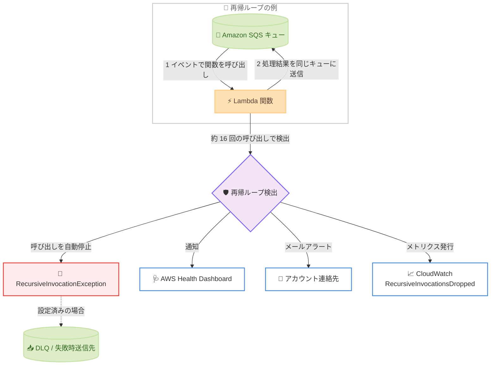

# AWS Lambda - 再帰ループ検出機能の全商用リージョン対応

**リリース日**: 2026 年 8 月 31 日
**サービス**: AWS Lambda
**機能**: 再帰ループ検出 (Recursive Loop Detection)

📊 [このアップデートのインフォグラフィックを見る](https://takech9203.github.io/aws-news-summary/20260831-lambda-recursion-regions.html)

## 概要

AWS Lambda の再帰ループ検出機能が、すべての商用 AWS リージョンで利用可能になりました。この機能は、Lambda 関数とサポート対象サービス (Amazon S3、Amazon SQS、Amazon SNS) の間で発生する再帰的な呼び出しを自動的に検出して停止するセーフティガードレールであり、デフォルトで有効化されています。

再帰ループは、設定ミスやコードのバグにより、関数を呼び出したイベントソースに対して関数がイベントを書き戻してしまうことで発生します。例えば、SQS キューをトリガーとする Lambda 関数が処理結果を同じキューに送信すると、無限に呼び出しが繰り返され、意図しない使用量の増加と予期しないコストが発生します。本機能により、Lambda はループを検出すると該当イベントの処理を自動的に停止し、AWS Health Dashboard にトラブルシューティングガイダンス付きの通知を送信します。

今回のアップデートにより、地理的な制約なくすべての商用リージョンで一貫したコスト保護が提供されるため、グローバルにサーバーレスワークロードを展開する組織にとって重要な安全性向上となります。

**アップデート前の課題**

これまで再帰ループ検出機能は一部のリージョンに限定されており、以下の課題がありました。

- 未対応リージョンでは、設定ミスによる無限ループが検出されず、Lambda が自動スケールして意図しない大量の呼び出しとコストが発生する可能性があった
- 未対応リージョンでは、CloudWatch アラームや請求アラームなどの間接的な仕組みでループを検知する必要があった
- グローバル展開するワークロードにおいて、リージョンごとに保護レベルが異なり、統一的な運用ガードレールを設計しにくかった

**アップデート後の改善**

- すべての商用 AWS リージョンで、追加設定なし (デフォルト有効・無料) で再帰ループが自動検出・停止されるようになった
- どのリージョンでも、ループ検出時に AWS Health Dashboard への通知とメールアラートを受け取れるようになった
- 意図的に再帰パターンを使用する場合は、`PutFunctionRecursionConfig` API で関数ごとに検出を無効化できる

## アーキテクチャ図



Lambda 関数と SQS キューの間で再帰ループが発生した場合の検出と通知の流れを示しています。同一のリクエストチェーンで約 16 回の呼び出しが発生すると、Lambda は次の呼び出しを自動的に停止し、Health Dashboard、メール、CloudWatch メトリクスを通じて通知します。

## サービスアップデートの詳細

### 主要機能

1. **再帰ループの自動検出と停止**
   - AWS X-Ray のトレースヘッダーを利用してイベントを追跡し、同一のリクエストチェーン内での呼び出し回数をカウントする
   - 同じトリガーイベントによる呼び出しが約 16 回に達すると、次の呼び出しを自動的に停止する
   - X-Ray のアクティブトレースを有効化する必要はなく、追加料金なしでデフォルト有効
   - 関数に複数のトリガーが設定されている場合、他のトリガーからの呼び出しは影響を受けない

2. **検出時の通知とモニタリング**
   - ループ停止時に AWS Health Dashboard の [Your account health] ページに通知を表示 (表示まで最大 3.5 時間かかる場合あり)
   - アカウントのプライマリ連絡先と代替オペレーション連絡先にメールアラートを送信 (関数ごとに 24 時間あたり最大 1 通)
   - CloudWatch メトリクス `RecursiveInvocationsDropped` で停止された呼び出し数を監視可能
   - 失敗時送信先 (on-failure destination) または DLQ が設定されている場合、停止されたイベントはそちらに送信される

3. **意図的な再帰パターンのサポート**
   - 設計上意図的に再帰を使用するワークロードでは、関数ごとに検出を無効化可能
   - Lambda コンソール、AWS CLI (`put-function-recursion-config`)、AWS SAM、CloudFormation で設定可能
   - 無効化した場合、`RecursiveInvocationsDropped` メトリクスは発行されない

4. **全商用リージョンへの拡大**
   - 今回のアップデートにより、すべての商用 AWS リージョンで利用可能になった
   - リージョンを問わず一貫したコスト保護ガードレールを提供

## 技術仕様

### 検出対象と動作

| 項目 | 詳細 |
|------|------|
| 検出対象サービス | Amazon SQS、Amazon S3、Amazon SNS、Lambda 関数間の同期・非同期呼び出し |
| 検出のしきい値 | 同一リクエストチェーンで約 16 回の呼び出し |
| 検出の仕組み | X-Ray トレースヘッダーのメタデータ (Lineage カウンター) によるイベント追跡 |
| デフォルト設定 | 有効 (ループ検出時に呼び出しを停止) |
| 料金 | 無料 |
| 通知手段 | AWS Health Dashboard、メール、CloudWatch メトリクス `RecursiveInvocationsDropped` |
| 検出対象外 | Amazon DynamoDB など上記以外のサービスを含むループは検出不可 |

### サポートされる AWS SDK の最小バージョン

再帰ループ検出には、関数が以下のバージョン以上の AWS SDK を使用している必要があります。

| ランタイム | 最小 SDK バージョン |
|------|------|
| Node.js | 2.1147.0 (v2) / 3.105.0 (v3) |
| Python | boto3 1.24.46 / botocore 1.27.46 |
| Java 8 / 11 | 2.17.135 |
| Java 17 | 2.20.81 |
| Java 21 | 2.21.24 |
| .NET | 3.7.293.0 |
| Ruby | 3.134.0 |
| PHP | 3.232.0 |
| Go | v2 SDK 1.57.0 |

ランタイム同梱の SDK バージョンが要件を満たさない場合は、デプロイパッケージまたは Lambda レイヤーでサポート対象バージョンの SDK を追加できます。

## 設定方法

### 前提条件

1. Lambda 関数がサポート対象の AWS SDK バージョン以上を使用していること
2. ループの対象が Amazon SQS、Amazon S3、Amazon SNS、または Lambda 関数間の呼び出しであること
3. 検出設定を変更する場合は `lambda:PutFunctionRecursionConfig` の IAM 権限があること

### 手順

本機能はデフォルトで有効なため、通常は設定不要です。以下は意図的な再帰パターンを使用する場合の設定手順です。

#### ステップ 1: 現在の再帰検出設定を確認する

```bash
aws lambda get-function-recursion-config --function-name my-function
```

指定した関数の再帰ループ検出設定を取得します。デフォルトでは `RecursiveLoop` が `Terminate` (検出時に停止) に設定されています。

#### ステップ 2: 意図的な再帰を許可する

```bash
aws lambda put-function-recursion-config \
  --function-name my-function \
  --recursive-loop Allow
```

関数の再帰ループ検出を無効化し、再帰的な呼び出しを許可します。意図的に再帰パターンを使用する設計の場合のみ実行してください。

#### ステップ 3: デフォルト設定に戻す

```bash
aws lambda put-function-recursion-config \
  --function-name my-function \
  --recursive-loop Terminate
```

再帰ループ検出をデフォルトの動作 (検出時に停止) に戻します。

#### ステップ 4: ループ検出時の緊急対応

再帰ループが検出された場合は、以下の対応で再発を防止します。

```bash
# 関数の同時実行数を 0 にして呼び出しをスロットリング
aws lambda put-function-concurrency \
  --function-name my-function \
  --reserved-concurrent-executions 0

# イベントソースマッピングを無効化
aws lambda update-event-source-mapping \
  --function-name my-function \
  --uuid a1b2c3d4-5678-90ab-cdef-EXAMPLE11111 --no-enabled
```

1 つ目のコマンドは関数の予約済み同時実行数を 0 に設定してすべての呼び出しを停止し、2 つ目のコマンドはループの原因となっているイベントソースマッピングを無効化します。その後、イベントソースとターゲットに同じリソースを指定しているなどのコード上の欠陥を修正します。

## メリット

### ビジネス面

- **予期しないコストの防止**: 設定ミスによる無限ループを自動停止することで、意図しない大量呼び出しによる予期しない請求を防止できる
- **グローバルで一貫した保護**: すべての商用リージョンで同一のガードレールが提供され、リージョンごとの保護レベルの差異を考慮する必要がなくなる
- **追加コストゼロ**: 機能は無料かつデフォルト有効のため、導入コストや運用負荷なしで保護を得られる

### 技術面

- **同時実行枠の保護**: ループによって Lambda がスケールし、アカウントの利用可能な同時実行数を使い果たす事態を防止できる
- **迅速な検知と通知**: Health Dashboard、メール、CloudWatch メトリクスの複数チャネルで検出を通知し、根本原因の調査を支援する
- **柔軟なオプトアウト**: 意図的な再帰パターンを使用するワークロードでは、関数単位で検出を無効化できる

## デメリット・制約事項

### 制限事項

- 検出対象は Amazon SQS、Amazon S3、Amazon SNS、および Lambda 関数間の呼び出しに限定される。DynamoDB など他のサービスを含むループは検出されない
- 関数がサポート対象バージョン以上の AWS SDK を使用していない場合、検出は機能しない
- Health Dashboard への通知表示とメールアラートの送信には、ループ停止から最大 3.5 時間かかる場合がある
- メールアラートは関数ごとに 24 時間あたり最大 1 通に制限される

### 考慮すべき点

- SQS がイベントソースの場合、ループ検出後も `maxReceiveCount` を超えるまで SQS はメッセージの再試行を続ける (Lambda は呼び出しをブロックし続け、最終的にメッセージはソースキューの DLQ に送信される)
- 関数の失敗時送信先や DLQ に、関数のトリガーと同じリソースを指定すると別の再帰ループが発生するため避ける
- 検出対象外のサービスを含むワークロードでは、CloudWatch アラーム、請求アラーム、AWS Cost Anomaly Detection の併用が引き続き推奨される

## ユースケース

### ユースケース 1: SQS キュー処理での設定ミス保護

**シナリオ**: SQS キューからメッセージを受信して加工し、別のキューに送信する Lambda 関数で、環境変数の設定ミスにより送信先が入力元と同じキューになってしまった。

**実装例**:
```python
import os
import boto3

sqs = boto3.client("sqs")

def handler(event, context):
    for record in event["Records"]:
        processed = transform(record["body"])
        # 設定ミス: OUTPUT_QUEUE_URL に入力キューの URL が設定されていた
        sqs.send_message(
            QueueUrl=os.environ["OUTPUT_QUEUE_URL"],
            MessageBody=processed,
        )
```

**効果**: 約 16 回の呼び出し後に Lambda が自動的にループを停止し、Health Dashboard とメールで通知される。無限ループによるコスト爆発と同時実行枠の枯渇を回避できる。

### ユースケース 2: S3 イベント駆動処理での出力先誤設定の保護

**シナリオ**: S3 バケットへのオブジェクト作成をトリガーに画像をリサイズし、処理結果を保存する構成で、誤って入力と同じバケット・同じプレフィックスに出力してしまい、出力オブジェクトが再び関数をトリガーした。

**実装例**:
```bash
# ループ検出後、CloudWatch メトリクスで停止された呼び出し数を確認
aws cloudwatch get-metric-statistics \
  --namespace AWS/Lambda \
  --metric-name RecursiveInvocationsDropped \
  --dimensions Name=FunctionName,Value=image-resizer \
  --start-time 2026-08-31T00:00:00Z \
  --end-time 2026-08-31T23:59:59Z \
  --period 3600 --statistics Sum
```

**効果**: ループが自動停止されるため被害が最小限に抑えられ、メトリクスから影響範囲を定量的に把握して修正 (出力先バケットの分離やプレフィックスフィルターの設定) につなげられる。

### ユースケース 3: 意図的な再帰パターンの継続利用

**シナリオ**: 大規模データセットをバッチ分割して処理するため、Lambda 関数が自分自身を再帰的に呼び出す設計を意図的に採用している。

**実装例**:
```bash
# 対象関数のみ再帰ループ検出を無効化
aws lambda put-function-recursion-config \
  --function-name batch-processor \
  --recursive-loop Allow
```

**効果**: 意図的な再帰設計を維持したまま全リージョン展開できる。ただし、同時実行数の予約や CloudWatch アラームなどのガードレールを併せて実装することが推奨される。

## 料金

再帰ループ検出機能自体は無料で、追加料金は発生しません。デフォルトで有効化されており、X-Ray のアクティブトレースを有効化する必要もありません。

なお、ループが停止されるまでの約 16 回の呼び出しには通常の Lambda 料金 (リクエスト数と実行時間に基づく課金) が適用されます。

## 利用可能リージョン

すべての商用 AWS リージョンで利用可能です。

## 関連サービス・機能

- **AWS X-Ray**: トレースヘッダーのメタデータを利用してイベントのリクエストチェーンを追跡する (アクティブトレースの有効化は不要)
- **AWS Health Dashboard**: ループ検出時の通知とトラブルシューティングガイダンスを表示する
- **Amazon CloudWatch**: `RecursiveInvocationsDropped` メトリクスによる監視や、検出対象外サービスに対するアラーム設定に使用する
- **Amazon SQS / Amazon SNS / Amazon S3**: 再帰ループ検出の対象となるイベントソース。DLQ や失敗時送信先の設定と組み合わせることで、停止されたイベントを保全できる

## 参考リンク

- 📊 [インフォグラフィック](https://takech9203.github.io/aws-news-summary/20260831-lambda-recursion-regions.html)
- [公式発表 (What's New)](https://aws.amazon.com/about-aws/whats-new/2026/08/lambda-recursion-regions)
- [AWS Blog: Detecting and stopping recursive loops in AWS Lambda functions](https://aws.amazon.com/blogs/compute/detecting-and-stopping-recursive-loops-in-aws-lambda-functions/)
- [ドキュメント: Lambda 再帰ループ検出](https://docs.aws.amazon.com/lambda/latest/dg/invocation-recursion.html)
- [API リファレンス: PutFunctionRecursionConfig](https://docs.aws.amazon.com/lambda/latest/api/API_PutFunctionRecursionConfig.html)
- [料金ページ: AWS Lambda](https://aws.amazon.com/lambda/pricing/)

## まとめ

AWS Lambda の再帰ループ検出機能がすべての商用リージョンに拡大され、設定ミスによる無限ループとそれに伴う予期しないコストからグローバルに保護されるようになりました。機能は無料かつデフォルト有効のため追加の対応は不要ですが、関数が使用する AWS SDK バージョンがサポート要件を満たしているかの確認と、検出対象外のサービスを含むワークロードに対する CloudWatch アラームの設定を推奨します。
