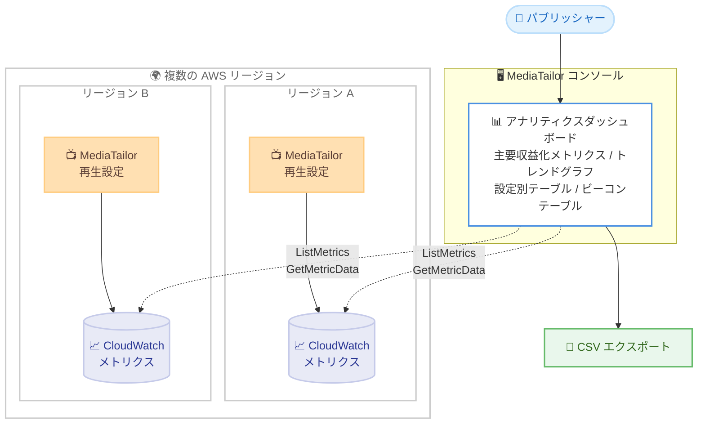

# AWS Elemental MediaTailor - コンソール内アナリティクスダッシュボード

**リリース日**: 2026年8月31日
**サービス**: AWS Elemental MediaTailor
**機能**: 広告収益化とストリーミングパフォーマンスのためのコンソール内アナリティクスダッシュボード

📊 [このアップデートのインフォグラフィックを見る](https://takech9203.github.io/aws-news-summary/20260831-mediatailor-analytics-dashboard.html)

## 概要

AWS Elemental MediaTailor に、AWS マネジメントコンソールに直接組み込まれたアナリティクスダッシュボードが追加されました。パブリッシャー (配信事業者) は、広告収益化とストリーミングパフォーマンスをグローバルかつマルチリージョンで俯瞰でき、リージョン間の比較や個々の再生設定 (playback configuration) へのドリルダウンが可能になります。

ダッシュボードには、フィル率、広告インプレッション率、動画完了率、インプレッションリカバリーデータといった主要なビジネスメトリクスが表示されます。特にインプレッションリカバリーデータでは、MediaTailor のサーバーサイドビーコン再試行ロジックによって、課金対象のインプレッションをどれだけ回復できているかを正確に把握できます。

このダッシュボードは MediaTailor コンソールのトップレベルページとして提供され、MediaTailor がサーバーサイド広告挿入 (SSAI) 向けに発行する CloudWatch メトリクスを単一のビューで確認できます。今後のリリースで、追加のストリーミングメトリクス、レポートディメンション、ビジュアライゼーションが順次追加される予定です。

**アップデート前の課題**

- 以前は、MediaTailor の収益化メトリクスを可視化するには、CloudWatch コンソールで独自のダッシュボードを構築する必要があった
- 複数の AWS リージョンにまたがる広告挿入パフォーマンスを俯瞰・比較するには、リージョンごとのメトリクスを手動で集計する仕組みが必要だった
- ビーコン再試行によるインプレッション回復の状況を、広告トラッキングドメイン単位で簡単に確認する手段がなかった

**アップデート後の改善**

- 今回のアップデートにより、独自の CloudWatch ダッシュボードを構築することなく、コンソールから収益化の健全性をすぐに監視できるようになった
- 複数リージョンのメトリクスを集約表示 (Aggregate regions) したり、2 つのリージョングループを並べて比較 (Compare regions) したりできるようになった
- 広告トラッキングドメインごとのビーコン発火・再試行・回復の状況を一覧・ランキング表示でき、問題のあるドメインを特定しやすくなった
- メトリクステーブルやトレンドグラフのデータを CSV としてエクスポートできるようになった

## アーキテクチャ図



各リージョンの MediaTailor が発行する CloudWatch メトリクスを、コンソール内のアナリティクスダッシュボードがユーザーに代わってクエリし、複数リージョンの集約ビューまたは比較ビューとして表示します。

## サービスアップデートの詳細

### 主要機能

1. **主要収益化メトリクス (Key monetization metrics)**
   - ダッシュボード上部のサマリータイルに、選択したリージョンと期間における全再生設定の広告挿入パフォーマンスを表示
   - 表示メトリクス: 加重フィル率 (Weighted fill rate)、広告挿入率 (Ad insertion rate)、広告インプレッション率 (Ad impression rate)、動画完了率 (Video completion rate)、広告挿入数 (Ad insertions)
   - レートメトリクスは分子・分母をリージョンごとに合計してから除算する加重平均のため、トラフィックの多いリージョンが結果に比例して寄与する

2. **リージョン選択と 2 つのビューモード**
   - ダッシュボードを開くと、MediaTailor が利用可能な各リージョンをチェックし、再生設定が存在するリージョンを選択肢として提示
   - **Aggregate regions**: 選択したすべてのリージョンのメトリクスを単一の値に統合し、広告挿入全体の合計と加重平均を表示
   - **Compare regions**: 選択したリージョンを Group A と Group B の 2 グループに分割して並列表示し、各グループのタイルにもう一方のグループとの差分をパーセンテージで表示 (例: プライマリリージョンとフェイルオーバーリージョンの比較)

3. **トレンドグラフ (Trends)**
   - 主要収益化メトリクスを、選択期間にわたる時系列の折れ線グラフとして表示
   - 単一のサマリー値では見逃しやすいリグレッション (性能低下) を早期に発見可能
   - Compare regions ビューではグループごとに 1 本の線を表示

4. **設定別収益化パフォーマンステーブル (Monetization performance by configuration)**
   - 再生設定ごとにレートメトリクスを一覧表示し、他の設定と比べてパフォーマンスが低い設定を特定可能
   - 再生設定はリージョンスコープのため、同名の設定が複数リージョンにある場合はリージョンごとに行を表示
   - 設定名、リージョン、グループによるプロパティフィルタ (演算子: `=`、`!=`、`:`、`!:`) に対応

5. **ビーコン発火パフォーマンステーブル (Beacon firing performance)**
   - インプレッションビーコンと完了ビーコンの発火 (Fired)、再試行 (Retried)、回復 (Recovered)、再試行成功率 (Retry success rate) を広告トラッキングドメイン単位で表示
   - **Browse ビュー**: 観測されたすべての広告トラッキングドメインを一覧表示
   - **Ranked ビュー**: 選択したビーコンカウントメトリクスの上位・下位ドメインを (ドメイン、リージョン) ペアごとにランキング表示。ソートには CloudWatch Metrics Insights を使用

6. **CSV エクスポート**
   - メトリクステーブルの選択行、およびトレンドグラフのデータを CSV ファイルとしてエクスポート可能

## 技術仕様

### 主要収益化メトリクスの計算式

| メトリクス | 計算式 |
|------|------|
| 加重フィル率 | SUM(Avail.FilledDuration) / SUM(Avail.Duration) × 100 |
| 広告挿入率 | SUM(AdsBilled) / SUM(AdDecisionServer.Ads) × 100 |
| 広告インプレッション率 | SUM(Avail.Impression) / SUM(AdsBilled) × 100 |
| 動画完了率 | SUM(Avail.Complete) / SUM(Avail.Impression) × 100 |
| 広告挿入数 | SUM(AdsBilled) |

### CloudWatch API の使用

| 項目 | 詳細 |
|------|------|
| メトリクステーブル | `ListMetrics` API を呼び出し (アカウントの CloudWatch API リクエスト使用量にカウント)。1 回のロードあたりリージョンごとに最大 10 回に制限され、超過分は [Load more] ボタンで追加取得 |
| 主要収益化メトリクスとトレンドグラフ | `ListMetrics` を呼び出さない |
| Ranked ビュー | CloudWatch Metrics Insights を使用 (直近 14 日間のデータのみクエリ可能) |

### 必要な IAM 権限

ダッシュボードを使用する IAM プリンシパルには、最低限以下のアクションが必要です。これらは MediaTailor と CloudWatch への読み取りアクセスを付与する AWS マネージドポリシーに含まれています。

```json
{
  "Version": "2012-10-17",
  "Statement": [
    {
      "Effect": "Allow",
      "Action": [
        "mediatailor:ListPlaybackConfigurations",
        "cloudwatch:ListMetrics",
        "cloudwatch:GetMetricData"
      ],
      "Resource": "*"
    }
  ]
}
```

## 設定方法

### 前提条件

1. MediaTailor で 1 つ以上の再生設定 (playback configuration) を運用していること
2. IAM プリンシパルに `mediatailor:ListPlaybackConfigurations`、`cloudwatch:ListMetrics`、`cloudwatch:GetMetricData` の権限があること
3. MediaTailor が CloudWatch メトリクスを発行していること (SSAI ワークフローの稼働)

### 手順

#### ステップ1: アナリティクスダッシュボードを開く

1. MediaTailor コンソール (https://console.aws.amazon.com/mediatailor/) にサインインする
2. ナビゲーションペインの [Ad insertion] から [Analytics dashboard] を選択する

ページを開くと、現在サインインしているリージョンの過去 1 日分のメトリクスがロードされます。

#### ステップ2: 時間範囲とリージョンを選択する

1. ページ上部の時間範囲セレクタで対象期間を変更する
2. リージョンセレクタで対象リージョンを選択する (再生設定が存在するリージョンが自動的に提示される)
3. [Aggregate regions] または [Compare regions] のビューモードを選択する

選択を変更すると、ページ内の各セクションが新しい選択条件で再ロードされます。

#### ステップ3: メトリクスを分析しエクスポートする

1. 主要収益化メトリクスのタイルとトレンドグラフで全体傾向を確認する
2. 設定別テーブルでパフォーマンスの低い再生設定を特定する
3. ビーコン発火テーブルで再試行の多い広告トラッキングドメインを特定する
4. 必要に応じて、テーブルの行を選択して [Export CSV] を選択するか、トレンドグラフのアクションメニューから [Download as .csv] を選択してデータをエクスポートする

エクスポートされるファイルにメトリクス値を含めるには、選択した行を含むテーブルのページを一度表示して、値をロードしておく必要があります。

## メリット

### ビジネス面

- **収益化の可視性向上**: フィル率や広告挿入数などの課金・収益に直結するメトリクスを、追加の構築作業なしにすぐに確認できる
- **インプレッション回復の定量化**: サーバーサイドビーコン再試行ロジックにより回復できた課金対象インプレッション数を正確に把握でき、MediaTailor の収益貢献を定量的に評価できる
- **問題の早期発見**: トレンドグラフによりリグレッションを早期に発見し、広告収益の損失を最小限に抑えられる

### 技術面

- **カスタムダッシュボード構築が不要**: CloudWatch ダッシュボードを自前で設計・保守する運用負荷を削減できる
- **マルチリージョンの集約・比較**: リージョン間のメトリクス集約 (加重平均) や 2 グループ比較が組み込み機能として提供される
- **ドリルダウン分析**: 再生設定単位、広告トラッキングドメイン単位での詳細分析により、問題箇所を迅速に特定できる

## デメリット・制約事項

### 制限事項

- メトリクステーブルは `ListMetrics` API を呼び出すため、CloudWatch の無料利用枠を超えた分には料金が発生する
- Ranked ビューで使用する CloudWatch Metrics Insights は直近 14 日間のデータのみをサポートするため、それより長い期間を選択しても直近 14 日間のデータが表示される
- 再試行成功率 (Retry success rate) は計算値のため、Ranked ビューのランキング指標として使用できない
- 1 回のロードで取得されるのはリージョンあたり最大 10 回の `ListMetrics` 呼び出し分であり、それを超える設定やドメインは [Load more] による追加取得が必要

### 考慮すべき点

- カスタムアラームや独自のダッシュボードを構築したい場合は、従来どおり CloudWatch コンソールを直接使用する必要がある
- CSV エクスポートでメトリクス値を含めるには、対象行を含むテーブルページを事前に表示しておく必要がある
- 追加のストリーミングメトリクスやビジュアライゼーションは今後のリリースで追加予定であり、現時点の機能範囲を確認した上で活用する

## ユースケース

### ユースケース1: 週次の収益化健全性レビュー

**シナリオ**: 動画配信事業者が、全リージョンの広告収益化パフォーマンスを週次でレビューし、前週からの変化を確認したい。

**実装例**:
```
1. Analytics dashboard を開き、時間範囲を過去 7 日間に設定
2. Aggregate regions ビューで全リージョンの加重フィル率と広告挿入数を確認
3. トレンドグラフで週内の変動を確認し、前週のエクスポート済み CSV と比較
```

**効果**: 独自ダッシュボードを構築せずに、全体の加重フィル率や広告挿入数の推移を定点観測でき、収益低下の兆候を早期に検知できる。

### ユースケース2: リージョン間のパフォーマンス比較

**シナリオ**: プライマリリージョンとフェイルオーバーリージョンで広告挿入パフォーマンスに差がないかを確認したい。

**実装例**:
```
1. Compare regions ビューを選択
2. Group A にプライマリリージョン、Group B にフェイルオーバーリージョンを割り当て
3. 各メトリクスタイルに表示されるグループ間のパーセンテージ差分を確認
```

**効果**: フェイルオーバー先の広告挿入品質を事前に検証でき、障害時の収益影響を見積もることができる。

### ユースケース3: 問題のある広告トラッキングドメインの特定

**シナリオ**: インプレッションビーコンの再試行が多発しており、原因となっている広告トラッキングドメインを特定したい。

**実装例**:
```
1. Beacon firing performance テーブルで [Impression] を選択
2. Ranked ビューに切り替え、Metric を [Retried]、Order を [Descending] に設定
3. 再試行数の多いドメインとリージョンを特定し、Recovered と Retry success rate で回復状況を確認
```

**効果**: ビーコン再試行を引き起こしているドメインを特定し、広告デシジョンサーバーやトラッキング事業者との改善対応につなげられる。同時に、再試行ロジックで回復できている課金対象インプレッション数も定量的に把握できる。

## 料金

アナリティクスダッシュボード自体に追加料金はありません。ダッシュボードは Amazon CloudWatch を使用しており、CloudWatch には無料利用枠があります。

一部のダッシュボードコンポーネント (メトリクステーブル) は `ListMetrics` API を呼び出すため、無料利用枠を超えた使用分には CloudWatch の料金が適用されます。主要収益化メトリクスとトレンドグラフは `ListMetrics` を呼び出しません。

詳細は [Amazon CloudWatch の料金ページ](https://aws.amazon.com/cloudwatch/pricing/) を参照してください。

## 利用可能リージョン

AWS Elemental MediaTailor が利用可能なすべての AWS リージョンで利用できます。

## 関連サービス・機能

- **Amazon CloudWatch**: ダッシュボードのデータソース。MediaTailor が発行するメトリクスの保存・クエリ基盤であり、カスタムアラームや独自ダッシュボードの構築にも利用できる
- **CloudWatch Metrics Insights**: ビーコン発火テーブルの Ranked ビューで、メトリクスのソートに使用される
- **AWS Elemental MediaTailor のサーバーサイド広告挿入 (SSAI)**: ダッシュボードが監視対象とする、再生設定ベースの広告挿入機能
- **AWS Identity and Access Management (IAM)**: ダッシュボード利用に必要な MediaTailor および CloudWatch への読み取り権限を管理する

## 参考リンク

- 📊 [インフォグラフィック](https://takech9203.github.io/aws-news-summary/20260831-mediatailor-analytics-dashboard.html)
- [公式発表 (What's New)](https://aws.amazon.com/about-aws/whats-new/2026/08/mediatailor-analytics-dashboard)
- [ドキュメント: Monitoring ad insertion performance with the analytics dashboard](https://docs.aws.amazon.com/mediatailor/latest/ug/analytics-dashboard.html)
- [ドキュメント: Monitoring AWS Elemental MediaTailor with Amazon CloudWatch metrics](https://docs.aws.amazon.com/mediatailor/latest/ug/monitoring-cloudwatch.html)
- [料金ページ (Amazon CloudWatch)](https://aws.amazon.com/cloudwatch/pricing/)

## まとめ

AWS Elemental MediaTailor のアナリティクスダッシュボードにより、パブリッシャーは独自の CloudWatch ダッシュボードを構築することなく、広告収益化とストリーミングパフォーマンスをマルチリージョンで監視・比較できるようになりました。SSAI ワークフローを運用しているユーザーは、まずコンソールからダッシュボードを開き、加重フィル率やビーコン回復状況などの主要メトリクスを確認することを推奨します。今後のリリースで追加されるメトリクスやビジュアライゼーションにも注目してください。
