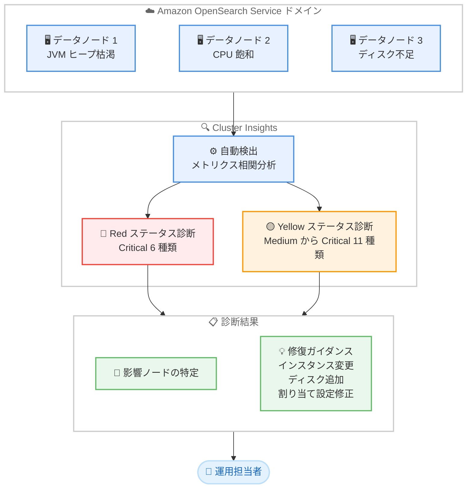

# Amazon OpenSearch Service - クラスターステータス診断のための新しい Cluster Insights

**リリース日**: 2026 年 8 月 31 日
**サービス**: Amazon OpenSearch Service
**機能**: Cluster Insights によるクラスターステータス (Red / Yellow) の迅速な診断

📊 [このアップデートのインフォグラフィックを見る](https://takech9203.github.io/aws-news-summary/20260831-opensearch-cluster-status-insight.html)

## 概要

Amazon OpenSearch Service は、クラスターが Red または Yellow ステータスに陥った原因を特定し、修復方法を提示する 17 個の新しい Cluster Insights を追加しました。JVM ヒープ枯渇、持続的な CPU 飽和、アベイラビリティーゾーン間のノード配置の偏り、レプリカ数の誤設定といった問題を自動的に検出し、影響を受けているノードを特定した上で、具体的な対処手順を提示します。

新しいインサイトは 2 つのカテゴリで構成されています。プライマリシャードが未割り当てになる状態 (Red ステータス) を検出する 6 個の Critical 重要度のインサイトと、レプリカシャードの割り当てを妨げる問題 (Yellow ステータス) を特定する 11 個のインサイト (Medium から Critical 重要度) です。OpenSearch クラスターを運用するすべてのユーザーが追加料金なしで利用できます。

**アップデート前の課題**

これまで、クラスターステータスが Red や Yellow になった際の原因調査には、多くの手作業が必要でした。

- 未割り当てシャードのトラブルシューティングでは、複数のノードやアベイラビリティーゾーンにまたがるメトリクスを手動で相関分析する必要があった
- JVM メモリ不足、CPU 飽和、EBS スループット飽和など、原因の候補が多岐にわたり、切り分けに時間がかかった
- 原因を特定できても、適切な対処方法 (インスタンスタイプの変更、ディスク容量の追加など) を自分で調査する必要があった

**アップデート後の改善**

今回のアップデートにより、原因特定から対処までの流れが大幅に効率化されました。

- リソース制約や設定ミスをサービスが自動検出し、影響を受けているノードを名指しで特定できるようになった
- インスタンスタイプのアップグレード、ディスク容量の追加、シャード割り当て設定の修正など、原因に応じた具体的な修復ガイダンスが提示されるようになった
- Red ステータス (プライマリシャード未割り当て) と Yellow ステータス (レプリカシャード未割り当て) の両方について、重要度付きのインサイトで優先順位を判断できるようになった

## アーキテクチャ図



Cluster Insights がクラスターのメトリクスを自動的に相関分析し、Red / Yellow ステータスの根本原因と影響ノードを特定して、修復ガイダンスを提示する流れを示しています。

## サービスアップデートの詳細

### 主要機能

1. **Red ステータス診断インサイト (Critical 重要度 6 種類)**
   - プライマリシャードが未割り当てになる原因を自動検出する
   - 検出対象: JVM ヒープ枯渇、持続的なガベージコレクション圧迫、持続的な CPU 飽和、EBS スループット飽和、EBS IOPS 飽和、ディスク容量不足による書き込みブロック
   - すべて Critical 重要度として扱われ、即時対応が必要な問題として通知される

2. **Yellow ステータス診断インサイト (Medium から Critical 重要度 11 種類)**
   - レプリカシャードの割り当てを妨げる問題を自動検出する
   - リソース起因: ディスク容量不足、JVM ヒープ枯渇、ガベージコレクション圧迫、CPU 飽和、EBS スループット / IOPS 飽和
   - 構成起因: アベイラビリティーゾーン間のノード配置の偏り、カスタムシャードルーティング設定、シャード割り当ての明示的な無効化、ノードあたりシャード数上限、データノード数を超えるレプリカ数

3. **影響ノードの特定と修復ガイダンス**
   - 各インサイトは影響を受けているノードを具体的に特定する
   - 原因に応じた対処手順 (インスタンスタイプのアップグレード、ディスク容量の追加、シャード割り当て設定の修正など) を提示する
   - コンソールの [Cluster health] タブまたは OpenSearch UI (Dashboards) から確認できる

## 技術仕様

### 新しいインサイトの内訳

| カテゴリ | 重要度 | 検出内容の例 |
|------|------|------|
| Cluster Status Red (6 種類) | Critical | JVM ヒープ枯渇、GC 圧迫、CPU 飽和、EBS スループット飽和、EBS IOPS 飽和、ディスク不足による書き込みブロック |
| Cluster Status Yellow (11 種類) | Medium ~ Critical | ディスク不足、AZ 間のノード配置の偏り、カスタムルーティング設定、割り当て無効化、シャード数上限、過剰なレプリカ数、JVM / GC / CPU / EBS リソース飽和 |

### 利用要件

| 項目 | 詳細 |
|------|------|
| 対応バージョン | OpenSearch 1.0 以降、Elasticsearch 6.8 以降 |
| 料金 | 追加料金なし |
| コンソールでの確認 | [Cluster health] タブの Cluster Insights |
| OpenSearch UI での確認 | OpenSearch 2.17 以降が必要 (2.17 / 2.19 は最新のサービスソフトウェアが必要) |
| 通知連携 | Amazon EventBridge イベント経由でインサイトを監視可能 |

## 設定方法

### 前提条件

1. Amazon OpenSearch Service ドメインが OpenSearch 1.0 以降または Elasticsearch 6.8 以降で稼働していること
2. サポート対象の 11 リージョンのいずれかでドメインを運用していること
3. OpenSearch UI (Dashboards) で確認する場合は、OpenSearch UI アプリケーションの管理者ロールを持っていること

### 手順

#### ステップ 1: コンソールで Cluster Insights を確認する

1. AWS マネジメントコンソールで Amazon OpenSearch Service を開く
2. 対象ドメインを選択し、[Cluster health] タブを開く
3. Cluster Insights セクションでアクティブなインサイトの一覧を確認する

コンソールの [Cluster health] タブから、追加設定なしでアクティブなインサイトを確認できます。

#### ステップ 2: インサイトの詳細と修復ガイダンスを確認する

1. 一覧から対象のインサイト (例: Cluster Status Red) を選択する
2. 影響を受けているノードやリソースを確認する
3. [Recommendations] タブで段階的な修復手順を確認する

各インサイトには、影響リソースのマップ、修復手順、および過去の修復履歴のタイムラインが含まれます。

#### ステップ 3: OpenSearch UI で複数クラスターを横断的に確認する (オプション)

1. コンソールの左ナビゲーションで [OpenSearch UI (Dashboards)] を選択する
2. OpenSearch Service アプリケーションを作成し、データソースとしてドメインを関連付ける
3. 設定アイコンから [Data administrator] > [Cluster Insights] を選択する

OpenSearch UI では、複数ドメインのインサイトを重要度順に一元表示できるほか、過去 30 日間のインサイトのトレンドも確認できます。

## メリット

### ビジネス面

- **ダウンタイムの短縮**: Red ステータスの原因特定にかかる時間が短縮され、サービス影響の長期化を防止できる
- **運用コストの削減**: 手動でのメトリクス相関分析が不要になり、トラブルシューティングの工数を削減できる
- **追加費用なし**: 対象リージョンのすべての対応ドメインで、追加料金なしで利用できる

### 技術面

- **根本原因の自動特定**: JVM、CPU、EBS、ディスクなど多岐にわたる原因候補から、実際のボトルネックを自動で切り分けられる
- **ノードレベルの粒度**: 影響を受けている具体的なノードが特定されるため、対処対象を即座に把握できる
- **実行可能な修復ガイダンス**: 原因に応じたインスタンスタイプ変更、ディスク追加、設定修正などの手順が提示される

## デメリット・制約事項

### 制限事項

- 利用可能リージョンは現時点で 11 リージョンに限定される (順次拡大予定)
- OpenSearch UI (Dashboards) での表示には OpenSearch 2.17 以降が必要で、2.17 / 2.19 のドメインは最新のサービスソフトウェアへの更新が必要
- OpenSearch UI で Cluster Insights にアクセスするには管理者ロールが必要

### 考慮すべき点

- インサイトは原因の特定と修復手順の提示を行うが、修復アクション自体 (スケーリングや設定変更) はユーザーが実行する必要がある
- 継続的な監視や自動通知を行いたい場合は、Amazon EventBridge との連携を別途構成する必要がある

## ユースケース

### ユースケース 1: Red ステータス発生時の迅速な原因特定

**シナリオ**: 本番のログ分析クラスターが突然 Red ステータスになり、一部のインデックスへの書き込みが失敗している。

**実装例**:
```text
1. コンソールの [Cluster health] タブで Cluster Insights を確認
2. 「JVM ヒープ枯渇によりプライマリシャードが未割り当て」の
   Critical インサイトを確認
3. 影響ノードを特定し、推奨されたインスタンスタイプの
   アップグレードを実施
```

**効果**: 複数ノードのメトリクスを手動で突き合わせる作業が不要になり、原因特定から復旧までの時間を大幅に短縮できます。

### ユースケース 2: Yellow ステータスの構成ミスの検出

**シナリオ**: 開発環境のクラスターが Yellow ステータスのまま解消せず、原因が分からない。

**実装例**:
```text
1. Cluster Insights で「レプリカ数が利用可能なデータノード数を
   超過」の Medium インサイトを確認
2. 推奨に従い、対象インデックスの number_of_replicas を
   データノード数以下に修正
PUT /my-index/_settings
{
  "index": { "number_of_replicas": 1 }
}
```

**効果**: リソース増強では解決しない構成起因の問題を正確に特定し、不要なスケールアップコストを回避できます。

### ユースケース 3: EventBridge 連携によるプロアクティブな監視

**シナリオ**: 複数の OpenSearch ドメインを運用しており、Red / Yellow ステータスの兆候を検知したら即座に運用チームへ通知したい。

**実装例**:
```text
1. Amazon EventBridge で OpenSearch Service のインサイト
   イベントをキャッチするルールを作成
2. ターゲットに Amazon SNS トピックを設定し、
   運用チームへ通知
3. Critical 重要度のインサイトはインシデント管理ツールへ連携
```

**効果**: コンソールを開かなくてもインサイトの発生を検知でき、重要度に応じた対応フローを自動化できます。

## 料金

Cluster Insights は追加料金なしで利用できます。Amazon OpenSearch Service のドメイン自体の料金 (インスタンス、ストレージなど) は通常どおり発生します。

## 利用可能リージョン

以下の 11 リージョンで利用可能です (順次拡大予定)。

- 米国東部 (バージニア北部、オハイオ)
- 米国西部 (オレゴン)
- カナダ (中部)
- アジアパシフィック (東京、シドニー)
- 欧州 (フランクフルト、アイルランド、ロンドン、パリ、ストックホルム)

## 関連サービス・機能

- **Amazon EventBridge**: Cluster Insights のイベントを受け取り、通知や自動化ワークフローに連携できる
- **Amazon CloudWatch**: OpenSearch Service のメトリクス監視に引き続き利用でき、インサイトと組み合わせた詳細分析が可能
- **OpenSearch UI (Dashboards)**: 複数ドメインのインサイトを横断的に確認できる統合ダッシュボード

## 参考リンク

- 📊 [インフォグラフィック](https://takech9203.github.io/aws-news-summary/20260831-opensearch-cluster-status-insight.html)
- [公式発表 (What's New)](https://aws.amazon.com/about-aws/whats-new/2026/08/opensearch-cluster-status-insight/)
- [Cluster Insights ドキュメント](https://docs.aws.amazon.com/opensearch-service/latest/developerguide/cluster-insights.html)
- [Insights カタログ](https://docs.aws.amazon.com/opensearch-service/latest/developerguide/insights-catalog.html)
- [料金ページ](https://aws.amazon.com/opensearch-service/pricing/)

## まとめ

今回のアップデートにより、OpenSearch クラスターの Red / Yellow ステータスの根本原因特定が自動化され、影響ノードの特定から修復手順の確認までをコンソール上で完結できるようになりました。追加料金なしで利用できるため、対象リージョンで OpenSearch Service を運用しているチームは、まずコンソールの [Cluster health] タブでインサイトを確認し、EventBridge 連携による通知の自動化も検討することを推奨します。
